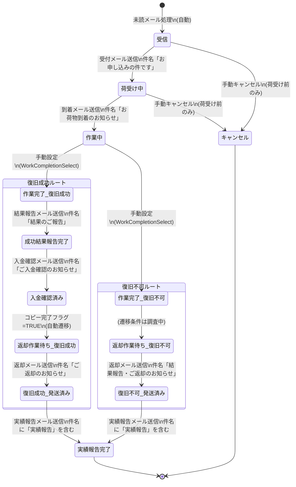
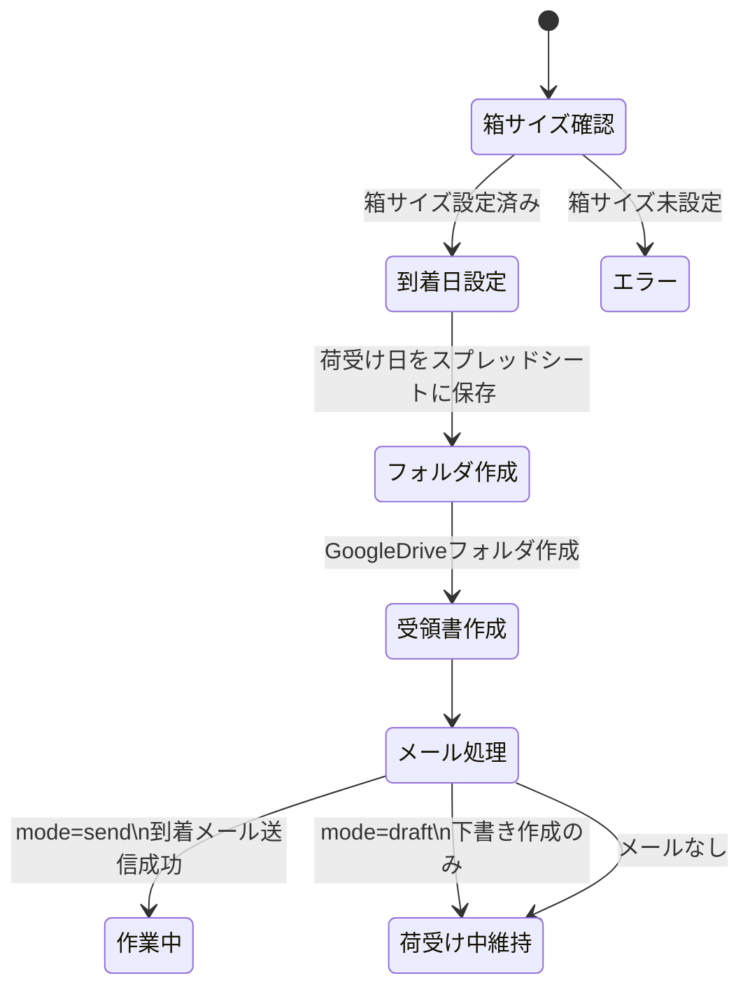
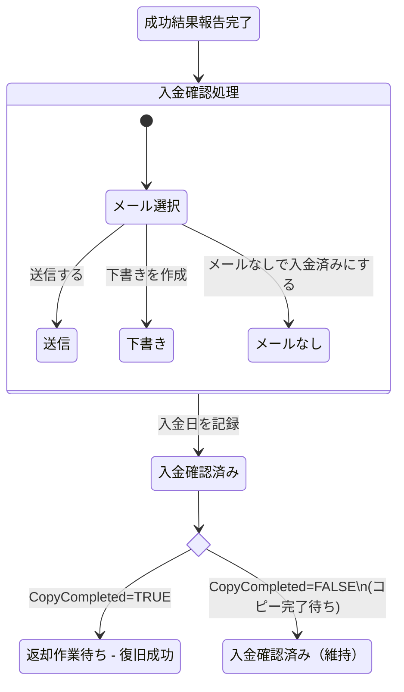

# ステータス遷移図 - データ復旧サービス業務管理システム

## 検討経緯

| 日付 | 内容 |
|------|------|
| 2026-02-20 | 初回作成: コードベースからステータス定義・遷移条件・変更トリガーを調査し整理 |

## 概要

データ復旧サービス（auto-daysupport-cloudrun）の案件管理において、顧客の申込から完了までをステータスで管理している。ステータスは主に「送信メールの件名」から自動判定されるほか、手動でのステータス変更も可能。

## ステータス一覧

### メインフロー（statusOrder による順序定義）

| # | ステータス | 意味 | 補足 |
|---|-----------|------|------|
| 0 | 受信 | 申込メールを受信・スプレッドシートに登録済み | 未読メール処理時に自動設定 |
| 1 | 荷受け中 | 受付メール送信済み、顧客からの発送待ち | 受付メール送信で自動設定。受付開始日も記録 |
| 2 | 作業中 | 荷物到着、復旧作業中 | 到着メール送信で自動設定。荷受け日も記録 |
| 3 | 作業完了 - 復旧不可 | 作業完了、復旧できなかった | 手動で設定（WorkCompletionSelect） |
| 3 | 作業完了 - 復旧成功 | 作業完了、復旧できた | 手動で設定（WorkCompletionSelect） |
| 4 | 成功結果報告完了 | 結果報告メール送信済み | 結果報告メール送信で自動設定 |
| 5 | 入金確認済み | 入金を確認、入金確認メール送信済み | 入金確認メール送信で自動設定。入金日も記録 |
| 6 | 返却作業待ち - 復旧成功 | 入金確認+コピー完了、発送準備待ち | 入金確認済み+CopyCompleted=TRUEで自動遷移 |
| 6 | 返却作業待ち - 復旧不可 | 復旧不可、返却発送準備待ち | -- |
| 7 | 復旧不可(発送済み) | 復旧不可メディアを返却発送済み | 返却メール（復旧不可版）送信で自動設定 |
| 7 | 復旧成功(発送済み) | 復旧データ+メディアを返却発送済み | 返却メール（復旧成功版）送信で自動設定 |
| 8 | 実績報告完了 | 実績報告メール送信済み（最終ステータス） | 実績報告メール送信で自動設定 |

### 特殊ステータス

| ステータス | 意味 | 補足 |
|-----------|------|------|
| キャンセル | 申込キャンセル | 荷受け前（受信/荷受け中）のみ設定可能。キャンセル後は自動更新対象外 |
| 催促 | 催促が必要な状態 | フロントエンド表示のみ確認。statusOrderに含まれるが自動遷移には未登場 |
| コピー完了 | データコピー作業完了 | フロントエンド表示用。statusOrderにも登場 |
| 見積 | 見積メール送信済み | detectStatusFromSubjectで検出されるがcanUpdateStatusのマップに未登録 |
| 請求 | 請求メール送信済み | detectStatusFromSubjectで検出されるがcanUpdateStatusのマップに未登録 |

## ステータス遷移図

### 全体フロー（復旧成功ルート / 復旧不可ルート）



### 荷受け処理の詳細フロー



### 入金確認の詳細フロー



## 各遷移の条件・トリガー詳細

### 自動遷移（メール件名によるステータス判定）

StatusUpdaterServiceが未完了顧客の送信済みメールを定期チェックし、件名からステータスを判定する。

| トリガー（メール件名に含まれるキーワード） | 遷移先ステータス | 追加処理 |
|-----------------------------------------|-----------------|---------|
| 「お申し込みの件です」 | 荷受け中 | 受付開始日を記録 |
| 「お荷物到着のお知らせ」 | 作業中 | -- |
| 「結果のご報告」 | 成功結果報告完了 | -- |
| 「お見積」「見積書」「復旧完了」 | 見積 | (注意: canUpdateStatusに未登録) |
| 「ご請求」「請求書」 | 請求 | (注意: canUpdateStatusに未登録) |
| 「ご入金確認のお知らせ」 | 入金確認済み | 入金日を記録。CopyCompleted=TRUEなら返却作業待ちへ |
| 「ご返却のお知らせ」 | 復旧成功(発送済み) | -- |
| 「結果報告・ご返却のお知らせ」 | 復旧不可(発送済み) | -- |
| 「復旧不可」 | 復旧不可(発送済み) | -- |
| 「実績報告」 | 実績報告完了 | -- |

メール件名の判定は優先度順（上のキーワードが先にマッチする）。「Re:」で始まる返信メールは無視される。

### 自動遷移（条件ベース）

| 条件 | 遷移先 | 実装箇所 |
|------|--------|---------|
| 入金確認済み + CopyCompleted=TRUE + PaymentDate非空 | 返却作業待ち - 復旧成功 | StatusUpdaterService.UpdateStatusFromSentEmails |

### 手動遷移（UIからの操作）

| 操作 | 対象ステータス | 遷移先 | UIコンポーネント |
|------|--------------|--------|----------------|
| 作業完了選択 | 作業中 | 作業完了 - 復旧成功 / 復旧不可 | WorkCompletionSelect |
| キャンセル | 受信, 荷受け中 | キャンセル | CancelButton |
| 店頭復旧不可 | 受信, 荷受け中 | 復旧不可(発送済み) | WalkInIrrecoverableButton |
| 入金確認 | 成功結果報告完了 | 入金確認済み | PaymentConfirmation |

### 荷受け処理（ArrivalService）

| 操作 | 前提条件 | 遷移先 | 追加処理 |
|------|---------|--------|---------|
| 荷受け処理（メール送信） | 箱サイズ設定済み | 作業中 | 荷受け日記録、フォルダ作成、受領書作成、住所登録フラグ設定 |
| 荷受け処理（下書き） | 箱サイズ設定済み | (変更なし) | 荷受け日記録、フォルダ作成、受領書作成 |

## ステータス更新の制約

### 進行方向のみ許可（canUpdateStatus）

ステータスには順序値が割り当てられており、自動更新では「現在の順序 < 新しい順序」の場合のみ更新が許可される。逆方向への更新は行われない。

```
(空) < 受信 < 荷受け中 < 作業中 < 作業完了(成功/不可) < 成功結果報告完了
< 入金確認済み < 返却作業待ち(成功/不可) < 発送済み(成功/不可) < 実績報告完了
```

### キャンセルからの復帰不可

ステータスが「キャンセル」の場合、いかなる自動更新も行われない。

### 手動ステータス管理フラグ

ManualStatus（手動ステータス管理）がTRUEの場合、自動ステータス更新の対象外となる。

## メールテンプレートとステータスの対応

| テンプレート | テンプレートID | メール件名 | 関連ステータス遷移 |
|-------------|--------------|-----------|-------------------|
| 受付メール | uketuke | お申し込みの件です。 | (空)/受信 --> 荷受け中 |
| 荷受けメール | niuke | お荷物到着のお知らせ | 荷受け中 --> 作業中 |
| 進捗報告メール | shinchoku | 進捗状況のお知らせ | (ステータス変更なし) |
| 結果報告メール | kekka | 結果のご報告 | 作業完了 --> 成功結果報告完了 |
| 入金確認メール | nyukin | ご入金確認のお知らせ | 成功結果報告完了 --> 入金確認済み |
| 返却メール（成功） | henkyaku | ご返却のお知らせ | 返却作業待ち --> 復旧成功(発送済み) |
| 返却メール（不可） | henkyaku | 結果報告・ご返却のお知らせ | 返却作業待ち --> 復旧不可(発送済み) |

## 経過日数の警告表示

フロントエンドのStatusBadgeコンポーネントでは、以下のステータスで経過日数を表示し、閾値を超えると赤色で警告する。

| ステータス | 基準日 | 警告閾値 |
|-----------|--------|---------|
| 荷受け中 | 受付開始日（receptionStartDate） | 7日 |
| 作業中 | 荷受け日（arrivalDate） | 10日 |
| 作業完了 - 復旧成功 | 荷受け日（arrivalDate） | 10日 |
| 作業完了 - 復旧不可 | 荷受け日（arrivalDate） | 10日 |
| 返却作業待ち - 復旧不可 | 荷受け日（arrivalDate） | 10日 |

## 検討事項・疑問点

### 1. 「見積」「請求」ステータスの不整合

`detectStatusFromSubject`では「見積」「請求」ステータスが検出されるが、`canUpdateStatus`の`statusOrder`マップにはこの2つが含まれていない。そのため、これらのステータスに自動遷移しようとしても `canUpdateStatus` が `false` を返し、実質的に更新されない可能性がある。

- 意図的な仕様か、追加漏れかの確認が必要

### 2. 「催促」ステータスの設定経路

フロントエンドの表示順序（CustomerList.tsx の statusOrder）には「催促」が含まれているが、バックエンドの自動遷移ロジックには登場しない。手動設定のみと思われるが、設定UIも確認できなかった。

- スプレッドシート側で手動設定している可能性あり

### 3. 「コピー完了」ステータスの扱い

フロントエンドの表示順序に「コピー完了」が含まれているが、バックエンドの `statusOrder` には含まれていない。`CopyCompleted` フラグ（チェックボックス）とは別概念として存在している可能性がある。

### 4. 復旧不可ルートの中間遷移

「作業完了 - 復旧不可」から「返却作業待ち - 復旧不可」への遷移トリガーがコード上で明確に確認できなかった。手動設定またはスプレッドシート側の処理の可能性がある。

### 5. 店頭持ち込みの特殊フロー

- 店頭受付（BoxSize="店頭受付"）の場合、入金確認メールと返却メールが店頭版のテンプレートに切り替わる
- WalkInIrrecoverableButton で、店頭持込で即時復旧不可の場合に直接「復旧不可(発送済み)」へ遷移可能

## 参照元コード（auto-daysupport-cloudrun）

| ファイル | 内容 |
|---------|------|
| `backend/internal/service/status_updater.go` | ステータス自動更新ロジック、statusOrder定義、canUpdateStatus |
| `backend/internal/service/email_template.go` | メールテンプレート種別定義 |
| `backend/internal/service/arrival_service.go` | 荷受け処理ビジネスロジック |
| `backend/internal/service/email_processor.go` | 未読メール処理（受信ステータス設定） |
| `backend/internal/domain/model/customer.go` | 顧客モデル定義 |
| `backend/internal/domain/column/columns.go` | スプレッドシートカラム定義 |
| `frontend/src/components/StatusBadge.tsx` | ステータス表示（色・経過日数） |
| `frontend/src/components/WorkCompletionSelect.tsx` | 作業完了ステータス選択 |
| `frontend/src/components/CancelButton.tsx` | キャンセルボタン |
| `frontend/src/components/WalkInIrrecoverableButton.tsx` | 店頭復旧不可ボタン |
| `frontend/src/components/PaymentConfirmation.tsx` | 入金確認処理 |
| `frontend/src/components/ReturnShippingEditor.tsx` | 返却発送情報入力 |
| `frontend/src/components/CustomerList.tsx` | ステータス表示順序定義 |
