# 検討結果: デプロイフローパターン定型化

## 検討経緯

| 日付 | 内容 |
|------|------|
| 2026-03-02 | 初回相談: Claude Codeでの開発フローにおけるデプロイパターンの定型化 |
| 2026-03-02 | 深掘り: 個人開発 + Claude Code に特化した汎用パターン集の方向性を確認 |
| 2026-03-02 | 方針決定: 5パターン分類、staging運用、コマンド体系を確定 |

## 背景・目的

現在のClaude Code開発フローは「実装 → コミット → 本番デプロイ → 確認」の本番直パターンのみ。
本番DBがあるプロジェクトやスマホアプリなど、ステージング環境が必要なケースに対応できていない。

プロジェクトの特性に応じた適切なデプロイフローを定型化し、Claude Codeのコマンド/テンプレートに組み込む。

## 対象ユーザー

個人開発者（Claude Codeを使って開発する人）

## 解決する課題

- プロジェクトごとにデプロイフローを毎回ゼロから考えている
- ステージング環境が必要なプロジェクトでのClaude Code運用が定型化されていない
- DBマイグレーションを含むデプロイの安全な手順が整理されていない

---

## 1. 5つのデプロイパターン

| パターン | 対象 | ステージング |
|----------|------|-------------|
| A: ローカル完結型 | CLI、ライブラリ、デスクトップアプリ | 不要 |
| B: 本番直デプロイ型 | 個人用ツール、スプレッドシートDB | 不要 |
| C: DB分離型 | 本番DBありのWebアプリ、SaaS | 必要 |
| D: 実機確認必須型 | スマホアプリ | テスト配信必要 |
| E: 静的サイト型 | ブログ、LP、ドキュメント | プレビューURLで代替 |

### パターン A: ローカル完結型

**該当例:** CLIツール、デスクトップアプリ、ライブラリ、Electronアプリ

| 項目 | 内容 |
|------|------|
| 確認環境 | ローカルで完結 |
| データ層 | なし、またはローカルファイル |
| デプロイ先 | npm publish / GitHub Release / brew等 |
| ステージング | 不要 |

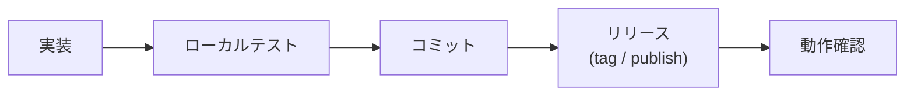

特徴: 最もシンプル。本番環境 = 手元のマシン。

### パターン B: 本番直デプロイ型

**該当例:** Ghostrunner、個人用管理ツール、社内ツール（利用者が自分or少人数）

| 項目 | 内容 |
|------|------|
| 確認環境 | ローカル + 本番 |
| データ層 | なし、またはスプレッドシート等の共有データ |
| デプロイ先 | Cloud Run / Vercel / VPS等 |
| ステージング | 不要（本番で直接確認） |

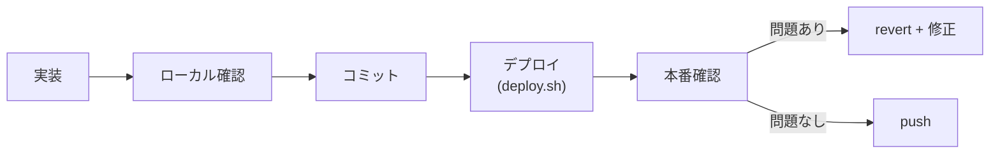

特徴: 壊れてもすぐ戻せるので問題ない。Ghostrunnerがこのパターン。

### パターン C: DB分離型

**該当例:** toC/toBサービス、本番DBがあるWebアプリ、SaaS

| 項目 | 内容 |
|------|------|
| 確認環境 | ローカル（テストDB） + ステージング環境 |
| データ層 | 本番DB / テストDB の分離が必要 |
| デプロイ先 | Cloud Run / Vercel / VPS等 |
| ステージング | 必要（テストDBで動作確認） |

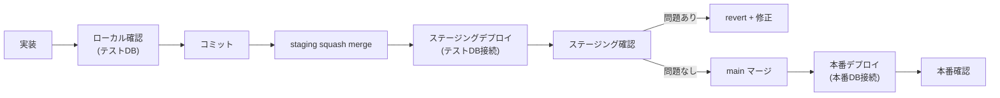

特徴: DB分離が核心。マイグレーション管理も加わる。詳細は後述。

### パターン D: 実機確認必須型

**該当例:** スマホアプリ（React Native / Flutter）、IoTデバイス向け

| 項目 | 内容 |
|------|------|
| 確認環境 | エミュレータ + 実機 |
| データ層 | APIサーバーのDB分離が必要な場合あり |
| デプロイ先 | TestFlight / Google Play内部テスト / ストア公開 |
| ステージング | テスト配信が必要 |

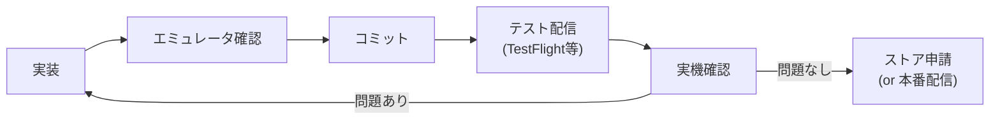

特徴: Claude Codeだけでは確認が完結しない。実機テストのステップが必須。APIサーバーがある場合はパターンCとの組み合わせになる。

### パターン E: 静的サイト型

**該当例:** ブログ、ドキュメントサイト、LP、ポートフォリオ

| 項目 | 内容 |
|------|------|
| 確認環境 | ローカルで完結 |
| データ層 | なし（静的ファイルのみ） |
| デプロイ先 | Vercel / Netlify / GitHub Pages / Cloudflare Pages |
| ステージング | プレビュー機能で自動対応（Vercel等） |

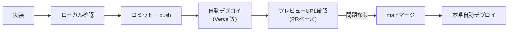

特徴: 最もCI/CDが自然に組み込まれるパターン。Vercel等のプレビュー機能がステージングの代替になる。

---

## 2. パターン判定フロー

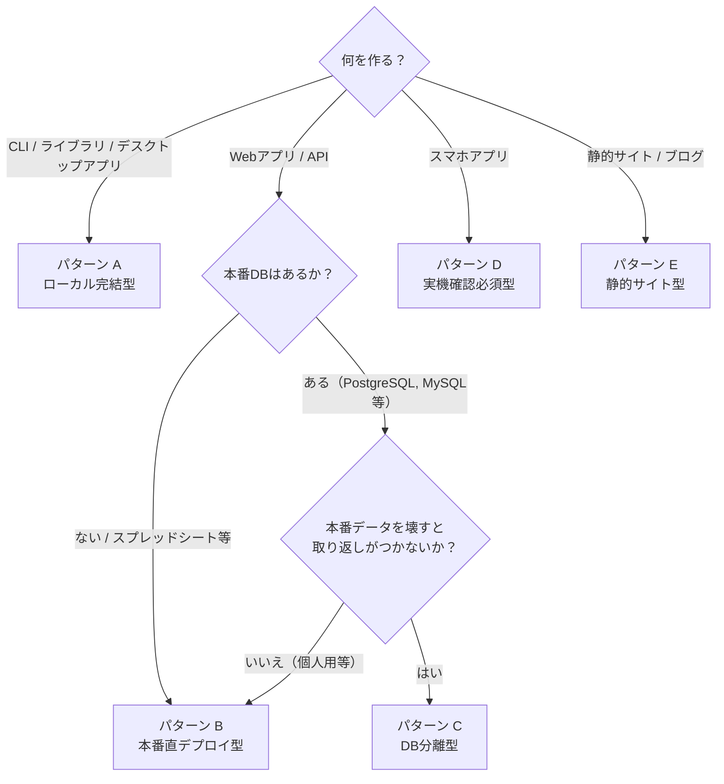

### 判定の質問セット

| # | 質問 | 選択肢 | 判定への影響 |
|---|------|--------|-------------|
| 1 | 何を作りますか？ | CLI/ライブラリ / Webアプリ / スマホアプリ / 静的サイト | 大分類を決定 |
| 2 | 本番用のDBはありますか？ | ない / ある | DB分離の要否 |
| 3 | 本番データを壊すと困りますか？ | 困る / 困らない（復元可能） | ステージングの要否 |
| 4 | ローカルで動作確認できますか？ | できる / 実機が必要 | 確認フローの分岐 |
| 5 | 自動デプロイの仕組みはありますか？ | ある（Vercel等） / ない（手動） | デプロイステップの詳細 |

---

## 3. パターンB: 本番直デプロイ型のフロー

現在のGhostrunnerで使用しているフロー。

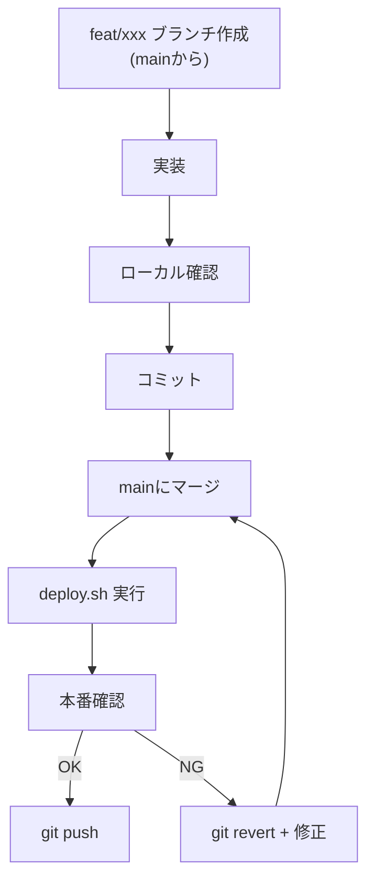

---

## 4. パターンC: DB分離型のフロー（詳細）

### ブランチ戦略

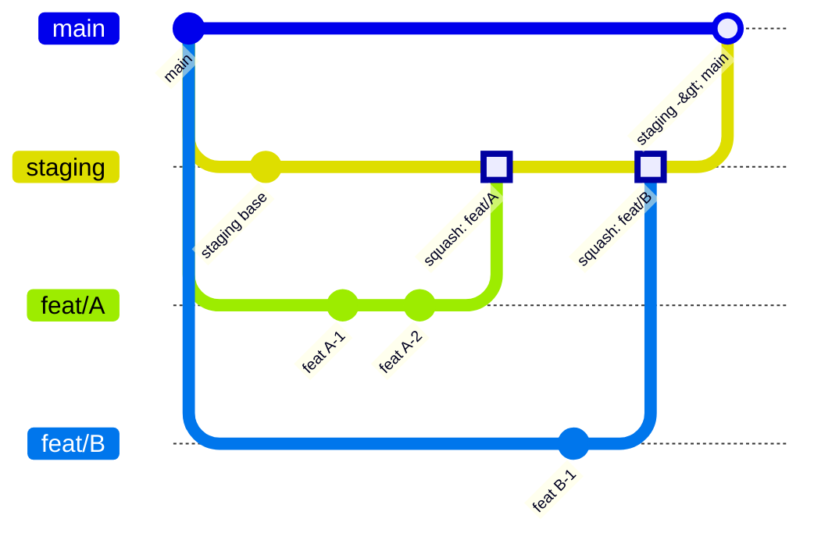

**ルール:**
- featブランチは必ずmainから切る
- 依存する機能は1ブランチにまとめる（数珠つなぎしない）
- featブランチ同士は独立させる

### squash merge方式

1機能 = 1コミットでstagingの履歴が綺麗になる。

```bash
# feat/A を staging に squash merge
git checkout staging
git merge --squash feat/A
git commit -m "$(echo "feat/A: 機能の説明"; echo ""; git log main..feat/A --pretty=format:'- %s')"
```

コミットメッセージにfeatの詳細履歴を自動転記する。

### コンフリクト解消

- staging上で解消する（featブランチをrebaseしない）
- featブランチをmainベースのまま無傷で残す
- やり直しが必要なとき、いつでも再マージできる

### NG機能の除外

- git revert 1回でNG機能を除外できる
- feat同士が独立しているのでrevertが確実
- 必要ならrevert後に元のfeatブランチから再マージも可能

### 1日の流れ

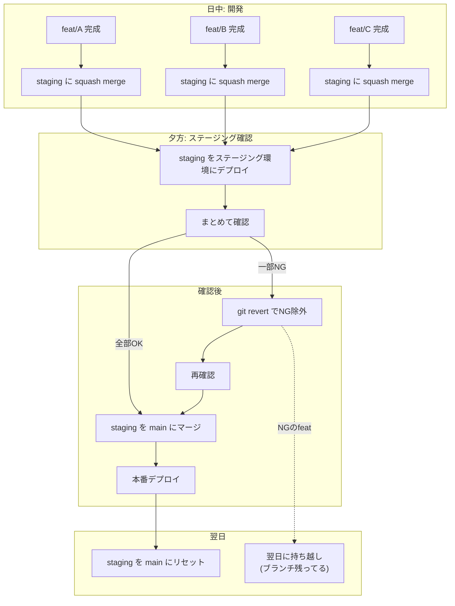

### staging管理

- 本番反映後にstagingをmainにリセットする
- ホットフィックス時もstagingをmainにリセット → hotfix適用 → 確認 → main

### featブランチ削除タイミング

- 本番反映が完了するまで残す
- 本番に入ったら削除OK

---

## 5. DBマイグレーション方針

### 基本原則

- **追加系のみ**: NULLABLEまたはデフォルト値付きで追加する
- **削除・変更系は2段階リリース** (Expand and Contract パターン):
  - リリース1回目: コードからの参照を除去（カラムはそのまま）
  - リリース2回目: 安定確認後にカラム/テーブル削除
- 本番マイグレーション実行前にバックアップを取る

### ロールバック戦略

- アプリだけ戻す。DBは触らない
- 追加したカラム/テーブルは放置する（古いコードでも動く設計にしておく）
- 後日、不要なカラム/テーブルを掃除する

### Expand and Contract パターンの流れ

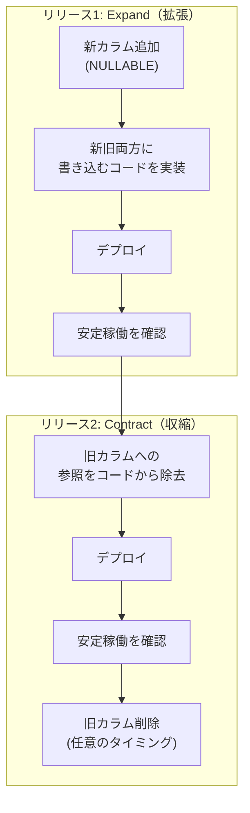

---

## 6. コマンド体系

### /fullstack（拡張版）

状況に応じて不要なステップをスキップする。

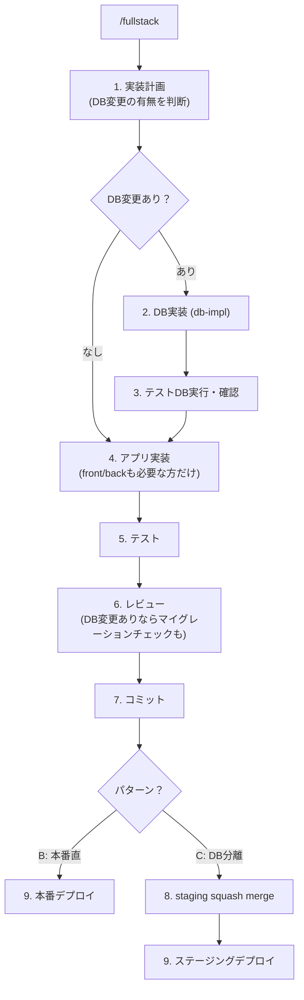

**スキップの判断:**

| 状況 | スキップされるもの |
|------|-----------------|
| フロントだけ | バックエンド実装 |
| バックだけ | フロントエンド実装 |
| DB変更なし | DB実装、マイグレーション |
| パターンB | staging処理 |

### /release

パターンCのみ使用。staging確認後に本番反映する。

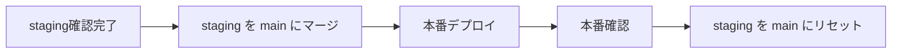

### /hotfix

パターンCのみ使用。緊急修正を本番に反映する。

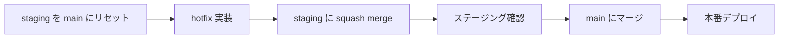

---

## 7. エージェント体系

### 既存エージェント（変更なし）

| エージェント | 担当 | やること |
|-------------|------|---------|
| go-planner / nextjs-planner | 計画 | 実装計画（DB変更の有無判断含む） |
| go-impl / nextjs-impl | アプリ実装 | コード実装（スキーマ確定済み前提） |
| go-tester / nextjs-tester | テスト | テスト実行 |
| go-reviewer / nextjs-reviewer | レビュー | コードレビュー |

### 新規エージェント（パターンC用）

| エージェント | 担当 | やること |
|-------------|------|---------|
| db-impl | DB実装 | マイグレーション作成、テストDB実行 |
| migration-checker | レビュー | 削除系検出、2段階提案、Expand/Contractチェック |
| staging-manager | staging管理 | squash merge、ステージングデプロイ |
| release-manager | リリース | staging→main、本番デプロイ、リセット |

---

## 8. 世の中のリリース戦略との対応

| 今の方針 | 世の中の用語 |
|----------|-------------|
| パターンB（本番直） | GitHub Flow |
| パターンC（staging） | GitLab Flow の個人開発向け最適化 |
| squash merge | 1機能=1コミットの個人開発向けアレンジ |
| Expand and Contract | 業界標準のDB安全パターン |

---

## 9. パターン別フローまとめ

| パターン | ブランチ戦略 | デプロイ | 確認方法 | revert戦略 |
|----------|-------------|---------|---------|------------|
| A: ローカル完結 | feat/ → main | tag + publish | ローカル実行 | tag削除 + 再publish |
| B: 本番直 | feat/ → main | deploy.sh | 本番URL | git revert + 再deploy |
| C: DB分離 | feat/ → staging → main | 2段階deploy | ステージングURL → 本番URL | git revert + 再deploy |
| D: 実機必須 | feat/ → main | ビルド + 配信 | エミュレータ → 実機 | 新バージョン配信 |
| E: 静的サイト | feat/ → main (PR) | 自動(push時) | プレビューURL | mainへのrevert |

---

## 次のステップ

1. パターンBは既にGhostrunnerで運用中（変更不要）
2. パターンCを実際のプロジェクトに適用する際に、コマンド（/fullstack拡張版、/release、/hotfix）とエージェント（db-impl、migration-checker、staging-manager、release-manager）を実装する
3. パターン判定を `/deploy-setup` コマンドとして実装し、質問に答えるとCLAUDE.mdにデプロイフローを自動生成する仕組みを作る
