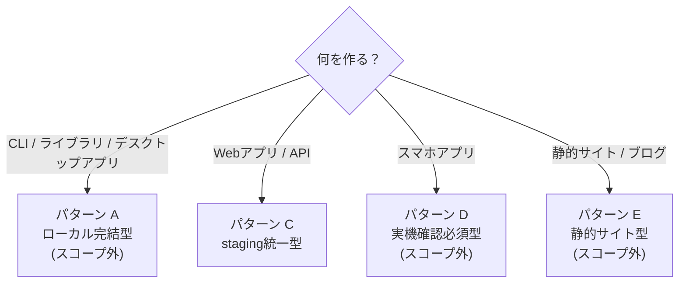
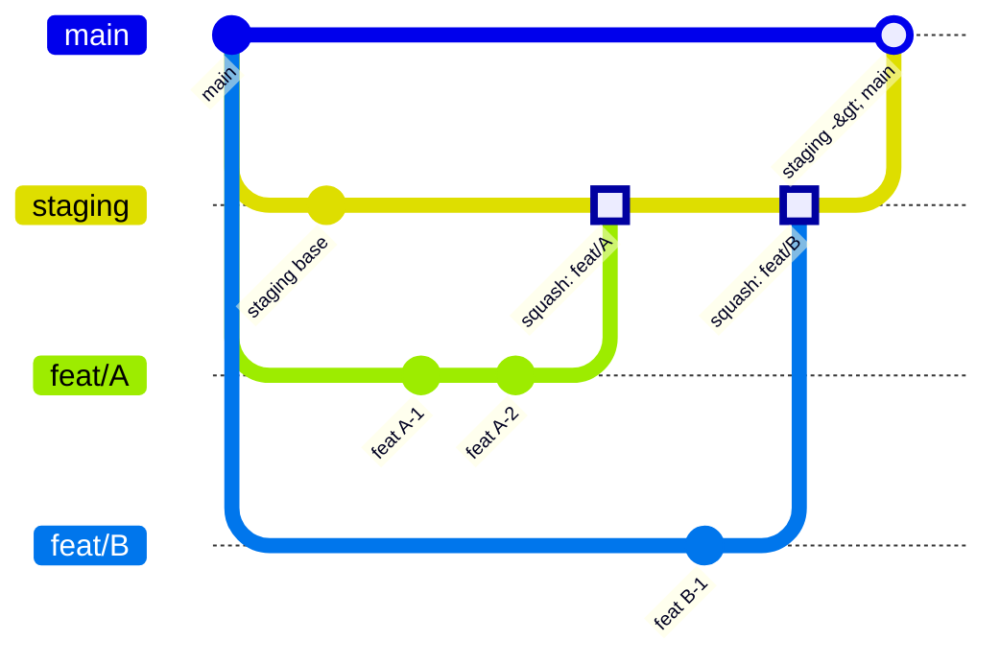
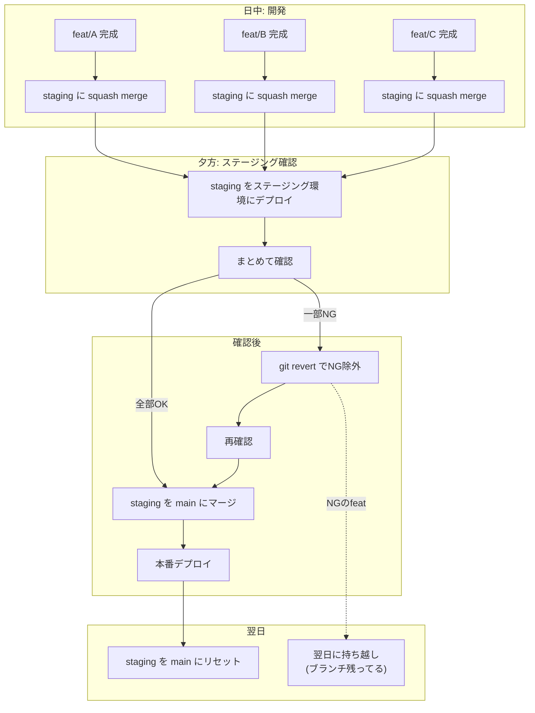
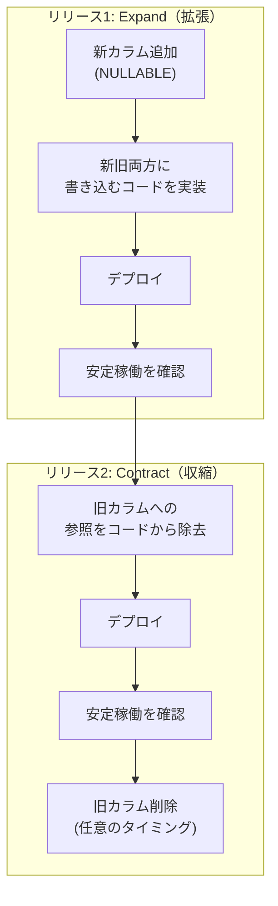
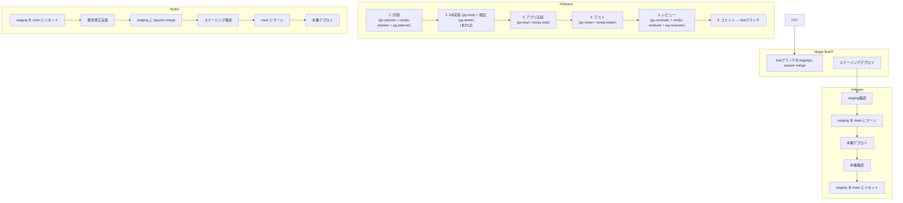
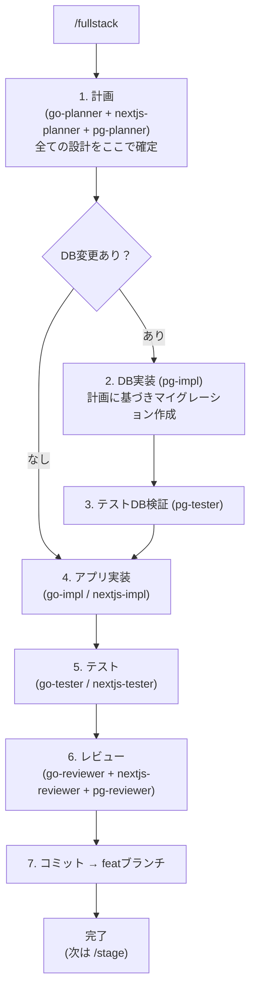
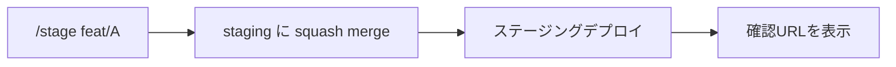
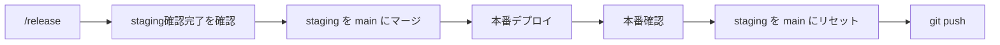

# 検討結果: デプロイフローパターン定型化

## 検討経緯

| 日付 | 内容 |
|------|------|
| 2026-03-02 | 初回相談: Claude Codeでの開発フローにおけるデプロイパターンの定型化 |
| 2026-03-02 | 深掘り: 個人開発 + Claude Code に特化した汎用パターン集の方向性を確認 |
| 2026-03-02 | 方針決定: 5パターン分類、staging運用、コマンド体系を確定 |
| 2026-03-02 | 方針更新: パターンC統一、DB4分割エージェント、コマンド体系確定 |
| 2026-03-02 | 方針更新: DB系エージェントをpg-*に命名変更、PostgreSQL+GORM構成を確定 |
| 2026-03-02 | 方針追加: DB環境構成を確定（開発Docker / staging Supabase / 本番Supabase） |

## 背景・目的

現在のClaude Code開発フローは「実装 → コミット → 本番デプロイ → 確認」の本番直パターンのみ。
本番DBがあるプロジェクトやスマホアプリなど、ステージング環境が必要なケースに対応できていない。

プロジェクトの特性に応じた適切なデプロイフローを定型化し、Claude Codeのコマンド/テンプレートに組み込む。

**方針更新（2026-03-02）:** Webアプリ/API系は全てパターンC（stagingあり）で統一する。パターンA/D/Eは一旦スコープ外とし、Webアプリ/APIの開発フローを一律化することに集中する。

## 対象ユーザー

個人開発者（Claude Codeを使って開発する人）

## 解決する課題

- プロジェクトごとにデプロイフローを毎回ゼロから考えている
- ステージング環境が必要なプロジェクトでのClaude Code運用が定型化されていない
- DBマイグレーションを含むデプロイの安全な手順が整理されていない

---

## 1. デプロイパターンの分類（参考）

初回検討で洗い出した5パターン。Webアプリ/API系（旧B/C）はパターンC統一とした。

| パターン | 対象 | ステージング | 備考 |
|----------|------|-------------|------|
| A: ローカル完結型 | CLI、ライブラリ、デスクトップアプリ | 不要 | スコープ外 |
| ~~B: 本番直デプロイ型~~ | ~~個人用ツール、スプレッドシートDB~~ | ~~不要~~ | Cに統合 |
| **C: staging統一型** | **Webアプリ/API全般** | **必要** | **統一フロー** |
| D: 実機確認必須型 | スマホアプリ | テスト配信必要 | スコープ外 |
| E: 静的サイト型 | ブログ、LP、ドキュメント | プレビューURLで代替 | スコープ外 |

### パターンC統一の理由

- フローが一律になり、プロジェクト切り替え時の認知コストがなくなる
- DBなしプロジェクトでもstagingのオーバーヘッドは「squash mergeを1回打つ」程度
- /release、/hotfixのフローが全プロジェクトで共通になる
- 安全網が常にある（壊れても大丈夫なプロジェクトでも、stagingで確認してからリリース）

---

## 2. パターン判定フロー（参考）

初回検討時の判定フロー。現在はWebアプリ/API系は全てCに統一。



---

## 3. パターンC: staging統一型のフロー（詳細）

### ブランチ戦略



**ルール:**
- featブランチは必ずmainから切る
- 依存する機能は1ブランチにまとめる（数珠つなぎしない）
- featブランチ同士は独立させる

### squash merge方式

1機能 = 1コミットでstagingの履歴が綺麗になる。

```bash
# feat/A を staging に squash merge
git checkout staging
git merge --squash feat/A
git commit -m "$(echo "feat/A: 機能の説明"; echo ""; git log main..feat/A --pretty=format:'- %s')"
```

コミットメッセージにfeatの詳細履歴を自動転記する。

### コンフリクト解消

- staging上で解消する（featブランチをrebaseしない）
- featブランチをmainベースのまま無傷で残す
- やり直しが必要なとき、いつでも再マージできる

### NG機能の除外

- git revert 1回でNG機能を除外できる
- feat同士が独立しているのでrevertが確実
- 必要ならrevert後に元のfeatブランチから再マージも可能

### 1日の流れ



### staging管理

- 本番反映後にstagingをmainにリセットする
- ホットフィックス時もstagingをmainにリセット → hotfix適用 → 確認 → main

### featブランチ削除タイミング

- 本番反映が完了するまで残す
- 本番に入ったら削除OK

---

## 4. DBマイグレーション方針

### 基本原則

- **追加系のみ**: NULLABLEまたはデフォルト値付きで追加する
- **削除・変更系は2段階リリース** (Expand and Contract パターン):
  - リリース1回目: コードからの参照を除去（カラムはそのまま）
  - リリース2回目: 安定確認後にカラム/テーブル削除
- 本番マイグレーション実行前にバックアップを取る

### ロールバック戦略

- アプリだけ戻す。DBは触らない
- 追加したカラム/テーブルは放置する（古いコードでも動く設計にしておく）
- 後日、不要なカラム/テーブルを掃除する

### Expand and Contract パターンの流れ



---

## 5. DB環境構成

### 環境別DB構成

| 環境 | DB | 方式 | 理由 |
|------|-----|------|------|
| 開発（ローカル） | Docker (PostgreSQL) | `docker-compose` で起動 | 高速、オフライン可、無料 |
| staging | Supabase (別プロジェクト) | クラウド | 本番と同じ環境で最終確認 |
| 本番 | Supabase | クラウド | 本番環境 |

**ポイント:**
- GORMは素のPostgreSQLとして接続するため、開発環境がDockerでも本番Supabaseとの差異はほぼ出ない
- Supabase無料枠2プロジェクト = staging + 本番でちょうど収まる
- Supabase固有機能（RLS, Auth, Realtime等）に依存する場合は、開発もSupabase CLI（ローカル）に切り替え可能

**CLAUDE.md設定例:**
```markdown
## DB環境
dev: docker (postgresql)
staging: supabase (myapp-staging)
production: supabase (myapp-prod)
```

---

## 6. コマンド体系

### 全体フロー



### /fullstack

計画から実装・レビューを経てfeatブランチへのコミットまでを担当する。staging操作は行わない。

**重要: planner系は全て計画フェーズで揃えて実行し、設計を確定させてから実装に入る。**



**フェーズの原則: planner系は計画、impl系は実装、reviewer系はレビューに統一**

| フェーズ | Go | Next.js | PostgreSQL |
|---------|-----|---------|-----------|
| 計画 | go-planner | nextjs-planner | pg-planner |
| 実装 | go-impl | nextjs-impl | pg-impl |
| テスト | go-tester | nextjs-tester | pg-tester |
| レビュー | go-reviewer | nextjs-reviewer | pg-reviewer |

**スキップの判断:**

| 状況 | スキップされるもの |
|------|-----------------|
| フロントだけ | go-planner, go-impl, go-tester, go-reviewer, pg系全て |
| バックだけ | nextjs-planner, nextjs-impl, nextjs-tester, nextjs-reviewer |
| DB変更なし | pg-planner, pg-impl, pg-tester, pg-reviewer |

### /stage

featブランチをstagingにsquash mergeし、ステージング環境にデプロイする。



使用エージェント: staging-manager

### /release

staging確認後に本番反映する。



使用エージェント: release-manager

### /hotfix

緊急修正を本番に反映する。


使用エージェント: staging-manager + release-manager

### コマンド一覧

| コマンド | やること | 使うエージェント |
|----------|---------|----------------|
| /fullstack | 実装 → featブランチにコミット | go/nextjs/pg の planner/impl/tester/reviewer |
| /stage | featブランチをstagingにsquash merge + ステージングデプロイ | staging-manager |
| /release | staging確認 → main → 本番デプロイ → stagingリセット | release-manager |
| /hotfix | stagingリセット → 緊急修正 → 確認 → main → 本番 | staging-manager + release-manager |

---

## 7. エージェント体系

### Go系エージェント（既存、変更なし）

| エージェント | 担当 | やること |
|-------------|------|---------|
| go-planner | 計画 | 実装計画 |
| go-impl | 実装 | コード実装 |
| go-tester | テスト | テスト実行 |
| go-reviewer | レビュー | コードレビュー |

### Next.js系エージェント（既存、変更なし）

| エージェント | 担当 | やること |
|-------------|------|---------|
| nextjs-planner | 計画 | 実装計画 |
| nextjs-impl | 実装 | コード実装 |
| nextjs-tester | テスト | テスト実行 |
| nextjs-reviewer | レビュー | コードレビュー |

### PostgreSQL系エージェント（新規）

go/nextjsと同じ4分割構造。DB言語名（pg）で命名。ORM/ツールはCLAUDE.mdの設定で指定する。

| エージェント | 担当 | やること |
|-------------|------|---------|
| pg-planner | 計画 | PostgreSQLスキーマ設計、マイグレーション計画、Expand/Contract計画 |
| pg-impl | 実装 | マイグレーションファイル作成（GORM経由）、テストDB実行 |
| pg-tester | テスト | テストDBでの検証（データ整合性、制約確認、ロールバック確認） |
| pg-reviewer | レビュー | SQL品質レビュー、Expand/Contract掃除候補リスト管理 |

**技術構成:**
- DB: PostgreSQL
- ORM: GORM
- バックエンド（Go）がDB操作を担当（フロントエンドはAPI経由のみ）

**CLAUDE.md設定例:**
```markdown
## DB設定
db: postgresql
orm: gorm
migration: gorm
```

**命名の理由:** ORMは変わり得るがDBは変わりにくい。pgの知識（スキーマ設計、SQL方言、PostgreSQL固有機能）がエージェントの核心であり、GORM/sqlc等のツール選択は設定で切り替える。将来MySQLプロジェクトが出た場合は `mysql-*` エージェントを追加する。

※ 初回検討で別エージェントとしていたmigration-checkerはpg-reviewerに統合。pg-reviewerが「このマイグレーション大丈夫？」のレビューと「DB全体として掃除対象は何か？」の整合性管理を両方担当する。

### インフラ系エージェント（新規）

| エージェント | 担当 | やること | 使用コマンド |
|-------------|------|---------|-------------|
| staging-manager | staging管理 | squash merge、ステージングデプロイ | /stage, /hotfix |
| release-manager | リリース | staging→main、本番デプロイ、stagingリセット | /release, /hotfix |

---

## 8. 世の中のリリース戦略との対応

| 今の方針 | 世の中の用語 |
|----------|-------------|
| パターンC統一（staging経由） | GitLab Flow の個人開発向け最適化 |
| squash merge | 1機能=1コミットの個人開発向けアレンジ |
| Expand and Contract | 業界標準のDB安全パターン |
| /fullstack → /stage → /release | 実装・ステージング・リリースの責務分離 |

---

## 9. パターン別フローまとめ（参考）

初回検討時の5パターン比較。現在はWebアプリ/API系をCに統一。

| パターン | ブランチ戦略 | デプロイ | 確認方法 | revert戦略 | 備考 |
|----------|-------------|---------|---------|------------|------|
| A: ローカル完結 | feat/ → main | tag + publish | ローカル実行 | tag削除 + 再publish | スコープ外 |
| ~~B: 本番直~~ | ~~feat/ → main~~ | ~~deploy.sh~~ | ~~本番URL~~ | ~~git revert + 再deploy~~ | Cに統合 |
| **C: staging統一** | **feat/ → staging → main** | **2段階deploy** | **ステージングURL → 本番URL** | **git revert + 再deploy** | **統一フロー** |
| D: 実機必須 | feat/ → main | ビルド + 配信 | エミュレータ → 実機 | 新バージョン配信 | スコープ外 |
| E: 静的サイト | feat/ → main (PR) | 自動(push時) | プレビューURL | mainへのrevert | スコープ外 |

---

## 次のステップ

1. **コマンド実装**: /fullstack拡張版（DB対応、featブランチコミットで終了）、/stage、/release、/hotfix の4コマンドを実装する
2. **PostgreSQL系エージェント実装**: pg-planner、pg-impl、pg-tester、pg-reviewer の4エージェントを作成する（PostgreSQL + GORM構成）
3. **インフラ系エージェント実装**: staging-manager、release-manager を作成する
4. **Ghostrunnerへの適用**: 現在のパターンB運用をパターンC（staging統一）に移行する
5. **CLAUDE.mdテンプレート作成**: 新規プロジェクト向けに、パターンC統一フローが組み込まれたテンプレートを用意する
