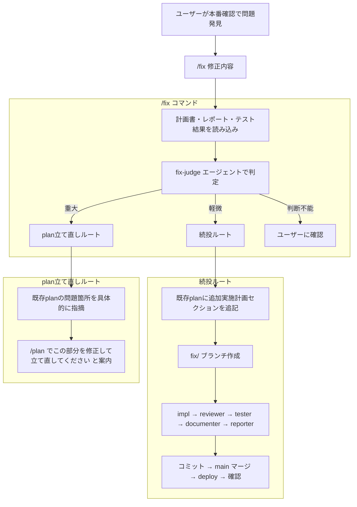

# 検討結果: デプロイ後の修正判定エージェント（fix-judge）と /fix コマンド

## 検討経緯

| 日付 | 内容 |
|------|------|
| 2026-03-02 | 初回相談: デプロイ後の本番確認で修正が必要な場合に「軽い修正ならplan続投、重い修正なら新規plan作成」を判断するエージェントを作りたい |
| 2026-03-02 | 深掘り: (C) デプロイ後の本番確認タイミングであることを確認。案A（エージェント）+ /fix コマンドの方向性を決定 |
| 2026-03-02 | 方針決定: fix-judge エージェント + /fix コマンドの2点セット。軽微修正でもフルサイクル必須 |
| 2026-03-02 | 最終確定: 設計判断の経緯を整理、/fullstack への組み込みはコンテキスト消費の問題で見送り、独立コマンドとして確定 |

## 背景・目的

### なぜ必要か

現在の `/fullstack`, `/go`, `/nextjs` のフェーズ3（本番確認）で「問題あり」の場合、フローが1パターンしかない:

```
問題あり → git revert → feat ブランチに戻って修正 → 再マージ
```

これには2つの問題がある:

1. **修正の重さに関係なく同じフロー**: 「文字色を変えたい」も「機能の動線を見直したい」も同じ扱い
2. **フルサイクルがスキップされがち**: revert → 修正 → 再マージの記述が簡素なため、reviewer / tester / documenter / reporter のステップが省略されやすい

### 解決したいこと

- 修正の重さに応じて「既存plan続投」か「plan立て直し」を適切に判定する
- **どちらのルートでもフルサイクル（impl → reviewer → tester → documenter → reporter）を必ず回す**（最重要要件）

## 対象ユーザー

プロジェクト開発者（Claude Code エージェント利用者）

## 選択肢の検討

### 案A: fix-judge エージェント + /fix コマンド（採用）

- 概要: 判定ロジックを `fix-judge` エージェントとして独立させ、`/fix` コマンドから呼び出す。判定後はフルサイクルを実行
- メリット: 責務が明確に分離。判定基準の変更が1箇所で済む。コマンドで一気通貫
- デメリット: ファイルが2つ増える（agent + command）
- 工数感: 小〜中

### 案B: /fix コマンドのみ（不採用）

- 概要: コマンド内に判定ロジックを直接記述
- メリット: ファイルが1つで済む
- デメリット: コマンドファイルが長くなり、判定ロジックと実行フローが混在
- 工数感: 中

### 案C: 既存フロー拡張のみ（不採用）

- 概要: `/fullstack`, `/go`, `/nextjs` のフェーズ3を書き換え
- メリット: 新規ファイル不要
- デメリット: 3ファイルに同じロジックを書く必要がある。判定基準の変更時に3箇所修正
- 工数感: 小

### 案D: /fullstack に組み込み（不採用）

- 概要: `/fullstack` のフェーズ3内に fix-judge の呼び出しと修正サイクルを組み込む
- 不採用理由: `/fullstack` は既に impl → reviewer → tester → documenter → reporter の長いフローを持つ。デプロイ後の修正サイクルまで含めるとコンテキスト消費が過大になり、品質が下がる恐れがある

## 設計判断の経緯

| 判断 | 決定 | 理由 |
|------|------|------|
| `/fullstack` に組み込むか | 組み込まない | コンテキスト消費の問題。独立コマンドの方が安定 |
| 実装サイクルの再利用 | 既存の fullstack エージェント群を内部で再利用 | ロジック重複を避ける |
| 軽微修正のサイクル | フルサイクル必須 | これが最重要要件。スキップを防ぐ仕組みが目的 |
| 軽微修正時のplan扱い | 既存planに「追加実施計画」セクションを追記 | planを壊さず積み上げ。実装履歴としても追える |
| 重大修正時のplan扱い | 既存planベースで問題箇所を指摘し、/plan への入力材料にする | ゼロからではなく、どこを修正すべきかを明示 |

## 確定した設計

### 全体フロー



### 1. fix-judge エージェント

**ファイル**: `.claude/agents/fix-judge.md`

**責務**: デプロイ後の修正依頼を受け取り、既存planの続投で対応可能か、plan立て直しが必要かを判定する

**入力情報**:
- ユーザーの修正依頼（自然言語）
- 既存の計画書（`*_plan.md`）-- 実装ステップ、設計判断、変更ファイル一覧
- 既存のレポート（計画書末尾の実装完了レポート）-- 計画からの変更点、残存する懸念点
- テストプラン/テスト結果
- 現在の git diff / git log

**判定基準**:

| 観点 | 続投（既存plan延長） | plan立て直し |
|------|---------------------|-------------|
| 変更スコープ | 計画書の変更ファイル一覧の範囲内 | 計画書にない新しいファイルへの変更が必要 |
| 設計判断 | 計画書の設計判断・トレードオフが維持される | 計画書の設計判断を覆す必要がある |
| API/データ構造 | API エンドポイント追加・変更なし | API やデータ構造の変更が必要 |
| テストへの影響 | 既存テストの修正で対応可能 | 新しいテストケースの設計が必要 |
| レポートの懸念点 | レポートの「残存する懸念点」に該当しない | レポートの「残存する懸念点」に該当する |
| 修正の性質 | スタイル修正、文言修正、定数変更、軽微なロジック修正 | 機能追加、フロー変更、アーキテクチャ変更 |

**出力フォーマット**:

```markdown
## 修正判定結果

### 判定: 続投 / plan立て直し / 要確認

### 修正内容の分析
- 修正依頼: [ユーザーの修正依頼を要約]
- 影響範囲: [変更が必要なファイル・箇所]
- 既存planとの関係: [planの範囲内/範囲外]

### 判定理由
| 観点 | 評価 | 詳細 |
|------|------|------|
| 変更スコープ | plan範囲内/外 | ... |
| 設計判断 | 維持/変更 | ... |
| API/データ構造 | 変更なし/あり | ... |
| テスト影響 | 軽微/重大 | ... |
| レポート懸念点 | 該当なし/該当あり | ... |

### 推奨アクション
[具体的な次のステップ]
```

### 2. /fix コマンド

**ファイル**: `.claude/commands/fix.md`

**責務**: fix-judge の判定結果に応じて、適切な修正フローを実行する。ユーザーは `/fix 修正内容` の1コマンドで完結する。

**フロー**:

#### 共通ステップ（最初に実行）
1. 最新の計画書・レポートのパスを特定（`開発/実装/完了/` または `開発/実装/実装待ち/` から直近の `*_plan.md` を探す）
2. `fix-judge` エージェントを呼び出して判定
3. 判定結果をユーザーに提示し、承認を得る

#### 続投ルート（軽微な修正）
1. `fix/修正内容` ブランチを作成
2. 既存計画書に「追加実施計画」セクションを追記（修正内容、変更ファイル、修正ステップ）
3. フルサイクル実行（既存の fullstack エージェント群を再利用）:
   - impl エージェント（修正内容に応じて go-impl / nextjs-impl）
   - reviewer エージェント
   - tester エージェント
   - documenter エージェント
   - reporter エージェント（レポートを計画書に追記）
4. コミット
5. main マージ → deploy → 本番確認

#### plan立て直しルート（重大な修正）
1. 既存planのどこに問題があるか具体的に指摘
2. 「`/plan` でこの部分を修正して立て直してください」と案内（既存planベースで修正箇所を明示。ゼロからではない）
3. ユーザーが `/plan` で計画を修正
4. 計画完了後、`/fullstack` or `/go` or `/nextjs` で実装

### 計画書への追記イメージ（続投ルート）

続投ルートでは、既存の計画書に以下のセクションが追記される:

```markdown
---

## 追加実施計画（YYYY-MM-DD）

### 修正依頼
[ユーザーの修正内容]

### 修正判定
続投（fix-judge 判定: 既存planの範囲内）

### 変更ファイル
| ファイル | 変更内容 |
|---------|---------|
| ... | ... |

### 修正ステップ
1. ...
2. ...

---

## 追加修正レポート（YYYY-MM-DD）

### 実装サマリー
- 変更ファイル数: X files

### 変更ファイル一覧
| ファイル | 変更内容 |
|---------|---------|
| ... | ... |

...
```

これにより、1つの計画書ファイルに初回実装と追加修正の履歴が全て残る。

## 作成・変更ファイル

| ファイル | 種別 | 内容 |
|---------|------|------|
| `.claude/agents/fix-judge.md` | 新規 | 修正の重さを判定するエージェント |
| `.claude/commands/fix.md` | 新規 | 判定から実行まで1コマンドで完結するコマンド |

既存の `/fullstack`, `/go`, `/nextjs` は変更しない。`/fix` は独立したコマンドとして運用する。

## 次回以降

- 判定精度の改善（実運用でのフィードバックを元に判定基準を調整）
- 続投ルートでの差分テスト（変更箇所に関連するテストのみ実行する最適化）
- 修正履歴の蓄積と分析（どの程度の修正が発生しているかの可視化）

## 次のステップ

1. `/plan` で実装計画を作成（fix-judge.md と fix.md の具体的な記述内容を詳細化）
