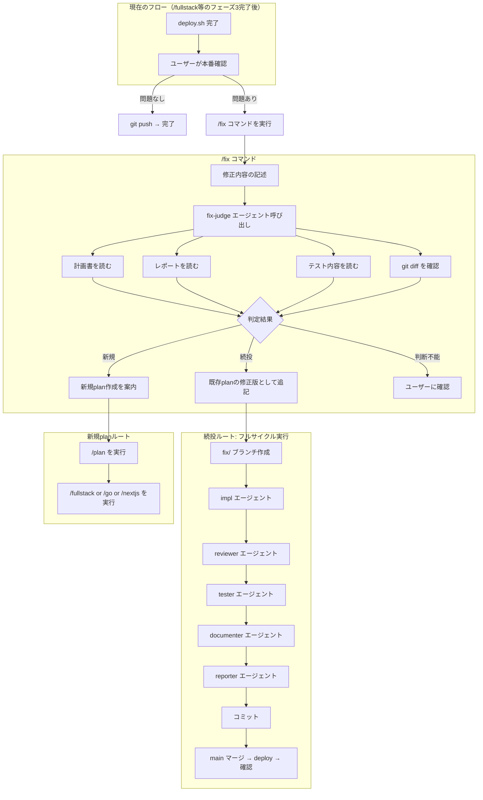

# 検討結果: デプロイ後の修正判定エージェント（fix-judge）と /fix コマンド

## 検討経緯

| 日付 | 内容 |
|------|------|
| 2026-03-02 | 初回相談: デプロイ後の本番確認で修正が必要な場合に「軽い修正ならplan続投、重い修正なら新規plan作成」を判断するエージェントを作りたい |
| 2026-03-02 | 深掘り: (C) デプロイ後の本番確認タイミングであることを確認。案A（エージェント）+ /fix コマンドの方向性を決定 |
| 2026-03-02 | 方針決定: fix-judge エージェント + /fix コマンドの2点セット。軽微修正でもフルサイクル必須 |

## 背景・目的

### なぜ必要か

現在の `/fullstack`, `/go`, `/nextjs` のフェーズ3（本番確認）で「問題あり」の場合、フローが1パターンしかない:

```
問題あり → git revert → feat ブランチに戻って修正 → 再マージ
```

これには2つの問題がある:

1. **修正の重さに関係なく同じフロー**: 「文字色を変えたい」も「機能の動線を見直したい」も同じ扱い
2. **フルサイクルがスキップされがち**: revert → 修正 → 再マージの記述が簡素なため、reviewer / tester / documenter / reporter のステップが省略されやすい

### 解決したいこと

- 修正の重さに応じて「既存plan続投」か「新規plan作成」を適切に判定する
- **どちらのルートでもフルサイクル（impl → reviewer → tester → documenter → reporter）を必ず回す**

## 対象ユーザー

プロジェクト開発者（Claude Code エージェント利用者）

## 選択肢の検討

### 案A: fix-judge エージェント + /fix コマンド（採用）

- 概要: 判定ロジックを `fix-judge` エージェントとして独立させ、`/fix` コマンドから呼び出す。判定後はフルサイクルを実行
- メリット: 責務が明確に分離。判定基準の変更が1箇所で済む。コマンドで一気通貫
- デメリット: ファイルが2つ増える（agent + command）
- 工数感: 小〜中

### 案B: /fix コマンドのみ（不採用）

- 概要: コマンド内に判定ロジックを直接記述
- メリット: ファイルが1つで済む
- デメリット: コマンドファイルが長くなり、判定ロジックと実行フローが混在
- 工数感: 中

### 案C: 既存フロー拡張のみ（不採用）

- 概要: `/fullstack`, `/go`, `/nextjs` のフェーズ3を書き換え
- メリット: 新規ファイル不要
- デメリット: 3ファイルに同じロジックを書く必要がある。判定基準の変更時に3箇所修正
- 工数感: 小

## 設計詳細

### 全体フロー



### 1. fix-judge エージェント

**ファイル**: `.claude/agents/fix-judge.md`

**責務**: デプロイ後の修正依頼を受け取り、既存planの続投で対応可能か、新規plan作成が必要かを判定する

**入力情報**:
- ユーザーの修正依頼（自然言語）
- 既存の計画書（`*_plan.md`）
- 既存のレポート（計画書末尾の実装完了レポート）
- テストプラン/テスト結果
- 現在の git diff / git log

**判定基準**:

| 観点 | 続投（既存plan延長） | 新規plan作成 |
|------|---------------------|-------------|
| 変更スコープ | 計画書の変更ファイル一覧の範囲内 | 計画書にない新しいファイルへの変更が必要 |
| 設計判断 | 計画書の設計判断・トレードオフが維持される | 計画書の設計判断を覆す必要がある |
| API/データ構造 | API エンドポイント追加・変更なし | API やデータ構造の変更が必要 |
| テストへの影響 | 既存テストの修正で対応可能 | 新しいテストケースの設計が必要 |
| レポートの懸念点 | レポートの「残存する懸念点」に該当しない | レポートの「残存する懸念点」に該当する |
| 修正の性質 | スタイル修正、文言修正、定数変更、軽微なロジック修正 | 機能追加、フロー変更、アーキテクチャ変更 |

**出力フォーマット**:

```markdown
## 修正判定結果

### 判定: 続投 / 新規plan / 要確認

### 修正内容の分析
- 修正依頼: [ユーザーの修正依頼を要約]
- 影響範囲: [変更が必要なファイル・箇所]
- 既存planとの関係: [planの範囲内/範囲外]

### 判定理由
| 観点 | 評価 | 詳細 |
|------|------|------|
| 変更スコープ | plan範囲内/外 | ... |
| 設計判断 | 維持/変更 | ... |
| API/データ構造 | 変更なし/あり | ... |
| テスト影響 | 軽微/重大 | ... |
| レポート懸念点 | 該当なし/該当あり | ... |

### 推奨アクション
[具体的な次のステップ]
```

### 2. /fix コマンド

**ファイル**: `.claude/commands/fix.md`

**責務**: fix-judge の判定結果に応じて、適切な修正フローを実行する

**フロー**:

#### 共通（最初に実行）
1. 最新の計画書・レポートのパスを特定
2. `fix-judge` エージェントを呼び出して判定
3. 判定結果をユーザーに提示し、承認を得る

#### 続投ルート
1. `fix/修正内容` ブランチを作成
2. 既存計画書に「追加修正」セクションを追記
3. フルサイクル実行:
   - impl エージェント（修正内容に応じて go-impl / nextjs-impl）
   - reviewer エージェント
   - tester エージェント
   - documenter エージェント
   - reporter エージェント（レポートを計画書に追記）
4. コミット
5. main マージ → deploy → 本番確認

#### 新規planルート
1. `/plan` コマンドの実行を案内
2. ユーザーが `/plan` で新規計画を作成
3. 計画完了後、`/fullstack` or `/go` or `/nextjs` で実装

### 3. 既存コマンドへの影響

`/fullstack`, `/go`, `/nextjs` のフェーズ3（本番確認）の「問題あり」分岐を以下のように変更:

**変更前:**
```
問題あり → git revert HEAD → feat ブランチに戻って修正 → 再マージ
```

**変更後:**
```
問題あり → `/fix` コマンドの実行を案内
```

## MVP提案

**推奨案**: 案A（fix-judge エージェント + /fix コマンド）

### MVP範囲

- `fix-judge` エージェントの作成（判定ロジック）
- `/fix` コマンドの作成（判定 → フルサイクル実行）
- `/fullstack`, `/go`, `/nextjs` のフェーズ3を `/fix` への誘導に書き換え

### 次回以降

- 判定精度の改善（実運用でのフィードバックを元に判定基準を調整）
- 続投ルートでの差分テスト（変更箇所に関連するテストのみ実行する最適化）
- 修正履歴の蓄積と分析（どの程度の修正が発生しているかの可視化）

## ファイル構成

```
.claude/
  agents/
    fix-judge.md        # 新規: 修正判定エージェント
  commands/
    fix.md              # 新規: 修正実行コマンド
    fullstack.md        # 変更: フェーズ3の分岐を修正
    go.md               # 変更: 本番確認の分岐を修正
    nextjs.md           # 変更: 本番確認の分岐を修正
```

## 次のステップ

1. この検討結果を `開発/検討中/` に保存
2. 方針決定後、`/plan` で実装計画を作成
3. 計画確定後、`開発/実装/実装待ち/` に移動
