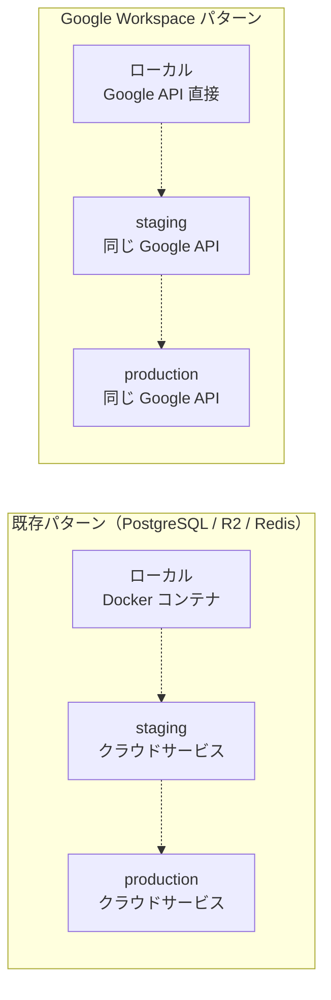
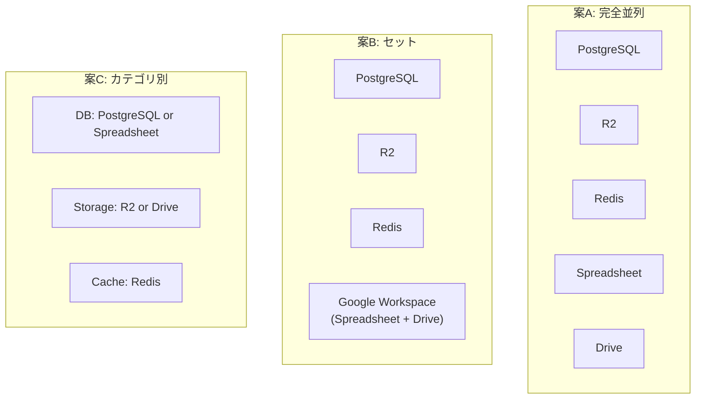
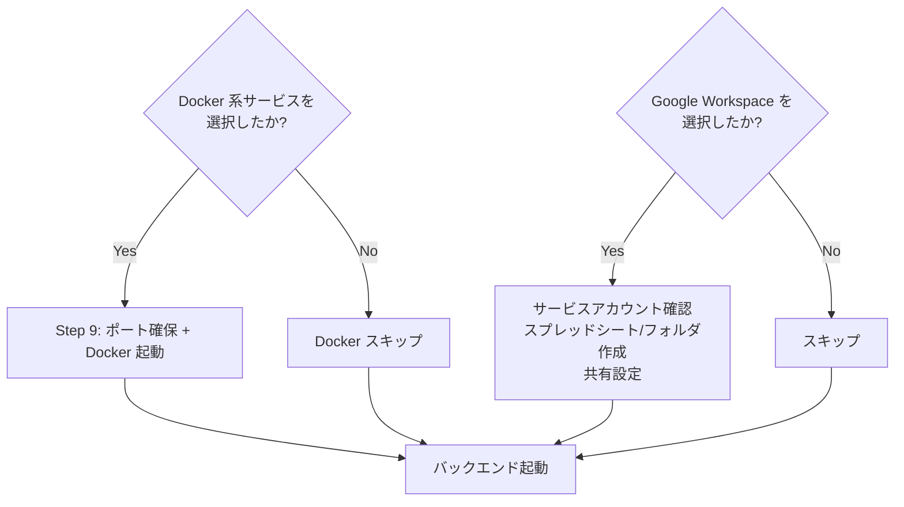

# 検討結果: Google Workspace 連携選択肢（Spreadsheet / Drive）

## 検討経緯

| 日付 | 内容 |
|------|------|
| 2026-03-03 | 初回相談: DB の代わりに Google Spreadsheet、ストレージの代わりに Google Drive を `/init` の選択肢に追加するアイデア |

## 背景・目的

### なぜこの選択肢が必要か

Ghostrunner 本体（データ復旧サービスの業務管理システム）が既に Google Sheets API + Gmail API を使って運用されており、Google Workspace を「データ基盤」として使うパターンの実績がある。このパターンをプロジェクトスターターの選択肢として提供することで、以下のニーズに応える。

### ユースケース

1. **社内ツール・業務管理系**: スプレッドシートで既にデータ管理している業務をWebアプリ化する。非エンジニアが直接データを見たり編集したりできる利点。
2. **プロトタイプ・MVP**: DB設計なしに素早く動くものを作りたい。スキーマ変更がスプレッドシートの列追加で済む。
3. **小規模サービス**: ユーザー数が少なく、トランザクション要件が低い。Google Workspace の無料枠・既存契約内で完結したい。
4. **ファイル共有・コラボレーション**: Google Drive をファイルストレージとして使い、Google Workspace の共有・権限管理機能をそのまま活用。

## 対象ユーザー

- Google Workspace を既に契約・利用している開発者
- 社内ツール・業務管理システムを構築する開発者
- DB の運用コスト・複雑さを避けたい小規模プロジェクト

## 解決する課題

| 現状の課題 | この機能で解決 |
|-----------|-------------|
| PostgreSQL は学習コスト・運用コストが高い（Neon の無料枠は限定的） | Google Spreadsheet は追加コストなし、GUI で直接データ操作可能 |
| R2 はファイル共有の権限管理を自前で実装する必要がある | Google Drive は既存の共有・権限管理をそのまま使える |
| ローカル開発に Docker が必要 | Google API はローカルから直接叩ける（Docker 不要） |

---

## 重要な論点: 既存パターンとの構造的な違い

### 3層パターンとの整合性

既存の選択肢（PostgreSQL / R2 / Redis）は全て「3層パターン」に従っている:

```
ローカル開発:  Docker コンテナ（PostgreSQL / MinIO / Redis）
staging:      クラウドサービス（Neon staging / R2 staging / Upstash staging）
production:   クラウドサービス（Neon production / R2 production / Upstash production）
```

**Google Spreadsheet / Drive にはローカル Docker に相当するものがない。** これが最大の構造的な違い。



### staging / production の分離方法

Google Workspace で環境分離する場合、いくつかの戦略がある:

| 戦略 | Spreadsheet での例 | Drive での例 | メリット | デメリット |
|------|-------------------|-------------|---------|----------|
| **A: 別ファイル/フォルダ** | staging 用と production 用で別のスプレッドシート | 別フォルダ | シンプル、完全に分離 | ファイル ID を環境変数で管理する必要がある |
| **B: 別シート/サブフォルダ** | 同一スプレッドシート内の別シート | 同一フォルダ内のサブフォルダ | 管理が楽 | 誤操作のリスク |
| **C: 別アカウント** | 別の Google アカウント | 別の Google アカウント | 完全分離、権限も独立 | サービスアカウントの管理が煩雑 |

**推奨: 戦略 A（別ファイル/フォルダ）**

- 環境変数で `SPREADSHEET_ID` / `DRIVE_FOLDER_ID` を切り替える
- 既存の Secret Manager パターン（`DATABASE_URL` / `DATABASE_URL_STAGING`）と同じ構造で管理可能
- init コマンドで「開発用」のスプレッドシート/フォルダを自動作成できる

---

## 選択肢の検討

### 案A: 完全な新カテゴリとして追加

- 概要: 既存の「PostgreSQL / R2 / Redis」と並列に「Google Spreadsheet」「Google Drive」を選択肢に追加する。合計5つの選択肢になる。
- テンプレート: `templates/with-sheets/`, `templates/with-drive/` を新規作成
- init の Q2 選択肢: PostgreSQL / R2 / Redis / Google Spreadsheet / Google Drive
- メリット: ユーザーが自由に組み合わせられる（例: Spreadsheet + R2、PostgreSQL + Drive）
- デメリット: 選択肢が多くなりすぎる。Spreadsheet + PostgreSQL のような非現実的な組み合わせも可能になる
- 工数感: 大（テンプレート2セット + init.md の大幅改修 + 組み合わせテスト）

### 案B: Google Workspace セットとして追加

- 概要: 「Google Spreadsheet + Google Drive」をセットで1つの選択肢として追加。DB の代わりに Spreadsheet、ストレージの代わりに Drive、という位置づけ。
- テンプレート: `templates/with-google-workspace/` を新規作成
- init の Q2 選択肢: PostgreSQL / R2 / Redis / Google Workspace（Spreadsheet + Drive）
- メリット: 選択肢がシンプル。Google Workspace はそもそもセットで使うことが多い。認証も1つのサービスアカウントで済む
- デメリット: Drive だけ・Spreadsheet だけという選択ができない
- 工数感: 中（テンプレート1セット + init.md の改修）

### 案C: DB カテゴリ / ストレージカテゴリに統合

- 概要: Q2 を「DB 選択」「ストレージ選択」「キャッシュ選択」の3段階に分け、各段階で排他的に選択させる。
- init の Q2 が3つの質問に分かれる:
  - Q2a: DB → なし / PostgreSQL（Neon） / Google Spreadsheet
  - Q2b: ストレージ → なし / R2（Cloudflare） / Google Drive
  - Q2c: キャッシュ → なし / Redis（Upstash）
- メリット: 論理的に正しい（DB と Spreadsheet は排他、ストレージと Drive は排他）。将来の選択肢追加（例: MySQL、S3）にも対応しやすい
- デメリット: init の対話フローが複雑化。既存の multiSelect から段階的質問に変更が必要
- 工数感: 大（init.md のフロー全体を再設計 + テンプレート2セット）

### 比較表



| 観点 | 案A: 完全並列 | 案B: セット | 案C: カテゴリ別 |
|------|-------------|-----------|--------------|
| 選択のシンプルさ | x 5つの選択肢、組み合わせ爆発 | o 4つの選択肢 | o 各カテゴリ2-3択 |
| 柔軟性 | o 自由な組み合わせ | △ セットのみ | o カテゴリ内で排他選択 |
| 論理的正しさ | x DB+Spreadsheet 同時選択が可能 | △ Google Workspace 単位 | o 排他関係が明確 |
| 実装工数 | 大 | 中 | 大 |
| 既存コードへの影響 | 中（追加のみ） | 小（追加のみ） | 大（Q2フロー再設計） |
| 将来の拡張性 | △ 選択肢が増え続ける | △ セット単位でしか追加できない | o カテゴリに選択肢を追加 |

---

## 技術的な検討

### 認証方式

Google Workspace API を使うには認証が必要。プロジェクトスターターとして提供する場合:

| 方式 | ローカル開発 | staging / production | 適しているケース |
|------|-----------|---------------------|---------------|
| **サービスアカウント** | JSON キーファイル | Secret Manager で JSON キーを管理 | バックエンドからの自動処理 |
| **OAuth 2.0** | ブラウザでログイン | リフレッシュトークンを管理 | ユーザーの権限でアクセスする場合 |

**推奨: サービスアカウント方式**
- init コマンドで「GCP プロジェクトのサービスアカウントキー」を環境変数に設定
- Spreadsheet / Drive をサービスアカウントに共有設定
- 既存の GCP デプロイフロー（Step 12）との相性が良い

### 環境変数

```
# Google Workspace 共通
GOOGLE_SERVICE_ACCOUNT_KEY=<JSON キーファイルのパスまたは内容>

# Spreadsheet
SPREADSHEET_ID=<スプレッドシートの ID>

# Drive
DRIVE_FOLDER_ID=<Google Drive フォルダの ID>
```

### Docker 不要という特性

既存パターンと最も異なる点。これはメリットでもありデメリットでもある:

- **メリット**: Docker Desktop のインストール不要。マシンリソースの節約。起動が速い。
- **デメリット**: ローカルで完全にオフライン開発できない。API レート制限がある。ネットワーク依存。

### init コマンドへの影響

Docker が不要なため、Step 9（ポート確保と Docker 起動）のフローが変わる:



### API レート制限

| API | 制限 | 影響 |
|-----|------|------|
| Google Sheets API | 読み取り: 60回/分/ユーザー、書き込み: 60回/分/ユーザー | 高頻度アクセスには不向き |
| Google Drive API | 20,000回/100秒/プロジェクト | 一般的な用途では問題なし |

---

## MVP 提案

**推奨案: 案B（Google Workspace セット）をベースに、まず Spreadsheet のみから始める**

### 理由

1. Spreadsheet が最もニーズが高い（Ghostrunner 本体が実績あり）
2. Drive は Spreadsheet の認証基盤を共有できるため、後から追加しやすい
3. 案B のセット構造は後から案C のカテゴリ別に移行しやすい
4. 1つのテンプレートから始めれば工数が小さい

### MVP 範囲（Phase 1: Google Spreadsheet）

- `templates/with-sheets/` テンプレートの作成
  - `backend/internal/infrastructure/sheets.go` - Sheets API クライアント
  - `backend/internal/handler/sheets.go` - CRUD ハンドラー
  - `backend/internal/registry/sheets.go` - レジストリ登録
  - `frontend/src/app/sheets/page.tsx` - サンプルページ
- init.md の Q2 に「Google Spreadsheet」選択肢を追加
- サービスアカウント認証の初期化フロー
- 環境変数: `GOOGLE_SERVICE_ACCOUNT_KEY`, `SPREADSHEET_ID`
- init 時にサンプル用スプレッドシートを自動作成（Google Sheets API で）
- 動作確認: CRUD API でスプレッドシートの行を操作

### 次回以降（Phase 2: Google Drive）

- `templates/with-drive/` テンプレートの作成
- Drive API によるファイルアップロード/ダウンロード/一覧
- 認証基盤は Phase 1 で作った `GOOGLE_SERVICE_ACCOUNT_KEY` を共有
- init.md を案C（カテゴリ別選択）に移行するタイミングで統合

### 次回以降（Phase 3: カテゴリ別選択への移行）

- Q2 を「DB」「ストレージ」「キャッシュ」のカテゴリ別に再設計
- Spreadsheet を DB カテゴリ、Drive をストレージカテゴリに配置
- 排他選択の制約を実装

---

## 確認させてください

検討をさらに進める前に、いくつか確認したいことがあります:

1. **ユースケースの優先度**: Spreadsheet と Drive、どちらが先にほしいですか？（上記では Spreadsheet を優先と仮定しています）

2. **認証方式**: サービスアカウント方式で問題ないですか？それとも OAuth 2.0（ユーザー権限でのアクセス）も考慮すべきですか？

3. **init フローの変更範囲**: 案B（セット追加）で始めるか、この機会に案C（カテゴリ別）にフロー全体を再設計するか、どちらが好みですか？

4. **既存の選択肢との排他関係**: 「PostgreSQL と Spreadsheet を同時に選ぶ」ことを許容しますか？（例: PostgreSQL はメインDB、Spreadsheet はレポート出力用、のような使い方）

## 次のステップ

1. この検討結果を `開発/検討中/` に保存 --- 完了
2. 上記の確認事項について方針を決定
3. 方針決定後、`/plan` で実装計画を作成
4. 計画確定後、`開発/実装/実装待ち/` に移動
