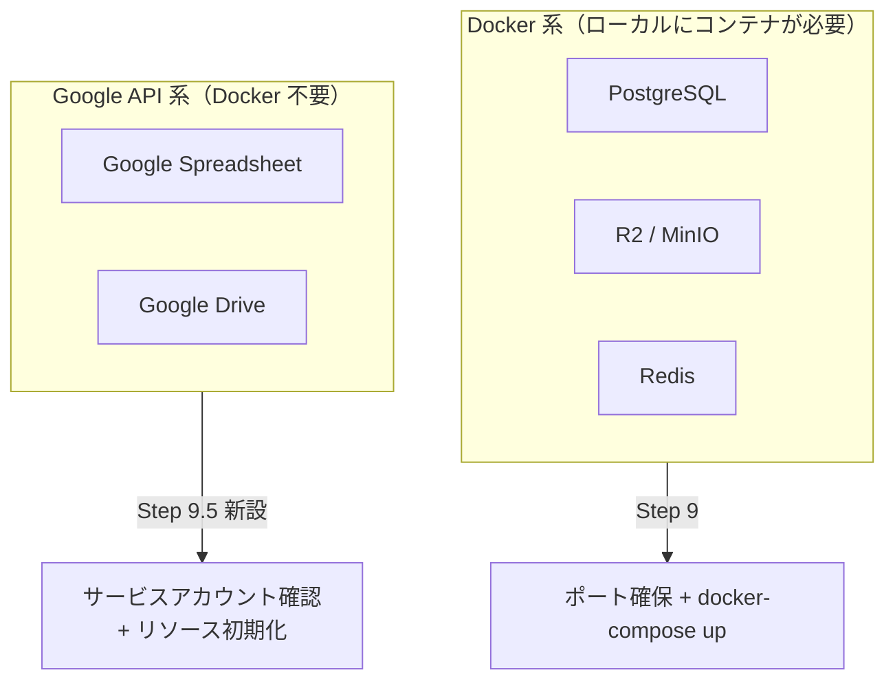
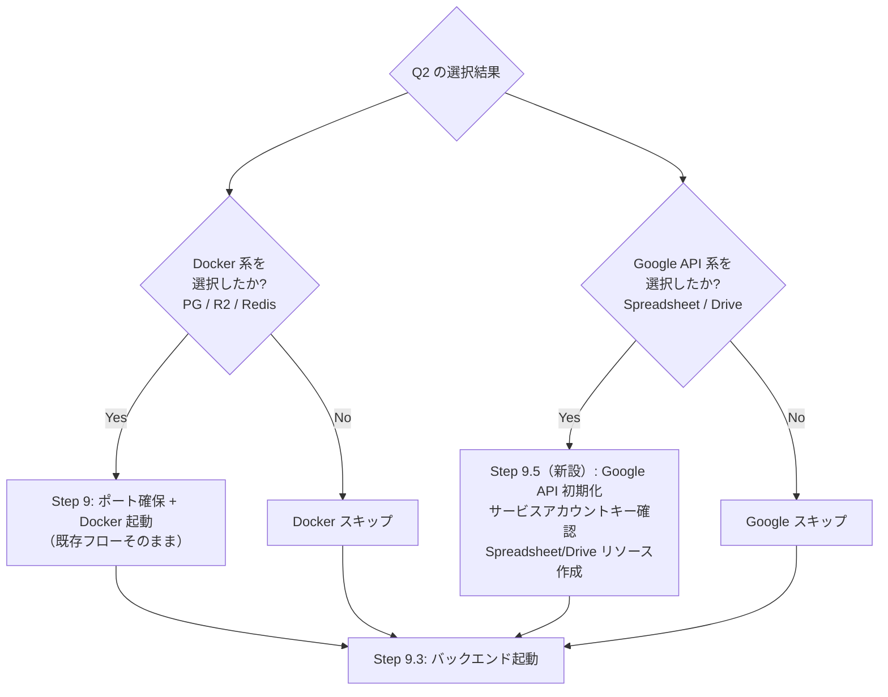
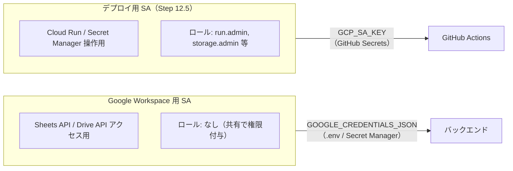
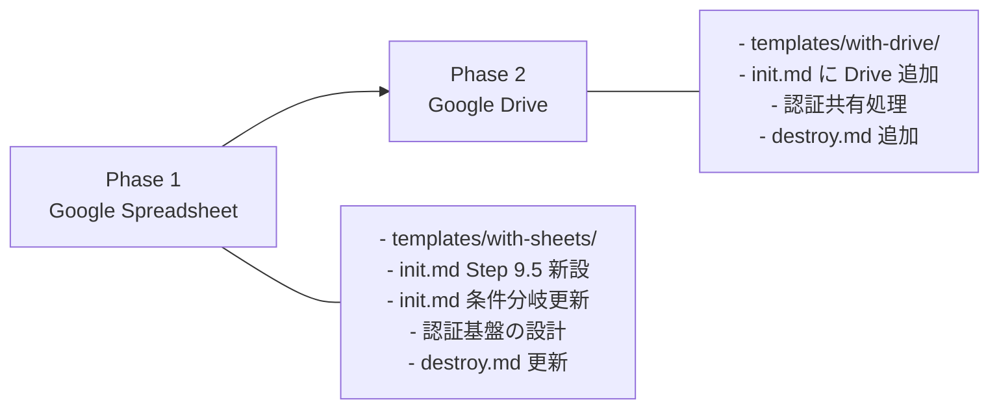

# 検討結果: Google Workspace 連携選択肢（Spreadsheet / Drive）

## 検討経緯

| 日付 | 内容 |
|------|------|
| 2026-03-03 | 初回相談: DB の代わりに Google Spreadsheet、ストレージの代わりに Google Drive を `/init` の選択肢に追加するアイデア |
| 2026-03-03 | 方針決定: 案A（完全並列）を採用。認証はサービスアカウント方式。PostgreSQL と Spreadsheet の同時選択を許容（排他ではなく共存） |

## 背景・目的

### なぜこの選択肢が必要か

Ghostrunner 本体（データ復旧サービスの業務管理システム）が既に Google Sheets API + Gmail API を使って運用されており、Google Workspace を「データ基盤」として使うパターンの実績がある。このパターンをプロジェクトスターターの選択肢として提供することで、以下のニーズに応える。

### ユースケース

1. **社内ツール・業務管理系**: スプレッドシートで既にデータ管理している業務をWebアプリ化する。非エンジニアが直接データを見たり編集したりできる利点。
2. **プロトタイプ・MVP**: DB設計なしに素早く動くものを作りたい。スキーマ変更がスプレッドシートの列追加で済む。
3. **小規模サービス**: ユーザー数が少なく、トランザクション要件が低い。Google Workspace の無料枠・既存契約内で完結したい。
4. **ファイル共有・コラボレーション**: Google Drive をファイルストレージとして使い、Google Workspace の共有・権限管理機能をそのまま活用。

## 対象ユーザー

- Google Workspace を既に契約・利用している開発者
- 社内ツール・業務管理システムを構築する開発者
- DB の運用コスト・複雑さを避けたい小規模プロジェクト

## 解決する課題

| 現状の課題 | この機能で解決 |
|-----------|-------------|
| PostgreSQL は学習コスト・運用コストが高い（Neon の無料枠は限定的） | Google Spreadsheet は追加コストなし、GUI で直接データ操作可能 |
| R2 はファイル共有の権限管理を自前で実装する必要がある | Google Drive は既存の共有・権限管理をそのまま使える |
| ローカル開発に Docker が必要 | Google API はローカルから直接叩ける（Docker 不要） |

---

## 決定事項

### 採用案: 案A（完全並列）

5つの選択肢を全て並列に表示し、ユーザーが自由に組み合わせられるようにする。

- PostgreSQL と Spreadsheet の同時選択も許容する（排他にしない）
- 認証はサービスアカウント方式（OAuth 2.0 は不要）

### 理由

- 柔軟性が最も高い。PostgreSQL をメインDB、Spreadsheet をレポート出力用のように使い分けるケースも現実的
- 排他制約を実装するよりシンプル（multiSelect のまま選択肢を増やすだけ）
- ユーザーの判断に委ねる方が使いやすい

---

## Q2 の選択肢の最終形

### 対話フロー

```
Q2: 使用するデータサービスを選択してください（複数選択可）
  1. PostgreSQL（Neon）       -- ローカル: Docker, staging/prod: Neon
  2. オブジェクトストレージ（Cloudflare R2） -- ローカル: Docker MinIO, staging/prod: R2
  3. Redis（Upstash）         -- ローカル: Docker, staging/prod: Upstash
  4. Google Spreadsheet       -- 全環境: Google Sheets API
  5. Google Drive             -- 全環境: Google Drive API
```

### 選択可能な組み合わせの例

全ての組み合わせを許容する（2^5 = 32通り）。以下は代表的な組み合わせ:

| パターン | 選択 | Docker | ユースケース |
|---------|------|--------|------------|
| DB のみ | PostgreSQL | 必要 | 一般的な CRUD アプリ |
| Spreadsheet のみ | Spreadsheet | 不要 | 社内ツール、MVP |
| DB + Spreadsheet | PostgreSQL + Spreadsheet | 必要 | メインDB + レポート/ダッシュボード |
| ストレージのみ | R2 | 必要 | ファイルアップロード中心 |
| Drive のみ | Drive | 不要 | Google Workspace 中心のファイル管理 |
| R2 + Drive | R2 + Drive | 必要 | 公開ファイル(R2) + 内部ファイル(Drive) |
| Spreadsheet + Drive | Spreadsheet + Drive | 不要 | 完全 Google Workspace 構成 |
| フルセット | 全部 | 必要 | 大規模プロジェクト |

---

## 3層パターンとの違い: init.md フローへの影響

### Docker 系 vs Google API 系の分類



### Step 9 の条件分岐（変更後）

現在の Step 9 は「PostgreSQL またはストレージまたは Redis 選択時」に Docker を起動する。Google API 系は Docker が不要なので、条件を「Docker 系サービスを選択したか」に変更する。



### Step 9.5（新設）: Google API 初期化

Google Spreadsheet または Google Drive を選択した場合に実行する。

#### 9.5.1 サービスアカウントキーの確認

```
AskUserQuestion:
「Google API 用のサービスアカウントキー（JSON）のパスを入力してください」
```

ユーザーが入力したパスの JSON を読み込み、`.env` に設定:
```bash
# JSON ファイルの内容を base64 エンコードして環境変数に設定
GOOGLE_CREDENTIALS_JSON=$(cat <入力されたパス>)
echo "GOOGLE_CREDENTIALS_JSON='$(cat <入力されたパス>)'" >> /Users/user/<プロジェクト名>/backend/.env
```

**注意**: Step 12.5 で作成するデプロイ用サービスアカウントとは別物。ここで使うのは Google Sheets API / Drive API にアクセスするためのサービスアカウント。デプロイ用は Cloud Run / Secret Manager 等の GCP インフラ用。

#### 9.5.2 GCP API 有効化の案内

サービスアカウントが属する GCP プロジェクトで Sheets API / Drive API を有効化する必要がある。ただし、この時点では gcloud がセットアップされていない可能性がある（Step 12 で行う）ため、案内メッセージを表示するのみ:

```
注意: Google Cloud Console で以下の API を有効化してください:
  - Google Sheets API（Spreadsheet 選択時）
  - Google Drive API（Drive 選択時）
  URL: https://console.cloud.google.com/apis/library
```

#### 9.5.3 Spreadsheet 初期化（Spreadsheet 選択時）

```
AskUserQuestion:
「開発用スプレッドシートの ID を入力してください（ブラウザの URL から取得: https://docs.google.com/spreadsheets/d/<この部分>/edit）」
```

入力された ID を `.env` に追記:
```bash
echo "SPREADSHEET_ID=<入力された ID>" >> /Users/user/<プロジェクト名>/backend/.env
echo "SPREADSHEET_ID=<入力された ID>" >> /Users/user/<プロジェクト名>/backend/.env.example
```

**注意**: サービスアカウントにスプレッドシートを共有する必要がある旨を案内:
```
注意: サービスアカウントのメールアドレス（JSON の client_email）に
スプレッドシートの編集権限を共有してください。
```

#### 9.5.4 Drive 初期化（Drive 選択時）

```
AskUserQuestion:
「開発用 Google Drive フォルダの ID を入力してください（ブラウザの URL から取得: https://drive.google.com/drive/folders/<この部分>）」
```

入力された ID を `.env` に追記:
```bash
echo "DRIVE_FOLDER_ID=<入力された ID>" >> /Users/user/<プロジェクト名>/backend/.env
echo "DRIVE_FOLDER_ID=<入力された ID>" >> /Users/user/<プロジェクト名>/backend/.env.example
```

**注意**: サービスアカウントにフォルダを共有する必要がある旨を案内。

#### 9.5.5 動作確認

バックエンド起動後（Step 9.3 の後）の動作確認に追加:

Spreadsheet 選択時:
```bash
# スプレッドシート読み取りテスト
curl -s http://localhost:8080/api/sheets/rows

# スプレッドシート書き込みテスト
curl -s -X POST http://localhost:8080/api/sheets/rows \
  -H "Content-Type: application/json" \
  -d '{"values":["Hello","World"]}'
```

Drive 選択時:
```bash
# ファイルアップロードテスト
echo "test" > /tmp/test-upload.txt
curl -s -X POST http://localhost:8080/api/drive/upload -F "file=@/tmp/test-upload.txt"

# ファイル一覧確認
curl -s http://localhost:8080/api/drive/files
rm /tmp/test-upload.txt
```

### Step 10 の条件変更

現在の Step 10 は「PostgreSQL もストレージも Redis も未選択時」に実行される。Google API 系の追加により条件を更新:

**変更前**: PostgreSQL もストレージも Redis も選択しなかった場合
**変更後**: Docker 系（PostgreSQL / R2 / Redis）を1つも選択しなかった場合

Google API 系のみ選択した場合もここに該当する。ただし、Step 9.5 の Google API 初期化は Step 10 より前に実行する。

---

## サービスアカウント認証の詳細

### 2つのサービスアカウントの関係



### 同じ SA を使い回せるか？

技術的には同じサービスアカウントに追加ロールを付与すれば可能だが、**分離を推奨**する:

| 観点 | 同じ SA | 別々の SA |
|------|---------|----------|
| 管理のシンプルさ | o 1つだけ管理 | x 2つ管理 |
| 最小権限の原則 | x デプロイ権限 + データアクセス権限が1つに | o 権限が分離 |
| ローカル開発 | x デプロイ用キーをローカルに置くことになる | o データアクセス用キーのみ |
| セキュリティ | x キー漏洩時の影響範囲が大きい | o 影響範囲が限定される |

**推奨**: 別々のサービスアカウント。ただし init.md では「既に SA キーがあればそれを使う」「なければ作り方を案内する」というフローにし、ユーザーの判断に委ねる。

### Google Workspace 用 SA に必要な設定

Sheets API / Drive API は IAM ロールではなく、**リソースの共有設定**でアクセスを制御する:

1. GCP プロジェクトで Sheets API / Drive API を有効化
2. サービスアカウントを作成
3. スプレッドシート / Drive フォルダを SA のメールアドレスに共有

IAM ロールの追加は不要。SA の `client_email` にスプレッドシートの編集権限を付与するだけ。

---

## 環境分離（staging / production）

### 環境変数の命名規則

既存の命名規則（`DATABASE_URL` / `DATABASE_URL_STAGING`）に合わせる:

| 環境変数 | 用途 | ローカル | staging | production |
|---------|------|---------|---------|------------|
| `GOOGLE_CREDENTIALS_JSON` | SA キーの JSON 内容 | .env | Secret Manager | Secret Manager |
| `SPREADSHEET_ID` | production 用シートの ID | .env（開発用） | Secret Manager | Secret Manager |
| `SPREADSHEET_ID_STAGING` | staging 用シートの ID | - | Secret Manager | - |
| `DRIVE_FOLDER_ID` | production 用フォルダの ID | .env（開発用） | Secret Manager | Secret Manager |
| `DRIVE_FOLDER_ID_STAGING` | staging 用フォルダの ID | - | Secret Manager | - |

### Secret Manager 登録（Step 12 への追加）

#### 12.x Google Spreadsheet の Secret Manager 登録（Spreadsheet 選択時）

```
AskUserQuestion:
「Google Spreadsheet の環境分離を設定しますか？（staging 用と production 用のスプレッドシート ID が必要です）」
- 選択肢: はい / 後で設定する
```

「はい」の場合:
```bash
# SA キー
gcloud secrets create GOOGLE_CREDENTIALS_JSON --data-file=<SA キーのパス>

# staging 用
echo -n "<staging 用 SPREADSHEET_ID>" | gcloud secrets create SPREADSHEET_ID_STAGING --data-file=-

# production 用
echo -n "<production 用 SPREADSHEET_ID>" | gcloud secrets create SPREADSHEET_ID --data-file=-
```

#### 12.x Google Drive の Secret Manager 登録（Drive 選択時）

```bash
# SA キーは Spreadsheet と共有（既に登録済みならスキップ）
gcloud secrets create GOOGLE_CREDENTIALS_JSON --data-file=<SA キーのパス> 2>/dev/null || true

# staging 用
echo -n "<staging 用 DRIVE_FOLDER_ID>" | gcloud secrets create DRIVE_FOLDER_ID_STAGING --data-file=-

# production 用
echo -n "<production 用 DRIVE_FOLDER_ID>" | gcloud secrets create DRIVE_FOLDER_ID --data-file=-
```

#### deploy.yml への --set-secrets 追加

Spreadsheet 選択時:
```
--set-secrets "GOOGLE_CREDENTIALS_JSON=GOOGLE_CREDENTIALS_JSON:latest,SPREADSHEET_ID=${{ github.ref_name == 'main' && 'SPREADSHEET_ID' || 'SPREADSHEET_ID_STAGING' }}:latest"
```

Drive 選択時:
```
--set-secrets "GOOGLE_CREDENTIALS_JSON=GOOGLE_CREDENTIALS_JSON:latest,DRIVE_FOLDER_ID=${{ github.ref_name == 'main' && 'DRIVE_FOLDER_ID' || 'DRIVE_FOLDER_ID_STAGING' }}:latest"
```

Spreadsheet + Drive 同時選択時は `GOOGLE_CREDENTIALS_JSON` の重複を避けて1つにまとめる。

---

## テンプレートファイル構成

### with-sheets/

```
templates/with-sheets/
|-- backend/
|   |-- internal/
|   |   |-- infrastructure/
|   |   |   |-- sheets.go          # Google Sheets API クライアント
|   |   |-- handler/
|   |   |   |-- sheets.go          # CRUD ハンドラー（行の読み書き）
|   |   |-- registry/
|   |       |-- sheets.go          # registry 登録（init + routes）
|   |-- go_deps.txt                # 追加する Go 依存パッケージ一覧（後述）
|-- frontend/
|   |-- src/
|       |-- app/
|           |-- sheets/
|               |-- page.tsx       # サンプル CRUD ページ
```

#### infrastructure/sheets.go の責務

- `NewSheets(credentialsJSON, spreadsheetID string) (*Sheets, error)` - クライアント初期化
- `GetRows(ctx, sheetName, range) ([][]string, error)` - 行の読み取り
- `AppendRow(ctx, sheetName, values []string) error` - 行の追加
- `UpdateRow(ctx, sheetName, rowIndex, values []string) error` - 行の更新
- `DeleteRow(ctx, sheetName, rowIndex) error` - 行の削除

#### registry/sheets.go のパターン

既存の `registry/db.go` や `registry/storage.go` と同じ `init()` + `OnInit` / `OnRoute` パターン:

- `OnInit`: `GOOGLE_CREDENTIALS_JSON` と `SPREADSHEET_ID` を読み取り、`infrastructure.NewSheets()` で初期化
- `OnRoute`: `/api/sheets/rows` に CRUD エンドポイントを登録
- 環境変数が未設定の場合は `log.Println` で警告してスキップ（storage.go と同じパターン）

#### Go 依存パッケージ

```bash
go get google.golang.org/api/sheets/v4@latest
go get google.golang.org/api/option@latest
go get golang.org/x/oauth2/google@latest
```

### with-drive/

```
templates/with-drive/
|-- backend/
|   |-- internal/
|   |   |-- infrastructure/
|   |   |   |-- drive.go           # Google Drive API クライアント
|   |   |-- handler/
|   |   |   |-- drive.go           # ファイル操作ハンドラー
|   |   |-- registry/
|   |       |-- drive.go           # registry 登録（init + routes）
|   |-- go_deps.txt                # 追加する Go 依存パッケージ一覧
|-- frontend/
|   |-- src/
|       |-- app/
|           |-- drive/
|               |-- page.tsx       # サンプルファイル管理ページ
```

#### infrastructure/drive.go の責務

- `NewDrive(credentialsJSON, folderID string) (*Drive, error)` - クライアント初期化
- `Upload(ctx, filename string, body io.Reader, mimeType string) (*FileInfo, error)` - アップロード
- `Download(ctx, fileID string) (io.ReadCloser, string, error)` - ダウンロード
- `List(ctx, query string) ([]FileInfo, error)` - ファイル一覧
- `Delete(ctx, fileID string) error` - 削除

#### Go 依存パッケージ

```bash
go get google.golang.org/api/drive/v3@latest
go get google.golang.org/api/option@latest
go get golang.org/x/oauth2/google@latest
```

**注意**: `option` と `oauth2/google` は Sheets と共通。両方選択した場合、`go get` は一度だけ実行すればよい。

### テンプレートの docker-compose.yml

Google API 系のテンプレートには **docker-compose.yml が存在しない**。これが Docker 系との最大の違い。

init.md の Step 3 で docker-compose.yml のマージ処理があるが、Google API 系は:
- docker-compose.yml へのサービス追加なし
- Docker 系と同時選択された場合は Docker 系の docker-compose.yml のみ使用

---

## destroy.md への影響

### リソース検出（Step 2）の追加

Google API 系のリソースは「アプリ外」にある（スプレッドシート、Drive フォルダ）ため、削除対象にはしない。ただし、関連する Secret Manager エントリは検出・削除する。

追加する検出:
```bash
# Google Workspace 関連の Secret Manager
gcloud secrets list --filter="name:GOOGLE_CREDENTIALS_JSON" 2>&1
gcloud secrets list --filter="name:SPREADSHEET_ID" 2>&1
gcloud secrets list --filter="name:DRIVE_FOLDER_ID" 2>&1
```

### 削除対象の選択（Step 3）への追加

選択肢に変更なし。Google Workspace のスプレッドシートや Drive フォルダ自体は削除しない（ユーザーが手動で管理するもの）。

Secret Manager のエントリは「GitHub + GCP デプロイ基盤」に含めて削除する:

```bash
# Step 4.7 に追加
gcloud secrets delete GOOGLE_CREDENTIALS_JSON --quiet 2>/dev/null || true
gcloud secrets delete SPREADSHEET_ID --quiet 2>/dev/null || true
gcloud secrets delete SPREADSHEET_ID_STAGING --quiet 2>/dev/null || true
gcloud secrets delete DRIVE_FOLDER_ID --quiet 2>/dev/null || true
gcloud secrets delete DRIVE_FOLDER_ID_STAGING --quiet 2>/dev/null || true
```

### 完了メッセージへの追加

Google API 系を使用していた場合、残存リソースの案内を追加:

```
注意: 以下のリソースは手動で管理してください:
  - Google スプレッドシート（ID: <SPREADSHEET_ID>）
  - Google Drive フォルダ（ID: <DRIVE_FOLDER_ID>）
  - サービスアカウント（GCP Console で管理）
```

---

## MVP の実装順序

### Phase 1: Google Spreadsheet（推奨: 先に実装）

**理由**:
1. Ghostrunner 本体で Google Sheets API の実績があり、実装パターンが確立している
2. Spreadsheet の方がユースケースが明確（DB の代替）
3. 認証基盤（`GOOGLE_CREDENTIALS_JSON` の取り扱い）を先に整備すれば、Drive は認証部分を共有できる
4. テンプレートファイル数が少ない（backend 3ファイル + frontend 1ファイル）

**スコープ**:
- `templates/with-sheets/` の全ファイル作成
- init.md の Q2 に選択肢追加
- init.md の Step 3（テンプレートコピー）に Spreadsheet 分岐を追加
- init.md の Step 5（.env 作成）に Spreadsheet 環境変数を追加
- init.md の Step 6（依存関係の解決）に `go get` を追加
- init.md の Step 9.5（Google API 初期化）を新設
- init.md の Step 9/10 の条件分岐を更新
- destroy.md の Secret Manager 削除に追加
- 静的検証スクリプトの更新

**工数感**: 中

### Phase 2: Google Drive

**理由**:
1. Phase 1 で認証基盤（`GOOGLE_CREDENTIALS_JSON`）が整備済み
2. Drive の infrastructure/handler パターンは storage.go とほぼ同じ（Upload/Download/List/Delete）
3. Phase 1 の init.md 変更を活用できる

**スコープ**:
- `templates/with-drive/` の全ファイル作成
- init.md に Drive 分岐を追加（Phase 1 のパターンを踏襲）
- `GOOGLE_CREDENTIALS_JSON` の共有処理（Spreadsheet と同時選択時の重複回避）
- destroy.md に Drive 関連の Secret Manager 削除を追加

**工数感**: 小（Phase 1 のパターンを流用できるため）

### 実装の依存関係



---

## init.md 変更箇所まとめ

Phase 1 + Phase 2 完了時点での init.md の変更箇所を一覧化する:

| Step | 変更内容 | Phase |
|------|---------|-------|
| Step 2 Q2 | 選択肢に「Google Spreadsheet」「Google Drive」を追加 | 1, 2 |
| Step 3 | Spreadsheet / Drive 選択時のテンプレートコピー処理を追加 | 1, 2 |
| Step 5 | `GOOGLE_CREDENTIALS_JSON`, `SPREADSHEET_ID`, `DRIVE_FOLDER_ID` を `.env` に追記 | 1, 2 |
| Step 6 | `google.golang.org/api/sheets/v4`, `drive/v3`, `option`, `oauth2/google` の `go get` を追加 | 1, 2 |
| Step 7.1 | Spreadsheet / Drive 未選択時に対応するエージェントを削除 | 1, 2 |
| Step 9 | 条件を「Docker 系を選択したか」に変更（Google API 系のみの場合は Step 10 に回す） | 1 |
| Step 9.5 | 新設: Google API 初期化（SA キー確認、スプレッドシートID/フォルダID 入力、案内メッセージ） | 1, 2 |
| Step 9.5 動作確認 | Spreadsheet / Drive の API テスト（curl コマンド） | 1, 2 |
| Step 10 | 条件を「Docker 系を1つも選択しなかった場合」に更新 | 1 |
| Step 11 | Google API 系の完了メッセージを追加 | 1, 2 |
| Step 12.4 | `sheets.googleapis.com`, `drive.googleapis.com` を API 有効化に追加 | 1, 2 |
| Step 12.x | Secret Manager に `GOOGLE_CREDENTIALS_JSON`, `SPREADSHEET_ID(_STAGING)`, `DRIVE_FOLDER_ID(_STAGING)` を登録 | 1, 2 |
| Step 12.16 | deploy.yml に `--set-secrets` で Google 系環境変数を追加 | 1, 2 |

---

## 次のステップ

1. ~~この検討結果を `開発/検討中/` に保存~~ --- 完了
2. ~~方針決定~~ --- 完了（案A、サービスアカウント、共存許容）
3. `/plan` で Phase 1（Google Spreadsheet）の実装計画を作成
4. Phase 1 実装完了後、Phase 2（Google Drive）の実装計画を作成
