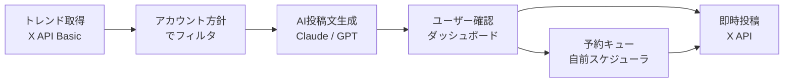
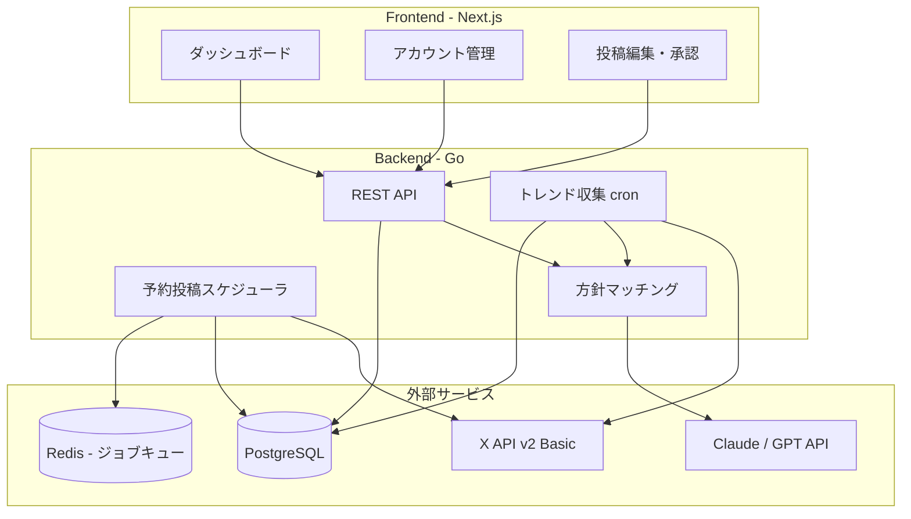

# SNSトレンド監視 & 戦略投稿アシスタント

## 概要

X / Instagram のアカウント成長を加速するため、リアルタイムのトレンドやネタを自動で検知し、各アカウントの方針に沿った投稿案を生成・予約投稿まで一気通貫で行うツール。

## 対象ユーザー

- 2-3個のSNSアカウントを運用している個人
- 「何を投稿すべきか」のネタ出しに時間をかけている人
- 戦略的にフォロワーを増やしたい人

## コアバリュー

**「ネタ探し -> 投稿案生成 -> 投稿実行」のサイクルを自動化し、運用者の意思決定だけに集中させる**

## 方針決定

- **運用規模**: 2-3アカウント
- **承認フロー**: AI生成後、毎回確認してから投稿（自動投稿なし）
- **API予算**: X API Basic ($200/月) OK
- **推奨アプローチ**: X特化MVPを先に作り、Instagram対応は後で追加

---

## API調査結果

### X API v2

| 機能 | Free ($0) | Basic ($200/月) | Pro ($5,000/月) |
|------|-----------|-----------------|-----------------|
| 投稿 | 500件/月 | 10,000件/月 | 1M件/月 |
| 検索 | 不可 | 直近7日間 | フルアーカイブ |
| トレンド取得 | 不可 | 利用可 | 利用可 |
| 予約投稿 | -- | Ads API必要 | Ads API必要 |

- 予約投稿はAds APIが必要 → **自前スケジューラで対応**
- 2026年2月からPay-Per-Use（従量課金）も開始

### Instagram Graph API

| 機能 | 可否 | 制限 |
|------|------|------|
| 画像/動画/カルーセル投稿 | 可 | 100件/24時間 |
| リール/ストーリー投稿 | 可 | 同上 |
| ハッシュタグ検索 | 可 | 30ユニークタグ/週 |
| トレンドトピック取得 | **不可** | 公式APIにエンドポイントなし |
| 予約投稿 | 可 | Content Publishing API |

- Business/Creatorアカウント + Meta App審査が必須
- トレンド取得APIがないため、外部ソース（Google Trends等）で補完

### 代替トレンドソース

| ソース | コスト | 用途 |
|--------|--------|------|
| Google Trends API (alpha) | 無料? | 検索トレンド補完 |
| RSS / ニュースAPI | 無料~安価 | ニュース系ネタ収集 |

---

## フェーズ計画

### Phase 1: X特化MVP（2-3週間）



**作るもの:**
1. アカウント管理: 登録、方針設定（ジャンル、トーン、投稿頻度、NG表現）
2. トレンド収集: X APIでトレンドを定期取得（cronジョブ、15分~1時間間隔）
3. ネタ提案: トレンドをアカウント方針でフィルタしてスコアリング
4. 投稿文生成: Claude/GPTでアカウントのトーンに合わせた投稿文を自動生成
5. ダッシュボード: 提案一覧の閲覧、編集、承認/却下
6. 投稿実行: 承認した投稿をX APIで即時投稿
7. 予約投稿: 指定時刻に投稿するスケジューラ（バックグラウンドジョブ）

**作らないもの:**
- Instagram対応
- 複数アカウント協力投稿
- 投稿パフォーマンス分析
- 時間帯自動最適化

**月額コスト:** X API Basic $200 + AI API $20-50 = 約$250/月

### Phase 2: 拡張（Instagram + 協力投稿）

- Instagram Graph API対応（Meta App審査を並行で進める）
- 複数アカウント協力投稿（同じネタを違う角度で、リポスト連携）
- 投稿パフォーマンス分析（インプレッション、エンゲージメント）
- 時間帯最適化（過去データから最適な投稿時間を推定）
- ニュース/RSS連携による追加ネタソース

### Phase 3: 高度化

- トレンド予測（過去パターンから今後のトレンドを予測）
- A/Bテスト投稿（同じネタで複数パターンの投稿文を比較）
- 競合分析（類似アカウントの投稿パターン分析）
- イベントカレンダー連携（祝日、記念日、業界イベント）

---

## アーキテクチャ方針



- **Go + Next.js**: Ghostrunnerテンプレート（PostgreSQL + Redis構成）を活用
- **バックグラウンドジョブ**: Go側でcronスケジューラを内蔵
- **Redis**: 予約投稿キュー、トレンドキャッシュ
- **PostgreSQL**: アカウント情報、トレンド履歴、投稿履歴

---

## 投稿例イメージ

### アカウント方針の例

```
アカウント: @tech_news_akiba
ジャンル: テック・ガジェット
トーン: カジュアル、情報提供型
投稿頻度: 1日3-5回
NG表現: 政治、宗教、ネガティブ批判
```

### トレンド検知 -> 投稿案の例

**検知したトレンド:** 「#Apple WWDC」がトレンド入り

**生成される投稿案:**
```
WWDC 2026、今年も気になるポイントまとめ

- iOS 20のAI機能強化
- M5チップ搭載MacBook
- visionOS 3.0

リアルタイムで追っていくので、気になる人はフォローしておいてね

#WWDC2026 #Apple #テック速報
```

### 協力投稿の例（Phase 2）

**メインアカウント @tech_news_akiba:**
```
WWDC 2026で発表されたM5チップ、ベンチマークがヤバい...
詳しいスペック比較は @gadget_review_akiba で解説中
```

**サブアカウント @gadget_review_akiba:**
```
M5 vs M4 Pro ベンチマーク比較

- シングルコア: +35%
- マルチコア: +42%
- GPU: +50%

正直これはゲームチェンジャー。詳細レビューはスレッドで
```

---

## 次のステップ

1. この方針でOKなら `/plan` で Phase 1 の実装計画を作成
2. 新プロジェクト生成: `/init sns-assistant` (or 別の名前)
3. Phase 1 実装開始
