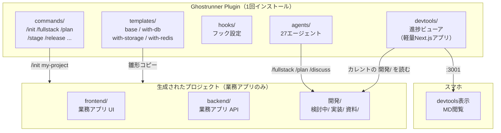
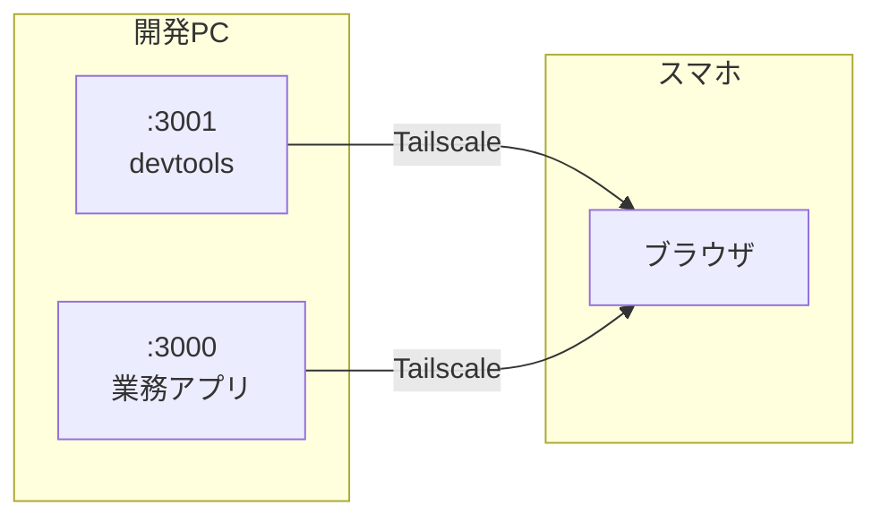

# 検討結果: Ghostrunner配布方法

## 検討経緯

| 日付 | 内容 |
|------|------|
| 2026-03-20 | 初回検討: 配布方法の選択肢比較（6案を詳細分析） |
| 2026-03-20 | 方針決定: Claude Code Plugin化を採用、devtoolsをPlugin内に含める構成に確定 |

## 背景・目的

Ghostrunnerは現在、27個のエージェント、12個のコマンド、4種のテンプレート、フック設定を持つClaude Code用の開発フレームワーク。
新規プロジェクトを作るには「まずGhostrunnerプロジェクトをClaude Codeで開いて `/init` を実行する」必要がある。
これは非エンジニアにとって直感的でなく、同人誌で「非エンジニアでもWebシステムを作る方法」として紹介するには導入ステップが多すぎる。

**解決したい課題:**
1. 「どのディレクトリからでも」Ghostrunnerの機能を使えるようにしたい
2. Ghostrunner本体が更新されたら利用者側も更新を取り込みたい
3. 非エンジニアでも導入ステップが少ないこと
4. 進捗ビューア（devtools）と業務アプリを分離し、テンプレートをクリーンに保つ

## 要件

- **配布対象**: エージェント/コマンド/フック + テンプレート + 進捗ビューア（全て）
- **利用者の技術レベル**: Claude Codeインストール済み、ターミナルで `claude` は打てる
- **更新と同期**: Ghostrunner本体が更新されたら利用者側も更新したい
- **用途**: 同人誌で非エンジニア向けに紹介する

---

## 決定事項

### 配布方法: Claude Code Plugin

Ghostrunnerの全資産をClaude Code Pluginとしてパッケージ化し、GitHubリポジトリから配布する。

**利用者の導入ステップ**:
```bash
# 1回だけ実行
claude
/plugin install ghostrunner
```
以降、どのディレクトリからでも `/init my-project` が使える。

### devtools（進捗ビューア）の配置: Plugin内に含める

業務アプリとdevtoolsを分離する。devtoolsはPlugin内に1つだけ持ち、全プロジェクトで共有する。

**分離の理由:**
- テンプレートから生成されるプロジェクトに開発支援ツールのコードが混ざらない
- devtoolsは本番にデプロイする必要がない
- Plugin更新でdevtoolsの改善も自動反映される
- 1つのdevtoolsが複数プロジェクトで使い回せる

---

## 全体構成図



### Plugin内部構造

```
ghostrunner-plugin/
├── .claude-plugin/
│   └── plugin.json            # プラグインメタデータ
├── agents/                    # 27エージェント
│   ├── discuss.md
│   ├── go-impl.md
│   ├── go-planner.md
│   ├── go-reviewer.md
│   ├── go-tester.md
│   ├── nextjs-impl.md
│   ├── nextjs-planner.md
│   ├── nextjs-reviewer.md
│   ├── nextjs-tester.md
│   ├── pg-impl.md
│   ├── pg-planner.md
│   ├── pg-reviewer.md
│   ├── pg-tester.md
│   ├── staging-manager.md
│   ├── release-manager.md
│   └── ... (その他)
├── commands/                  # 12コマンド
│   ├── init.md
│   ├── fullstack.md
│   ├── plan.md
│   ├── stage.md
│   ├── release.md
│   ├── hotfix.md
│   ├── fix.md
│   ├── go.md
│   ├── nextjs.md
│   ├── discuss.md
│   ├── research.md
│   └── devtools.md            # devtools起動コマンド
├── hooks/
│   └── hooks.json             # フック設定
├── templates/                 # プロジェクト雛形（業務アプリのみ）
│   ├── base/
│   ├── with-db/
│   ├── with-storage/
│   └── with-redis/
└── devtools/                  # 進捗ビューア（Plugin内に同居）
    ├── package.json
    ├── src/
    │   ├── app/
    │   │   ├── page.tsx       # ダッシュボード
    │   │   └── docs/          # MDビューア
    │   ├── components/
    │   │   └── docs/
    │   │       ├── MarkdownViewer.tsx
    │   │       ├── MermaidRenderer.tsx
    │   │       ├── Breadcrumb.tsx
    │   │       └── FolderList.tsx
    │   └── lib/
    │       └── docs/
    │           └── fileSystem.ts
    └── next.config.js
```

### 生成されるプロジェクト構造（クリーン）

```
~/my-project/
├── frontend/                  # 業務アプリのみ（devtoolsのコードなし）
│   ├── src/app/
│   └── package.json
├── backend/                   # 業務アプリのみ
│   ├── cmd/server/
│   └── internal/
├── .claude/
│   └── CLAUDE.md              # /init 実行時に生成
├── 開発/                      # MDファイル（devtoolsが読む対象）
│   ├── 検討中/
│   ├── 実装/
│   ├── 資料/
│   └── アーカイブ/
├── Makefile
└── docker-compose.yml
```

---

## devtoolsの動作仕様

### 起動

`make dev` で業務アプリと一緒に自動起動する（個別起動も可能）。

```bash
cd ~/my-project
make dev           # backend + frontend + devtools 全部起動
make devtools      # devtoolsだけ起動したい時
```

Makefileの定義:
```makefile
dev:
    make backend & make frontend & make devtools

devtools:
    cd ${GHOSTRUNNER_PLUGIN_ROOT}/devtools && PROJECT_DIR=$(pwd) npm run dev -- -p 3001
```

動作:
1. `${GHOSTRUNNER_PLUGIN_ROOT}/devtools/` のNext.jsアプリを起動
2. カレントディレクトリの `開発/` をMD読み込み対象として環境変数で渡す
3. ポート3001で起動（業務アプリの3000と分離）

### 機能

- カレントプロジェクトの `開発/` 配下のMDファイルを一覧表示
- Markdown + Mermaid図のレンダリング
- スマホからTailscale経由でアクセス可能

### ポート分離

| アプリ | ポート | 用途 |
|--------|--------|------|
| 業務アプリ（frontend） | 3000 | ユーザーが作るWebアプリ |
| devtools（進捗ビューア） | 3001 | 開発ドキュメント閲覧 |
| backend | 8080 | 業務アプリAPI |

### スマホからのアクセス



- **devtools** = ブラウザでMDドキュメント閲覧（Tailscale経由）
- `make dev` で自動起動するので、開発中は常にスマホからアクセス可能

---

## 選択肢の比較（参考）

決定に至るまでに比較した6案。

### 案A: Claude Code Plugin（採用）

**概要**: Ghostrunnerの資産をClaude Code Pluginとしてパッケージ化し、GitHubリポジトリから配布する。

**メリット**:
- 導入が最もシンプル（1コマンド）
- Claude Codeの公式配布メカニズムに乗れる
- 更新の仕組みが組み込み済み（auto-update）
- agents, commands, hooks, devtools を1パッケージにバンドルできる
- テンプレートも `${CLAUDE_PLUGIN_ROOT}` で参照可能

**デメリット**:
- Plugin形式への変換作業が必要
- Plugin APIの変更リスク（比較的新しい機能）

### 案B: グローバルエージェント + シェルスクリプト（フォールバック）

`~/.claude/agents/` にファイルを配置する方式。Plugin APIが不安定な場合のフォールバック。

### 案C: npm CLIパッケージ

`npx ghostrunner init` 方式。CLI開発コストが高く、エージェント常時利用にならない。

### 案D: MCPサーバー化

エージェント/コマンドの配布にMCPは不向き。非エンジニアにはハードルが高い。

### 案E: Git submodule / subtree

非エンジニアには操作が複雑すぎる。

### 案F: GitHub Template Repository

更新追従ができない。

### 比較表

| 観点 | A: Plugin | B: Global | C: npm CLI | D: MCP | E: submodule | F: Template |
|------|-----------|-----------|------------|--------|--------------|-------------|
| 導入の簡単さ | 5 | 4 | 4 | 3 | 2 | 4 |
| 更新の仕組み | 5 | 3 | 4 | 4 | 3 | 1 |
| 非エンジニア向け | 5 | 3 | 4 | 2 | 1 | 4 |
| エージェント/コマンド配布 | 5 | 5 | 2 | 1 | 3 | 3 |
| フック配布 | 5 | 2 | 1 | 1 | 3 | 3 |
| テンプレート配布 | 4 | 4 | 5 | 4 | 3 | 5 |
| devtools配布 | 5 | 4 | 3 | 2 | 3 | 1 |
| 開発コスト | 中 | 小 | 大 | 大 | 小 | 小 |

---

## MVP提案

### Phase 1: Plugin化（MVP）

1. **Plugin構造の作成**
   - `.claude-plugin/plugin.json` を作成
   - 既存の agents/, commands/ をPlugin形式に再配置
   - `settings.json` のフック定義を `hooks/hooks.json` に変換
   - テンプレートのパス参照を `${CLAUDE_PLUGIN_ROOT}` に修正

2. **devtoolsの分離**
   - Ghostrunner本体の `frontend/src/app/docs/` 関連コードを `devtools/` に移植
   - 対象プロジェクトのパスを環境変数で受け取る仕組みに変更
   - `/devtools` コマンドを作成

3. **`/init` コマンドの修正**
   - テンプレートのソースパスを `${CLAUDE_PLUGIN_ROOT}/templates/` に変更
   - devtools関連コードをテンプレートから除外

4. **GitHubリポジトリとして公開**

### Phase 2: 安定化

- テストとドキュメント整備
- 同人誌向けのインストール手順書作成
- 案B（install.sh方式）のフォールバック用意
- バージョニング戦略

---

## 技術的な検討事項

### Plugin形式への変換で注意すべき点

1. **パス参照**: 現在の `/init` コマンドは `/Users/user/Ghostrunner/templates/` をハードコードしている。Plugin化後は `${CLAUDE_PLUGIN_ROOT}/templates/` に変更が必要

2. **フック設定**: 現在の `settings.json` のフック定義は、Plugin形式では `hooks/hooks.json` に分離する。フック内のシェルスクリプトのパス参照も要修正

3. **スコープ**: User scopeでインストールすると全プロジェクトで利用可能。プロジェクトごとのカスタマイズが必要な場合はProject scopeとの併用を検討

4. **CLAUDE.md**: Plugin経由ではCLAUDE.mdは配布されない。プロジェクト固有のものなので `/init` 実行時に生成する現在の方式を維持

5. **devtoolsの依存解決**: Plugin install時にdevtoolsの `npm install` が必要。post-installフック or 初回 `/devtools` 実行時に実行

### リポジトリ戦略

既存のGhostrunnerリポジトリとPlugin用リポジトリの関係を決める必要がある:

- **案1**: 既存リポジトリをPlugin構造に変換する
- **案2**: 別リポジトリ（ghostrunner-plugin）を作成し、既存リポジトリは開発用として維持

---

## 次のステップ

1. リポジトリ戦略を決定（既存変換 or 別リポジトリ）
2. `/plan` で実装計画を作成
3. Plugin構造への変換を実施
4. devtoolsの分離・移植
5. 同人誌向けドキュメントを整備
