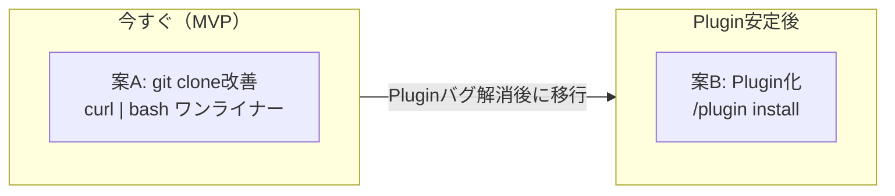
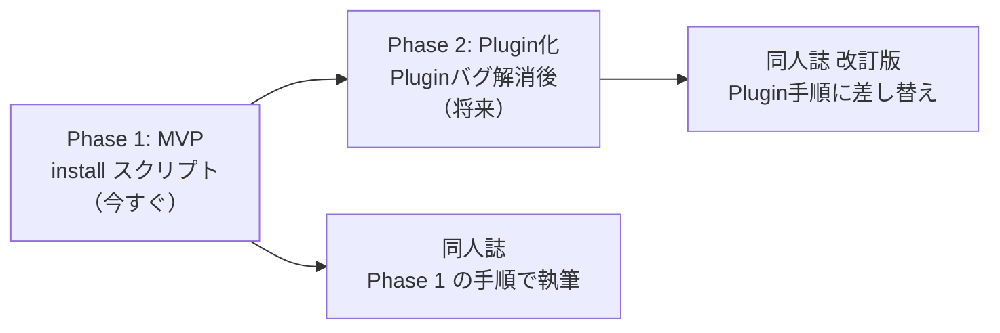

# 検討結果: Ghostrunner配布方法

## 検討経緯

| 日付 | 内容 |
|------|------|
| 2026-03-20 | 初回検討: 配布方法の選択肢比較（6案を詳細分析） |
| 2026-03-20 | 方針決定: Claude Code Plugin化を採用、devtoolsをPlugin内に含める構成に確定 |
| 2026-03-20 | 撤回: Plugin（--plugin-dir）にバグあり不安定、Ghostrunner起動方式に戻す |
| 2026-03-20 | 再検討: 現状のPlugin安定性を踏まえ、3案に絞って比較。MVPはgit clone改善 |

## 背景・目的

Ghostrunnerは `.claude/skills/` に13スキル、`.claude/agents/` に23エージェント、`templates/` に4種のプロジェクト雛形を持つClaude Code用フルスタック開発フレームワーク。

現状の導入フロー:
1. Ghostrunnerリポジトリを `git clone`
2. Ghostrunnerディレクトリで Claude Code を起動
3. `/init my-project` を実行

**解決したい課題:**
1. 非エンジニアにとって `git clone` のURL入力がハードル
2. 「Ghostrunnerディレクトリを開いてから /init」という2段階の手順が直感的でない
3. 同人誌の読者がスムーズに始められる導入体験にしたい
4. Ghostrunner本体の更新を利用者側に反映したい

---

## 現状の技術的制約

### Claude Code Pluginの安定性（2026-03-20時点）

- **Issue #35641**: `/reload-plugins` でスキルが読み込まれない（2日前に報告）
- **Issue #35879**: スキルが認識されない問題（過去にGhostrunnerで確認済み）
- Plugin マーケットプレイス機能自体は進化中（`/plugin marketplace add` でカスタムマーケットプレイス追加可能）
- **結論**: Plugin方式は「将来の本命」だが、今はまだ安定していない

### Ghostrunnerの構造上の特性

- `.claude/skills/` と `.claude/agents/` はClaude Codeのネイティブ機能で、プロジェクトルートに存在する必要がある
- `/init` 実行時に `templates/` から新プロジェクトへファイルをコピーする
- `/init` はGhostrunnerのプロジェクトコンテキスト内で実行される前提

---

## 選択肢の検討

### 案A: git clone + ワンライナー改善（MVP推奨）

**概要**: 現行のgit clone方式をそのまま維持しつつ、導入をワンライナーに簡略化する。

```bash
# 非エンジニアが打つコマンド（1行）
curl -sL https://ghostrunner.dev/install | bash
```

install スクリプトが行うこと:
1. `git clone` を `~/Ghostrunner` に実行（既に存在すれば `git pull`）
2. 完了メッセージで次のステップを案内

```
Ghostrunnerのインストールが完了しました！

次のステップ:
  cd ~/Ghostrunner
  claude
  /init my-project
```

- **メリット**:
  - 開発コストが極めて小さい（シェルスクリプト1つ）
  - 現行の仕組みをそのまま活用できる
  - 更新は `git pull` で対応可能
  - 非エンジニアにとっても1行コピペでOK
- **デメリット**:
  - 「Ghostrunnerを開いてから /init」の2段階は残る
  - curl | bash パターンに抵抗がある人もいる
  - install スクリプトのホスティングが必要（GitHub Pages or リポジトリ内）
- **工数感**: 小（シェルスクリプト + ホスティング）

### 案B: Claude Code Plugin（将来の本命）

**概要**: GhostrunnerをClaude Code Pluginとしてパッケージ化し、マーケットプレイスから配布する。

```bash
# 将来の導入ステップ
claude
/plugin install ghostrunner
```

以降、どのディレクトリからでも `/init my-project` が使える。

- **メリット**:
  - 導入が最もシンプル（Claude Code内で1コマンド）
  - Claude Codeの公式配布メカニズムに乗れる
  - 更新の仕組みが組み込み済み（auto-update）
  - 「Ghostrunnerを開く」ステップが不要
- **デメリット**:
  - **Plugin のスキル読み込みバグが未解決**（Issue #35641, #35879）
  - Plugin形式への変換作業が必要
  - Plugin APIの変更リスク
  - バグが解消されるタイミングが読めない
- **工数感**: 中（Plugin構造変換 + テスト）

### 案C: npx ワンライナー

**概要**: npm パッケージとして公開し、`npx` で実行する方式。

```bash
npx create-ghostrunner my-project
```

CLIが行うこと:
1. Ghostrunnerリポジトリを一時ディレクトリにクローン
2. テンプレートコピー + `.claude/` 資産コピー
3. 対話的にプロジェクト構成を選択（DB/ストレージ等）

- **メリット**:
  - Next.js の `npx create-next-app` と同じパターンで馴染みやすい
  - 1コマンドでプロジェクト生成まで完結
  - npm のバージョニング機能が使える
- **デメリット**:
  - `/init` のロジック（対話 + テンプレートコピー + 依存解決 + 起動）をNode.jsで再実装する必要がある
  - 現在の `/init` はClaude Codeのスキルとして動作し、AIが対話的に判断する仕組み。これをCLIで再現するのは本質的に異なるアプローチ
  - npm公開のメンテナンスコスト
  - エージェント/スキルの常時利用にはならない（生成後は別途Ghostrunner資産が必要）
- **工数感**: 大（CLI開発 + npm公開 + メンテナンス）

---

## 比較表



| 観点 | A: git clone改善 | B: Plugin | C: npx CLI |
|------|------------------|-----------|------------|
| 非エンジニアの導入しやすさ | 4 (1行コピペ) | 5 (Claude内で完結) | 4 (1行コピペ) |
| 開発コスト | 小 | 中 | 大 |
| 技術的リスク | なし | Plugin バグ未解決 | なし |
| 更新の容易さ | 3 (git pull) | 5 (auto-update) | 3 (npx再実行) |
| 「Ghostrunner開く」ステップ | 必要 | 不要 | 不要 |
| 同人誌での説明しやすさ | 4 | 5 | 4 |
| 今すぐ使えるか | はい | いいえ | いいえ |

---

## MVP提案

**推奨**: 案A（git clone + ワンライナー改善）を今すぐ実施し、案B（Plugin化）をPlugin安定後に移行する。

### 段階的アプローチ



### Phase 1: MVP範囲（案A）

- **install.sh の作成**: git clone + 完了メッセージ表示
- **ホスティング**: GitHub リポジトリ内に `install.sh` を配置、raw URL で配布
- **同人誌向け導入手順の整備**: 3ステップで始められる手順書

同人誌での記載イメージ:
```
ステップ1: ターミナルを開く
ステップ2: 以下をコピペして Enter
  curl -sL https://raw.githubusercontent.com/.../install.sh | bash
ステップ3: 表示された指示に従う
  cd ~/Ghostrunner && claude
  /init my-project
```

### Phase 2: 将来の移行（案B）

- Claude Code Pluginのスキル読み込みバグが解消されたら移行
- 移行時は同人誌の手順も差し替え

### 次回以降（後回し）

- npx CLI（案C）: 開発コストに見合わないため見送り
- brew / VSCode拡張: メンテナンスコストが高いため見送り
- 自動更新通知の仕組み: Phase 1では手動 `git pull` で十分

---

## 技術的な補足

### install.sh の仕様案

```
処理フロー:
1. ~/Ghostrunner が存在するか確認
   - 存在しない -> git clone
   - 存在する -> git pull（更新）
2. 完了メッセージを表示
   - 次のステップ（cd, claude, /init）を案内
```

### 「Ghostrunnerを開く」ステップを減らすための工夫

install.sh の完了後に、以下のようなエイリアスを提案できる:

```
alias ghostrunner='cd ~/Ghostrunner && claude'
```

これを `~/.zshrc` に追加すれば、`ghostrunner` と打つだけでGhostrunnerが起動する。
ただし非エンジニアにはシェル設定ファイルの編集はハードルが高いため、同人誌では省略し、3ステップの手順をそのまま案内する方がよい。

### Plugin安定性のモニタリング

以下のIssueをウォッチし、解消されたらPhase 2に移行する:
- https://github.com/anthropics/claude-code/issues/35641
- https://github.com/anthropics/claude-code/issues/35879

---

## 次のステップ

1. この検討結果を `開発/検討中/` に保存
2. Phase 1（install.sh）の実装を `/plan` で計画
3. 同人誌の導入手順セクションを並行して検討
