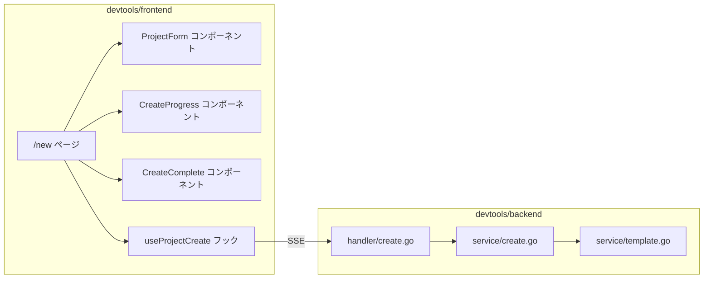
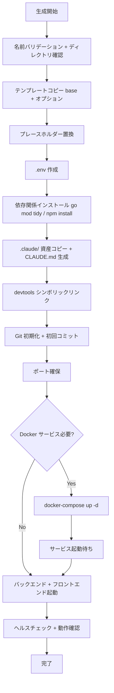
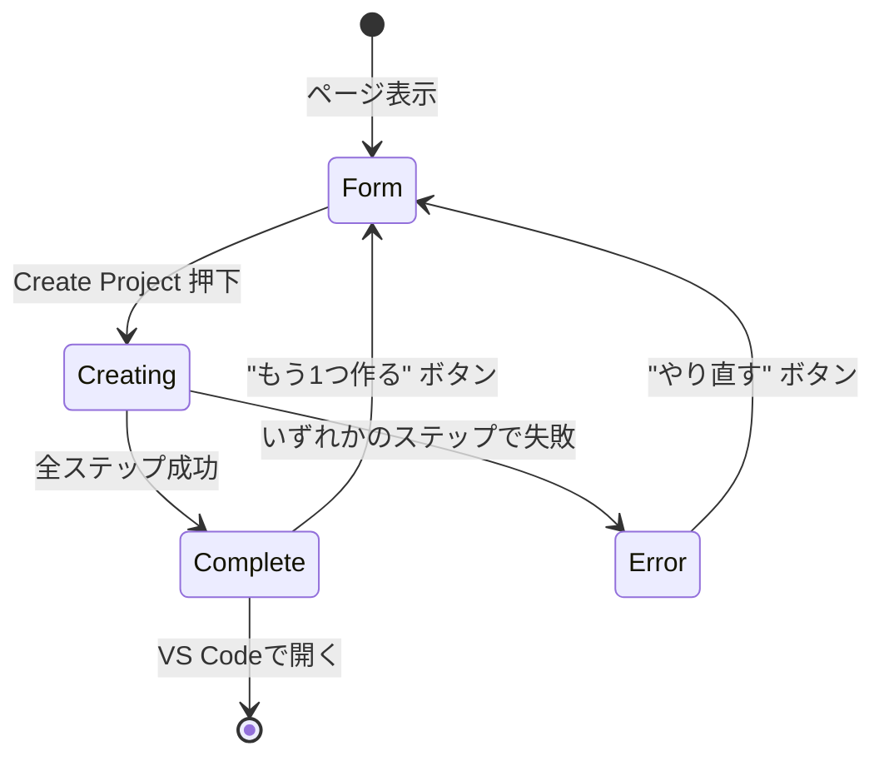

# 検討結果: devtools GUIプロジェクト作成画面

## 検討経緯

| 日付 | 内容 |
|------|------|
| 2026-03-20 | 初回相談: CLIの /init を非エンジニアでも使えるGUI画面にしたい |
| 2026-03-20 | 深掘り: 利用シナリオ=初心者もリピーターも両方、完了体験=起動+動作確認+VS Code開くボタンまで、デプロイ準備=MVPでは含めない |
| 2026-03-20 | 設計完了: UI設計、API設計、実装方針、MVP範囲を確定 |

## 背景・目的

CLIの `/init` コマンドは非エンジニアには分かりにくい。ブラウザでフォーム入力してボタンを押すだけでプロジェクトが生成される体験を提供する。同人誌「非エンジニアでもClaude CodeでWebシステムを作る方法」の導入体験としても重要な画面。

## 対象ユーザー

- 初めてGhostrunnerを使う非エンジニア（メイン）
- 繰り返しプロジェクトを作るリピーター（サブ）

## 要件

### 確定事項（ユーザー回答）

1. **利用シナリオ**: 初心者もリピーターも両方対応
2. **完了体験**: 生成 + 起動 + 動作確認 + 「VS Codeで開く」ボタン
3. **デプロイ準備**: MVPでは含めない（生成+起動まで）

### 機能要件

- プロジェクト名の入力とリアルタイムバリデーション
- プロジェクト概要の入力（自由テキスト）
- データサービスの選択（DB / ストレージ / Redis、複数選択可）
- 生成前の確認画面
- 進捗のリアルタイム表示（SSE）
- 生成完了後の動作確認結果表示
- 「VS Codeで開く」ボタン

---

## UI設計

### ページ構成

```
/new - プロジェクト作成画面（新規ページ）
```

既存のトップページ（`/`）のヘッダーナビゲーションに「New Project」リンクを追加する。

### 画面遷移フロー

```mermaid
flowchart TD
    TOP[トップページ /] -->|"New Project" リンク| FORM[/new フォーム入力]
    FORM -->|入力完了| CONFIRM[確認表示]
    CONFIRM -->|"作成する" ボタン| PROGRESS[生成進捗画面]
    PROGRESS -->|生成完了| RESULT[完了画面]
    RESULT -->|"VS Codeで開く"| VSCODE[VS Code起動]
    RESULT -->|"もう1つ作る"| FORM
```

### フォーム構成（3ステップ構成ではなく1画面）

初心者にもリピーターにも対応するため、1画面のシンプルなフォームを採用する。ステップ分割はユーザーに「まだ先がある」という不安を与えるため避ける。

```
+------------------------------------------------------+
| Ghost Runner          [Docs] [New Project] [...]     |
+------------------------------------------------------+
|                                                      |
|  New Project                                         |
|                                                      |
|  Project Name                                        |
|  +------------------------------------------------+  |
|  | my-project                                      |  |
|  +------------------------------------------------+  |
|  (OK) 使用可能な名前です                               |
|                                                      |
|  What are you building?                              |
|  +------------------------------------------------+  |
|  | 予約管理システム                                   |  |
|  +------------------------------------------------+  |
|  (例: 予約管理システム、社内の在庫管理ツール)             |
|                                                      |
|  Data Services (optional)                            |
|  +------------------------------------------------+  |
|  | [x] Database                                    |  |
|  |     ユーザー情報や注文履歴など表形式のデータを保存   |  |
|  |                                                  |  |
|  | [ ] File Storage                                |  |
|  |     画像やPDFなどのファイルをアップロード・管理     |  |
|  |                                                  |  |
|  | [ ] Cache                                       |  |
|  |     よく使うデータを高速に取り出す（上級者向け）     |  |
|  +------------------------------------------------+  |
|                                                      |
|  +------------------------------------------------+  |
|  |  確認                                            |  |
|  |  名前: my-project                               |  |
|  |  概要: 予約管理システム                            |  |
|  |  データ: Database                                |  |
|  |  生成先: /Users/user/my-project/                 |  |
|  +------------------------------------------------+  |
|                                                      |
|  [ Create Project ]                                  |
|                                                      |
+------------------------------------------------------+
```

### 進捗表示画面

「Create Project」ボタン押下後、同一ページ内でフォームが進捗表示に切り替わる。既存の `ProgressContainer` コンポーネントのパターンを踏襲する。

```
+------------------------------------------------------+
|                                                      |
|  Creating "my-project"...                            |
|                                                      |
|  [################............] 60%                  |
|  Setting up dependencies...                          |
|                                                      |
|  [v] Template copied                                 |
|  [v] Placeholders replaced                           |
|  [v] .env created                                    |
|  [>] Installing dependencies...                      |
|  [ ] Claude assets                                   |
|  [ ] Git initialization                              |
|  [ ] Server startup                                  |
|  [ ] Health check                                    |
|                                                      |
+------------------------------------------------------+
```

### 完了画面

```
+------------------------------------------------------+
|                                                      |
|  Project Created!                                    |
|                                                      |
|  "my-project" is ready.                              |
|                                                      |
|  Frontend: http://localhost:3000                      |
|  Backend:  http://localhost:8080/api/health           |
|  Database: docker exec my-project-db psql ...        |
|                                                      |
|  [ Open in VS Code ]  [ Create Another ]             |
|                                                      |
+------------------------------------------------------+
```

### UI設計のポイント

- **プロジェクト名のリアルタイムバリデーション**: 入力のたびにフロントエンドで形式チェック（英数字+ハイフン）、バックエンドでディレクトリ存在チェック
- **Data Servicesの説明文**: 非エンジニア向けに「何に使うか」で説明。「PostgreSQL」「Redis」等の技術用語は表示しない
- **確認セクション**: フォーム下部に常時表示。入力内容がリアルタイムに反映される（モーダルではない）
- **進捗表示**: チェックリスト形式で「今何をしているか」を可視化。既存のSSEインフラを活用

---

## API設計

### 新規エンドポイント

#### 1. プロジェクト名バリデーション

```
GET /api/projects/validate?name={name}
```

**目的**: プロジェクト名のリアルタイムバリデーション（ディレクトリ存在チェック）

**レスポンス**:
```json
{
  "valid": true,
  "path": "/Users/user/my-project",
  "error": ""
}
```

```json
{
  "valid": false,
  "path": "/Users/user/my-project",
  "error": "このプロジェクト名は既に使用されています"
}
```

**バリデーションルール**:
- 空文字 -> エラー
- 英数字+ハイフン以外 -> エラー
- 先頭・末尾がハイフン -> エラー
- ディレクトリが既に存在 -> エラー

**備考**: 形式チェック（正規表現）はフロントエンドでも行い、ディレクトリ存在チェックのみバックエンドに問い合わせる。不要なAPIコール削減のためデバウンス（300ms）を適用する。

#### 2. プロジェクト生成（SSEストリーミング）

```
POST /api/projects/create/stream
Content-Type: application/json
```

**リクエスト**:
```json
{
  "name": "my-project",
  "description": "予約管理システム",
  "services": ["database", "storage"]
}
```

**services の値**:
- `"database"` -> PostgreSQL + GORM
- `"storage"` -> Cloudflare R2 / MinIO
- `"cache"` -> Redis
- 空配列 -> base のみ

**SSEイベント（レスポンス）**:

既存の `StreamEvent` 型を拡張し、プロジェクト生成に特化したイベントを追加する。

```
data: {"type":"progress","step":"template_copy","message":"テンプレートをコピー中...","progress":10}
data: {"type":"progress","step":"placeholder_replace","message":"プロジェクト名を設定中...","progress":20}
data: {"type":"progress","step":"env_create","message":"環境設定ファイルを作成中...","progress":30}
data: {"type":"progress","step":"dependency_install","message":"依存パッケージをインストール中...","progress":50}
data: {"type":"progress","step":"claude_assets","message":"開発支援ツールを設定中...","progress":65}
data: {"type":"progress","step":"git_init","message":"バージョン管理を初期化中...","progress":75}
data: {"type":"progress","step":"server_start","message":"サーバーを起動中...","progress":85}
data: {"type":"progress","step":"health_check","message":"動作確認中...","progress":95}
data: {"type":"complete","project":{"name":"my-project","path":"/Users/user/my-project","frontend_url":"http://localhost:3000","backend_url":"http://localhost:8080","services":["database"]},"progress":100}
data: {"type":"error","message":"依存パッケージのインストールに失敗しました","step":"dependency_install"}
```

**イベント型定義**:

| type | 説明 | 追加フィールド |
|------|------|--------------|
| `progress` | ステップ進捗 | `step`, `message`, `progress` (0-100) |
| `complete` | 生成完了 | `project` (生成結果の詳細) |
| `error` | エラー発生 | `message`, `step` (どのステップで失敗したか) |

#### 3. VS Codeで開く

```
POST /api/projects/open
Content-Type: application/json
```

**リクエスト**:
```json
{
  "path": "/Users/user/my-project"
}
```

**レスポンス**:
```json
{
  "success": true
}
```

**処理**: バックエンドで `code /Users/user/my-project` を実行する。

### API設計のポイント

- **Claude CLIを使わない**: `/init` コマンドの処理は全てシェルコマンドの連鎖であり、Claude AIの推論は不要。バックエンドのGoコードで直接実行する方が高速・確実・低コスト
- **既存のSSEインフラを活用**: `sse.go` の `writeSSEEvents` / `setSSEHeaders` をそのまま利用
- **既存のプロジェクト一覧APIを活用**: バリデーション時に `/api/projects` のロジックを内部的に参照

---

## 実装方針

### アーキテクチャ



### バックエンドの構成

プロジェクト生成ロジックは `/init` コマンド（Claude AI経由）ではなく、Go コードとして直接実装する。

**理由**:
1. `/init` の処理は定型的なシェルコマンドの連鎖であり、AI推論は不要
2. Go で実装すればエラーハンドリングが確実にできる
3. 各ステップの進捗をSSEで正確に報告できる
4. Claude APIのコストが発生しない
5. 実行時間が大幅に短縮される（AI応答待ちがない）

**ファイル構成**:

| ファイル | 責務 |
|---------|------|
| `handler/create.go` | HTTPハンドラ、バリデーション、SSE送信 |
| `service/create.go` | プロジェクト生成のオーケストレーション |
| `service/template.go` | テンプレートコピー、プレースホルダー置換、依存関係解決 |

**処理ステップ（service/create.go のフロー）**:



各ステップ完了時にSSEでprogressイベントを送信する。

### CLAUDE.md 生成について

現在の `/init` では Claude AI が CLAUDE.md を生成しているが、GUI版ではテンプレートベースの生成に切り替える。

- ベースとなる CLAUDE.md テンプレートを用意
- プロジェクト名、概要、選択したサービスに応じてセクションを組み立て
- テンプレートの部分的な include で構成（DB選択時はDBセクションを追加、等）

### フロントエンドの構成

**ファイル構成**:

| ファイル | 責務 |
|---------|------|
| `app/new/page.tsx` | /new ページ本体 |
| `components/create/ProjectForm.tsx` | フォーム入力部分 |
| `components/create/ServiceSelector.tsx` | Data Services チェックボックス群 |
| `components/create/CreateProgress.tsx` | 進捗チェックリスト表示 |
| `components/create/CreateComplete.tsx` | 完了画面（URL表示、VS Codeボタン） |
| `hooks/useProjectCreate.ts` | 生成APIとのSSE通信、状態管理 |
| `hooks/useProjectValidation.ts` | プロジェクト名のデバウンスバリデーション |
| `lib/createApi.ts` | API呼び出し関数 |

**状態遷移**:



### VS Codeで開くボタンの実装

2つの方式を検討し、案Aを採用する。

| 方式 | 仕組み | メリット | デメリット |
|------|--------|---------|----------|
| **案A: バックエンドAPI経由** | `POST /api/projects/open` -> `exec.Command("code", path)` | 確実に動作、VS Code未起動でも開ける | サーバーサイドでのプロセス実行 |
| 案B: カスタムURLスキーム | `vscode://file/{path}` リンク | サーバー不要 | VS Codeの設定次第で動かない場合がある |

**案A採用の理由**: ローカルで動作するdevtoolsなのでセキュリティリスクは低く、確実性を優先する。`code` コマンドが見つからない場合はエラーを返し、フロントエンドで「VS Codeのコマンドラインツールをインストールしてください」と案内する。

### ポート競合の処理

現在の `/init` ではユーザーに確認して停止する対話的処理を行っているが、GUI版ではバックエンドで自動的に空きポートを検出する方式を検討した結果、以下の方針とする:

- ポート使用中の場合はエラーイベントを返す
- エラーメッセージに「ポート XXXX が使用中です。既存のプロセスを停止してからやり直してください」と表示
- 自動停止は行わない（予期しないプロセスを停止するリスクを回避）

---

## MVP提案

### MVP範囲（Phase 1）

1. `/new` ページの基本フォーム（プロジェクト名、概要、Data Services選択）
2. プロジェクト名のリアルタイムバリデーション
3. `POST /api/projects/create/stream` によるプロジェクト生成
4. SSEによる進捗チェックリスト表示
5. 完了画面（URL表示、VS Codeで開くボタン）
6. トップページからのナビゲーション

### 次回以降（Phase 2+）

- 本番デプロイ準備（GCP + Neon / R2 / Upstash）の GUI 化
- プロジェクトテンプレートのプリセット（「ブログ」「EC」「管理画面」等）
- 生成済みプロジェクトの一覧・管理画面
- 生成ログの永続化・再表示
- ポート競合時の自動解決UI（「停止しますか？」確認ダイアログ）

### 工数感

| 領域 | 内容 | 工数感 |
|------|------|--------|
| バックエンド | handler/create.go, service/create.go, service/template.go | 中 |
| フロントエンド | /new ページ、コンポーネント群、フック | 中 |
| CLAUDE.md テンプレート | テンプレート化とセクション分割 | 小 |
| テスト | バックエンドのユニットテスト | 小 |
| 合計 | | 中（2-3回の /fullstack セッション想定） |

---

## 次のステップ

1. この検討結果を `開発/検討中/` に保存（完了）
2. 方針確認後、`/plan` で実装計画を作成
3. 計画確定後、`/fullstack` でバックエンドAPI -> フロントエンドの順に実装
4. 実装完了後、`開発/実装/完了/` に移動
