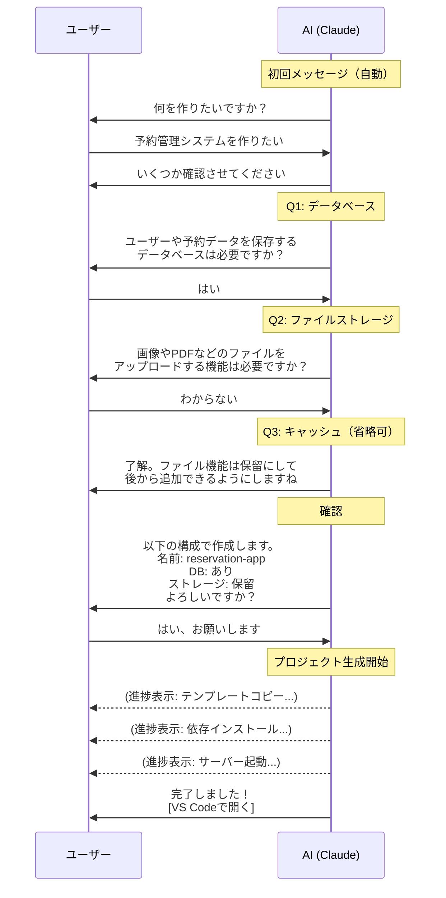
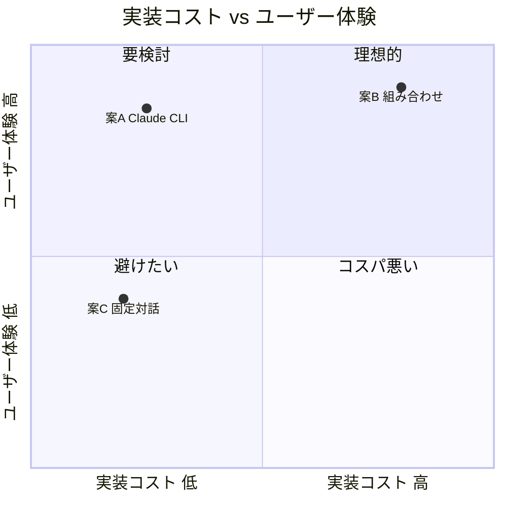
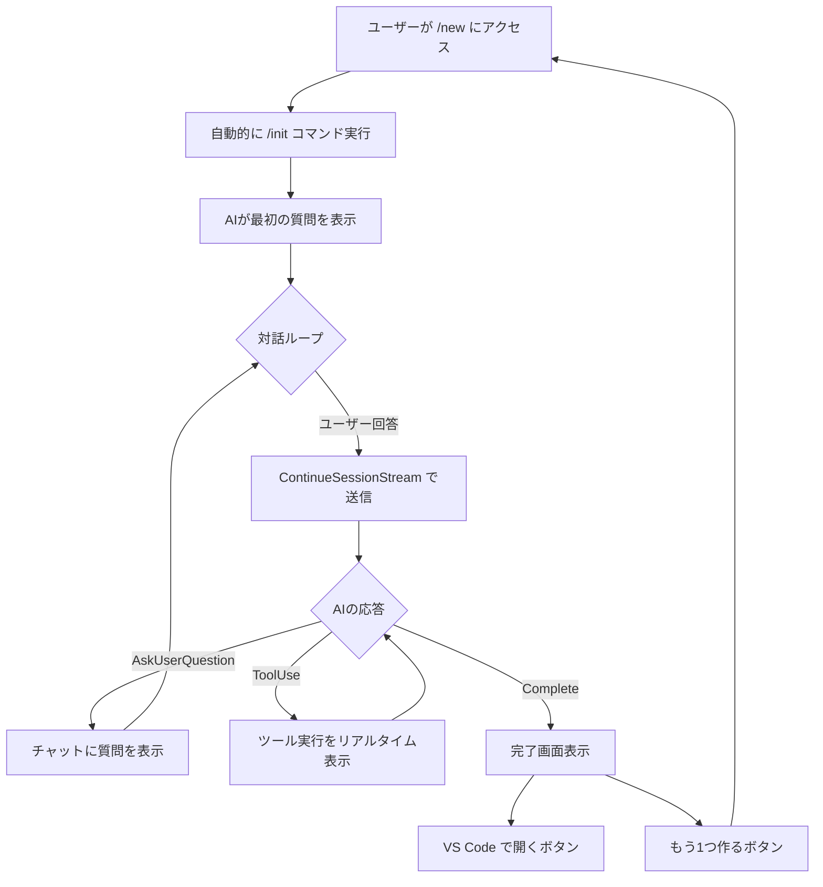

# 検討結果: /new ページの対話型プロジェクト作成への再設計

## 検討経緯

| 日付 | 内容 |
|------|------|
| 2026-03-20 | 初回相談: /new のフォームUIを対話型チャットUIに再設計したい |
| 2026-03-20 | 要件整理: 対話でDB等の要否を判断、保留機能、完了後VSCodeで開発継続 |

## 背景・目的

現在の /new ページはフォーム入力型（プロジェクト名・概要・Data Services選択）で構成されている。これを「AIとの対話」に変更し、ユーザーが自然言語で「何を作りたいか」を伝えるだけで、AIが必要な構成を判断してプロジェクトを生成する体験にする。

ユーザーの理想:
- 「/newの画面で対話をして、初期MVPを作ります」
- 「その後、プロジェクトで /discuss や /plan /fullstack を使う形です」
- 「/newの画面では、初期プロジェクトに必要なものを聞いてくれます」
- 「わからない場合はDBなど作成保留にして作成もできます」

同人誌のデモとしても「AIと会話するだけでプロジェクトが出来上がる」という体験は強い訴求力を持つ。

## 対象ユーザー

- 非エンジニア（メインターゲット、同人誌の読者）
- Claude Code を初めて触る人

## 解決する課題

| 課題 | 現状（フォーム型） | 対話型で解決 |
|------|-------------------|-------------|
| Data Servicesが分からない | DB/Storage/Cache の選択肢が並ぶが判断できない | AIが「ユーザー情報を保存しますか？」と聞いて判断 |
| 何を入力すればいいか迷う | フォームの各フィールドを自力で埋める | AIが順番に質問してくれる |
| 保留ができない | 全部決めないとCreateできない | 「分からない」と答えれば保留にしてくれる |
| 体験の一貫性 | /new はフォーム、その後はCLI | /new も /discuss も同じ「対話」体験 |

---

## 対話フロー設計

### 対話の流れ



### AIの初回メッセージ

ページを開いた時点で、AIからの最初のメッセージを表示する:

```
こんにちは！ 新しいプロジェクトを作成しましょう。

何を作りたいですか？ 一言で教えてください。
（例: 「予約管理システム」「社内の在庫管理ツール」「ブログサービス」）
```

### 対話の回数

- 最短: 3往復（概要 -> 構成確認 -> 作成承認）
- 最長: 5-6往復（概要 -> DB確認 -> ストレージ確認 -> キャッシュ確認 -> プロジェクト名確認 -> 作成承認）
- AIが文脈から判断できるものは質問を省略する（「ブログ」なら画像ストレージを提案する等）

### 「保留」の仕組み

ユーザーが「わからない」「後で決める」と答えた場合:
- そのサービスを **含めずに** プロジェクトを生成する
- 完了メッセージで「後からDBを追加するには、VS Codeで `/init-db` を実行してください」等の案内を表示
- base テンプレートで作成し、テンプレートの追加は既存の仕組み（手動 or 将来のコマンド）で対応

---

## 選択肢の検討

### 案A: Claude CLI 経由（既存API活用）

- 概要: 既存の `ExecuteCommandStream` + `/init` コマンドをそのまま呼び出す。/new ページは「initコマンドをGUIで実行するチャットUI」になる
- メリット:
  - バックエンドの追加実装がほぼ不要（AllowedCommandsに "init" を追加するだけ）
  - `/init` の SKILL.md がそのまま対話プロンプトになる
  - AI が文脈に応じて柔軟に質問を変えられる
  - AskUserQuestion の仕組みがそのまま使える（既存のトップページと同じ）
- デメリット:
  - Claude APIコストが発生する（毎回のプロジェクト作成で）
  - AI応答待ちで時間がかかる（各質問で数秒）
  - プロジェクト生成中の進捗表示が粗い（AIのツール実行ログのみ）
- 工数感: 小

### 案B: 専用エージェント + 既存バックエンド組み合わせ

- 概要: 対話フェーズは Claude CLI で専用エージェント（対話だけ担当）を実行し、対話完了後の生成フェーズは既存の `CreateProjectService`（Goコード）を呼び出す
- メリット:
  - 対話はAIの柔軟性を活かせる
  - 生成は既存のGoコードで高速・確実
  - 進捗表示は既存のSSEインフラ（CreateProgress）をそのまま使える
- デメリット:
  - 「対話フェーズ」と「生成フェーズ」の接続が複雑
  - AIの対話結果（プロジェクト名、選択サービス）をパースして CreateProjectService に渡す必要がある
  - 新しいAPIエンドポイントと接続ロジックが必要
- 工数感: 大

### 案C: フロントエンド主導の固定対話 + 既存バックエンド

- 概要: 対話のフローをフロントエンドでハードコードする（AIは使わず、固定の質問シーケンス）。見た目はチャットUIだが、質問は事前に決まっている。生成は既存の `CreateProjectService` を使う
- メリット:
  - AIコスト不要
  - 応答が即座（ネットワーク遅延のみ）
  - 実装がシンプル
  - 既存の CreateProjectService をそのまま使える
- デメリット:
  - 対話の柔軟性がない（定型質問の順番を変えるだけ）
  - 「AIと会話している」感がない（同人誌のデモとして弱い）
  - 結局フォームの変形でしかない
- 工数感: 小

---

## 案の比較



| 観点 | 案A: Claude CLI | 案B: 組み合わせ | 案C: 固定対話 |
|------|----------------|----------------|--------------|
| ユーザー体験 | 高（AI対話） | 高（AI対話 + 確実な生成） | 低（定型的） |
| 実装コスト | 小 | 大 | 小 |
| 同人誌デモ映え | 高 | 高 | 低 |
| APIコスト | 毎回発生 | 対話フェーズのみ | なし |
| 進捗表示 | 粗い（ツールログ） | 細かい（ステップ別） | 細かい |
| 保守性 | 高（SKILL.md変更で対応） | 中 | 低（ハードコード） |
| 柔軟性 | 高（AIが判断） | 高 | 低 |

---

## MVP提案

**推奨案: 案A（Claude CLI 経由）**

### 推奨理由

1. **実装コストが最小**: AllowedCommands に "init" を追加 + チャットUIのフロントエンドのみ
2. **同人誌のデモに最適**: 「AIと会話するだけでプロジェクトができる」が最も伝わる
3. **既存インフラをフル活用**: トップページ（`/`）の仕組みがほぼそのまま使える
   - `ExecuteCommandStream` -> AIが /init を実行
   - `ContinueSessionStream` -> ユーザーの回答をAIに送信
   - `EventTypeQuestion` -> AIからの質問をチャットUIに表示
   - `EventTypeToolUse` -> プロジェクト生成中のツール実行をリアルタイム表示
4. **保留の仕組みが自然**: AIに「わからない」と答えるだけで、AIが判断して保留にする
5. **SKILL.md の変更だけで対話フローを改善可能**: コード変更なしで質問内容を調整できる

### APIコストについての考え

- プロジェクト作成は1回きり（繰り返し使うものではない）
- 1プロジェクトあたり数ドル程度のコスト
- 同人誌のターゲット（個人開発者）にとって許容範囲
- 対話の質を考えるとコスト対効果は十分

### MVP範囲

#### 必須（Phase 1）

1. AllowedCommands に "init" を追加
2. /new ページをチャットUIに書き換え
   - AIの初回メッセージ表示
   - ユーザーの自由テキスト入力
   - AIからの質問表示（AskUserQuestion対応）
   - ツール実行のリアルタイム表示（ファイルコピー、コマンド実行等）
   - 完了表示 + VS Codeで開くボタン
3. トップページのチャットUI（page.tsx）の仕組みを /new 向けに特化

#### 次回以降（Phase 2+）

- 対話履歴の永続化（ブラウザリロードしても消えない）
- 生成完了後の動作確認結果の詳細表示
- プロジェクト名の事前バリデーション（AIに渡す前にフロントエンドで検証）
- チャット内での画像添付（ワイヤーフレーム等を見せて「こんなものを作りたい」）
- 既存フォームUIの完全撤去（Phase 1 では並行運用も可）

---

## 技術的な実装方針

### バックエンド変更

変更箇所は最小限:

| ファイル | 変更内容 |
|---------|---------|
| `service/types.go` | AllowedCommands に `"init": true` を追加 |

既存の CommandHandler / ClaudeService はそのまま使える。`/init` は SKILL.md として定義済みで、Claude CLI が AskUserQuestion を使って対話し、テンプレートコピーやコマンド実行を行う。

### フロントエンド変更

| ファイル | 変更内容 |
|---------|---------|
| `app/new/page.tsx` | フォームUIからチャットUIに全面書き換え |
| `components/chat/ChatMessage.tsx` | 新規: チャットメッセージ（AI/ユーザー）の表示 |
| `components/chat/ChatInput.tsx` | 新規: テキスト入力 + 送信ボタン |
| `components/chat/ToolActivity.tsx` | 新規: ツール実行のリアルタイム表示 |
| `hooks/useProjectChat.ts` | 新規: /init 対話のステート管理 |

### 既存コードの再利用

トップページ（`page.tsx`）から以下のパターンをそのまま使える:

- `useSSEStream` フック -> SSEストリーム処理
- `executeCommandStream` / `continueSessionStream` -> API呼び出し
- `handleStreamEvent` のイベント処理ロジック -> question / tool_use / complete の処理

### /new ページのチャットUI構成

```
+------------------------------------------------------+
| Ghost Runner          [Back]                          |
+------------------------------------------------------+
|                                                       |
| +-- チャットエリア（スクロール可能） ----------------+ |
| |                                                    | |
| |  [AI] こんにちは！新しいプロジェクトを            | |
| |       作成しましょう。                             | |
| |       何を作りたいですか？                         | |
| |                                                    | |
| |  [You] 予約管理システムを作りたい                  | |
| |                                                    | |
| |  [AI] いいですね！いくつか確認させてください。     | |
| |       ユーザーや予約のデータを保存する             | |
| |       データベースは必要ですか？                   | |
| |       [はい] [いいえ] [わからない]                 | |
| |                                                    | |
| |  ...                                               | |
| |                                                    | |
| |  [AI] プロジェクトを生成中...                      | |
| |    > Copying template files...                     | |
| |    > Installing dependencies...                    | |
| |    > Starting server...                            | |
| |                                                    | |
| |  [AI] 完了しました！                              | |
| |       Frontend: http://localhost:3000               | |
| |       Backend:  http://localhost:8080               | |
| |       [VS Codeで開く]                              | |
| |                                                    | |
| +----------------------------------------------------+ |
|                                                       |
| +----------------------------------------------------+ |
| | メッセージを入力...                    [送信]      | |
| +----------------------------------------------------+ |
|                                                       |
+------------------------------------------------------+
```

### 対話の開始方法

ページ読み込み時に自動的に `/init` コマンドを実行する:
1. ユーザーが /new にアクセス
2. 自動的に `ExecuteCommandStream(project=Ghostrunner, command="init", args="")` を実行
3. `/init` の SKILL.md に従い、AIが最初の質問を返す
4. AskUserQuestion イベントでチャットUIに質問を表示
5. ユーザーの回答を ContinueSessionStream で送信
6. 以降、対話が完了するまで繰り返す

**注意**: `args=""` の場合、現在の SKILL.md はプロジェクト名が空でエラーになる。SKILL.md を修正して、プロジェクト名が空の場合は最初にプロジェクト名を質問するようにする必要がある。

### SKILL.md の修正

現在の `/init` SKILL.md は `$ARGUMENTS` でプロジェクト名を受け取る前提。GUI対話版では:

- `$ARGUMENTS` が空の場合、最初にプロジェクト名を AskUserQuestion で質問する
- これにより、CLI（`/init my-project`）とGUI（引数なしで対話開始）の両方に対応できる

---

## フロー図（全体）



---

## 既存フォームUIの扱い

案A ではフォームUI（ProjectForm, ServiceSelector 等）は使わなくなる。

- Phase 1: 既存のフォームコンポーネントは削除せず残す（テスト用、フォールバック用）
- Phase 2: チャットUIが安定したら、既存フォームコンポーネントを削除

既存の `CreateProjectService`（Goコードでのプロジェクト生成）は `/init` SKILL.md と機能が重複するが、Phase 1 では両方残す。将来的に統合するかは別途検討。

---

## 変更対象ファイル一覧

### バックエンド

| ファイル | 変更種別 | 内容 |
|---------|---------|------|
| `devtools/backend/internal/service/types.go` | 修正 | AllowedCommands に "init" 追加 |

### フロントエンド

| ファイル | 変更種別 | 内容 |
|---------|---------|------|
| `devtools/frontend/src/app/new/page.tsx` | 全面書き換え | チャットUIに変更 |
| `devtools/frontend/src/components/chat/ChatMessage.tsx` | 新規 | メッセージ表示コンポーネント |
| `devtools/frontend/src/components/chat/ChatInput.tsx` | 新規 | テキスト入力コンポーネント |
| `devtools/frontend/src/components/chat/ToolActivity.tsx` | 新規 | ツール実行表示コンポーネント |
| `devtools/frontend/src/hooks/useProjectChat.ts` | 新規 | チャット対話のステート管理 |

### Ghostrunner 本体

| ファイル | 変更種別 | 内容 |
|---------|---------|------|
| `.claude/skills/init/SKILL.md` | 修正 | 引数なし時にプロジェクト名を質問するフロー追加 |

---

## 次のステップ

1. この検討結果を `開発/検討中/` に保存（完了）
2. 方針確認後、`/plan` で実装計画を作成
3. `/fullstack` でバックエンド変更（1行） -> SKILL.md修正 -> フロントエンドチャットUI実装
4. 動作確認: /new ページでAIと対話してプロジェクトが生成されることを確認
