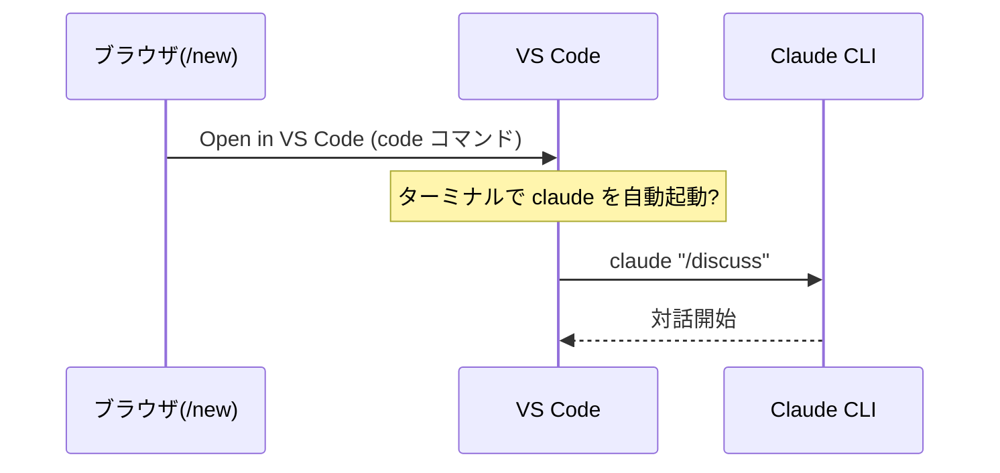
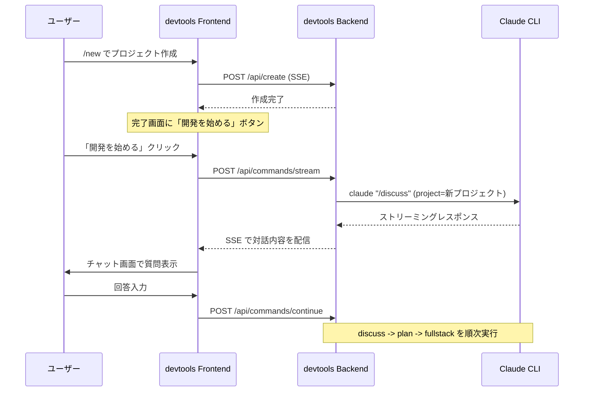
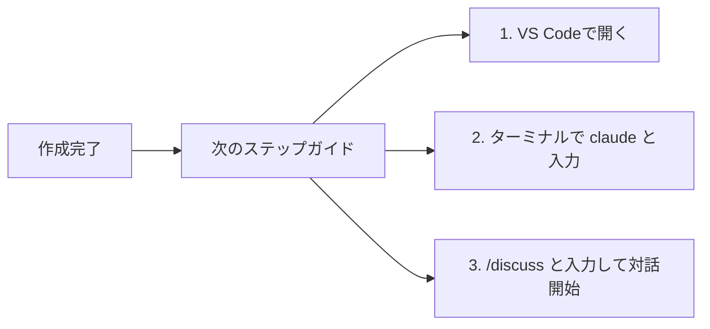
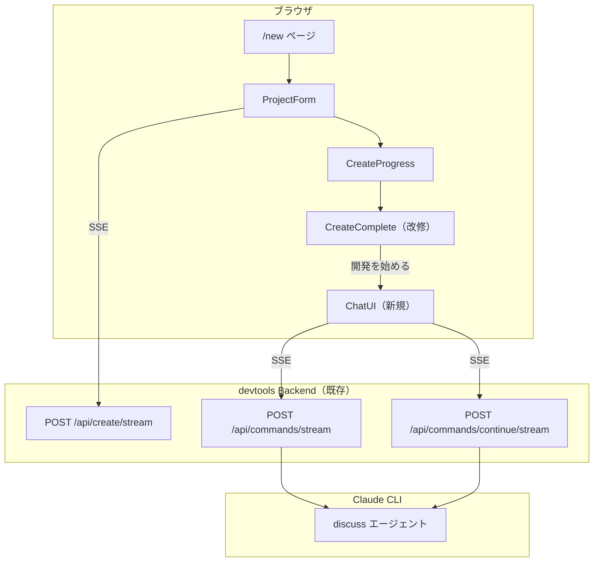

# 検討結果: /new 完了後の自動開発フロー

## 検討経緯

| 日付 | 内容 |
|------|------|
| 2026-03-20 | 初回相談: Data Services表記の非エンジニア向け変更、/new完了後に自動で /discuss -> /plan -> /fullstack を実行するフロー |

## 背景・目的

Ghostrunner の /new ページでプロジェクトを作成した後、ユーザー（特に非エンジニア）が次に何をすべきか分からない問題がある。理想的には、プロジェクト作成後に自動的に「何を作りたいか」の対話が始まり、MVP決定から実装まで一気通貫で進む体験を提供したい。

## 対象ユーザー

非エンジニア（技術書典の同人誌ターゲット層）。Claude Code を使って Web システムを作りたいが、CLI操作に不慣れな人。

## 解決する課題

1. **Data Services の表記が技術用語**: PostgreSQL + GORM / Cloudflare R2 / Redis は非エンジニアに意味不明
2. **プロジェクト作成後の導線が不明**: /new 完了後、VS Code で開いても次に何をすればいいか分からない
3. **CLI操作のハードル**: /discuss, /plan, /fullstack というコマンドを知り、正しく実行する必要がある

---

## 課題1: Data Services の表記変更

### 現在の表記

| id | label | description |
|----|-------|-------------|
| database | PostgreSQL + GORM | Database with migration support |
| storage | Cloudflare R2 / MinIO | Object storage for files |
| cache | Redis | In-memory cache and session store |

### 変更案

**案A: 完全に平易な日本語**

| id | label | description |
|----|-------|-------------|
| database | データベース | データを保存・検索する機能（ユーザー情報、投稿など） |
| storage | ファイルストレージ | 画像やファイルをアップロード・管理する機能 |
| cache | キャッシュ | データの高速読み込みやセッション管理 |

- メリット: 非エンジニアにも直感的
- デメリット: 技術的に何を使うか分からない

**案B: 平易な名前 + 技術名を小さく表示**

| id | label | sublabel | description |
|----|-------|----------|-------------|
| database | データベース | PostgreSQL | データを保存・検索する機能 |
| storage | ファイルストレージ | Cloudflare R2 | 画像やファイルのアップロード機能 |
| cache | キャッシュ | Redis | データの高速読み込み機能 |

- メリット: 非エンジニアにも分かりつつ、技術者も何を使うか把握できる
- デメリット: UIの変更が少し多い（sublabel表示の追加）

**推奨: 案B**

セクションタイトルも `Data Services (optional)` から `追加機能（オプション）` に変更する。

### 変更対象ファイル

- `devtools/frontend/src/components/create/ServiceSelector.tsx` (SERVICES定数、ラベルテキスト)

工数感: **小**（フロントエンドのみ、1ファイル修正）

---

## 課題2: /new 完了後の自動開発フロー

### 全体フロー（理想形）

```mermaid
flowchart TD
    NEW[/new でプロジェクト作成] --> COMPLETE[作成完了]
    COMPLETE --> DISCUSS[対話: 何を作りたい?]
    DISCUSS --> MVP[MVP決定]
    MVP --> PLAN[実装計画の生成]
    PLAN --> IMPL[自動実装開始]
    IMPL --> DONE[完成]
```

### 選択肢の検討

---

### 案A: VS Code ターミナルで claude CLI を自動実行



- 概要: /new 完了後、VS Code で開き、ターミナルで `claude "/discuss"` を自動実行する
- メリット:
  - Claude Code の本来の使い方に沿っている
  - 既存のエージェント定義（discuss.md）がそのまま使える
  - devtools バックエンドの改修が不要
- デメリット:
  - **技術的に困難**: VS Code の `code` コマンドで開いた後、ターミナルでコマンドを自動実行する標準的な方法がない
  - `code --goto` や拡張機能が必要になり、セットアップの前提条件が増える
  - 非エンジニアに「VS Code のターミナルで対話してください」は高いハードル
- 工数感: **大**（VS Code 拡張 or ワークスペース設定のカスタマイズが必要）

**技術的制約**: `open -a "Visual Studio Code" <path>` の後にターミナルコマンドを自動実行する公式APIは存在しない。VS Code の Task 機能や拡張機能で実現可能だが、前提条件が増えすぎる。

---

### 案B: devtools ブラウザ UI 上で対話を行う



- 概要: /new 完了後、同じブラウザ画面で対話を開始。devtools バックエンドが Claude CLI を呼び出し、ストリーミングで対話内容を表示する
- メリット:
  - **既存の ClaudeService を活用可能**: `ExecuteCommandStream` + `ContinueSessionStream` が既にある
  - 非エンジニアに最もフレンドリー（ブラウザから出ない）
  - 対話 -> 計画 -> 実装の一気通貫フローが実現可能
  - devtools のコマンド実行UI（既存の `/api/commands/stream`）を再利用できる
- デメリット:
  - フロントエンドにチャットUI（対話画面）の新規開発が必要
  - discuss -> plan -> fullstack の「つなぎ」ロジックが必要
  - 長時間実行（fullstack は数十分かかる可能性）への対応
  - ブラウザを閉じた場合の復帰処理
- 工数感: **大**（チャットUI + フロー制御 + 長時間実行対応）

---

### 案C: /new 完了画面にガイドステップを表示



- 概要: /new 完了画面に「次のステップ」を視覚的に表示。自動化はせず、ユーザーに操作方法を案内する
- メリット:
  - 実装が最小限（CreateComplete.tsx にテキスト追加のみ）
  - 技術的リスクがゼロ
  - VS Code を開くボタンは既存のまま
- デメリット:
  - 自動化されていないため、非エンジニアには依然としてハードルが残る
  - 「CLIにコマンドを打つ」という体験を完全には排除できない
- 工数感: **小**

---

### 案D: 案Bの段階的実装（ハイブリッド）

```mermaid
flowchart TD
    subgraph MVP["MVP（Phase 1）"]
        NEW[/new 作成完了] --> BTN["「開発を始める」ボタン"]
        BTN --> CHAT[チャット画面で /discuss 実行]
        CHAT --> RESULT[検討結果を表示]
    end

    subgraph PHASE2["Phase 2"]
        RESULT --> PLAN_BTN["「計画を作る」ボタン"]
        PLAN_BTN --> PLAN_EXEC[/plan 実行]
    end

    subgraph PHASE3["Phase 3"]
        PLAN_EXEC --> IMPL_BTN["「実装する」ボタン"]
        IMPL_BTN --> FULLSTACK[/fullstack 実行]
    end
```

- 概要: 案Bを段階的に実装。まず /discuss のみをブラウザ上で実行し、/plan と /fullstack は後続フェーズで追加
- メリット:
  - MVP が明確（チャットUIで /discuss だけ動かす）
  - 既存の `CommandHandler` + `ClaudeService` をそのまま利用
  - 段階的にリスクを検証できる
  - Phase 1 だけでも価値がある（対話で何を作るか決まる）
- デメリット:
  - Phase 1 完了時点では /plan 以降は手動（VS Code で実行）
  - チャットUIの開発は依然として必要
- 工数感: Phase 1 は **中**、全体は **大**

---

## MVP提案

**推奨案: 案D（ハイブリッド / 段階的実装）の Phase 1**

### 理由

1. 既存の `ClaudeService.ExecuteCommandStream` と `ContinueSessionStream` がそのまま使える
2. バックエンド側は API が既に存在するため、フロントエンドのチャットUI開発が主な作業
3. /discuss だけでも「何を作るか決まる」という大きな価値がある
4. 案Cはハードルが残りすぎ、案Aは技術的に無理がある

### MVP範囲（Phase 1）

- **Data Services 表記の変更**（案B: 平易な名前 + 技術名小さく）
- **/new 完了画面に「開発を始める」ボタン追加**
- **チャットUI**: /discuss をブラウザ上で実行し、対話内容をストリーミング表示
- **セッション継続**: ユーザーの回答を受け取り、Claude の質問に答える
- **検討結果の表示**: /discuss 完了後、検討結果のサマリーを表示

### 技術的なポイント

- API: 既存の `POST /api/commands/stream` を使用（command="discuss", project=新プロジェクトパス）
- セッション継続: 既存の `POST /api/commands/continue/stream` を使用
- フロントエンド: `/new` ページ内に新しいフェーズ `"developing"` を追加するか、別ページ `/new/develop` に遷移

### 次回以降（Phase 2, 3）

- /plan の自動実行（検討結果を元に実装計画を生成）
- /fullstack の自動実行（計画を元に自動実装）
- 長時間実行時の進捗表示・復帰処理
- ブラウザ閉じた場合のセッション復帰

---

## アーキテクチャ概要（Phase 1）



## 次のステップ

1. この検討結果を `開発/検討中/` に保存 -- 完了
2. 方針決定後、`/plan` で実装計画を作成
3. 計画確定後、`開発/実装/実装待ち/` に移動
