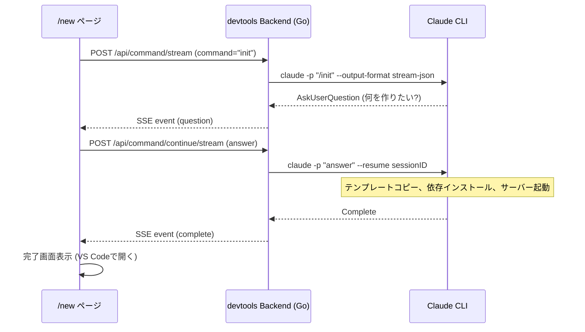
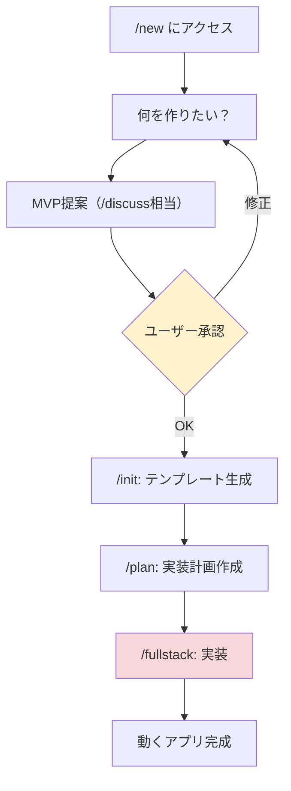
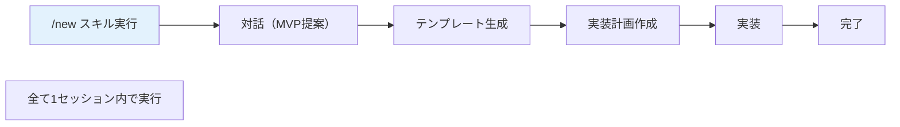
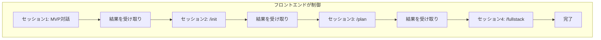
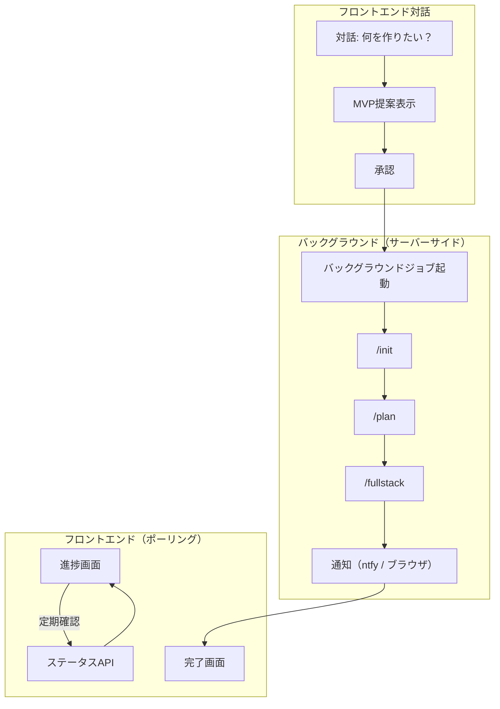
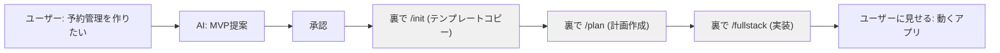
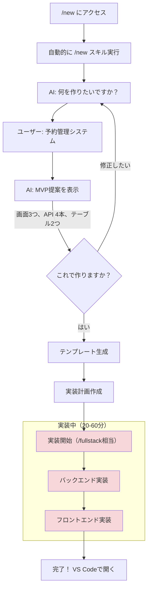

# 検討結果: /new 自動MVP構築（ワンストップ型プロジェクト作成）

## 検討経緯

| 日付 | 内容 |
|------|------|
| 2026-03-20 | 初回相談: /new でテンプレートだけでなく、MVP提案から /discuss /plan /fullstack を一気通貫で実行したい |

## 背景・目的

現在の /new ページは `/init` でテンプレートをコピーして「空の箱」を作るだけで完了する。その後ユーザーは自分で `/discuss` -> `/plan` -> `/fullstack` を順に実行する必要がある。

理想は、/new で「何を作りたい？」と聞いた後、MVP提案 -> 承認 -> 自動で実装まで完了し、ブラウザで動くアプリが出来上がっている状態。

ユーザーの言葉: 「/newはtemplateより、MVPを提案して、/discuss /plan /fullstackの工程を一気にやってくれるものがいいのでは」

### ターゲット

- 非エンジニア（同人誌の読者）
- 同人誌のデモとして最も映える体験にしたい

## 解決する課題

| 課題 | 現状 | 理想 |
|------|------|------|
| 工程が多い | /init -> VS Code -> /discuss -> /plan -> /fullstack を手動で実行 | /new で全部自動 |
| 非エンジニアに難しい | 各コマンドの意味を理解する必要がある | 「何を作りたい？」に答えるだけ |
| 空の箱 | テンプレートコピーだけで、画面もAPIも空 | MVP機能が実装済みで動く |

---

## 現在のアーキテクチャ（前提）

### 既に動いている仕組み



### 技術的ポイント

- `ExecuteCommandStream` / `ContinueSessionStream` で Claude CLI を呼び出せる
- AskUserQuestion で対話ができる
- SSE で進捗をリアルタイム表示できる
- セッションの --resume で対話を継続できる
- タイムアウトは60分（`s.timeout = 60 * time.Minute`）
- **クライアント切断時にプロセスが停止する**（ctx.Err() チェック）

### 既存スキルの役割

| スキル | 役割 | 所要時間（想定） |
|--------|------|-----------------|
| /init | テンプレートコピー + 環境構築 + サーバー起動 | 2-5分 |
| /discuss | アイデア深掘り、MVP提案、検討結果ファイル出力 | 対話次第（5-15分） |
| /plan | 仕様分析、懸念点洗い出し、実装計画作成、レビュー、テストプラン | 10-20分 |
| /fullstack | ブランチ作成 -> 実装 -> レビュー -> テスト -> ドキュメント -> コミット | 20-60分 |

**合計: 最短40分、最長100分以上**

---

## 検討ポイント

### 1. フロー設計: どこまで自動化するか



**黄色 = ユーザー判断が必要な箇所**
**赤 = 時間がかかる箇所**

#### 承認ポイントの検討

| パターン | 承認回数 | メリット | デメリット |
|----------|---------|---------|-----------|
| A: MVP提案のみ承認 | 1回 | シンプル、待ち時間が短い | 計画の質が見えない |
| B: MVP提案 + 実装計画を承認 | 2回 | 計画を見て安心できる | 2回待ちが発生 |
| C: 全自動（承認なし） | 0回 | 最速 | 意図しないものが作られるリスク |

### 2. 実現方法: 1セッション vs 複数セッション

#### 案A: 1つの長いClaude CLIセッション



- 新しいスキル `/new` を作り、/discuss + /init + /plan + /fullstack の全工程を1つのSKILL.mdに記述
- 1つのClaude CLIセッションが全てを処理
- **メリット**: 実装がシンプル、コンテキストが一貫
- **デメリット**: 1セッションが100分以上続く、途中でタイムアウトやクラッシュのリスク、コンテキストウィンドウの制限

#### 案B: 複数セッションを順次呼び出し



- フロントエンド（useProjectChat）が各セッションの完了を検知し、次のコマンドを自動発行
- **メリット**: 各フェーズが独立、1つ失敗しても再試行可能
- **デメリット**: セッション間のコンテキスト引き継ぎが必要、フロントエンドの制御ロジックが複雑

#### 案C: ハイブリッド（MVP対話 + バックグラウンドジョブ）



- 対話フェーズ（MVP提案まで）はリアルタイム
- 承認後、バックグラウンドジョブとして /init -> /plan -> /fullstack を実行
- ブラウザを閉じても続行、完了時に ntfy で通知
- **メリット**: ブラウザ閉じても安全、長時間処理に耐える
- **デメリット**: バックグラウンドジョブの仕組みを新規に作る必要がある、進捗のリアルタイム表示が難しい

### 3. 時間の問題

| 問題 | 影響 | 対策案 |
|------|------|--------|
| 全工程で40-100分 | ブラウザを開き続ける必要がある | バックグラウンドジョブ化 |
| Claude CLI セッションのタイムアウト | 60分で切れる | タイムアウト延長 or 分割 |
| SSE接続の維持 | ブラウザのバックグラウンドタブで切れる可能性 | 再接続 or ポーリング |
| コンテキストウィンドウ | /fullstack で大量のコードを生成すると溢れる | セッション分割 |

### 4. テンプレートの位置づけ

テンプレートはユーザーには見せず、裏で使う土台:



### 5. MVP提案の質

| 観点 | 粗い（推奨） | 詳細 |
|------|-------------|------|
| 画面 | 「3画面: 一覧、登録、詳細」 | ワイヤーフレーム付き |
| API | 「CRUD API 4本」 | エンドポイント + リクエスト/レスポンス定義 |
| DB | 「テーブル2つ: users, reservations」 | カラム定義まで |
| 判断基準 | /discuss が出す程度の粒度で十分 | /plan レベルは過剰 |

---

## 選択肢の検討

### 案A: 1セッション型（新 /new スキル）

- 概要: 全工程を1つの SKILL.md にまとめ、1つの Claude CLI セッションで実行する
- メリット:
  - 実装が最もシンプル（新しい SKILL.md を1つ書くだけ）
  - フロントエンドの変更が最小（既存チャットUIをほぼそのまま使える）
  - コンテキストが一貫（前の対話内容をAIが覚えている）
- デメリット:
  - 100分超のセッションが1つ続く（タイムアウト、クラッシュのリスク）
  - コンテキストウィンドウが溢れる可能性（/fullstack は大量のコードを生成）
  - ブラウザを閉じるとプロセスが停止する（現在の実装の制約）
  - /fullstack のサブエージェント（go-impl, go-reviewer等）がさらにネストする複雑さ
- 工数感: 小

### 案B: 多段セッション型（フロントエンド制御）

- 概要: フロントエンドが各フェーズの完了を検知し、次のコマンドを自動発行する
- メリット:
  - 各フェーズが独立（1つ失敗しても再試行可能）
  - 既存のスキル（/init, /plan, /fullstack）をそのまま使える
  - コンテキストウィンドウの問題なし（各セッションが独立）
- デメリット:
  - セッション間のコンテキスト引き継ぎが課題（MVP提案の内容を次のセッションにどう渡すか）
  - フロントエンドの制御ロジックが複雑（状態遷移、エラーハンドリング）
  - 完了判定が難しい（/init の complete と /plan の complete を区別する必要）
  - ブラウザを閉じると中断される問題は残る
- 工数感: 中

### 案C: ハイブリッド型（対話 + バックグラウンドジョブ）

- 概要: MVP対話はリアルタイム、承認後はバックグラウンドジョブとして実行
- メリット:
  - ブラウザを閉じても続行する
  - 長時間処理に耐える設計
  - 完了時に ntfy 通知（既に ntfyService が実装済み）
  - 進捗をDBに保存し、いつでも確認可能
- デメリット:
  - バックグラウンドジョブの仕組みを新規に作る必要がある
  - ジョブの状態管理（実行中、完了、エラー、再試行）が複雑
  - リアルタイム進捗表示が難しい（SSEではなくポーリング）
  - 実装コストが最も大きい
- 工数感: 大

---

## 案の比較

| 観点 | 案A: 1セッション | 案B: 多段セッション | 案C: ハイブリッド |
|------|-----------------|-------------------|------------------|
| 実装コスト | 小 | 中 | 大 |
| 信頼性 | 低（長時間1セッション） | 中（分割で耐障害性あり） | 高（バックグラウンド） |
| ブラウザ閉じ対応 | 不可 | 不可 | 可能 |
| 進捗表示 | リアルタイム（SSE） | リアルタイム（SSE） | ポーリング |
| 既存コード活用 | 高 | 高 | 中 |
| 同人誌デモ映え | 高（AIと会話 -> 動くアプリ） | 高 | 中（途中で画面が変わる） |
| MVP適性 | 高 | 中 | 低（作り込みが多い） |

---

## 要確認事項

以下の点について、ユーザーの判断を仰ぐ必要がある:

### 1. 承認ポイント

MVP提案を見せた後、「これで作りますか？」の1回だけ承認でよいか？ それとも /plan の実装計画も見せて承認したいか？

### 2. ブラウザ閉じ問題

/fullstack が数十分かかるが、その間ブラウザを開き続ける必要がある制約は許容できるか？ それともバックグラウンド実行が必須か？

### 3. 「動くアプリ」の定義

/fullstack 完了後の状態は何か:
- (a) テンプレート + MVP機能（画面、API、DB）が実装済みで、ブラウザで開くと動く
- (b) テンプレート + 実装計画ファイルが用意された状態（実装はまだ）
- (c) その他

### 4. 失敗時のリカバリー

/fullstack が途中で失敗した場合:
- (a) 最初からやり直し
- (b) 失敗したフェーズから再開
- (c) テンプレートだけの状態で返し、ユーザーがVS Codeで /fullstack を手動実行

---

## MVP提案（暫定）

**推奨案: 案A（1セッション型）**

### 推奨理由

1. **MVPに徹する**: 最小の実装コストで「/new で対話 -> 動くアプリ」の体験を実現
2. **同人誌デモ最優先**: 1画面でAIと会話し続けて、最後に動くアプリが出来上がるのが最も映える
3. **リスクは許容**: 長時間セッションの不安定さは、同人誌デモ（1回成功すればOK）なら問題ない
4. **既存コード変更なし**: 新しい SKILL.md を1つ書くだけ。バックエンド/フロントエンドの変更不要（既存の /new チャットUIをそのまま使える）

### MVP範囲

#### 必須

1. **新スキル `/new` の SKILL.md 作成**
   - MVP対話（何を作りたい？ -> 画面数/API数/DB構成を提案）
   - テンプレート生成（既存 /init のロジックを内包）
   - 実装計画作成（/plan 相当の簡易版）
   - 実装実行（/fullstack 相当、ただしレビュー/テストは省略してMVPに徹する）
2. **AllowedCommands に "new" を追加**
3. **フロントエンドの startChat で command を "new" に変更**
4. **タイムアウトの延長**（60分 -> 120分）

#### 次回以降

- バックグラウンドジョブ化（案C）
- 失敗時のリカバリー
- 進捗のステップ表示（「Step 2/5: 実装計画を作成中...」）
- 対話履歴の永続化

---

## フロー図（案A の場合）



### /new スキルの対話フロー（案A）

```
User: 予約管理システムを作りたい

AI: 予約管理システムですね！ MVPとして以下を提案します:

## 画面（3画面）
1. 予約一覧ページ - 予約の一覧表示、検索、フィルタ
2. 予約登録ページ - 新規予約の入力フォーム
3. 予約詳細ページ - 予約の詳細表示、編集、削除

## API（5本）
- GET /api/reservations - 一覧取得
- POST /api/reservations - 新規作成
- GET /api/reservations/:id - 詳細取得
- PUT /api/reservations/:id - 更新
- DELETE /api/reservations/:id - 削除

## データベース（2テーブル）
- reservations: id, name, date, time, status, note, created_at
- users: id, name, email（将来の認証用、MVP では使わない）

これでプロジェクトを作成してよいですか？
[はい、お願いします] [修正したい]
```

---

## 次のステップ

1. この検討結果について、上記「要確認事項」4点の回答を得る
2. 方針確定後、`/new` スキルの SKILL.md を設計
3. 実装（SKILL.md作成 + AllowedCommands追加 + フロントエンド微修正）
4. 動作検証（実際に /new で「予約管理」等を作ってみる）
