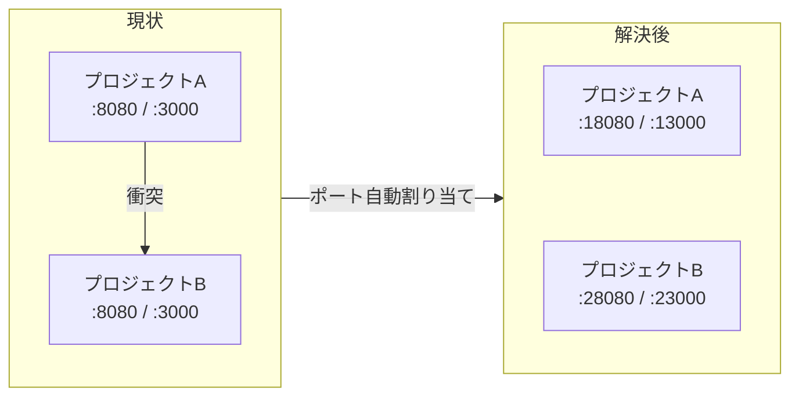
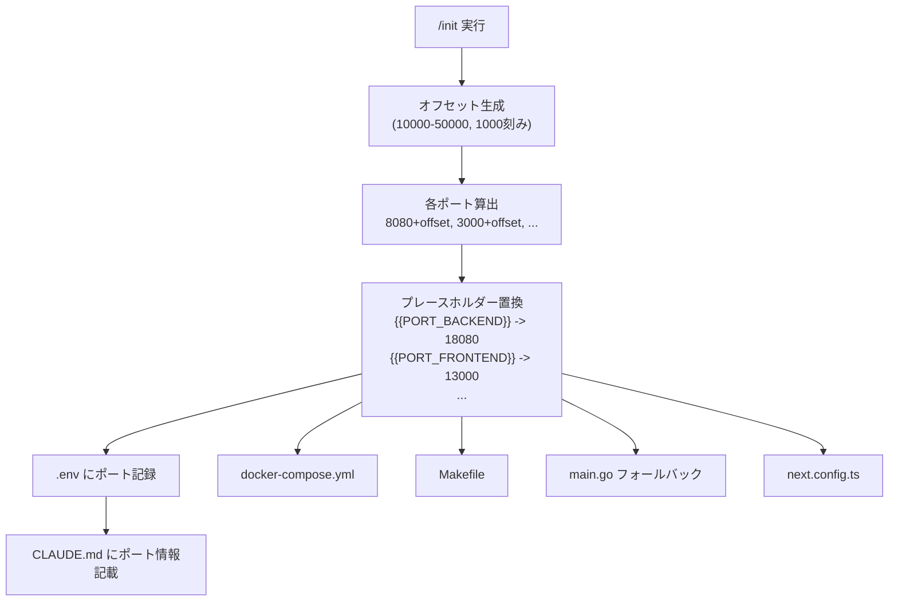

# 検討結果: プロジェクトポート自動割り当て

## 検討経緯

| 日付 | 内容 |
|------|------|
| 2026-03-20 | 初回相談: 複数プロジェクト同時起動時のポート衝突問題 |

## 背景・目的

`/init` で生成したプロジェクトは全て同じポートを使う（Backend: 8080, Frontend: 3000, DB: 5432, MinIO: 9000/9001, Redis: 6379）。複数プロジェクトを同時に開発する場合、ポートが衝突して一方を停止する必要がある。

プロジェクト生成時にユニークなポートを自動割り当てし、意識せず複数プロジェクトを並行稼働できるようにしたい。

## 対象ユーザー

Ghostrunner で複数プロジェクトを作成する個人開発者（非エンジニア含む）

## 解決する課題



## 現状のポートハードコード箇所

| ファイル | ポート | 用途 |
|---------|--------|------|
| `docker-compose.yml` (4テンプレート) | 8080, 3000, 5432, 9000, 9001, 6379 | ホスト-コンテナ間マッピング |
| `backend/.env.example` | 8080, 3000 | PORT, ALLOWED_ORIGIN |
| `backend/cmd/server/main.go` | 8080 | フォールバックポート |
| `frontend/next.config.ts` | 8080 | API proxy 先のフォールバック |
| `Makefile` | 8080, 3000, 3001 | stop/health/devtools |
| `SKILL.md` (/init) | 8080, 3000 他 | curl コマンド、完了メッセージ |

**重要な気付き**: Docker コンテナ内部のポートは変更不要。変えるのはホスト側のポートマッピングのみ。

```yaml
# 例: PostgreSQL
ports:
  - "15432:5432"  # ホスト側だけ変える、コンテナ内は5432のまま
```

## 選択肢の検討

### ポート決定方法

#### 案A: ランダム生成

- 概要: /init 実行時に 10000-60000 の範囲からランダムにポートを選ぶ
- メリット: 実装がシンプル、衝突確率が極めて低い
- デメリット: ポート番号に規則性がなく覚えにくい（12847, 39521 など）
- 工数感: 小

#### 案B: プロジェクト名ハッシュ

- 概要: プロジェクト名のハッシュ値からポートを決定論的に算出
- メリット: 同じプロジェクト名なら常に同じポート、再現性がある
- デメリット: ハッシュ衝突の可能性あり、番号は覚えにくい
- 工数感: 小

#### 案C: オフセット方式（推奨）

- 概要: ベースポート（8080 等）にランダムなオフセット（10000-50000、1000刻み）を加算
- メリット: 元のポート番号の構造が残り直感的（例: 8080 -> 18080, 3000 -> 13000）
- デメリット: 1000刻みだと最大40スロット程度（個人開発では十分）
- 工数感: 小

| 比較 | 案A ランダム | 案B ハッシュ | 案C オフセット |
|------|-------------|------------|--------------|
| 分かりやすさ | x 規則性なし | x 規則性なし | o 元ポートが見える |
| 衝突確率 | o 極めて低い | △ ハッシュ衝突あり | o 40スロットで十分 |
| 再現性 | x 毎回変わる | o 決定論的 | x 毎回変わる |
| 実装の簡潔さ | o | △ | o |

### ポート伝播方法

#### 方式X: プレースホルダー置換（推奨）

- 概要: テンプレートに `{{PORT_BACKEND}}` 等のプレースホルダーを追加し、`{{PROJECT_NAME}}` と同様に /init で一括置換
- メリット: 既存パターンの延長で分かりやすい、追加の仕組み不要
- デメリット: 生成後にポートを変えたい場合は手動で複数ファイルを修正
- 工数感: 小

#### 方式Y: .env 集中管理

- 概要: ルートに `.env` を置き、docker-compose.yml は `${PORT_BACKEND}` で参照、Makefile も `.env` を読む
- メリット: ポート変更が `.env` 1箇所で済む
- デメリット: docker-compose の env_file 対応、Makefile の include 対応など構造変更が大きい
- 工数感: 中〜大

| 比較 | 方式X プレースホルダー | 方式Y .env集中管理 |
|------|---------------------|-------------------|
| 変更箇所 | テンプレート + /init | テンプレート + /init + 構造変更 |
| ポート変更の容易さ | △ 複数ファイル修正 | o 1箇所修正 |
| 既存パターンとの整合性 | o そのまま | △ 新パターン導入 |
| 工数 | 小 | 中〜大 |

## MVP提案

**推奨案**: 案C（オフセット方式）+ 方式X（プレースホルダー置換）

### ポート割り当てルール

```
オフセット = ランダムに選んだ 1000 の倍数（10000, 11000, ..., 50000）

Backend:       8080 + offset  (例: 18080)
Frontend:      3000 + offset  (例: 13000)
PostgreSQL:    5432 + offset  (例: 15432)
MinIO API:     9000 + offset  (例: 19000)
MinIO Console: 9001 + offset  (例: 19001)
Redis:         6379 + offset  (例: 16379)
```

利点: ポート番号を見れば「ベースは何番か」「どのサービスか」が分かる。

### 変更対象



#### テンプレート側の変更

1. **docker-compose.yml** (全4テンプレート): `"8080:8080"` -> `"{{PORT_BACKEND}}:8080"`（ホスト側のみ置換）
2. **backend/.env.example**: `PORT={{PORT_BACKEND}}`, `ALLOWED_ORIGIN=http://localhost:{{PORT_FRONTEND}}`
3. **backend/cmd/server/main.go**: フォールバック `"8080"` -> `"{{PORT_BACKEND}}"`
4. **frontend/next.config.ts**: フォールバック `"http://localhost:8080"` -> `"http://localhost:{{PORT_BACKEND}}"`
5. **Makefile**: lsof, health check, devtools の各ポートを置換

#### /init (SKILL.md) 側の変更

- Step 3 の前にポート生成ステップを追加
- Step 4 のプレースホルダー置換に `{{PORT_*}}` を追加
- Step 9-11 の curl コマンド・完了メッセージにポート変数を使用
- CLAUDE.md 生成時にポート情報セクションを含める

#### 追加するプレースホルダー一覧

| プレースホルダー | 用途 | 例 |
|----------------|------|-----|
| `{{PORT_BACKEND}}` | バックエンド | 18080 |
| `{{PORT_FRONTEND}}` | フロントエンド | 13000 |
| `{{PORT_DB}}` | PostgreSQL | 15432 |
| `{{PORT_MINIO}}` | MinIO API | 19000 |
| `{{PORT_MINIO_CONSOLE}}` | MinIO Console | 19001 |
| `{{PORT_REDIS}}` | Redis | 16379 |

### CLAUDE.md へのポート情報記載

生成される各プロジェクトの CLAUDE.md に以下を含める:

```
## ポート情報

| サービス | ポート |
|---------|--------|
| Backend | {{PORT_BACKEND}} |
| Frontend | {{PORT_FRONTEND}} |
| PostgreSQL | {{PORT_DB}} |
| ...     | ...    |
```

これにより Claude Code が各プロジェクトのポートを把握できる。

### devtools 進捗ビューアとの連携

現時点では devtools は各プロジェクトのポートを把握する仕組みがない。対応は以下のいずれかだが、MVP では対象外とする:

- 各プロジェクトの `.env` を読んでポートを取得する
- プロジェクト登録時にポート情報を保存する

### MVP範囲

- /init でのランダムオフセット生成
- 6つのポートプレースホルダーをテンプレートに追加
- /init のプレースホルダー置換に追加
- 生成される CLAUDE.md にポート情報を記載
- /init の完了メッセージに実際のポート番号を表示

### 次回以降

- ポート空き確認（lsof で生成時にチェック）
- devtools からの各プロジェクトポート把握
- .env 集中管理方式への移行（必要になったら）
- ポート番号のカスタマイズ（ユーザーが指定したい場合）

## 次のステップ

1. この検討結果を `開発/検討中/` に保存 -> 完了
2. 方針決定後、`/plan` で実装計画を作成
3. 計画確定後、`開発/実装/実装待ち/` に移動
