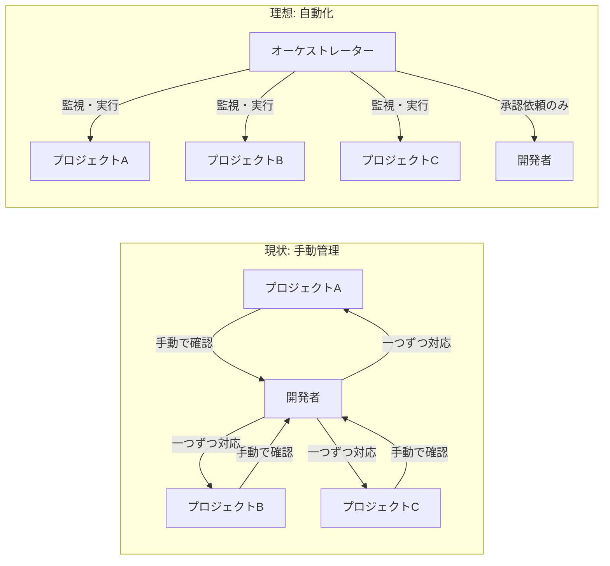
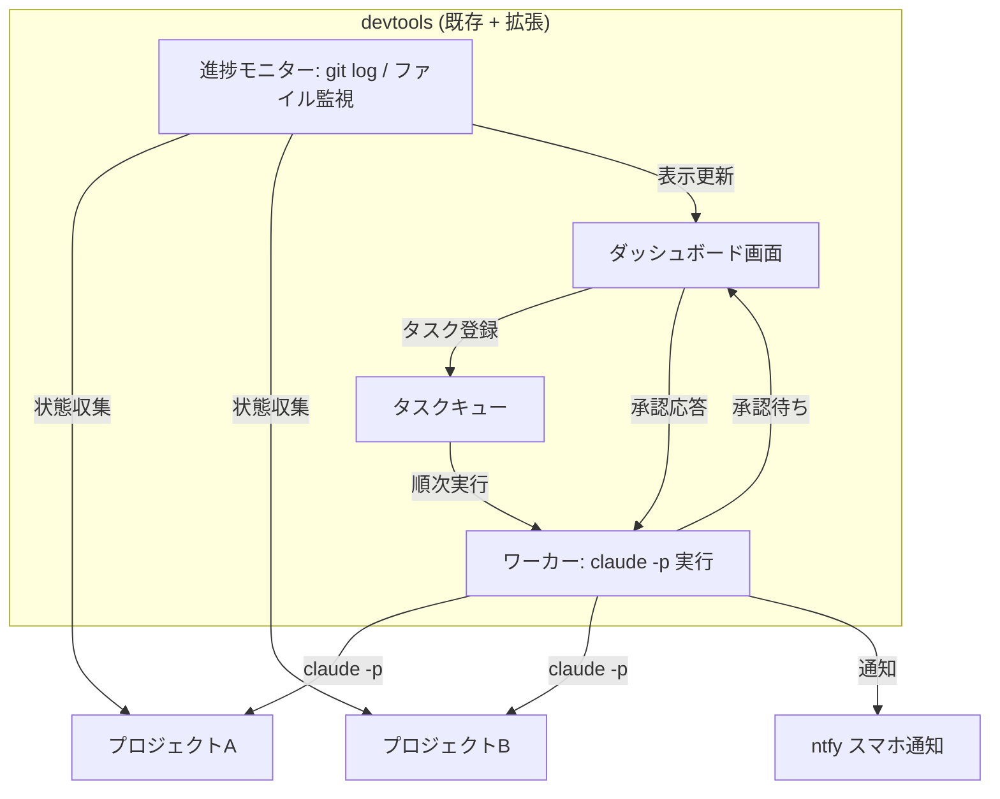
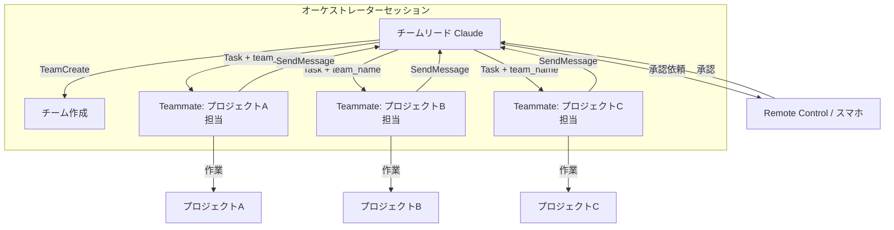
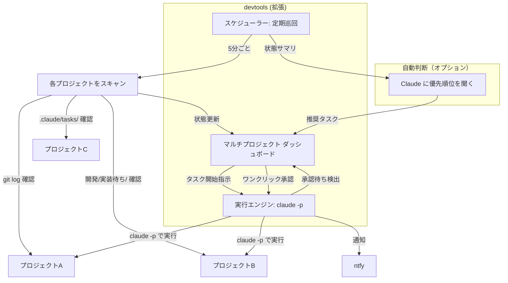
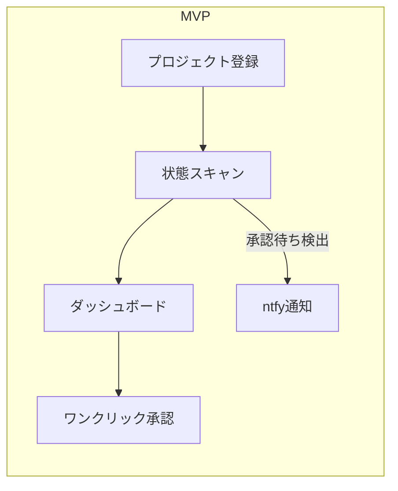

# 検討結果: 複数プロジェクト管理AI

## 検討経緯

| 日付 | 内容 |
|------|------|
| 2026-03-20 | 初回相談: 複数プロジェクトの進捗把握・優先順位判断・承認待ち問題を解決したい |
| 2026-03-20 | 深掘り: ユーザー回答を踏まえ、課題整理と3案の提示、MVP提案 |

## 背景・目的

個人開発者が複数のプロジェクトを同時に進めており、以下の問題に直面している:

1. **進捗把握の困難**: 各プロジェクトの状態（どこまで進んだか）が一目で分からない
2. **優先順位の判断**: 「今日はどのプロジェクトに手をつけるべきか」が不明
3. **承認待ちのボトルネック**: Claude Codeが質問や承認を待って停止しているが、気づかない
4. **指示結果の確認が面倒**: 各プロジェクトを個別に開いて確認する必要がある

### 期待する自律性レベル

**レベル3: オーケストレーター型** -- 自律的にプロジェクト間を移動して作業し、人は承認のみ行う。

## 対象ユーザー

個人開発者（自分自身）。複数のGhostrunnerプロジェクトを同時進行で開発している。

## 解決する課題

## 技術的な前提・制約

### 使えるもの

| 技術 | 説明 |
|------|------|
| `claude -p` (Headless Mode) | Claude CLIをプログラムから非対話的に実行。JSON/stream-json出力対応 |
| `--resume <session_id>` | 既存セッションを継続可能 |
| `--permission-mode bypassPermissions` | 承認なしで全ツール実行 |
| Agent Teams (実験的) | 複数Claude Codeインスタンスの協調動作。TeammateTool, SendMessage, 共有タスクリスト |
| Remote Control | スマホからセッションを監視・承認 |
| 既存devtools | Go + Next.js のWeb UI、claude CLIのラッパーAPI、SSEストリーミング、ntfy通知 |
| 各プロジェクトの `.claude/` | Ghostrunnerのエージェント・コマンドが全プロジェクトに入っている |
| git log | 外部からプロジェクトの進捗を把握可能 |

### 制約

1. Claude Codeセッション間の直接通信は不可（Agent Teamsの共有タスクリスト以外）
2. Agent Teamsは実験的機能でバグの可能性あり
3. `bypassPermissions` はセキュリティリスク（個人利用なので許容）
4. 1台のマシンで複数のclaude CLIプロセスを同時実行するとリソース消費が大きい

## 選択肢の検討

### 案A: devtools拡張 -- ダッシュボード + キュー型

既存のdevtools（Go + Next.js）を拡張し、複数プロジェクトのダッシュボードとタスクキューを追加する。

**仕組み:**
- devtoolsのバックエンドにタスクキューを追加（Go のインメモリ or SQLite）
- ダッシュボード画面で全プロジェクトの状態を一覧表示
- タスクをキューに入れると、ワーカーが `claude -p` で順次実行
- 承認待ちになったらダッシュボードに表示 + ntfy通知
- ユーザーがダッシュボードで承認 → `--resume` でセッション継続

**メリット:**
- 既存のdevtoolsコードベース（ClaudeService, SSE, ntfy）をそのまま活用できる
- 実装コストが比較的小さい
- 安定性が高い（自前で制御するため）
- 単一のWeb画面で全プロジェクトを管理できる

**デメリット:**
- タスクは順次実行（並列にすると複雑になる）
- オーケストレーション（優先順位の自動判断）は手動
- 「レベル3」の自律性には届かない（レベル2寄り）

**工数感:** 中

---

### 案B: Agent Teams活用 -- オーケストレーター型

Claude Code の Agent Teams 機能を使い、「チームリード」セッションが複数プロジェクトを横断的に管理する。

**仕組み:**
- devtoolsから「オーケストレーター」セッションを1つ起動（`claude -p` + bypassPermissions）
- オーケストレーターに「以下のプロジェクトの開発/実装/実装待ち/を確認し、タスクを進めよ」と指示
- Agent Teamsで各プロジェクトにTeammateを割り当て
- 各TeammateがプロジェクトのCLAUDE.mdと開発/ディレクトリを読み、自律的に作業
- 承認が必要な場面ではRemote Controlでスマホ承認

**メリット:**
- 真のレベル3（自律型オーケストレーション）に近い
- Claude自身が優先順位を判断し、プロジェクト間を移動
- 並列実行が可能
- コード量が少ない（Claudeの機能を活用するため）

**デメリット:**
- Agent Teamsは実験的機能（不安定リスクあり）
- プロジェクト間でcwdを切り替える動作が未検証
- リソース消費が大きい（同時に複数のClaudeプロセス）
- デバッグが難しい（Claudeの判断が不透明）
- Remote ControlはAPIキーでは使えない（claude.aiアカウントが必要）

**工数感:** 小（コード量）/ 大（検証・調整）

---

### 案C: ハイブリッド -- devtoolsダッシュボード + 自動巡回

案Aと案Bの中間。devtoolsに管理ダッシュボードを追加し、定期的にclaude CLIで各プロジェクトの状態を「巡回」する。

**仕組み:**
1. **巡回スキャン（Go バックエンド）**: 定期的にregisteredプロジェクトの `git log`, `開発/実装/実装待ち/`, `.claude/tasks/` を読み取り、状態をJSON化
2. **ダッシュボード（Next.js）**: 全プロジェクトの状態を一覧表示。各プロジェクトの「最終コミット」「実装待ちタスク数」「承認待ち」を表示
3. **タスク実行**: ダッシュボードからワンクリックで `claude -p /<command>` を実行
4. **承認フロー**: 承認待ち検出 → ntfy通知 → ダッシュボードでワンクリック承認 → `--resume` で継続
5. **優先順位レコメンド（オプション）**: 巡回結果をclaude -pに渡し「今日やるべきタスクは？」と聞く

**メリット:**
- 段階的に構築可能（巡回 → ダッシュボード → 自動実行 → AI判断）
- 既存devtoolsの資産を最大限活用
- 安定性と自律性のバランスが良い
- 各段階で価値が出る
- 実験的機能に依存しない

**デメリット:**
- フル機能の実装は案Aより工数が大きい
- 巡回のポーリング間隔と状態取得の精度にトレードオフ
- 「完全自律」ではない（人がタスクをトリガーする場面がある）

**工数感:** 中〜大（段階的に構築）

---

## 選択肢の比較

| 観点 | 案A: キュー型 | 案B: Agent Teams | 案C: ハイブリッド |
|------|:---:|:---:|:---:|
| 自律性レベル | Lv.2 | Lv.3 | Lv.2.5 (段階的にLv.3へ) |
| 安定性 | 高 | 低（実験的） | 高 |
| 既存コード活用 | 大 | 小 | 大 |
| 並列実行 | 困難 | 可能 | 段階的に可能 |
| 承認待ち解消 | 解消 | 解消 | 解消 |
| 優先順位自動判断 | 手動 | AI判断 | AI推奨（最終判断は人） |
| MVP工数 | 小〜中 | 小 + 検証大 | 小 |
| 拡張性 | 中 | 不透明 | 高 |

## MVP提案

**推奨案: 案C（ハイブリッド）のフェーズ1**

理由:
- 案Aは「承認待ち解消」には十分だが、優先順位判断がない
- 案Bは理想的だがAgent Teamsの安定性リスクが高い
- 案Cのフェーズ1は案Aと同程度の工数で、拡張の余地が大きい

### MVPスコープ（フェーズ1）

**目標: 「全プロジェクトの状態が一目でわかり、承認待ちに即座に対応できる」**

必須機能:
1. **プロジェクト登録**: 管理対象プロジェクトの登録（パス指定）
2. **状態スキャン**: 各プロジェクトの `git log --oneline -5` と `開発/` ディレクトリの状態を収集
3. **ダッシュボード画面**: `/projects` ページで全プロジェクトの状態を一覧表示
4. **既存のコマンド実行連携**: ダッシュボードからプロジェクトを選択 → 既存のコマンドフォーム画面へ遷移
5. **承認待ち通知**: 実行中に承認待ちが発生したらntfyでスマホ通知（既存機能を活用）

### Ghostrunnerとの関係

**devtoolsの拡張として実装する。** 理由:
- 既存の `ClaudeService`（claude CLI実行）、`NtfyService`（通知）、`ProjectsHandler`（プロジェクト一覧）をそのまま使える
- フロントエンドのSSEストリーミング、セッション継続UIも再利用可能
- 別プロジェクトにすると二重管理になる

### フェーズ2以降（次回以降）

- **タスクキュー**: ダッシュボードからタスク登録 → 順次自動実行
- **自動巡回**: 定期的にスキャンし、変化を検出して通知
- **優先順位レコメンド**: 巡回結果をclaude -pに渡し、今日やるべきタスクを提案
- **Agent Teams統合**: 安定したらTeammateによる並列実行を追加
- **実行履歴**: 各プロジェクトの実行ログ・コスト履歴を蓄積

## 次のステップ

1. この検討結果を `開発/検討中/` に保存 --> 完了
2. 方向性を確認（案C フェーズ1で進めるか？）
3. 確定後、`/plan` でMVPの実装計画を作成
4. devtoolsのバックエンド（Go）にプロジェクト状態スキャンAPIを追加
5. devtoolsのフロントエンド（Next.js）にダッシュボードページを追加

## 参考情報

- [Claude Code Headless Mode (公式)](https://code.claude.com/docs/en/headless)
- [Claude Code Agent Teams (公式)](https://code.claude.com/docs/en/agent-teams)
- [Agent Teams ガイド](https://claudefa.st/blog/guide/agents/agent-teams)
- [Claude Code Remote Control (公式)](https://code.claude.com/docs/ja/remote-control)
