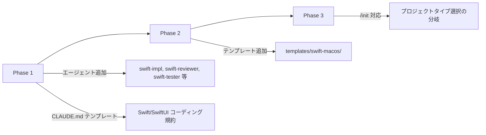

# Ghostrunner に Swift/macOS テンプレートを追加

## 検討経緯

| 日付 | 内容 |
|------|------|
| 2026-03-27 | 初回相談: macOS ネイティブアプリ（スクリーンキャプチャツール等）を作りたいが対応テンプレートがない |

## 概要

Ghostrunner は現在 Go + Next.js の Web アプリ向けテンプレート（base, with-db, with-storage, with-redis）のみを提供している。macOS ネイティブアプリを Swift/SwiftUI で開発するためのテンプレートとエージェント群を追加する検討。

## 現状分析

### テンプレート構造

現在のテンプレートは「base + オプション層」の合成パターンで構成されている。

```
templates/
  base/            -- Go(Gin) + Next.js の土台。プレースホルダー {{PROJECT_NAME}}, {{PORT_xxx}} を含む
  with-db/         -- base に PostgreSQL/GORM を追加する差分ファイル
  with-storage/    -- base に R2/MinIO を追加する差分ファイル
  with-redis/      -- base に Redis を追加する差分ファイル
```

- base はバックエンド（Go + Gin）とフロントエンド（Next.js）の 2 層構成
- with-xxx はそれぞれ `backend/internal/` にファイルを追加する registry パターン（衝突しない設計）
- docker-compose.yml でサービス管理、Makefile でdev/stop/build/health
- プレースホルダーは sed で一括置換
- デプロイは GCP Cloud Run + GitHub Actions

### /init スキルの動き

1. 対話で「何を作りたいか」を聞く
2. DB/ストレージ/Redis の要否を自動判断し、MVP を1つ提案
3. テンプレートコピー（base + 選択オプション）
4. ポート割り当て + プレースホルダー置換
5. .env / 依存関係の解決
6. .claude/ 資産コピー（agents, skills, settings.json, CLAUDE.md 生成）
7. Git 初期化 + サーバー起動 + /plan + /coding でMVP実装
8. GETTING_STARTED.md 生成

**重要な前提**: /init は「Web アプリを作る」ことがハードコードされている（Q1 で「どんな Web アプリ？」と聞く、docker-compose、フロントエンド/バックエンド 2 層構成など）。

### エージェント構成

23 エージェントのうち、技術固有のものは以下:
- Go 系: go-impl, go-planner, go-reviewer, go-tester, go-documenter, go-plan-reviewer (6個)
- Next.js 系: nextjs-impl, nextjs-planner, nextjs-reviewer, nextjs-tester, nextjs-documenter, nextjs-plan-reviewer (6個)
- PostgreSQL 系: pg-impl, pg-planner, pg-reviewer, pg-tester (4個)
- 汎用: discuss, research, fix-judge, release-manager, staging-manager, test-planner, reporter (7個)

## 要件整理

### macOS ネイティブアプリに必要なもの

1. **プロジェクト構成**: Xcode プロジェクト or Swift Package Manager
2. **UI フレームワーク**: SwiftUI（macOS 14+）
3. **アーキテクチャ**: MVVM or Clean Architecture
4. **権限管理**: entitlements（スクリーンキャプチャなら Screen Recording 権限）
5. **ビルド**: xcodebuild or swift build
6. **テスト**: XCTest
7. **配布**: .app 直接配布 or Mac App Store

### Web アプリとの根本的な違い

| 観点 | Web アプリ (現行) | macOS ネイティブ |
|------|-------------------|-----------------|
| 構成 | バックエンド + フロントエンド 2層 | 単一アプリ（場合によってローカルDB） |
| 実行 | Docker / make dev | Xcode or swift build |
| デプロイ | Cloud Run + GitHub Actions | .app 配布 or App Store |
| ポート管理 | ランダムポート割り当て | 不要 |
| DB | PostgreSQL (Docker) | Core Data / SwiftData / SQLite |
| テスト | go test + vitest | XCTest |
| CI/CD | GitHub Actions → GCP | GitHub Actions → Notarize (任意) |

## 技術検討

### 案A: 独立した swift-macos テンプレートを追加（推奨）

**概要**: `templates/swift-macos/` に独立したテンプレートを追加。/init で「Web アプリ / macOS アプリ」を選択できるようにする。

```
templates/
  base/                 -- 既存（Web アプリ用）
  with-db/              -- 既存
  with-storage/         -- 既存
  with-redis/           -- 既存
  swift-macos/          -- 新規（macOS アプリ用、独立した base）
```

```mermaid
flowchart TD
    INIT[/init 実行] --> Q0[何を作りたいか？]
    Q0 --> JUDGE{Web or macOS?}
    JUDGE -->|Web アプリ| WEB[既存フロー: base + with-xxx]
    JUDGE -->|macOS アプリ| MAC[新フロー: swift-macos]
    MAC --> Q_MAC[macOS 向け質問]
    Q_MAC --> COPY_MAC[テンプレートコピー]
    COPY_MAC --> CLAUDE_MAC[Swift 用 CLAUDE.md 生成]
    CLAUDE_MAC --> AGENTS_MAC[Swift 用エージェントのみコピー]
    AGENTS_MAC --> PLAN[/plan + /coding でMVP実装]
```

**swift-macos テンプレートの構成案**:

```
templates/swift-macos/
  Package.swift                          -- Swift Package Manager 定義
  Sources/
    App/
      <AppName>App.swift                 -- @main エントリポイント
      ContentView.swift                  -- ルート View
    Features/                            -- 機能別モジュール（空のサンプル）
    Shared/
      Models/                            -- ドメインモデル
      Services/                          -- ビジネスロジック
      Extensions/                        -- Swift 拡張
  Tests/
    <AppName>Tests/                      -- XCTest
  Resources/
    Info.plist                           -- アプリ情報
    <AppName>.entitlements               -- 権限（空テンプレート）
  .gitignore
  Makefile                               -- build / test / run / clean
  開発/                                  -- 開発ドキュメント構造
```

- メリット:
  - Web と macOS で完全に独立しており、互いに影響しない
  - macOS 特有の構成（entitlements, Info.plist）を最初から含められる
  - SPM ベースなので Xcode なしでもビルド可能（`swift build`）
  - 既存テンプレートのパターン（プレースホルダー置換、Makefile）を踏襲できる
- デメリット:
  - /init スキルの大幅な改修が必要（Web 前提のフローを分岐させる）
  - Swift 用エージェント群を新規作成する必要がある（6個程度）
  - メンテナンス対象が増える（Web 系 + Swift 系の2系統）
- 工数感: 大

### 案B: エージェント + CLAUDE.md のみ追加（テンプレートなし）

**概要**: テンプレートは作らず、Swift/SwiftUI 用のエージェントと CLAUDE.md テンプレートだけを追加。プロジェクトの初期構成は /init 内で Claude が動的に生成する。

- メリット:
  - テンプレートのメンテナンスが不要
  - 柔軟性が高い（プロジェクトごとに構成を変えられる）
  - 実装量が少ない
- デメリット:
  - 生成結果が毎回異なる可能性がある（品質の一貫性が低い）
  - /init の複雑さが増す（テンプレートコピーの代わりにファイル生成ロジックが必要）
  - Web 系テンプレートとの設計思想の一貫性が崩れる
- 工数感: 中

### 案C: 段階的アプローチ（エージェント先行 → テンプレート後追い）

**概要**: まず Swift 用エージェント + CLAUDE.md テンプレートだけ追加し、/init の対応は後回し。ユーザーは手動で Swift プロジェクトを作成し、Ghostrunner の .claude/ 資産を手動コピーして使う。



- メリット:
  - 最小限の変更ですぐに使い始められる
  - 実際に使いながらテンプレートの構成を検証できる
  - リスクが低い（既存機能に影響しない）
- デメリット:
  - Phase 1 では /init が使えない（手動セットアップが必要）
  - 2-3段階の作業が発生する
- 工数感: Phase 1 は小、全体では大

## MVP提案

**推奨案**: 案C（段階的アプローチ）

理由:
1. Ghostrunner の /init は Web アプリ向けに深く最適化されており、一度に分岐を入れると影響範囲が大きい
2. Swift/macOS テンプレートの「正解」がまだ見えていない（SPM vs Xcode プロジェクト、MVVM vs Clean Architecture など）
3. まずエージェントだけ追加して実際の macOS アプリ開発で使い、そのフィードバックを元にテンプレートを設計する方が合理的

### MVP 範囲（Phase 1）

以下のファイルを追加する:

1. **Swift 用エージェント**（`.claude/agents/` に追加）
   - `swift-impl.md` -- Swift/SwiftUI の設計・実装
   - `swift-reviewer.md` -- Swift コードレビュー
   - `swift-tester.md` -- XCTest テスト作成
   - `swift-planner.md` -- Swift 実装計画
   - `swift-plan-reviewer.md` -- 計画レビュー

2. **Swift/SwiftUI 向け CLAUDE.md テンプレート片**
   - `templates/swift-macos/CLAUDE_TEMPLATE.md` のような参考ファイル
   - コーディング規約（SwiftUI、MVVM、命名規則、エラーハンドリング）
   - ビルド・テストコマンド

### 次回以降（Phase 2-3）

- `templates/swift-macos/` テンプレート本体の作成
- /init スキルに「プロジェクトタイプ選択」の分岐を追加
- Makefile テンプレート（swift build / swift test / open .xcodeproj）
- CI/CD テンプレート（GitHub Actions for Swift）

## 影響範囲

### Phase 1（MVP）での影響

| 対象 | 変更内容 | 影響度 |
|------|----------|--------|
| `.claude/agents/` | Swift 用エージェント 5個を追加 | 低（既存に影響なし） |
| `templates/` | CLAUDE.md テンプレート片を参考用に配置 | 低 |
| `/init` スキル | **変更なし** | なし |
| `/coding` スキル | 変更なし（エージェント名を計画書に書けば自動で使われる） | なし |
| `/plan` スキル | 変更なし | なし |
| `.claude/CLAUDE.md` | プロジェクト概要にSwiftテンプレートの存在を追記 | 低 |

### Phase 2-3 での影響

| 対象 | 変更内容 | 影響度 |
|------|----------|--------|
| `/init` スキル | Q0 の回答から Web/macOS を判定する分岐追加、macOS 用フロー新設 | **高** |
| `templates/swift-macos/` | テンプレート本体の新規作成 | 中 |
| `/coding` スキル | Swift ビルド・テストコマンドへの対応確認 | 中 |
| `settings.json` | Swift フォーマッター（swift-format）のフック追加 | 低 |

## 未決定事項（Phase 2 以降で検討）

1. **SPM vs Xcode プロジェクト**: SPM（`Package.swift`）の方がテキストベースで Claude Code と相性が良いが、Xcode プロジェクト（`.xcodeproj`）の方が entitlements や capabilities の管理が楽。実際に使ってみて判断する。
2. **macOS バージョンターゲット**: macOS 14 (Sonoma) 以上なら SwiftData が使える。macOS 13 以上なら Core Data。
3. **with-xxx 相当のオプション**: macOS アプリの場合 with-db はローカル DB（SwiftData / Core Data）になる。ネットワーク経由の DB は別の設計が必要。
4. **デプロイ**: Mac App Store 配布か直接配布か。Notarize の自動化。

## 次のステップ

1. この検討結果を確認し、方針を決定する
2. 方針決定後、Phase 1 のエージェント設計を `/plan` で具体化
3. エージェント実装後、実際の macOS アプリ開発（スクリーンキャプチャツール等）で使ってフィードバックを得る
4. フィードバックを元に Phase 2（テンプレート）の設計に進む
