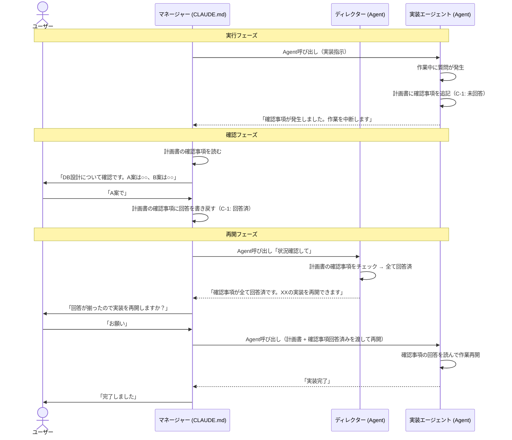
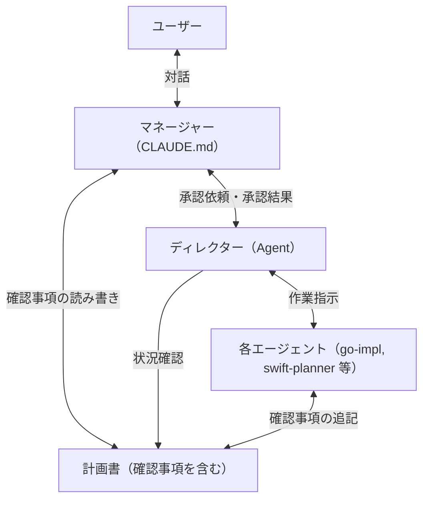
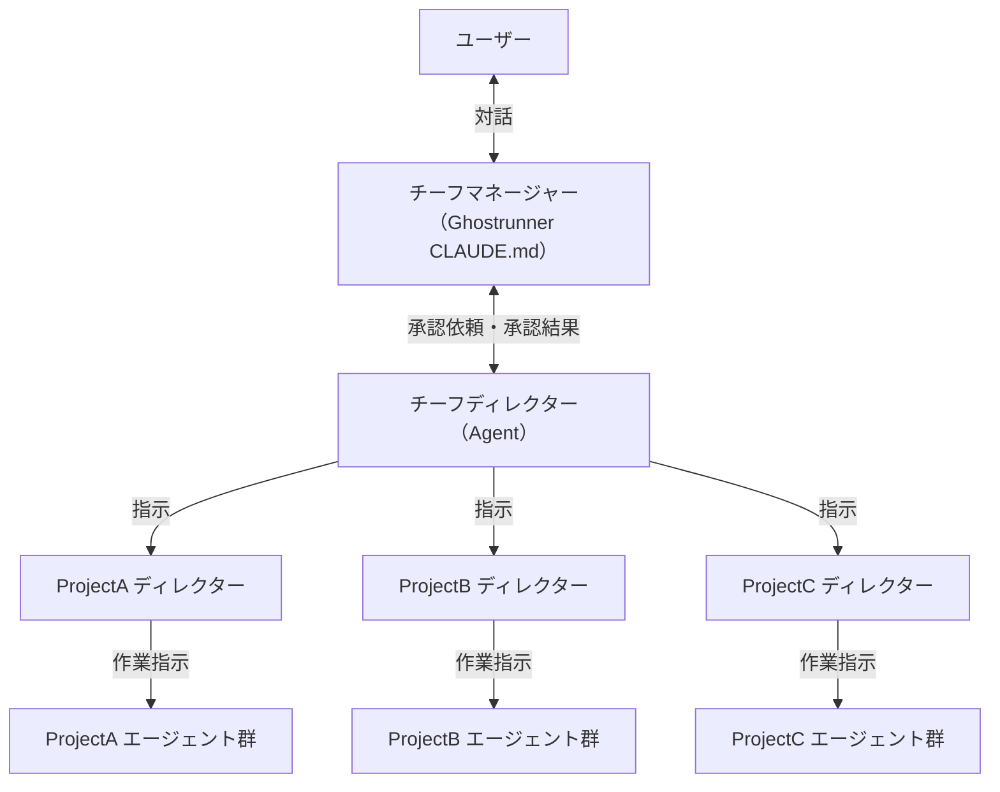
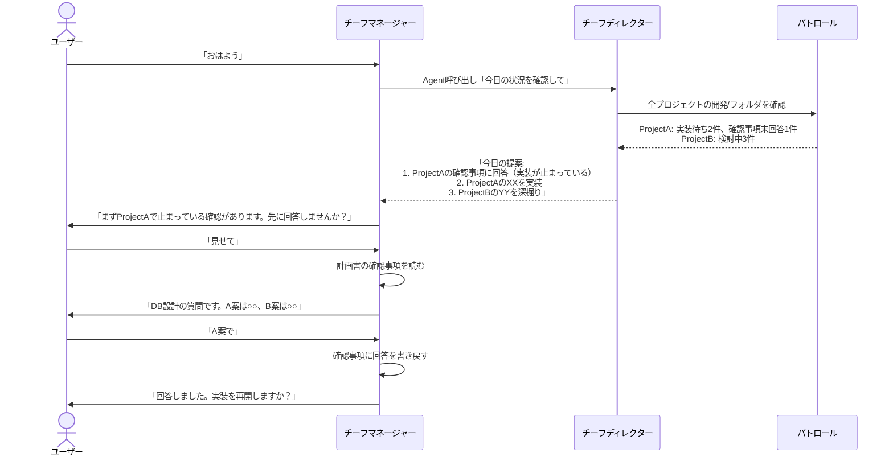
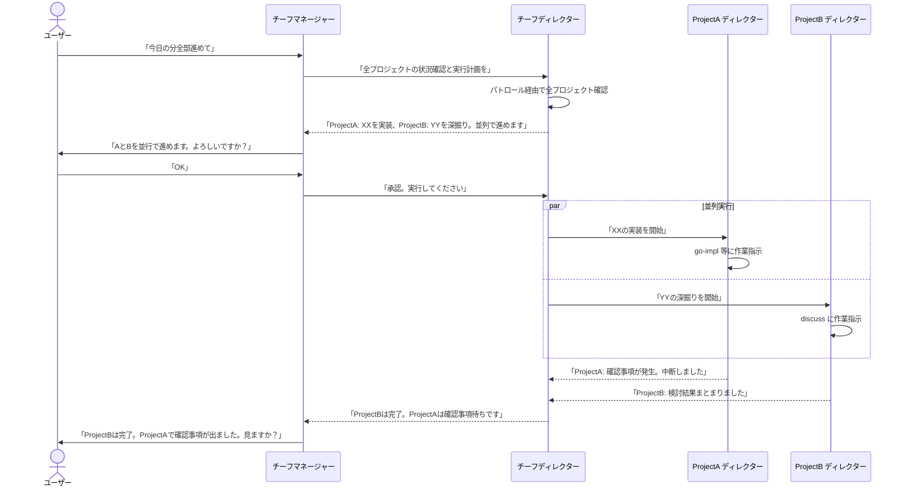

# 検討結果: マネージャーとディレクター

## 検討経緯

| 日付 | 内容 |
|------|------|
| 2026-04-03 | 初回相談: 対話特化エージェントとタスクマネージャーの要望 |
| 2026-04-03 | 命名を「マネージャー」「ディレクター」に決定。指揮系統・承認フロー・適用範囲を確定 |
| 2026-04-03 | チーフマネージャー/チーフディレクター（Ghostrunner横断版）の命名と一括管理フローを追加 |
| 2026-04-05 | 実装計画作成中にコンテキスト消失問題が発覚。Agent入れ子の深さ、質問取り次ぎの複雑さが課題に |
| 2026-04-05 | 構想を根本から見直し。「確認事項」（ファイルベースの非同期質問メカニズム）を導入。AIの記憶ではなくファイルで状態を管理する方針に転換 |

## 背景・目的

Claude Codeでの開発体験を統一するために、2つの役割を導入する。

- **マネージャー**: ユーザーの唯一の対話相手として、意図の解釈・確認事項の翻訳・承認フローを担う
- **ディレクター**: プロジェクトの状況把握・判断・作業の振り分けを担う

加えて、エージェントからの質問をリアルタイム対話ではなく**ファイルベースの非同期メカニズム（確認事項）**で管理する。

## 対象ユーザー

- Ghostrunnerフレームワークの利用者（個人開発者）
- `/init` で生成したプロジェクトの開発者

## 命名

| レベル | 名前 | 英語 | 所在 | 役割 |
|--------|------|------|------|------|
| Ghostrunner | チーフマネージャー | Chief Manager | CLAUDE.md | ユーザーの唯一の対話相手。全プロジェクトを横断 |
| Ghostrunner | チーフディレクター | Chief Director | Agent (.md) | 全プロジェクトの状況把握・目標立て・一括指示 |
| 各プロジェクト | マネージャー | Manager | CLAUDE.md | そのプロジェクト内でのユーザー対話相手 |
| 各プロジェクト | ディレクター | Director | Agent (.md) | そのプロジェクトの状況把握・判断・仕事の振り分け |

## 各役割の詳細

### チーフマネージャー（Ghostrunner CLAUDE.md）

**ユーザーとの対話窓口（横断版）**

- ユーザーの意図を解釈する（「今日全部進めて」→ 一括実行の指示）
- チーフディレクターに指示を出す
- チーフディレクターからの承認要求をユーザーに伝える
- 結果をユーザーに報告する

プロジェクト単体のマネージャーとの違い: スコープが全プロジェクト。それ以外の振る舞いは同じ。

### チーフディレクター（Ghostrunner Agent）

**全プロジェクトの統括責任者。横断版だけが持つ固有の役割。**

- パトロール経由で全プロジェクトの状況を集約する
- **その日の目標を立てる**（優先順位付き）
- どのプロジェクトの何を進めるか判断する
- 各プロジェクトのディレクターに指示を出す（並列可）
- 各ディレクターからの結果・確認事項を集約してチーフマネージャーに返す

プロジェクト単体のディレクターとの違い: 全プロジェクトを横断して見る + 目標立て + 各ディレクターへの指示。

### マネージャー（各プロジェクト CLAUDE.md）

**そのプロジェクト内でのユーザーの対話相手。**

- ユーザーの意図を解釈し、ディレクターに伝える
- ディレクターからの提案をユーザーに噛み砕いて伝える
- **確認事項を読んで、ユーザーに噛み砕いて伝える**
- **ユーザーの回答を確認事項に書き戻す**
- 承認フローの仲介

一括管理時は出番なし（チーフディレクターが直接ディレクターとやり取り）。プロジェクトを単体で開いた時に活躍する。

### ディレクター（各プロジェクト Agent）

**そのプロジェクトの現場責任者。**

- `開発/` フォルダ、git log/status から状況を把握する
- 計画書の確認事項をチェックし、未回答があれば報告する
- 回答済みの確認事項があればタスクの再開を提案する
- 次にやるべきことを判断して提案する

## 確認事項（非同期質問メカニズム）

### 背景（なぜ必要か）

Claude Codeの構造的制約:
- サブエージェントは呼び出し終了時にコンテキストを失う
- Agent入れ子が深くなると質問の取り次ぎが複雑になる
- AIの記憶に頼ると、会話が長くなった時にコンテキストが圧縮されて情報が失われる

**解決策**: 質問と回答をファイルに永続化する。エージェントが忘れても、ファイルが覚えている。

### フェーズ別の運用

| フェーズ | 確認事項の扱い | ベースになるファイル |
|----------|---------------|---------------------|
| /discuss | 使わない。対話ベースで検討ファイルに直接記録 | 検討ファイル（`開発/検討中/`） |
| /plan | 計画書に「確認事項」セクションとして追記 | 仕様書（`開発/検討中/`） |
| /coding | 計画書に「確認事項」セクションとして追記 | 計画書（`_plan.md`） |

### 確認事項のフォーマット

計画書（`_plan.md`）の中に追記する:

```markdown
## 確認事項

### C-1: DBスキーマの方式（go-impl, 2026-04-05）
**質問**: A案（正規化）とB案（非正規化）のどちらにするか
**ステータス**: 回答済
**回答**: A案で進める。パフォーマンスが問題になったら後で検討する

### C-2: エラー時のリトライ（go-reviewer, 2026-04-05）
**質問**: 外部API呼び出し失敗時にリトライするか
**ステータス**: 未回答
**回答**: -
```

### 確認事項の動作フロー



### エージェントの動作変更

- エージェントは `AskUserQuestion` でリアルタイムに質問しない
- 代わりに計画書に確認事項を追記して作業を中断する
- 再開時は計画書（確認事項の回答入り）を読んで文脈を復元する

## 指揮系統

### プロジェクト内（単体で開いた場合）



### Ghostrunner横断（複数プロジェクト一括管理）



### ルール

- ユーザーはマネージャー（チーフマネージャー）とだけ話す
- マネージャーはユーザーとディレクターの橋渡し。エージェントに直接指示しない
- ディレクターが各エージェントに仕事を振る
- **承認型**: ディレクターが提案 → マネージャーがユーザーに確認 → 承認後にディレクターが実行
- **一括管理時**: チーフディレクターが各プロジェクトのディレクターに並列で指示を出す
- **確認事項**: エージェントはユーザーに直接質問せず、計画書に確認事項を追記して中断する

## マネージャーの仕様

### 実現方法

**CLAUDE.md に人格・判断ロジック・取り次ぎプロトコルを組み込む。**

エージェントファイル(.md)ではユーザーと直接対話できない（Claude Codeの制約: サブプロセスはユーザーと対話不可）ため、メインプロセスであるCLAUDE.mdに組み込むのが唯一の実現手段。

### 役割

1. **ユーザーの意図を解釈する** - 曖昧な入力を具体的なアクションに変換
2. **確認事項を噛み砕いてユーザーに伝える** - 文脈補足、専門用語の翻訳
3. **ユーザーの回答を確認事項に書き戻す**
4. **ディレクターからの提案をユーザーに伝え、承認を得る**

### CLAUDE.mdに組み込む内容

1. **マネージャーの人格・振る舞いルール** - 対話スタイル、判断基準
2. **ディレクター連携手順** - 状況確認・提案取得・承認伝達の具体的な手順
3. **確認事項プロトコル** - 計画書の確認事項を読み、ユーザーに伝え、回答を書き戻す手順

### 自発的な通知について

Claude Codeの制約で、マネージャーが自発的にユーザーに話しかけることはできない。この機能はdevtoolsが担う（定期巡回 → UI通知）。

### 適用範囲

Ghostrunnerだけでなく、`/init` で生成したプロジェクトにも入れる。どこで開いても同じ体験を提供する。

## ディレクターの仕様

### 実現方法

**エージェントファイル（.md）。マネージャーが Agent ツールで呼び出す。**

### 役割

1. **プロジェクトの状況把握** - `開発/` フォルダ構造、git log/status、ファイル内容を読み取る
2. **確認事項の状態チェック** - 計画書の確認事項に未回答がないか確認
3. **計画・予定・優先順位の管理** - 既存の `開発/` フォルダ構造をそのまま使う（新規ファイル不要）
4. **「次にやるべきこと」を判断して提案**

### 計画・予定の管理場所

既存の `開発/` フォルダ構造をそのまま使う。フォルダ構造 = カンバンボード。

### 2つのスコープ

| スコープ | 対象 | 何を見るか |
|---------|------|-----------|
| プロジェクト内版 | 個別プロジェクト | そのプロジェクトの `開発/` フォルダ |
| Ghostrunner横断版 | 全プロジェクト | パトロール機能経由で全プロジェクトの `開発/` フォルダを集約 |

### 適用範囲

各プロジェクトにも入れる（`/init` でコピーされる）。

## Ghostrunner横断版の追加機能

パトロール機能を改変して各プロジェクトの `開発/` フォルダを読み、状況を集約する。

### その日の目標立て

全プロジェクトの状況から、今日やるべきことを優先順位付きで提案する。

### 朝のフロー例



## 典型的な動作フロー（一括管理）



## 設計判断まとめ

| 判断 | 選択 | 理由 |
|------|------|------|
| マネージャーの実現方法 | CLAUDE.md に組み込み | エージェントファイルだとユーザーと直接対話不可 |
| ディレクターの実現方法 | エージェントファイル(.md) | マネージャーが Agent ツールで呼び出す |
| エージェントからの質問方法 | 確認事項（ファイルベース非同期） | コンテキスト消失問題を解決。AIの記憶ではなくファイルで管理 |
| 確認事項の置き場所 | 計画書（_plan.md）に追記 | 1ファイルで全部わかる。同期不要 |
| /discuss の確認事項 | 使わない（対話ベースで検討ファイルに直接記録） | 対話そのものが成果物のため |
| 計画・予定の管理場所 | 既存の `開発/` フォルダ構造 | 2箇所の同期不要、シンプルで壊れにくい |
| 横断情報の取得 | パトロール機能を改変 | プロジェクト一覧の管理が既にある |
| 承認フロー | 承認型 | ディレクター提案 → マネージャー経由でユーザー承認 → 実行 |
| 適用範囲 | 両方とも全プロジェクトに入れる | どこで開いても同じ体験 |
| 横断時の命名 | チーフマネージャー / チーフディレクター | Ghostrunner版と各プロジェクト版を区別 |
| 一括管理 | チーフディレクターが各ディレクターに並列指示 | Agent ツールの並列起動で実現 |

## Claude Codeの構造的制約（設計の前提）

- ユーザーと直接対話できるのはメインプロセスだけ
- サブエージェント（.mdファイル）はメインプロセスに結果を返すだけ
- サブエージェント同士の直接通信は不可能
- サブエージェントからユーザーに話しかけることは不可能
- サブエージェントは呼び出し終了時にコンテキストを失う

この制約により:
- マネージャーはCLAUDE.md組み込み以外の選択肢がない
- エージェントの質問はファイルベース（確認事項）で管理する必要がある

## MVP提案

**マネージャー + ディレクター + 確認事項をセットで実装する。**

### MVP範囲

1. **director.md**: `開発/` フォルダを読んで状況報告、確認事項チェック、次のアクション提案
2. **CLAUDE.md マネージャーセクション**: ディレクター連携、確認事項の読み書き、ユーザーへの翻訳
3. **確認事項フォーマット**: 計画書に追記する形式の定義
4. **/init 更新**: 生成プロジェクトにもマネージャーセクションを含める

### 次のフェーズ

- チーフマネージャー / チーフディレクター（Ghostrunner横断版）
- パトロール機能の改変（横断版ディレクター用）
- devtools連携（自発的な通知）
- その日の目標立て（全プロジェクト横断）

## 次のステップ

1. `/plan` でマネージャー + ディレクター + 確認事項の実装計画を作成
