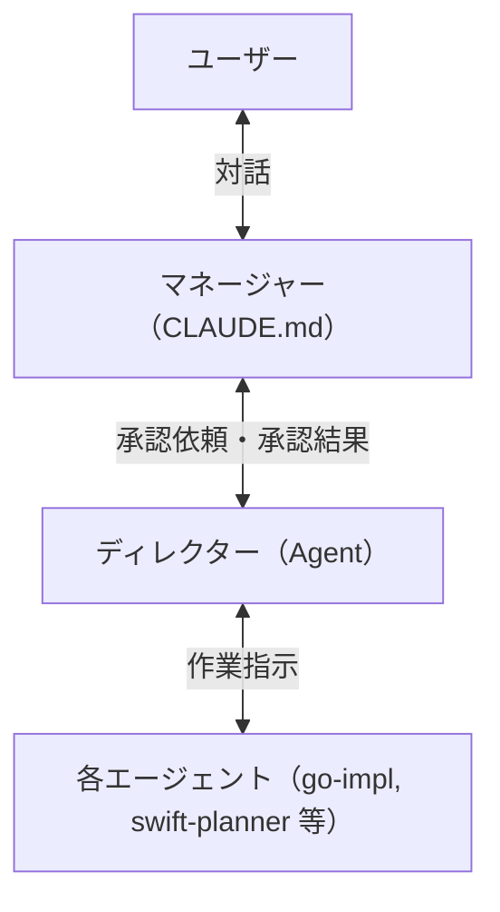
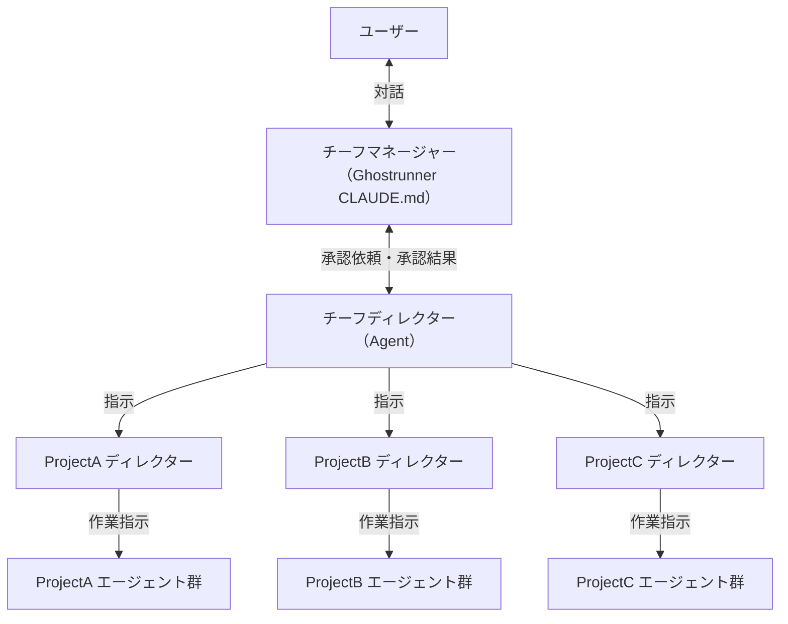
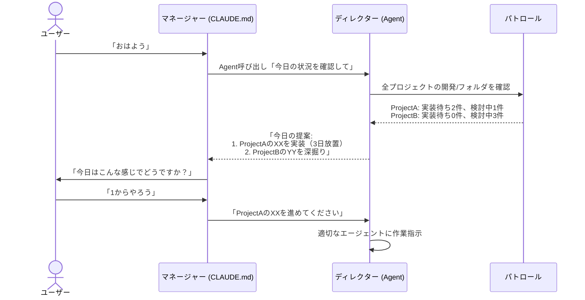
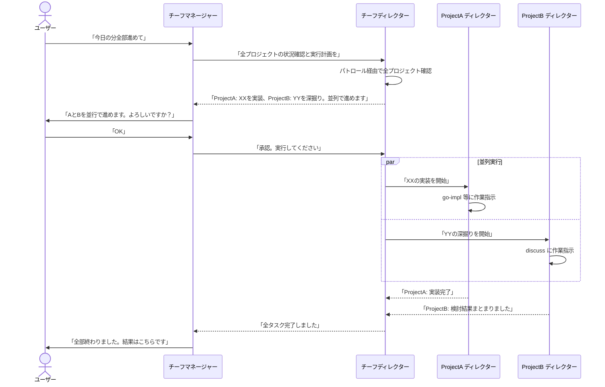
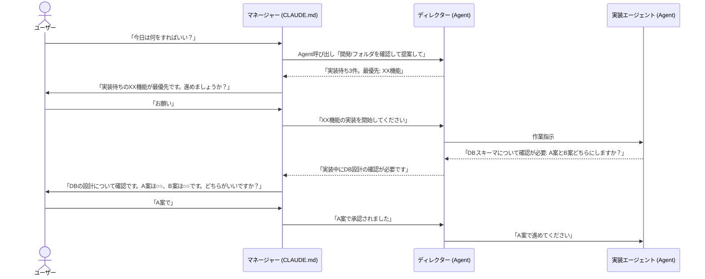

# 検討結果: マネージャーとディレクター

## 検討経緯

| 日付 | 内容 |
|------|------|
| 2026-04-03 | 初回相談: Ghostrunner固有の2つの新エージェント（対話特化・タスクマネージャー）追加の要望 |
| 2026-04-03 | 深掘り1: 対話エージェントの役割が明確化 - ルーター/オーケストレーターとして能動的にエージェントやスキルへ橋渡しする存在 |
| 2026-04-03 | 深掘り2: コンシェルジュ型で確定。CLAUDE.mdに人格を書くだけでは不十分。秘書は「中間層」であり、タスクマネージャーへの問い合わせ・他エージェントの取り次ぎを能動的に行う必要がある |
| 2026-04-03 | 深掘り3: Claude Codeの制約を分析。サブエージェントはユーザーと直接対話できないため、秘書はCLAUDE.md組み込みが唯一の正解と結論 |
| 2026-04-03 | 深掘り4: 命名を「マネージャー」「ディレクター」に変更。指揮系統・承認フロー・適用範囲・横断版の仕様を確定 |

## 背景・目的

Claude Codeでの開発体験を統一するために、2つの役割を導入する。

- **マネージャー**: ユーザーの唯一の対話相手として、意図の解釈・質問の翻訳・承認フローを担う
- **ディレクター**: プロジェクトの状況把握・判断・作業の振り分けを担う

これにより、ユーザーは「何をすればいいか」を自分で判断する必要がなくなり、ディレクターの提案をマネージャー経由で承認するだけで開発が進む。

## 対象ユーザー

- Ghostrunnerフレームワークの利用者（個人開発者）
- `/init` で生成したプロジェクトの開発者

## 命名

| レベル | 名前 | 英語 | 所在 | 役割 |
|--------|------|------|------|------|
| Ghostrunner | チーフマネージャー | Chief Manager | CLAUDE.md | ユーザーの唯一の対話相手。全プロジェクトを横断 |
| Ghostrunner | チーフディレクター | Chief Director | Agent (.md) | 全プロジェクトの状況把握・目標立て・一括指示 |
| 各プロジェクト | マネージャー | Manager | CLAUDE.md | そのプロジェクト内でのユーザー対話相手 |
| 各プロジェクト | ディレクター | Director | Agent (.md) | そのプロジェクトの状況把握・判断・仕事の振り分け |

## 各役割の詳細

### チーフマネージャー（Ghostrunner CLAUDE.md）

**ユーザーとの対話窓口（横断版）**

- ユーザーの意図を解釈する（「今日全部進めて」→ 一括実行の指示）
- チーフディレクターに指示を出す
- チーフディレクターからの承認要求をユーザーに伝える
- 結果をユーザーに報告する

プロジェクト単体のマネージャーとの違い: スコープが全プロジェクト。それ以外の振る舞いは同じ。

### チーフディレクター（Ghostrunner Agent）

**全プロジェクトの統括責任者。横断版だけが持つ固有の役割。**

- パトロール経由で全プロジェクトの状況を集約する
- **その日の目標を立てる**（優先順位付き）
- どのプロジェクトの何を進めるか判断する
- 各プロジェクトのディレクターに指示を出す（並列可）
- 各ディレクターからの結果・質問を集約してチーフマネージャーに返す

プロジェクト単体のディレクターとの違い: 全プロジェクトを横断して見る + 目標立て + 各ディレクターへの指示。

### マネージャー（各プロジェクト CLAUDE.md）

**そのプロジェクト内でのユーザーの対話相手。**

- ユーザーの意図を解釈し、ディレクターに伝える
- ディレクターからの提案・質問をユーザーに噛み砕いて伝える
- 承認フローの仲介

一括管理時は出番なし（チーフディレクターが直接ディレクターとやり取り）。プロジェクトを単体で開いた時に活躍する。

### ディレクター（各プロジェクト Agent）

**そのプロジェクトの現場責任者。**

- `開発/` フォルダ、git log/status から状況を把握する
- 次にやるべきことを判断して提案する
- 承認後、各エージェントに作業指示を出す

## 指揮系統

### プロジェクト内（単体で開いた場合）

### Ghostrunner横断（複数プロジェクト一括管理）

### ルール

- ユーザーはマネージャー（チーフマネージャー）とだけ話す
- マネージャーはユーザーとディレクターの橋渡し。エージェントに直接指示しない
- ディレクターが各エージェントに仕事を振る
- **承認型**: ディレクターが提案 → マネージャーがユーザーに確認 → 承認後にディレクターが実行
- **一括管理時**: チーフディレクターが各プロジェクトのディレクターに並列で指示を出す

## マネージャーの仕様

### 実現方法

**CLAUDE.md に人格・判断ロジック・取り次ぎプロトコルを組み込む。**

エージェントファイル(.md)ではユーザーと直接対話できない（Claude Codeの制約: サブプロセスはユーザーと対話不可）ため、メインプロセスであるCLAUDE.mdに組み込むのが唯一の実現手段。

### 役割

1. **ユーザーの意図を解釈する** - 曖昧な入力を具体的なアクションに変換
2. **他のエージェントからの質問を噛み砕いてユーザーに伝える** - 文脈補足、専門用語の翻訳
3. **ディレクターからの提案をユーザーに伝え、承認を得る**
4. **承認結果をディレクターに伝える**

### CLAUDE.mdに組み込む内容

単なる「人格を書くだけ」ではない。以下の全てを組み込む:

1. **マネージャーの人格・振る舞いルール** - 対話スタイル、判断基準
2. **Agent呼び出しプロトコル** - 「いつ」「どのエージェントを」「どういう指示で」呼ぶかの判断ロジック
3. **ディレクター連携手順** - 状況確認・提案取得・承認伝達の具体的な手順
4. **取り次ぎプロトコル** - エージェントからの質問をユーザーに伝え、回答を返す手順

### 自発的な通知について

Claude Codeの制約で、マネージャーが自発的にユーザーに話しかけることはできない。この機能はdevtoolsが担う（定期巡回 → UI通知）。

### 適用範囲

Ghostrunnerだけでなく、`/init` で生成したプロジェクトにも入れる。どこで開いても同じ体験を提供する。

## ディレクターの仕様

### 実現方法

**エージェントファイル（.md）。マネージャーが Agent ツールで呼び出す。**

### 役割

1. **プロジェクトの状況把握** - `開発/` フォルダ構造、git log/status、ファイル内容を読み取る
2. **計画・予定・優先順位の管理** - 既存の `開発/` フォルダ構造をそのまま使う（新規ファイル不要）
3. **「次にやるべきこと」を判断して提案**
4. **承認後、各エージェントに作業指示を出す**

### 計画・予定の管理場所

既存の `開発/` フォルダ構造をそのまま使う。フォルダ構造 = カンバンボード。

- 別の管理ファイルを作らない（2箇所の同期が不要でシンプル、壊れにくい）

### 2つのスコープ

| スコープ | 対象 | 何を見るか |
|---------|------|-----------|
| プロジェクト内版 | 個別プロジェクト | そのプロジェクトの `開発/` フォルダ |
| Ghostrunner横断版 | 全プロジェクト | パトロール機能経由で全プロジェクトの `開発/` フォルダを集約 |

### 適用範囲

各プロジェクトにも入れる（`/init` でコピーされる）。

## Ghostrunner横断版ディレクターの追加機能

パトロール機能を改変して各プロジェクトの `開発/` フォルダを読み、状況を集約する。

### その日の目標立て

全プロジェクトの状況から、今日やるべきことを優先順位付きで提案する。

### 朝のフロー例

## 典型的な動作フロー（一括管理）

## 典型的な動作フロー（プロジェクト内）

## 設計判断まとめ

| 判断 | 選択 | 理由 |
|------|------|------|
| マネージャーの実現方法 | CLAUDE.md に組み込み | エージェントファイルだとユーザーと直接対話不可 |
| ディレクターの実現方法 | エージェントファイル(.md) | マネージャーが Agent ツールで呼び出す |
| 計画・予定の管理場所 | 既存の `開発/` フォルダ構造 | 2箇所の同期不要、シンプルで壊れにくい |
| 横断情報の取得 | パトロール機能を改変 | プロジェクト一覧の管理が既にある |
| 承認フロー | 承認型 | ディレクター提案 → マネージャー経由でユーザー承認 → 実行 |
| 適用範囲 | 両方とも全プロジェクトに入れる | どこで開いても同じ体験 |
| 横断時の命名 | チーフマネージャー / チーフディレクター | Ghostrunner版と各プロジェクト版を区別 |
| 一括管理 | チーフディレクターが各ディレクターに並列指示 | Agent ツールの並列起動で実現 |

## Claude Codeの構造的制約（設計の前提）

- ユーザーと直接対話できるのはメインプロセスだけ
- サブエージェント（.mdファイル）はメインプロセスに結果を返すだけ
- サブエージェント同士の直接通信は不可能
- サブエージェントからユーザーに話しかけることは不可能

この制約により、マネージャーはCLAUDE.md組み込み以外の選択肢がない。

## MVP提案

**まずディレクター（プロジェクト内版）から作る。**

### MVP範囲

- `開発/` フォルダを読んで状況を報告する
- 次にやるべきことを提案する
- 承認後、適切なエージェントに指示を出す

### 次のフェーズ

- マネージャー（CLAUDE.md改変） - 影響範囲が大きいため後回し
- Ghostrunner横断版ディレクター - パトロール機能の改変が必要
- devtools連携（自発的な通知） - 将来の拡張

## 次のステップ

1. ディレクターエージェント（director.md）の実装計画を `/plan` で作成
2. マネージャーのCLAUDE.md組み込みの実装計画を `/plan` で作成
3. パトロール機能の改変計画
