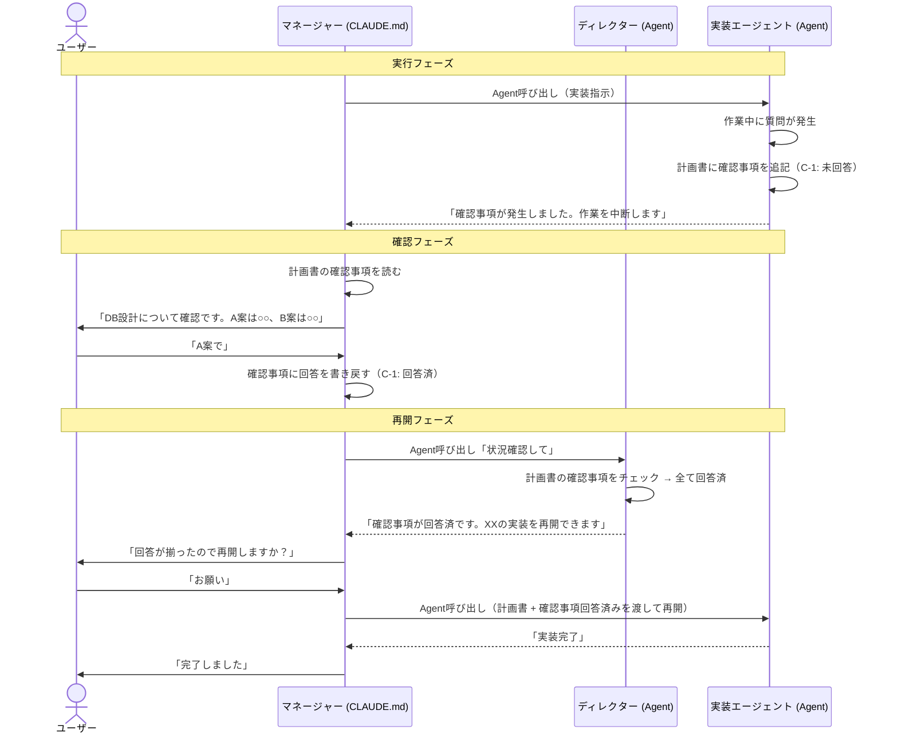
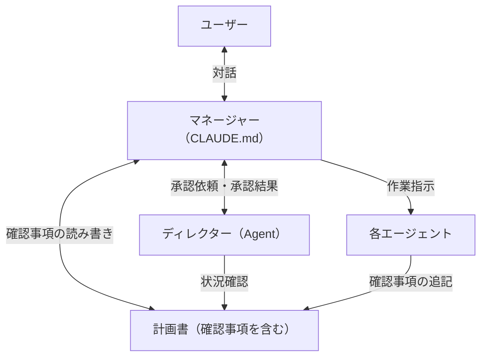
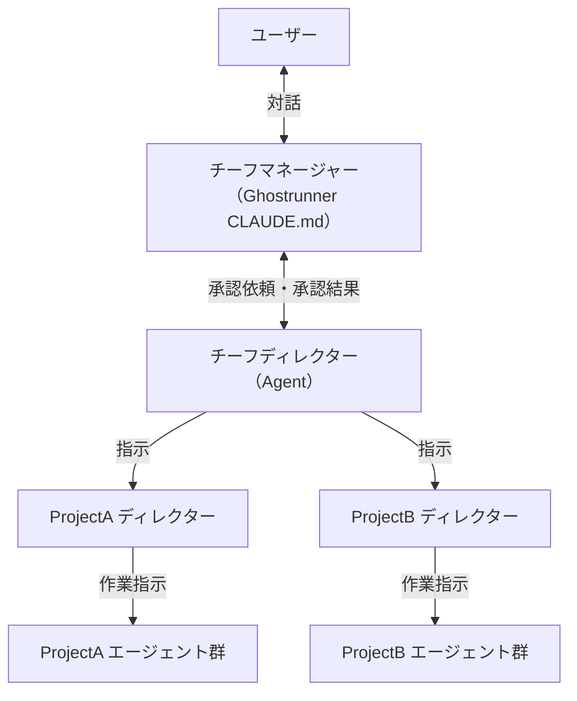

# マネージャーと確認事項

## 背景・目的

Claude Codeでの開発体験を統一するために、以下を導入する。

- **マネージャー**: ユーザーの唯一の対話相手。意図の解釈・確認事項の翻訳・承認フローを担う
- **確認事項**: エージェントからの質問をファイルベースで管理する非同期メカニズム

将来的に以下も追加する:
- **ディレクター**: プロジェクトの現場責任者。状況把握・判断・作業の振り分けを担う（未実装）

ユーザーは「何をすべきか」を自分で判断する必要がなくなり、マネージャーとの対話だけで開発が進む。

## 対象ユーザー

- Ghostrunnerフレームワークの利用者（個人開発者）
- `/init` で生成したプロジェクトの開発者

## 命名

| レベル | 名前 | 英語 | 所在 | 役割 |
|--------|------|------|------|------|
| Ghostrunner | チーフマネージャー | Chief Manager | CLAUDE.md | ユーザーの唯一の対話相手。全プロジェクトを横断 |
| Ghostrunner | チーフディレクター | Chief Director | Agent (.md) | 全プロジェクトの状況把握・目標立て・一括指示 |
| 各プロジェクト | マネージャー | Manager | CLAUDE.md | そのプロジェクト内でのユーザー対話相手 |
| 各プロジェクト | ディレクター | Director | Agent (.md) | そのプロジェクトの状況把握・判断・仕事の振り分け |

## 各役割の詳細

### マネージャー（各プロジェクト CLAUDE.md）

**ユーザーの唯一の対話相手。**

- ユーザーの意図を解釈し、ディレクターに伝える
- ディレクターからの提案をユーザーに噛み砕いて伝える
- **確認事項を読んで、ユーザーに噛み砕いて伝える**
- **ユーザーの回答を確認事項に書き戻す**
- 承認フローの仲介
- ユーザーが直接スキルを呼んだ場合は介入しない

一括管理時は出番なし（チーフディレクターが直接ディレクターとやり取り）。プロジェクトを単体で開いた時に活躍する。

### ディレクター（各プロジェクト Agent）

**プロジェクトの現場責任者。**

- `開発/` フォルダ、git log/status から状況を把握する
- 計画書の確認事項をチェックし、未回答があれば報告する
- 回答済みの確認事項があればタスクの再開を提案する
- 次にやるべきことを判断して提案する
- 自分ではコードを書かない、ファイルを作らない
- ユーザーと直接対話しない（マネージャーが取り次ぐ）

### チーフマネージャー（Ghostrunner CLAUDE.md）

マネージャーのGhostrunner横断版。スコープが全プロジェクト。それ以外はマネージャーと同じ。

### チーフディレクター（Ghostrunner Agent）

**全プロジェクトの統括責任者。横断版だけが持つ固有の役割。**

- パトロール経由で全プロジェクトの状況を集約する
- **その日の目標を立てる**（優先順位付き）
- どのプロジェクトの何を進めるか判断する
- 各プロジェクトのディレクターに指示を出す（並列可）
- 各ディレクターからの結果・確認事項を集約してチーフマネージャーに返す

## 確認事項（非同期質問メカニズム）

### なぜ必要か

Claude Codeの構造的制約:
- サブエージェントは呼び出し終了時にコンテキストを失う
- Agent入れ子が深くなると質問の取り次ぎが複雑になる
- AIの記憶に頼ると、会話が長くなった時に情報が失われる

**解決策**: エージェントはユーザーに直接質問せず、計画書に確認事項を追記して中断する。マネージャーが確認事項を読んでユーザーに伝え、回答を書き戻す。エージェントが忘れても、ファイルが覚えている。

### フェーズ別の運用

| フェーズ | 確認事項の扱い | 理由 |
|----------|---------------|------|
| /discuss | 使わない。対話ベースで検討ファイルに直接記録 | 対話そのものが成果物 |
| /plan | 計画書に「確認事項」セクションとして追記 | 仕様書がベースとして残っている |
| /coding | 計画書に「確認事項」セクションとして追記 | 計画書がベースとして残っている |

### フォーマット

計画書（`_plan.md`）の中に追記する:

```markdown
## 確認事項

### C-1: DBスキーマの方式（go-impl, 2026-04-05）
**質問**: A案（正規化）とB案（非正規化）のどちらにするか
**ステータス**: 回答済
**回答**: A案で進める。パフォーマンスが問題になったら後で検討する

### C-2: エラー時のリトライ（go-reviewer, 2026-04-05）
**質問**: 外部API呼び出し失敗時にリトライするか
**ステータス**: 未回答
**回答**: -
```

### 動作フロー



## 指揮系統

### プロジェクト内



### Ghostrunner横断



### ルール

- ユーザーはマネージャーとだけ話す
- マネージャーがディレクターを呼び、提案を受け取り、ユーザーに伝える
- 承認後、マネージャーがエージェントを呼んで実行する
- エージェントはユーザーに直接質問せず、計画書に確認事項を追記して中断する
- 一括管理時はチーフディレクターが各ディレクターに並列で指示を出す

## 設計判断

| 判断 | 選択 | 理由 |
|------|------|------|
| マネージャーの実現方法 | CLAUDE.md に組み込み | サブエージェントはユーザーと直接対話不可 |
| ディレクターの実現方法 | エージェントファイル(.md) | マネージャーが Agent ツールで呼び出す |
| エージェントの質問方法 | 確認事項（ファイルベース非同期） | コンテキスト消失問題を解決 |
| 確認事項の置き場所 | 計画書に追記 | 1ファイルで全部わかる |
| /discuss の確認事項 | 使わない | 対話そのものが成果物 |
| 承認後の実行主体 | マネージャーがエージェントを直接呼ぶ | Agent入れ子を浅く保つ |
| 計画・予定の管理場所 | 既存の `開発/` フォルダ構造 | 同期不要、シンプル |
| 横断情報の取得 | パトロール機能を改変 | プロジェクト一覧の管理が既にある |
| 適用範囲 | 全プロジェクトに入れる | どこで開いても同じ体験 |

## Claude Codeの構造的制約

- ユーザーと直接対話できるのはメインプロセス（CLAUDE.md）だけ
- サブエージェントは呼び出し終了時にコンテキストを失う
- サブエージェント同士の直接通信は不可能

## MVP

**マネージャー + ディレクター + 確認事項をセットで実装する。**

1. **director.md**: 状況確認、確認事項チェック、次のアクション提案
2. **CLAUDE.md マネージャーセクション**: ディレクター連携、確認事項の読み書き
3. **確認事項フォーマット**: 計画書に追記する形式
4. **/init 更新**: 生成プロジェクトにもマネージャーセクションを含める

### 次のフェーズ

- チーフマネージャー / チーフディレクター（Ghostrunner横断版）
- パトロール機能の改変
- devtools連携（自発的な通知）
- その日の目標立て
