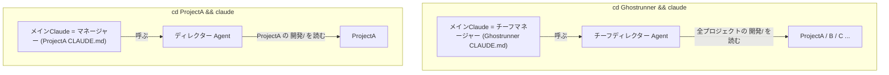
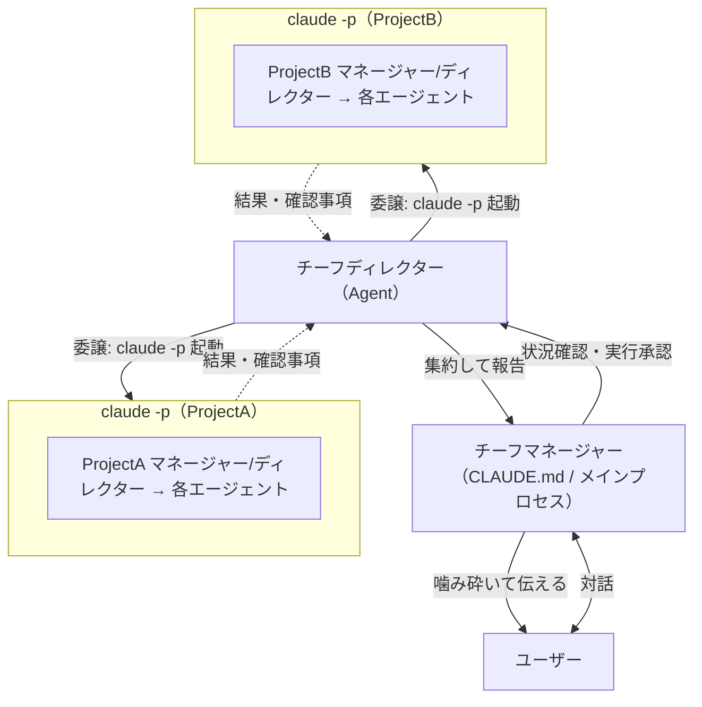
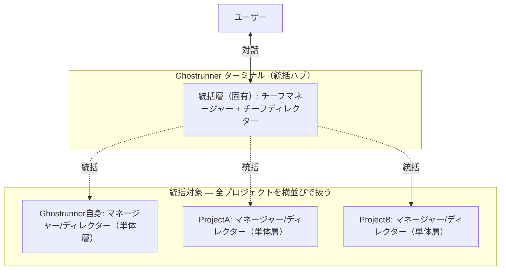
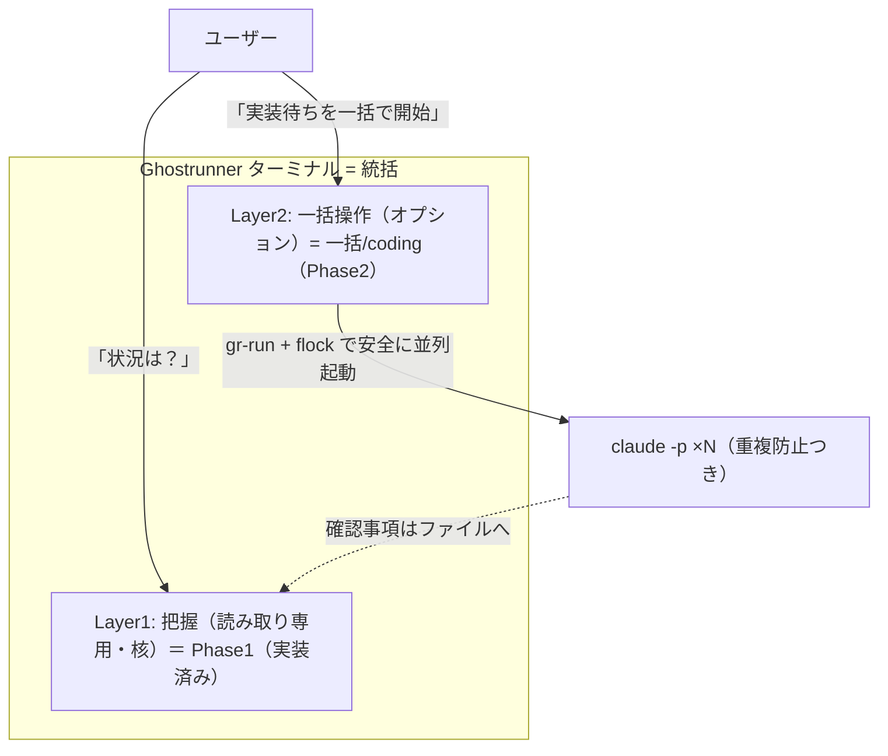
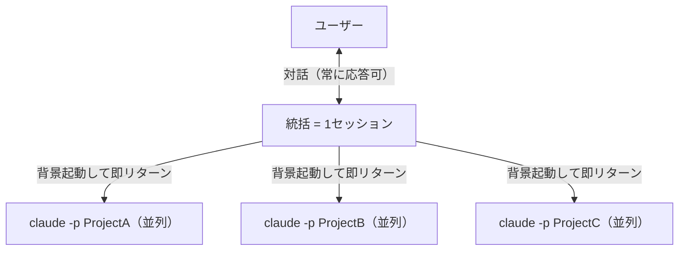
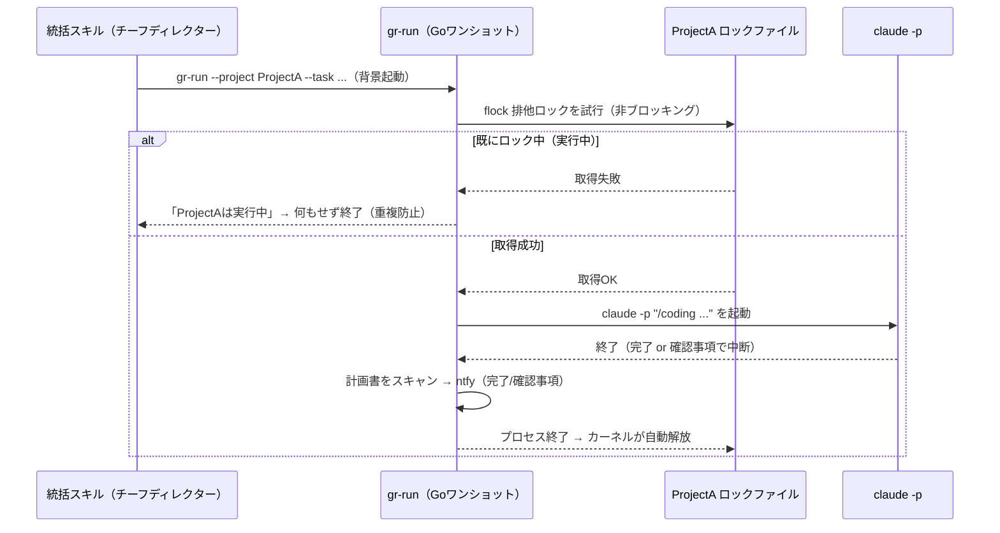
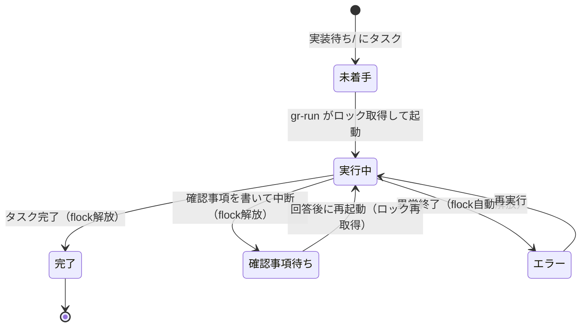
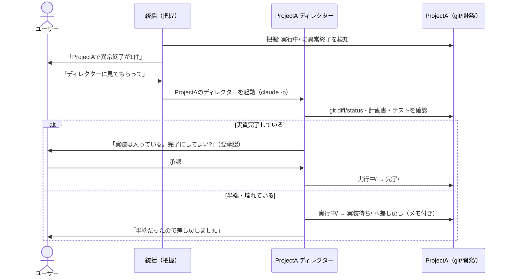
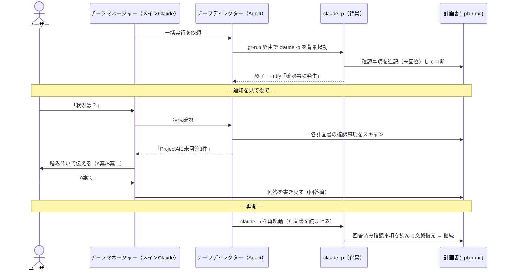
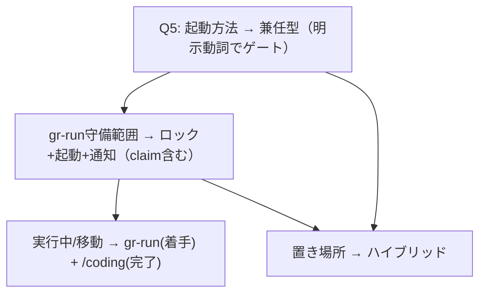

# 検討結果: 複数プロジェクト統括ターミナル

作成日: 2026-05-24
ステータス: 設計収束（把握＝Phase1実装完了 / 一括操作＝一括codingのみ・中間案flock採用 / Phase2の主要論点も決着、/plan へ進める状態）

## 検討経緯

| 日付 | 内容 |
|------|------|
| 2026-05-24 | ブラウザ操作に加えてターミナル操作も可能にしたい、という相談から開始 |
| 2026-05-24 | 当初仮説「対話モード＋既存スキルで足りる、作る必要はない」を検証 |
| 2026-05-24 | 単体プロジェクトはその通りと確認。一方で「複数プロジェクトを統括するターミナル」が真の要望と判明 |
| 2026-05-24 | これは既存の「チーフマネージャー/チーフディレクター構想」のターミナル版と一致すると整理 |
| 2026-05-24 | MVP（読み取り専用チーフディレクター）を確定。並列実行の方式は未決として論点化 |
| 2026-05-24 | 役割を2軸モデル（対話/実務 × 横断/単体）で整理。役割関係は委譲型を採用、案Cを除外 |
| 2026-05-24 | 統括の呼び出し元をGhostrunnerターミナルに確定。Ghostrunner＝統括層＋単体層の二層構造とし、自身の開発もディレクターで他プロジェクトと同じ扱いに |
| 2026-05-24 | 確認事項のライフサイクル（中断→把握→回答書き戻し→計画書を読ませて再起動）を整理。再開は --resume でなくファイルから文脈復元 |
| 2026-05-24 | 単一指揮官・並列ワーカー（フォアマン）モデルを確認。統括は1セッション、並列なのはワーカー。統括自体の並列は不要 |
| 2026-05-24 | 重複実行防止を議論し中間案（flockのGoワンショットヘルパー gr-run）を採用。Q1は案A/Bから中間案へ |
| 2026-05-24 | ロックと状態を分離（ロック=flock個別、状態=ファイルから導出）。起動判断は2層（スキルで判断＋flockで安全弁） |
| 2026-05-24 | 統括を把握(Layer1=MVP)＋一括操作(Layer2)の二層に整理。Layer2は一括/codingのみ、一括/planは入れない（決定）。原則「決まっていることは一括、決めることは個別対話」 |
| 2026-05-24 | 別ウィンドウ（同一セッション）の検討で「実行中/フォルダ」案が出る。flockの補完として状態を永続可視化、異常終了を検知。本ドキュメントに合流 |
| 2026-05-24 | 起動判断のゲートを「実行中/ が空か」に確定。1プロジェクト＝同時1タスク、mvがclaimを兼ねる、異常終了は人間が解消する導線が必要、と整理 |
| 2026-05-24 | ワーカーの終わり方を分類。確認事項を残して止まるのは正常（確認事項待ち）、異常終了は「成果も理由も残さず実行中/に取り残された状態」。gr-runが終了コードで分類、レアな「要確認」も定義 |
| 2026-05-24 | 異常終了の解消はディレクターに委ねる方針に。git/計画書/テストを調べ、差し戻し（安全・自動可）か完了（要承認）かを判断。ディレクターの既存役割の一適用 |
| 2026-05-24 | ディレクター調査は人間が指示したときだけ起動と確定。把握は検知・報告まで、解消は人間トリガー。MVP（把握）は異常終了の報告のみで解消機能は不要 |
| 2026-05-24 | Phase1（Layer1=把握＝chief-director Agent）を実装完了。chief-directorは patrol_projects.json を読み、各プロジェクトの 検討中/実装待ち/実行中/完了/ と未回答確認事項を集約報告する（読み取り専用） |
| 2026-05-24 | Phase2(Layer2=一括/coding)の残4論点を詰めて決着。Q5=兼任型（明示動詞でゲート）、gr-run守備範囲=ロック+起動+通知（claim含む）、実行中/移動の担当=gr-run（着手claim）と/coding（完了移動）の分担、置き場所=ハイブリッド（実行中/と確認事項は各プロジェクト＝真実、ロックは中央 ~/.ghostrunner/）。Phase2 MVPスコープも確定 |

## 背景・目的

現在ブラウザ（claude.ai/code、ローカル接続）から操作しているが、ターミナルからも操作したい。
メインで動くのは Claude Code の対話モードなので、それを使う前提。

当初の仮説は「対話モードが discuss / plan / coding 等のコマンドを理解していれば、
特に作るものは無いのではないか」。実際に試したところ理解しているようだった。

## 調査で分かったこと（現状）

### 単体プロジェクトなら、当初仮説は正しい（作るもの無し）

- ターミナルの対話モードは、ブラウザ越しに動いているのと**同じ Claude Code エンジン**。
- 同じ `.claude/skills/`（13スキル: discuss / plan / coding / stage / release 等）と
  `.claude/settings.json`（品質チェックのフック）を読む。
- したがって `cd プロジェクト && claude` で起動すれば、スラッシュコマンドもフックも
  そのまま効く。配布も「Ghostrunnerを開いて `/init`」方式（Plugin方式は不安定で不採用）。
- 結論: **1プロジェクトを対話で進める用途は、ターミナルで既に成立しており、作るものは無い。**

### ブラウザ版（devtools 巡回ダッシュボード）だけが持つもの

巡回ダッシュボード = 「複数プロジェクトを登録 → 各 `実装待ち/` のタスクを検出 →
`claude -p "/coding ..."` を並列実行 → 進捗を SSE 表示＋ntfy通知、質問は `--resume` で回答」。

ターミナルの対話モードに無いのは次の3つ:

1. 複数プロジェクトの並列・自動実行
2. 完了・質問待ちの通知（ntfy）
3. 全プロジェクトの状況集約（統括の目）

## 要望の再定義

ユーザーが本当に欲しいのは「**複数プロジェクトを統括できるターミナル**」＋並列実行＋通知。
これは既存の[マネージャー構想](../資料/2026-04-05_マネージャー構想_全体図.md)の
**チーフマネージャー / チーフディレクター（横断版）のターミナル実装**に一致する。

### マネージャー構想との対応

| 欲しいもの | 構想での役割 | 実現手段 |
|---|---|---|
| 統括する対話相手 | チーフマネージャー | ターミナルのメインClaude = CLAUDE.md（構想通り「マネージャー＝メインプロセス」） |
| 複数プロジェクトの状況把握 | チーフディレクター | 全プロジェクトの `開発/` を読む Agent |
| 並列実行 | 一括管理 | パトロールの `claude -p` 並列（既存ロジック） |
| 通知 | devtools が担当 | ntfy（既存）or Claude Code のフック |

### ターミナル版の利点（構想の難問が消える）

マネージャー構想の全体図には未解決の問いが残っていた:

- Q1: スマホアプリから claude.ai/code のセッションにどう接続するか
- Q4: そもそも自作アプリか devtools 拡張か
- 「難しい」: Claude Code チャット体験をアプリに埋め込む

**ターミナルで実現するなら、これらは消える。** ターミナルそのものがチャットなので、
アプリ埋め込みもセッション接続も不要。ターミナル版は構想への最短ルートになりうる。

## 役割の整理（2軸モデルと指揮系統）

### 役割は「2つの軸」で決まる

4つの役割は、2軸の掛け合わせで整理できる。

| スコープ ＼ 担当 | 対話・翻訳・承認（CLAUDE.md＝メインプロセス） | 状況把握・判断・振り分け（Agent） |
|---|---|---|
| 横断（全プロジェクト） | チーフマネージャー | チーフディレクター |
| 単体（1プロジェクト） | マネージャー | ディレクター |

- 横軸＝担当: マネージャー系は「人間と話す係」、ディレクター系は「現場を見て判断する係」
- 縦軸＝スコープ: 「チーフ」が付くと全プロジェクト横断、付かないと1プロジェクト

### なぜマネージャー＝CLAUDE.md、ディレクター＝Agentなのか

Claude Codeの制約から必然的にこうなる。

- マネージャー系 = CLAUDE.md（メインプロセス）: ユーザーと直接対話できるのはメインプロセスだけ。
- ディレクター系 = Agent: 状況調査でメインの文脈を汚さないため。マネージャーがAgentツールで呼び出す。

### ターミナルの起動場所が役割を決める（ターミナル版の肝）



同じ仕組みで、置き場所（Ghostrunner か 各プロジェクト か）だけが違う。両方に同じ役割を仕込めば、
どこで開いても一貫した体験になる。

### 役割の関係: 委譲型（決定）

横断時の「チーフディレクター」と各プロジェクトの「ディレクター」の関係は **委譲型** を採用する
（実際の指揮系統に即していて直感的）。

ただし委譲には実現方法が2つあり、片方は構想の制約に当たる。

| 委譲の実現方法 | 動くか | 説明 |
|---|---|---|
| Agent入れ子（チーフDir Agent → Dir Agent） | 不可 | サブエージェントはサブエージェントを呼べない |
| プロセス委譲（チーフ層が `claude -p` で各プロジェクトを起動、その中身が各プロジェクトのマネージャー/ディレクター） | 可 | Agentの入れ子でなくOSプロセスの親子。委譲が自然に成立 |

→ **委譲型を本気でやるなら、実行は `claude -p` のプロセス委譲（＝案Aの方向）が自然**。
役割の整理が、並列実行の論点（後述）に方向性を与えた。最終決定はMVP後でよい。

### 委譲型の指揮系統（実行フェーズ）



横断レイヤー（チーフ）＝親プロセス、各プロジェクト＝子プロセス。委譲がプロセスの親子で表現されるため、
構想の入れ子制約を踏まない。

### MVPでの委譲は「軽い」

MVPは状況把握だけなので重い委譲（仕事を渡す）は起きない。「チーフディレクターが各プロジェクトの
`開発/` を見て状況を集約」までで完結する。本格的な委譲（`claude -p` で仕事を渡す）は実行フェーズで効く。
よってMVPはシンプルなまま、委譲型を将来の姿として据えられる。

### 統括の呼び出し元とGhostrunnerの二層構造（決定）

統括（チーフマネージャー/チーフディレクター）は **Ghostrunnerターミナルからのみ** 呼び出す。
各プロジェクトのターミナルでは、そのプロジェクト専用のマネージャー/ディレクターが動く（統括ではない）。

ポイントは、**Ghostrunnerだけが2つの層を併せ持つ**こと。

- 統括層（Ghostrunner固有）: チーフマネージャー + チーフディレクター。全プロジェクトを横断して見る。
- 単体層（全プロジェクト共通）: マネージャー + ディレクター。Ghostrunner自身の開発も、他のプロジェクトと
  同じくこの単体層（ディレクター）で扱う。

他のプロジェクトは単体層のみを持つ（`/init` でコピー）。Ghostrunnerだけが統括層を追加で持つ。



統一性の利点: チーフディレクターから見ると、Ghostrunner自身も「単体層を持つ1プロジェクト」として
他と横並びに扱える（特別扱い不要）。よって統括対象にGhostrunner自身を含めてよく、現状
`patrol_projects.json` にGhostrunnerが入っているのと整合する。

統括の起動方法は「兼任型（明示動詞でゲート）」に決着（下の「決着済みの論点」参照）。

## 統括の最終整理：把握（Layer1）＋ 一括操作（Layer2）

統括の役割を「指示」ではなく「**把握**」と定義し直した。これにより統括は2層になる。

| | Layer 1：把握（核） | Layer 2：一括操作（オプション） |
|---|---|---|
| 役割 | 全プロジェクトの状況を集約・報告 | 実装の一括開始を複数プロジェクトにディスパッチ |
| モード | 日常・常時（読み取り専用） | 明示的・たまに呼ぶ特別操作 |
| 正体 | ＝ Phase1（読み取り専用チーフディレクター、実装済み） | gr-run + flock（中間案）を使う |

「統括は指示役ではない」の精神は保たれる。日常は把握、一括操作は明示的に呼ぶときだけ dispatch する。

### 設計原則：決まっていることは一括、決めることは個別対話

| | 一括（Layer 2） | 個別・対話 |
|---|---|---|
| 対象 | 実装待ちのタスク（もう決まっている） | plan / discuss（これから決める） |
| 理由 | 確定済みなので自動で回せる。例外は確認事項で対応 | 何度も往復が要る。バッチに向かない |
| 手段 | 一括/coding（gr-run + flock） | 各プロジェクトを個別に開いて対話 |

この線引きにより **Layer 2 は「一括/coding のみ」**と確定。**一括/plan は入れない**（決定）。
理由: plan はこの検討そのもののように対話で往復するもので、バッチ化すると「確認事項だらけの
下書き plan」が量産され質が低い。plan/discuss は個別対話に寄せる。



### ターゲット選択：把握の結果を使う（状態ベース）

一括/coding の対象は、把握(Layer1)で「実装待ちタスクがある」と分かったプロジェクト。
把握(Layer1)の結果がそのまま一括操作(Layer2)の対象選定に直結する（二層がここで噛み合う）。

## 実行エンジンの設計（Layer2 一括/coding）

### 単一指揮官・並列ワーカー（フォアマンモデル）

統括は1セッション（指揮官は1人）。並列なのは**ワーカー（`claude -p`）**の方。
指揮官は非ブロッキングで背景起動して手を離すので、「統括自体の並列」は不要・しない。



単一セッションゆえの注意点（自前対処）: 割り振りは必ず背景起動（会話を止めない）、
背景プロセスは `nohup`/`setsid` で切り離す。

### 重複実行の防止：flock（中間案・Goワンショットヘルパー gr-run）

同一プロジェクトで `claude -p` が二重起動すると、同じファイルを取り合い破壊的になる。これを防ぐ。

ロック方式は **flock** を採用。決め手は「異常終了時」:

| ロック方式 | atomic取得 | 異常終了時（stale） | macOS |
|---|---|---|---|
| flock（Goヘルパー） | ◎ | カーネルが自動解放（stale問題なし） | ◎ syscall.Flock |
| mkdir ロックdir | ◎ | 残る → 手動掃除/PID確認が必要 | ◎ |
| PIDファイル | 競合窓あり | 生存確認が必要 | ◎ |

`flock` だけが「プロセスが死んだ瞬間にカーネルが自動解放」するため stale lock 問題が無い。
macOS には `flock` コマンドが無いが Go の `syscall.Flock` は動くので、中間案＝小さなGoヘルパーと噛み合う。

`gr-run`（仮称）= ロック＋起動＋完了通知を行うワンショットCLI（常駐なし）。
`claude -p` 起動部分は patrol.go を流用し `cmd/gr-run` として一発実行にする（案Bのエンジンを daemon にせず借りる）。



### ロックと状態は別物

- **ロック** = flock（プロジェクト個別・「実行中か」の2値・並行制御）
- **状態** = ファイルから導出（状態ストアを持たない）

```
各プロジェクトについて:
  実行中/ にファイル ＆ flock 保持中               → 実行中
  実行中/ にファイル ＆ flock取れる ＆ 未回答確認事項あり → 確認事項待ち
  実行中/ にファイル ＆ flock取れる ＆ 未回答なし       → 異常終了（途中で止まった）
  実装待ち/ にタスク                             → 未着手
  完了/ にある                                   → 完了
```

状態DBを別に持たないので同期ズレが起きず、構想の「フォルダ＝カンバン／確認事項＝ファイル」と一致。
これは Phase1（読み取り専用チーフディレクター）がやることそのもの。



### 実行中/フォルダで状態を永続可視化（flockの補完）

状態判定をさらに堅くするため、`実装待ち/` `完了/` に加えて **`実行中/` フォルダ**を設ける。
タスク（計画書）の置き場所がそのまま状態を表す。

```
実装待ち/タスク.md
   ↓（実行開始 = ファイルを移動）
実行中/タスク.md  ＋ flock取得
   ↓（正常完了）
完了/タスク.md    ＋ flock解放
```

flock と フォルダは補完関係になる:

| | flock | 実行中/ フォルダ |
|---|---|---|
| 性質 | プロセスのランタイムガード（死ぬと消える） | 永続的に見える状態マーカー |
| 役割 | 二重起動を防ぐ（瞬間の排他） | 「今どこまで進んだか」を残す |

flock だけだとプロセスが死んだ瞬間に痕跡が消えるが、ファイルが `実行中/` にあれば「途中で止まった」と分かる。
2つを組み合わせて状態を正確に判定できる。

- **異常終了の検知**: 「`実行中/` にあるのに flock が取れる」＝ワーカーが死んでいる、と判定。統括は把握時に
  これを異常終了として報告する（自動リトライはせず人間が判断。自動で戻すのは怖い）。
- **確認事項待ちとの区別**: どちらも「実行中/ にあって flock が取れる」状態。計画書の未回答確認事項の
  有無で分ける（未回答あり＝確認事項待ち、無し＝異常終了）。
- **完了時**: `実行中/ → 完了/` へ移動。
- **フォルダ移動の担当（決着済み）**: `実装待ち/→実行中/` は gr-run（着手claim）、`実行中/→完了/` は
  /coding スキルが担う分担に決定（下の「決着済みの論点」参照）。

注: この案は別ウィンドウ（even-terminal で開いた同一セッション）での検討で出たもの。flockの弱点（プロセス死で
状態が消える）を `実行中/` フォルダが補い、「フォルダ＝カンバン」を完成させる。なお `実行中/` フォルダは
既にテンプレート（base / swift-macos）と chief-director に組み込まれており、Phase1 から読まれている。

### ワーカーの終わり方（確認事項待ち＝正常 / 異常終了＝要確認）

`claude -p` ワーカーの終わり方は次の通り。**確認事項を残して止まるのは正常な終わり方**であり、
異常終了ではない点に注意（実装中に「これどっち？」が出るのは想定内）。

| 終わり方 | 確認事項 | ファイル位置 | flock | 状態 | 正常? |
|---|---|---|---|---|---|
| タスク完了 | なし | `完了/` へ移動 | 解放 | 完了 | 正常 |
| 質問で中断（確認事項を書いて停止） | 未回答あり | `実行中/` | 解放 | 確認事項待ち | 正常（想定内） |
| クラッシュ/kill/timeout/APIエラー | なし | `実行中/` | 解放 | 異常終了 | 異常 |

区別は「確認事項を残したか否か」の一点:

```
実行中/ にある ＆ flock解放
   ├─ 未回答の確認事項あり → 確認事項待ち（正常な中断。人間が答える）
   └─ 確認事項なし         → 異常終了（理由不明の停止。人間が要確認）
```

**異常終了 ＝「完了/ にも行かず、確認事項も残さず、実行中/ に取り残された」状態**（原因はクラッシュ・kill・
タイムアウト・APIエラー等）。「成果も理由も残さず消えた」もの。

判定はgr-runの方が正確: gr-run は `claude -p` の**終了コード**を掴めるので、終了の瞬間に
（完了移動した? 確認事項を書いた? 終了コードは?）で分類できる。

- 完了/ へ移動 → 完了
- 確認事項あり → 確認事項待ち
- 終了コード異常 ＆ 何も残ってない → 異常終了
- 終了コード正常だが何も残ってない → 要確認（完了したのに移動失敗、等のレアケース）

最後の「要確認」があるため、厳密には **異常終了＝「想定外の終わり方。人間が中身を見て判断」** と捉える
（自動リトライも自動完了扱いもしない）。なお gr-run 自身が死んだ場合のみ、把握がファイルから推測する二段構え。

### 異常終了の解消：ディレクターに委ねる

異常終了を人間に丸投げするのではなく、そのプロジェクトの**ディレクターに調べさせて適切な処理を判断・提案**させる。
これはディレクターの本来の役割（状況把握・判断・提案）の一適用で、新しい仕組みは不要。

**重要: ディレクター調査は自動では走らない。人間が指示したときだけ。**
把握（Layer1・読み取り）は「異常終了が1件あります」と検知・報告するところまで。調査・解消（状態を変える処理）は
人間が「ディレクターに調べさせて」と指示して初めて起動する。「決めることは対話／状態を変える処理は人間トリガー」
の原則どおりで、勝手にプロジェクトをいじられる怖さがない（報告は出るので見落とさない）。
よって Phase1（把握）は異常終了を検知・報告するだけでよく、解消機能は不要（次フェーズ＋人間トリガー）。

ディレクターは実態を調べる: `git status`/`git diff`（実装が実際に入ったか）、計画書（何をやるはずだったか）、テスト。
その結果で処理を分ける:

| 調査結果 | 処理 | 承認 |
|---|---|---|
| 実質完了している（変更が入りテストも通る） | `実行中/ → 完了/` | 要承認（完了扱いはリスクあり） |
| 半端・壊れている | `実行中/ → 実装待ち/` に差し戻し（状況メモ付き） | 比較的安全（自動でも可） |
| 判断つかない | 人間にエスカレーション（具体的な推奨つき） | 人間 |



ポイント:

- **状態を変えるアクション**なので把握（Layer1・読み取り）ではなく Layer2 側の処理。把握で検知 → ディレクターが解消。
- **承認のグラデーション**: 差し戻し（実装待ちへ戻す）は安全なので自動でも可。完了扱いは要承認（クラッシュを「終わった」とするのは危険）。
- これにより「異常終了が静かに詰まる」問題が、ディレクターによる能動的な解消で閉じる。

### 起動判断は2層（ゲートは「実行中/ が空か」）

新規着手の可否は、まず `実行中/` フォルダで判断する。**`実行中/` にファイルがあれば、そのプロジェクトは
新規着手しない**（1プロジェクト＝同時1タスク。プロジェクト内は直列、プロジェクト間の並列はOK）。

`実行中/` にファイルがある状態は「実行中・確認事項待ち・異常終了」のいずれかで、すべて「まだ片付いていない」。
よって3つを区別せずとも、**「`実行中/` にファイルがあれば着手しない」だけで正しく止まる**（区別は把握・報告時に行う）。

- **層1（オーケストレーション・スキル）**: `実行中/` が空のプロジェクトの `実装待ち/` だけを着手対象にする
- **層2（安全弁・gr-run flock）**: 万一の競合・二重統括でも、flock が取れなければ起動しない

補足: 着手は「計画書を `実装待ち/ → 実行中/` へ移動」する行為そのもの。**この `mv` はアトミック**なので、
2つの統括が同時に同じタスクを着手しようとしても片方しか成功しない（移動が claim を兼ねる）。
flock は実行中の生存判定（実行中 vs 異常終了の区別）を担う。

注意: 異常終了でファイルが `実行中/` に残ると、そのプロジェクトは新規着手がブロックされ続ける（意図通り＝
勝手にリトライしない）。統括（把握）が「異常終了」として報告し、**ディレクターが調べて解消**する
（差し戻し／完了／エスカレーション。詳細は前節「異常終了の解消：ディレクターに委ねる」）。放置すると静かに詰まる。

### 確認事項のライフサイクル（統括中の質問処理）

統括の一括実行中、各エージェントはユーザーに直接質問しない。質問は確認事項としてファイルに溜め、後で処理する。



再開は `--resume`（セッション復帰）ではなく、**回答入りの計画書を読ませて新規 `claude -p` を起動**する。
質問したプロセスは既に終了しているが、計画書にすべて残っているので別プロセスが続きを拾える。
これが確認事項をファイルベースにする最大の理由（構想の「コンテキスト消失問題」の解決）。

## 既にあるもの / 新規に作るもの

| 区分 | 内容 |
|---|---|
| 既存（再利用可） | `patrol_projects.json`（プロジェクト一覧）、`patrol.go`（並列実行＋ntfy＋resume＋状態管理）、13スキル、フック、`実行中/`フォルダ（テンプレ済み）、chief-director Agent（Phase1実装済み） |
| 新規候補 | `gr-run`（GoワンショットCLI）、統括スキル（一括/coding）、CLAUDE.md チーフマネージャー節、確認事項フォーマットの確立 |

ポイント: 統括の中核ロジック（並列 `claude -p` ＋ntfy）は**既に devtools バックエンドに存在する**。
ゼロから作るのではなく、再利用の度合いをどうするかが設計判断になる。

## 核心の設計判断（決着済み）: 並列実行をどこで回すか

構想ドキュメントでも課題に挙がっていた「Agent入れ子の深さ、コンテキスト消失」が関わる分岐点。

| 案 | 統括ロジックの置き場所 | 長所 | 短所 |
|---|---|---|---|
| A. メインClaude + 統括スキル | スキル（メインClaudeが `claude -p` ループを実行） | サーバー不要・ターミナル完結・構想の「メイン＝マネージャー」に忠実 | パトロールの一部ロジックを再実装 |
| B. 既存backend + 薄いCLI | Goバックエンド（ヘッドレス常駐・ブラウザ不要） | 並列・ntfy・resume を全て再利用、重複ゼロ | バックエンド常駐が必要 |
| C. 全部Agent | チーフディレクター/ディレクター Agent | 完全統合・新規サーバー不要 | Agent入れ子・コンテキスト消失の制約に直面 |

補足: パトロールが `claude -p` サブプロセス並列（独立プロセス・独立コンテキスト）を採用しているのは、
真の並列・長時間実行に強いため。案A/Bはこの方式を踏襲、案Cは in-process Agent 方式で制約に当たりやすい。

**【決着】中間案（案Aと案Bの折衷）を採用。** 委譲型採用で案Cは除外。さらに重複実行の懸念から、
並列実行の中核（重複防止・起動・通知）を **Goワンショットヘルパー `gr-run`（flock使用・常駐なし）** に置き、
オーケストレーション（何を起動するか）はスキルが担う、という中間案に決着した。
詳細は上の「実行エンジンの設計」を参照。

## Phase1（確定・実装完了）: 読み取り専用チーフディレクター

いきなり並列実行を作らず、まず「統括の目」だけを最小コストで手に入れた（実装済み）。

### Phase1 範囲（実装済み）

- **chief-director Agent**（`.claude/agents/chief-director.md`）: 全登録プロジェクトの
  `開発/` フォルダ構造（検討中/実装待ち/実行中/完了）＋ git log/status を読み、状況を集約して報告する
  （実装待ち件数、検討中件数、確認事項の未回答数、実行中/異常終了の検知など）。
- プロジェクト一覧は既存の `patrol_projects.json` を流用（新規の一覧管理は作らない）。
- 実行は読み取りのみ。並列実行・書き込み・通知はこの段階では行わない。
- CLAUDE.md に「統括（把握）」節を追加済み（横断的状況確認は chief-director を呼ぶ／状態変更は明示指示のみ）。

### Phase1 の特徴

- ほぼ設定だけ（Agent定義 `.md` 1つ）で済み、新規コードはほぼ不要だった。
- ターミナルのメインClaude から「今日の状況は？」と聞けば、全プロジェクトを横断して報告が返る。
- 構想ドキュメントのMVP段階（ディレクター先行 → 横断パトロール改変）とも整合。

```
Phase1（Layer1=把握）:  chief-director Agent（全プロジェクトの開発/を読んで状況報告） ← 実装完了
Phase2（Layer2=一括操作）: 一括/coding（gr-run + flock）＋通知＋確認事項連携 ← 本ドキュメントで設計確定、次は /plan
```

## 決着済みの論点

### 並列実行・通知・常駐（Phase1検討時に決着）

- Q1: 並列実行 → **中間案（gr-run + flock、常駐なし）**
- Q2: 通知 → **gr-run が完了/確認事項を ntfy**（ワーカーの寿命を握る gr-run が担う）
- Q3: バックエンド常駐 → **不要**（中間案はワンショット、daemon にしない）
- Q4: 確認事項 → 実行設計の中核として組み込み済み（ファイルベース・再起動で復元）
- 一括/plan → **入れない**（plan は個別対話に寄せる）

### Phase2（Layer2=一括/coding）の4論点（2026-05-24 決着）

論点は依存関係を持つ（起動方法 → gr-runの守備範囲 → 実行中/移動の担当／置き場所）。
上流から順に決め、下流を絞り込んだ。



#### Q5: 統括の起動方法 → 兼任型（明示動詞でゲート）

検討した3案:

| 案 | 概要 | 長所 | 短所 |
|---|---|---|---|
| 兼任型 | Ghostrunnerターミナルのメインがそのまま統括も兼ねる | 新しい起動概念ゼロ。Layer1（把握）の現状と完全に同じ流儀で一貫 | 把握と一括の境界が曖昧になりうる |
| 明示起動型 | 一括操作だけ `/chief` 等の専用スキルで起動 | 「うっかり一括起動」を防ぐ明示ゲート | 起動概念が1つ増える。把握(兼任)と一括(明示)で流儀が割れる |
| 分離型 | 統括専用の別セッション/別プロセスを立てる | メイン文脈が汚れない | セッション管理が増え、委譲型(claude -p)と二重のプロセス階層になり複雑 |

**決定: 兼任型を採用。ただし「一括/coding して」のような明示動詞を必須ゲートにする。**

理由:
- Phase1（把握）は既に兼任型（メインClaude が chief-director を呼ぶ）で稼働しており、Phase2 だけ
  別流儀（明示起動・分離）にすると一貫性が崩れる。「Ghostrunner を開けば統括ハブ」の単純さを保つ。
- 分離型は委譲型（`claude -p` で各プロジェクトを別プロセス起動）と二重のプロセス階層になり、
  「単一指揮官・並列ワーカー（指揮官は1セッション）」という既定と相性が悪い。指揮官を分離する必然がない。
- 「うっかり一括起動」の懸念（明示起動型の利点）は、起動方法を分けずとも **明示的な動詞（「一括codingして」
  「実装待ちを一括で開始」）を必須トリガーにする**ことで満たせる。CLAUDE.md の既存原則
  「状態を変える操作はユーザーの明示指示があったときだけ」とそのまま一致する。把握は自動・読み取り、
  一括は明示動詞でのみ発火、と運用ルールで線引きする（新しい起動概念を増やさない）。
- 矛盾チェック: 委譲型・単一指揮官・「明示指示で状態変更」のいずれとも矛盾しない。

#### gr-run の守備範囲 → ロック + 起動 + 通知（claim も含む）

検討した3案:

| 案 | 守備範囲 | 長所 | 短所 |
|---|---|---|---|
| ロックのみ | flock の取得/解放だけ。起動・通知はスキル側 | gr-run が極小・単機能 | スキルが claude -p 起動とntfyを再実装。flock解放とプロセス寿命がズレ、stale窓が生じる |
| ロック + 起動 | flock + claude -p 起動。通知はスキル側 | プロセス寿命とflockが一致 | スキルが終了コードを掴めず、完了/確認事項/異常終了の分類とntfyができない |
| ロック + 起動 + 通知 | flock + claude -p 起動 + 終了コードで分類して ntfy（さらに着手の mv も担当） | 寿命・分類・通知が1プロセスに閉じる。patrol.go の起動+ntfy をそのまま流用 | gr-run がやや大きくなる |

**決定: 「ロック + 起動 + 通知」を採用。加えて着手 claim（実装待ち→実行中 の mv）も gr-run が担う。**

理由:
- flock は「プロセスが生きている間だけ」有効。ロックを取る主体と `claude -p` を起動する主体が同じでないと、
  ロック保持とプロセス寿命がズレて stale 窓が生じる。よって**ロックと起動は同一プロセス（gr-run）に閉じる**のが必然。
- ntfy 判定（完了/確認事項待ち/異常終了/要確認）は **`claude -p` の終了コードを掴める者にしかできない**。
  終了コードを握るのは gr-run だけ。よって通知も gr-run の責務に含めるのが自然（ドキュメントの Q2 決定と一致）。
- 起動 + ntfy のロジックは patrol.go（`startProjectExecution` → `ExecuteCommandStream` → ntfy）に既にあり、
  `cmd/gr-run` として daemon にせず一発実行に流用できる（既存資産の再利用）。
- 矛盾チェック: 「gr-run = ロック+起動+完了通知のワンショットCLI」というドキュメントの既定どおり。拡張ではなく明文化。

#### 実行中/ フォルダ移動の担当 → gr-run（実装待ち→実行中の着手）＋ /coding（実行中→完了の完了）

検討した3案と、現状の重要な前提:

**前提（現状調査で判明）**: 現状の `/coding` スキルは「仕様書を `実装待ち/` から `完了/` へ git mv」しており、
**`実行中/` を経由していない**（カンバンの中間列を `/coding` はまだ知らない）。よって Phase2 では
`/coding` を「`実行中/` → `完了/`」に直す必要がある。

| 案 | 着手（実装待ち→実行中） | 完了（実行中→完了） | 評価 |
|---|---|---|---|
| 全部 gr-run | gr-run | gr-run | gr-run が完了判定して移動。だが「完了したか」の確実な判断は実装の中身を知る claude 側にあり、gr-run は外形（終了コード）しか見えない。完了移動を gr-run に持たせると誤判定リスク |
| 全部 /coding スキル | /coding | /coding | claim（着手）の mv を claude -p の中（=ロック取得の後）でやると、ロックと claim の順序保証が崩れ、二重統括時に競合窓ができる |
| gr-run（着手）＋ /coding（完了） | gr-run | /coding | 着手 claim は「起動の門」なのでロックと同じ主体=gr-runが、起動直前にアトミック mv。完了移動は「実装が本当に終わったか」を知る /coding が担う |

**決定: 分担型を採用。着手の mv（実装待ち→実行中）は gr-run、完了の mv（実行中→完了）は /coding スキル。**

理由:
- 着手の mv は「**claim（占有宣言）＝起動してよいかの門**」であり、ドキュメントで「mv が claim を兼ねる／
  この mv はアトミック」と決めた中核。claim と flock 取得は**同じ瞬間に同じ主体**が行わないと意味がない
  （別主体だと取り合いの窓ができる）。flock を握るのは gr-run なので、着手 mv も gr-run が
  「flock 取得 → 即 実装待ち→実行中 の mv → claude -p 起動」という順で行う。
- 完了の mv は「実装が本当に完了したか」の判断を要する。これは実装の中身を見ている **`/coding` スキル
  （claude -p の中身）にしか確実に分からない**。gr-run は外形（終了コード）しか見えず、完了移動を任せると
  「コケたのに完了扱い」の誤判定が起きうる。よって完了移動は `/coding` の責務にする
  （現状 `/coding` 末尾の git mv を `実装待ち/→完了/` から `実行中/→完了/` に修正）。
- これにより gr-run の終了コード分類が素直になる: 「`完了/` にファイルが移っていれば完了、`実行中/` に
  残っていて確認事項あれば確認事項待ち、無ければ異常終了」。/coding が完了移動を済ませた事実を
  gr-run が外から確認できる（ドキュメントの分類表とそのまま一致）。
- 異常終了の解消時の移動（実行中→完了／実行中→実装待ち）は、これまで通りディレクター（人間トリガー）が担う。
  これは「正常系の移動分担」とは別レイヤー（解消フェーズ）であり矛盾しない。
- 矛盾チェック: 「mv がアトミックで claim を兼ねる」「gr-run が終了コードで分類」の既定どおり。

#### ロック・状態ファイルの置き場所 → ハイブリッド（状態は各プロジェクト、ロックは中央）

検討した3案:

| 案 | ロック | 状態（実行中/・確認事項） | 長所 | 短所 |
|---|---|---|---|---|
| 全部中央 ~/.ghostrunner/ | 中央 | 中央 | 一覧が1か所で見やすい | 状態を中央に持つと「フォルダ＝カンバン／状態はファイルから導出」の既定に反する。プロジェクトを単独で開いても状態が見えない |
| 全部各プロジェクト .gr/ | 各 .gr/lock | 各プロジェクト | プロジェクト完結 | ロックを各プロジェクト配下に置くと、Git管理・バックアップ・rsync 等でロックファイルが混ざる懸念 |
| ハイブリッド | 中央 ~/.ghostrunner/locks/ | 各プロジェクト（既存の 実行中/ と計画書） | 真実（状態）はプロジェクトに、揮発する排他制御だけ中央に集約 | 2か所に分かれる（ただし役割が違うので自然） |

**決定: ハイブリッドを採用。状態（実行中/ フォルダ・確認事項）は各プロジェクトに置き続け、
flock のロックファイルだけ中央 `~/.ghostrunner/locks/<project-hash>.lock` に置く。**

理由:
- **状態 = ファイルから導出**という既定が最重要。`実行中/` フォルダと計画書（確認事項）は「真実の状態」で、
  これは各プロジェクト配下にあってこそ意味がある（プロジェクトを単独で開いても、フォルダを見れば状態が分かる。
  chief-director も既に各プロジェクトの `実行中/` を読む実装になっている）。状態を中央に移すと既定に反するので不可。
- **ロックは揮発する排他制御**であり「真実」ではない（プロセスが死ねば消える、Git 管理対象でもない）。
  これを各プロジェクトの `.gr/` に置くと、各プロジェクトに `.gitignore` 追加が要り、rsync/バックアップで
  混ざる。中央に集約すれば各プロジェクトを汚さず、二重統括の検出も1か所で済む。
- 起動方法が「兼任型（単一指揮官）」なので、ロックを観測する主体は基本 Ghostrunner 1か所。中央集約と相性が良い。
- 中央ディレクトリ名 `~/.ghostrunner/` は MEMORY の「Ghostrunner起動方式」とも整合（中央のホーム配下にツール状態）。
- 矛盾チェック: 「ロックと状態は別物（ロック=flock個別、状態=ファイルから導出）」の既定どおり。
  別物だからこそ置き場所も分けてよい、という整理になる。

### 進め方（Phase1先行か二層同時か）→ Phase1先行で決着（実績）

「把握(Layer1)を先に作るか、二層を一緒に設計してから作るか」は、結果として **Phase1先行**で進み、
Phase1（chief-director）は実装完了済み。Phase2 は本ドキュメントで設計を固めた上で `/plan` に進む。
段階を分けたことで、Phase1 の `実行中/` フォルダ・確認事項スキャンの実装が Phase2 の土台として再利用できる。

## Phase2（Layer2=一括/coding）の実装範囲

### Phase2 MVP スコープ（最小で価値が出る範囲）

「一括で実装を回し、止まったら通知が来て、状況を把握できる」までを最小単位とする。

含む（MVP）:

1. **gr-run（GoワンショットCLI / `devtools/backend/cmd/gr-run`）**
   - 中央 `~/.ghostrunner/locks/` で flock 取得（非ブロッキング。取れなければ何もせず終了＝重複防止）
   - flock 取得直後に `実装待ち/→実行中/` をアトミック mv（着手 claim）
   - `claude -p "/coding @開発/実装/実行中/<task>"` を起動（patrol.go の起動ロジックを流用）
   - 終了コード＋ファイル位置（完了/ に移ったか・確認事項が残ったか）で分類し ntfy（完了 / 確認事項待ち）
2. **統括スキル（一括/coding）**: chief-director の把握結果を使い、`実行中/` が空 ＆ `実装待ち/` にタスクがある
   プロジェクトだけを対象に、gr-run を背景起動でディスパッチ（オーケストレーションの層1）
3. **`/coding` スキルの修正**: 完了移動を `実装待ち/→完了/` から `実行中/→完了/` に直す（カンバン中間列対応）
4. **確認事項フォーマットの確立**: chief-director が既にスキャンしている正規フォーマット
   （`**ステータス**: 未回答`）を計画書テンプレに正式化し、再起動時に読ませて文脈復元する流れを固める
5. **CLAUDE.md チーフマネージャー節の追記**: 「一括codingして」等の明示動詞で Phase2 を発火、把握との線引き、
   確認事項の取り次ぎ（噛み砕いて伝え、回答を計画書に書き戻す）

含まない（Phase2 以降 / 次フェーズ）:

- 異常終了の自動・半自動解消（ディレクター調査）。MVP は「異常終了を chief-director が検知・報告」までで、
  解消は人間トリガーで別途（既存の決定どおり）。
- 確認事項回答後の自動再起動オーケストレーション（MVP は手動で再度「一括codingして」でも可）。
- SSE/ダッシュボード連携（ターミナル完結を優先。devtools 連携は後回し）。
- 並列スロット数の動的制御・優先度付け（まずは固定上限で十分）。

### Phase2 で再利用するもの / 新規に作るもの

| 区分 | 内容 |
|---|---|
| 再利用 | patrol.go の起動+ntfy ロジック、patrol_projects.json、`実行中/` フォルダ（テンプレ済み）、chief-director の状態判定・確認事項スキャン |
| 新規 | `cmd/gr-run`（flock + 中央ロック + 着手mv + 起動 + 終了コード分類 + ntfy）、統括スキル（一括/coding）、CLAUDE.md チーフマネージャー節、計画書の確認事項フォーマット正式化 |
| 修正 | `/coding` スキルの完了移動を `実行中/→完了/` に変更 |

## 残る未解決の問い

（Phase2 の主要4論点は決着。以下は Phase2 実装・運用の中で詰めれば足りる細目で、/plan を止めるブロッカーではない）

- ロックファイル名のキー設計（プロジェクト絶対パスのハッシュ化方式の具体）。/plan の実装詳細で決める。
- 並列スロットの上限値（patrol の `MaxParallelSlots` を流用するか、別設定にするか）。運用で調整可能。
- 確認事項回答後の再起動を「手動の再ディスパッチ」で済ませるか「半自動」にするか（Phase2の後半で判断）。

## 次のステップ

1. 本ドキュメントの設計（Phase2 = Layer2 一括/coding）を `/plan` で実装計画化する。
   - 対象スコープ: 上の「Phase2 MVP スコープ」の 1〜5。
   - 主要成果物: `devtools/backend/cmd/gr-run`、統括スキル（一括/coding）、`/coding` 修正、CLAUDE.md 追記、確認事項フォーマット。
2. 計画確定後、`開発/実装/実装待ち/` に計画書を移動。
3. （Phase2 完了後）異常終了の解消（ディレクター人間トリガー）・確認事項の半自動再起動を次フェーズで検討。
