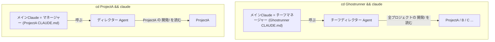
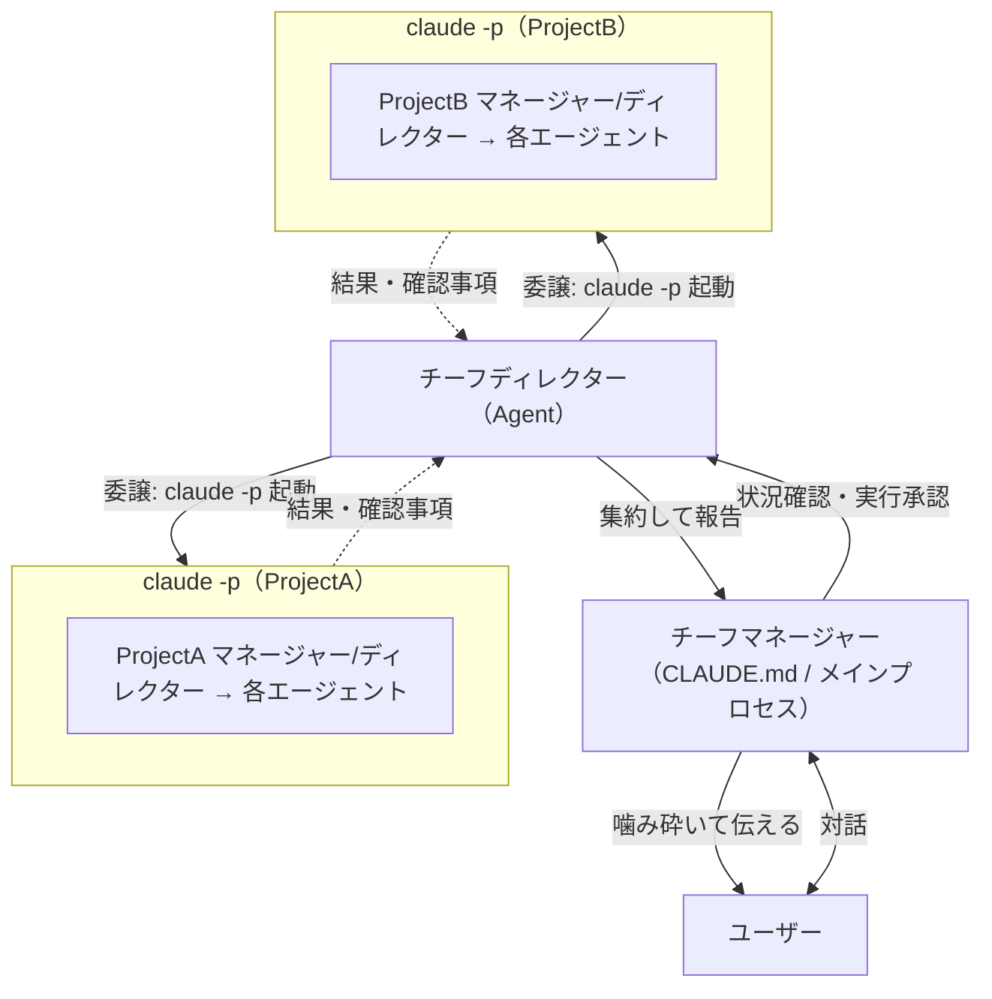

# 検討結果: 複数プロジェクト統括ターミナル

作成日: 2026-05-24
ステータス: MVP確定 / 並列実行方式は未決（論点整理段階）

## 検討経緯

| 日付 | 内容 |
|------|------|
| 2026-05-24 | ブラウザ操作に加えてターミナル操作も可能にしたい、という相談から開始 |
| 2026-05-24 | 当初仮説「対話モード＋既存スキルで足りる、作る必要はない」を検証 |
| 2026-05-24 | 単体プロジェクトはその通りと確認。一方で「複数プロジェクトを統括するターミナル」が真の要望と判明 |
| 2026-05-24 | これは既存の「チーフマネージャー/チーフディレクター構想」のターミナル版と一致すると整理 |
| 2026-05-24 | MVP（読み取り専用チーフディレクター）を確定。並列実行の方式は未決として論点化 |
| 2026-05-24 | 役割を2軸モデル（対話/実務 × 横断/単体）で整理。役割関係は委譲型を採用、案Cを除外 |

## 背景・目的

現在ブラウザ（claude.ai/code、ローカル接続）から操作しているが、ターミナルからも操作したい。
メインで動くのは Claude Code の対話モードなので、それを使う前提。

当初の仮説は「対話モードが discuss / plan / coding 等のコマンドを理解していれば、
特に作るものは無いのではないか」。実際に試したところ理解しているようだった。

## 調査で分かったこと（現状）

### 単体プロジェクトなら、当初仮説は正しい（作るもの無し）

- ターミナルの対話モードは、ブラウザ越しに動いているのと**同じ Claude Code エンジン**。
- 同じ `.claude/skills/`（14スキル: discuss / plan / coding / stage / release 等）と
  `.claude/settings.json`（品質チェックのフック）を読む。
- したがって `cd プロジェクト && claude` で起動すれば、スラッシュコマンドもフックも
  そのまま効く。配布も「Ghostrunnerを開いて `/init`」方式（Plugin方式は不安定で不採用）。
- 結論: **1プロジェクトを対話で進める用途は、ターミナルで既に成立しており、作るものは無い。**

### ブラウザ版（devtools 巡回ダッシュボード）だけが持つもの

巡回ダッシュボード = 「複数プロジェクトを登録 → 各 `実装待ち/` のタスクを検出 →
`claude -p "/coding ..."` を並列実行 → 進捗を SSE 表示＋ntfy通知、質問は `--resume` で回答」。

ターミナルの対話モードに無いのは次の3つ:

1. 複数プロジェクトの並列・自動実行
2. 完了・質問待ちの通知（ntfy）
3. 全プロジェクトの状況集約（統括の目）

## 要望の再定義

ユーザーが本当に欲しいのは「**複数プロジェクトを統括できるターミナル**」＋並列実行＋通知。
これは既存の[マネージャー構想](../資料/2026-04-05_マネージャー構想_全体図.md)の
**チーフマネージャー / チーフディレクター（横断版）のターミナル実装**に一致する。

### マネージャー構想との対応

| 欲しいもの | 構想での役割 | 実現手段 |
|---|---|---|
| 統括する対話相手 | チーフマネージャー | ターミナルのメインClaude = CLAUDE.md（構想通り「マネージャー＝メインプロセス」） |
| 複数プロジェクトの状況把握 | チーフディレクター | 全プロジェクトの `開発/` を読む Agent |
| 並列実行 | 一括管理 | パトロールの `claude -p` 並列（既存ロジック） |
| 通知 | devtools が担当 | ntfy（既存）or Claude Code のフック |

### ターミナル版の利点（構想の難問が消える）

マネージャー構想の全体図には未解決の問いが残っていた:

- Q1: スマホアプリから claude.ai/code のセッションにどう接続するか
- Q4: そもそも自作アプリか devtools 拡張か
- 「難しい」: Claude Code チャット体験をアプリに埋め込む

**ターミナルで実現するなら、これらは消える。** ターミナルそのものがチャットなので、
アプリ埋め込みもセッション接続も不要。ターミナル版は構想への最短ルートになりうる。

## 役割の整理（2軸モデルと指揮系統）

### 役割は「2つの軸」で決まる

4つの役割は、2軸の掛け合わせで整理できる。

| スコープ ＼ 担当 | 対話・翻訳・承認（CLAUDE.md＝メインプロセス） | 状況把握・判断・振り分け（Agent） |
|---|---|---|
| 横断（全プロジェクト） | チーフマネージャー | チーフディレクター |
| 単体（1プロジェクト） | マネージャー | ディレクター |

- 横軸＝担当: マネージャー系は「人間と話す係」、ディレクター系は「現場を見て判断する係」
- 縦軸＝スコープ: 「チーフ」が付くと全プロジェクト横断、付かないと1プロジェクト

### なぜマネージャー＝CLAUDE.md、ディレクター＝Agentなのか

Claude Codeの制約から必然的にこうなる。

- マネージャー系 = CLAUDE.md（メインプロセス）: ユーザーと直接対話できるのはメインプロセスだけ。
- ディレクター系 = Agent: 状況調査でメインの文脈を汚さないため。マネージャーがAgentツールで呼び出す。

### ターミナルの起動場所が役割を決める（ターミナル版の肝）



同じ仕組みで、置き場所（Ghostrunner か 各プロジェクト か）だけが違う。両方に同じ役割を仕込めば、
どこで開いても一貫した体験になる。

### 役割の関係: 委譲型（決定）

横断時の「チーフディレクター」と各プロジェクトの「ディレクター」の関係は **委譲型** を採用する
（実際の指揮系統に即していて直感的）。

ただし委譲には実現方法が2つあり、片方は構想の制約に当たる。

| 委譲の実現方法 | 動くか | 説明 |
|---|---|---|
| Agent入れ子（チーフDir Agent → Dir Agent） | 不可 | サブエージェントはサブエージェントを呼べない |
| プロセス委譲（チーフ層が `claude -p` で各プロジェクトを起動、その中身が各プロジェクトのマネージャー/ディレクター） | 可 | Agentの入れ子でなくOSプロセスの親子。委譲が自然に成立 |

→ **委譲型を本気でやるなら、実行は `claude -p` のプロセス委譲（＝案Aの方向）が自然**。
役割の整理が、並列実行の論点（後述）に方向性を与えた。最終決定はMVP後でよい。

### 委譲型の指揮系統（実行フェーズ）



横断レイヤー（チーフ）＝親プロセス、各プロジェクト＝子プロセス。委譲がプロセスの親子で表現されるため、
構想の入れ子制約を踏まない。

### MVPでの委譲は「軽い」

MVPは状況把握だけなので重い委譲（仕事を渡す）は起きない。「チーフディレクターが各プロジェクトの
`開発/` を見て状況を集約」までで完結する。本格的な委譲（`claude -p` で仕事を渡す）は実行フェーズで効く。
よってMVPはシンプルなまま、委譲型を将来の姿として据えられる。

## 既にあるもの / 新規に作るもの

| 区分 | 内容 |
|---|---|
| 既存（再利用可） | `patrol_projects.json`（プロジェクト一覧）、`patrol.go`（並列実行＋ntfy＋resume＋状態管理）、14スキル、フック |
| 新規候補 | チーフディレクター Agent、CLAUDE.md チーフマネージャー節、並列実行の繋ぎ込み |

ポイント: 統括の中核ロジック（並列 `claude -p` ＋ntfy）は**既に devtools バックエンドに存在する**。
ゼロから作るのではなく、再利用の度合いをどうするかが設計判断になる。

## 核心の設計判断（未決の論点）: 並列実行をどこで回すか

構想ドキュメントでも課題に挙がっていた「Agent入れ子の深さ、コンテキスト消失」が関わる分岐点。

| 案 | 統括ロジックの置き場所 | 長所 | 短所 |
|---|---|---|---|
| A. メインClaude + 統括スキル | スキル（メインClaudeが `claude -p` ループを実行） | サーバー不要・ターミナル完結・構想の「メイン＝マネージャー」に忠実 | パトロールの一部ロジックを再実装 |
| B. 既存backend + 薄いCLI | Goバックエンド（ヘッドレス常駐・ブラウザ不要） | 並列・ntfy・resume を全て再利用、重複ゼロ | バックエンド常駐が必要 |
| C. 全部Agent | チーフディレクター/ディレクター Agent | 完全統合・新規サーバー不要 | Agent入れ子・コンテキスト消失の制約に直面 |

補足: パトロールが `claude -p` サブプロセス並列（独立プロセス・独立コンテキスト）を採用しているのは、
真の並列・長時間実行に強いため。案A/Bはこの方式を踏襲、案Cは in-process Agent 方式で制約に当たりやすい。

**現時点では未決。** ただし「役割の整理」で委譲型を採用したことにより、実行は `claude -p` の
プロセス委譲が自然な候補（案A/Bの方向）となった。案C（全部Agent）は委譲型と相性が悪い
（Agent入れ子の壁）。最終決定はMVP を動かしてから。

## MVP（確定）: 読み取り専用チーフディレクター

いきなり並列実行を作らず、まず「統括の目」だけを最小コストで手に入れる。

### MVP範囲

- **チーフディレクター Agent**: 全登録プロジェクトの `開発/` フォルダ構造＋ git log/status を読み、
  状況を集約して報告する（実装待ち件数、検討中件数、確認事項の未回答数など）。
- プロジェクト一覧は既存の `patrol_projects.json` を流用（新規の一覧管理は作らない）。
- 実行は読み取りのみ。並列実行・書き込み・通知はこの段階では行わない。

### MVPの特徴

- ほぼ設定だけ（Agent定義 `.md` 1つ）で済み、新規コードはほぼ不要。
- ターミナルのメインClaude から「今日の状況は？」と聞けば、全プロジェクトを横断して報告が返る。
- 構想ドキュメントのMVP段階（ディレクター先行 → 横断パトロール改変）とも整合。

```
MVP:  チーフディレクターAgent（全プロジェクトの開発/を読んで状況報告） ← ほぼ設定だけ
次:   並列実行（案A/B/C を決定）＋通知＋確認事項連携
```

## 次フェーズ（MVP後）

- 並列実行方式の決定（案A / B / C）
- 通知の実装（Claude Code のフック or 既存 ntfy の再利用）
- 確認事項メカニズム（ファイルベース非同期質問）との連携
- CLAUDE.md チーフマネージャー節の追加（対話・承認・確認事項の取り次ぎ）

## 未解決の問い

- Q1: 並列実行は案A / B のどちらにするか（委譲型採用により案Cは除外。案A=スキル方式 / 案B=既存backend再利用）
- Q2: 通知はフックで完結させるか、既存 ntfy（パトロール）を再利用するか
- Q3: 案Bを選ぶ場合、devtools バックエンドの常駐を許容するか（ターミナル独立性とのトレードオフ）
- Q4: 確認事項メカニズムは並列実行と同時に必要か、後回しでよいか

## 次のステップ

1. MVP（チーフディレクター Agent）を `/plan` で実装計画化する、
   または並列実行の論点をさらに `/discuss` で詰める。
2. 方針確定後、`開発/実装/実装待ち/` に計画を移動。
