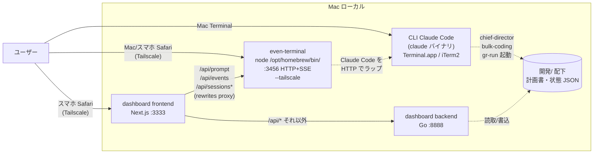

# 検討中: even-terminal の将来位置づけ

## 検討経緯

| 日付 | 内容 |
|------|------|
| 2026-05-26 | 初回相談: 「even-terminal と他のターミナル（CLI Claude Code）の違いがわからない」「整理したい」。新 dashboard も加わり3窓口になったので位置づけを決めたい。 |

## 背景

Ghostrunner エコシステムには現在「Claude Code を叩く窓」が **3 つ** ある。
利用者（ユーザー）視点では役割が重なって見え、混乱の元になっている。

加えて 2026-05-26 に新統括 GUI（dashboard）が実装完了し、そのチャット機能は **even-terminal の HTTP+SSE API に proxy で乗っている**。
つまり今や even-terminal は「並列ウィンドウ」ではなく **dashboard のチャットエンジン** という二重の役割を担っている。
この事実を踏まえて、将来どの形に収束させるかを決める必要がある。

## 3 者の現状関係

要点:

- **CLI Claude Code** — Mac で腰を据えて使う本拠地。`chief-director`・`bulk-coding`・`gr-run` 等の統括スキルはここから起動される。
- **even-terminal** — 外部 OSS（Homebrew 配下）。Claude Code を HTTP+SSE でラップし、`--tailscale` でスマホからも到達可。
- **dashboard** — 新統括 GUI。スマホ縦 1 列レイアウト＋カード型ダッシュボード＋チャット。**チャットは even-terminal を裏で叩いている**。

## 論点

1. **even-terminal の Web UI を今後直接触るか？**
   - 触らないなら「チャットエンジン（インフラ層）」として透過化できる。
2. **スマホからの入口を一本化するか？**
   - 現状スマホからは dashboard（:3333）と even-terminal Web UI（:3456）の 2 経路が見えている。
3. **Mac での使い分け**
   - Mac で `claude` CLI と Mac ブラウザの even-terminal、両方使う場面があるか？
4. **外部依存の許容度**
   - even-terminal は外部 OSS。バージョン追従・互換性のリスクをどこまで許すか。完全自前化（CLI 直叩き）への投資意欲は？

## 選択肢

### 案 A: 共存（直交）— 現状の案 5-A 継続

3 者を「目的が違うもの」として明文化して残す。

| 窓口 | 主目的 | 利用シーン |
|------|--------|-----------|
| CLI Claude Code | Mac で腰を据えた深い対話 | Mac 作業中の本拠地 |
| even-terminal | スマホ／Mac ブラウザでの Claude 対話 | 外出先で長めの対話、画面共有 |
| dashboard | スマホでの状況把握＋軽い指示 | 外出先で「状況は？」「実装待ち一括 coding」 |

- メリット: 現状維持。実装コスト 0。既存ユーザー体験を壊さない。
- デメリット: 「3 つある」混乱は残る。スマホで「結局どっち開く？」が発生し続ける。
- 工数感: 小（運用ドキュメント整理のみ）

### 案 B: even-terminal を「チャットエンジン（インフラ層）」と再定義

even-terminal を **裏方サーバ** に格下げし、ユーザーが直接 :3456 の Web UI を開く運用を辞める。
dashboard を順次リッチ化（session 切替・履歴閲覧・複数セッション並走 UI）して、even-terminal Web UI の機能を吸収していく。

- メリット: ユーザーから見える窓口が **CLI（Mac）と dashboard（スマホ）の 2 つ** に整理される。混乱が減る。チャットの実体（even-terminal）は安定資産として残す。
- デメリット: dashboard 側に session 一覧・履歴・切替 UI を追加実装する必要あり。「even-terminal の Web UI でしかできなかった操作」が dashboard に行き渡るまで完全移行できない。
- 工数感: 中（dashboard にセッション管理 UI を段階追加）

### 案 C: even-terminal を完全廃止、dashboard が CLI を直接呼ぶ

dashboard backend（Go :8888）が `claude` CLI または Claude Agent SDK を直接 exec し、SSE で配信する。
セッション管理・履歴永続化・Tailscale 対応を **全部自前実装** する。

- メリット: 外部依存ゼロ。窓口は CLI と dashboard の 2 つにすっきり。
- デメリット: even-terminal が今やっている「SSE ストリーミング・session 切替・履歴 API」を再発明することになる。実装重い、保守も自分で背負う。
- 工数感: 大（数週間〜）

### 案 D: 段階的廃止（A → B → C）

当面は A、dashboard が成熟したら B、最終的に必要なら C へ。

- メリット: 漸進的でリスク低。各段階で立ち止まれる。
- デメリット: 「いつかやる」が永遠に来ない可能性。
- 工数感: その都度

### 比較表

| 観点 | A 共存 | B インフラ層化 | C 完全廃止 | D 段階 |
|------|:---:|:---:|:---:|:---:|
| 実装コスト | 小 | 中 | 大 | 都度 |
| 窓口の数（ユーザー視点） | 3 | 2 | 2 | 3→2→2 |
| 外部依存リスク | 残る | 残る（裏方化） | 解消 | 都度 |
| dashboard の機能拡張必要性 | なし | あり | 多い | 段階的 |
| 既存資産の活用 | 最大 | 大 | なし | 大 |

## 推奨（仮）

**現時点では案 B（インフラ層化）を推奨方針として整理する。**

理由:

- dashboard は既に even-terminal の API に乗っている = 「裏方化」は実態として半分始まっている。
- スマホからの入口は dashboard 1 つにすると混乱が消える（CLI は Mac 専用なので並列が自然）。
- even-terminal を捨てるコスト（案 C）は SSE / session / 履歴の再実装を背負うことになり過大。
- 案 A の「3 つそのまま」は短期は楽だが、混乱の原因（ユーザー本人の最初の発言「違いがわからない」）を残し続ける。

ただし **「even-terminal Web UI を直接触る機会が本当に無いか」** はユーザーの実体験に依存するため、確認が必要（未決事項参照）。

## MVP（次の一手）

採用方針に関わらず、まず低コストでやれること:

1. **`devtools/frontend/docs/` または `開発/` 配下に「3 窓口の使い分けガイド」を 1 枚明文化する**
   - CLI = Mac の本拠地、even-terminal = チャット実体（直接開く必要は基本なし）、dashboard = スマホの入口
   - 案 A・B どちらに転んでも有用
2. **dashboard のヘッダ等に「Claude チャット」エリアを明示**
   - even-terminal Web UI を開かなくても dashboard で済むことを視覚的に伝える
3. （案 B を採るなら）dashboard に session 一覧 / 切替 UI を最小実装

案 B 採用後の段階的拡張:

- フェーズ 1: dashboard に session 一覧表示（even-terminal `/api/sessions` を叩く）
- フェーズ 2: session 切替・履歴閲覧 UI
- フェーズ 3: even-terminal を docs から「直接開かない裏方」と明記、Web UI URL は内部用扱い

## 未決事項

- [ ] **even-terminal Web UI（:3456 を直接開く運用）を今後も使う場面があるか？**
  - 「ある」なら案 A、「ない／減らしたい」なら案 B 寄り。
- [ ] **スマホからは dashboard 一本にしたいか、even-terminal も並走で問題ないか？**
  - 一本化したいなら案 B/C。
- [ ] **Mac で「ブラウザの even-terminal」を開く場面はあるか？**
  - CLI で完結しているなら、Mac 側で even-terminal を表に出す必要は薄い。
- [ ] **外部 OSS（Homebrew 経由）への依存で困っている／不安があるか？**
  - 強い不安があれば案 C も検討対象に上がる。

## 次のステップ

1. 未決事項への回答を得る（対話継続）
2. 回答を踏まえて推奨案を確定し、本書を更新
3. 方針確定後、必要なら `/plan` で案 B のフェーズ 1（dashboard session 一覧）等の実装計画を作成
