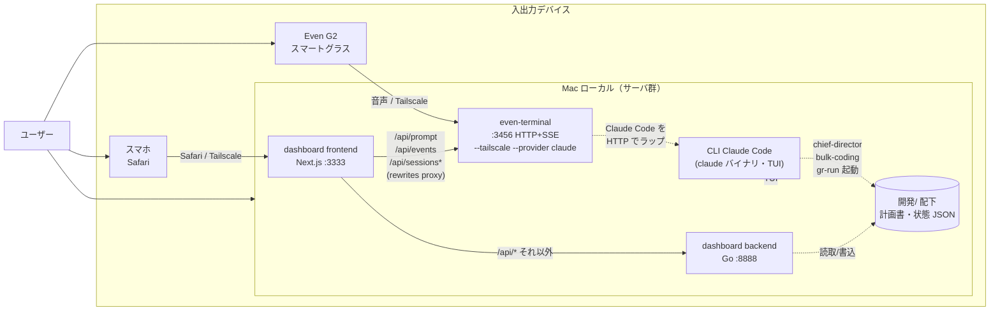

# 検討中: even-terminal の将来位置づけ

## 検討経緯

| 日付 | 内容 |
|------|------|
| 2026-05-26 | 初回相談: 「even-terminal と他のターミナル（CLI Claude Code）の違いがわからない」「整理したい」。新 dashboard も加わり3窓口になったので位置づけを決めたい。 |
| 2026-05-26 | **重要な前提修正**: ユーザーより「even-terminal は **Even G2（スマートグラス）** のためのインターフェース。ターミナル（HTTP サーバ）を立てるのが Even G2 を使う上での必須要件なので、`使いやすい / 使いにくい` の評価対象ではない」との指摘。当初の「3 つの並列ウィンドウのうち 1 つ」というフレーミングは誤り。本書は Even G2 前提で再整理する。 |
| 2026-05-26 | **未決事項への第一回回答**: (1) Even G2 と dashboard の使い分け = **「場面ごとに両方使う」** → 並列共存（案 A 系）が確定、案 C（dashboard チャット縮退）は脱落。 (2) even-terminal の起動・常駐 = **「確立している（自動起動済 or 都度手動で問題なし）」** → MVP の「Makefile に組み込む」は不要。残る論点は「場面の中身」と「Even G2 経由での統括スキル発火」「session 連続性」。次節で深堀りする。 |

## 背景（修正版）

Ghostrunner エコシステムには Claude Code へのアクセス経路が **3 つのモダリティ** ある。**競合関係ではなく、入出力デバイスが違うもの**として位置づけ直す必要がある。

| 経路 | 入力 | 出力 | 利用シーン |
|------|------|------|-----------|
| **CLI Claude Code** | キーボード | TUI（Mac の画面） | Mac で腰を据えた作業 |
| **Even G2 ＋ even-terminal** | 音声（グラス） | 音声＋HUD（グラス） | ハンズフリー、外出先、運転中等 |
| **dashboard（新統括 GUI）** | タッチ・音声 | スマホ画面（Safari） | スマホでの状況把握＋軽い指示 |

つまり **even-terminal は Even G2 を使うためのインフラ**であって、UI として選ぶ／捨てるの対象ではない。一方 dashboard のチャットは現状 `/api/prompt` 等を **even-terminal の :3456 に proxy** で流している = Even G2 用に立てたゲートウェイをスマホ Safari も間借りしている、という構造になる。

## 3 経路の関係（修正版）

要点:

- **even-terminal は Even G2 専用ではなく「Claude Code の HTTP+SSE ゲートウェイ」**として動いており、Even G2 と dashboard の双方が同じゲートウェイを共有している。
- Even G2 を使う以上 even-terminal は必ず立てる。**dashboard はその副産物として「タダ乗り」できる**。
- CLI Claude Code は Mac 上の本拠地で、統括スキル（`chief-director`・`bulk-coding`・`gr-run`）の起動元として独立した役割を持つ。

## 論点（修正版）

旧版にあった「even-terminal を残すか／廃止するか」は **論点ではない**（Even G2 を使う以上必須インフラ）。代わりに焦点を 4 つに整理する。

1. **dashboard を「Even G2 ゲートウェイ間借り」と公式に位置づけるか？**
   - 現状は事実として乗っているだけ。設計意図として正式に明文化するかは別問題。
2. **Even G2 と dashboard、スマホ用途での主役はどちら？**
   - 外出先で「状況は？」をやるとき、グラスで聞くのか、Safari で見るのか。両方ありなら使い分け基準が要る。
3. **dashboard 固有機能（カード型ダッシュボード・確認事項回答 UI・TTS）が Even G2 から触れないのは妥当か？**
   - グラスは音声 IO 主体なのでカード UI は当然不可。だが「確認事項に音声で答える」「進捗をグラスで読み上げ」は需要があるかも。
4. **3 モダリティの推奨使い分けをドキュメント化するか？**
   - 「Mac で腰を据えるなら CLI、外出先ハンズフリーなら G2、スマホで覗くなら dashboard」をどこに書くか。

## 選択肢（修正版）

### 案 A: 現状追認（3 モダリティを並列に明文化）

3 経路を「入出力デバイスごとの専用インターフェース」として明文化し、いまの構造をそのまま運用する。

| 経路 | 推奨用途 |
|------|---------|
| CLI Claude Code | Mac の本拠地。統括スキル起動。深い対話。 |
| Even G2 + even-terminal | ハンズフリー、外出先、運転中、寝る前など |
| dashboard | スマホで状況を一目把握、確認事項回答、TTS で読み上げ |

- メリット: 実装変更ゼロ。Even G2 のメリット（ハンズフリー）と dashboard のメリット（一覧性）を両方活かせる。
- デメリット: ドキュメントを書かないと「どれ使えばいいんだっけ」が再発する（ユーザー自身が最初に陥った混乱）。
- 工数感: 小（使い分けガイドを 1 枚書くだけ）

### 案 B: dashboard を「Even G2 ゲートウェイ+α」と公式定義し、機能拡張は両モダリティ共通の文脈で設計

dashboard を「even-terminal（Even G2 ゲートウェイ）に統括 GUI レイヤを乗せたもの」と公式に位置づける。今後 dashboard に session 管理／履歴閲覧／確認事項回答などを足すときは、**「グラスからも同じことを音声で出来るようにすべきか」を毎回問う**ことを設計原則化する。

- メリット: 「タダ乗り」が「意図ある設計」に格上げされる。Even G2 と dashboard で機能差が広がらないよう、構造的に縛れる。
- デメリット: Even G2 側で実現が難しい機能（例: 大量データの一覧）まで両方対応を考えると停滞する。原則は柔軟運用が前提。
- 工数感: 小〜中（原則ドキュメント化＋設計レビュー時のチェック項目化）

### 案 C: dashboard を「スマホ専用」と割り切り、Even G2 用途とは分離 ＜却下＞

dashboard は **スマホ Safari からの「目で見る把握」専用**と割り切り、音声系（チャット入力 / TTS）は Even G2 に集約する方向にする。dashboard のチャット欄を削除 or 縮退し、確認事項回答・状況把握ボタン・カード表示などビジュアル機能に絞る。チャットしたい場合は Even G2 を使う、と運用で線を引く。

- メリット: スマホで「カード見たい」と Even G2 で「対話したい」の役割が完全分離して、混乱が消える。dashboard の保守も軽くなる。
- デメリット: スマホしか持ってない（グラス未着用）外出時に対話ができなくなる。MVP で TTS まで作り込んだ流れに逆行。
- 工数感: 中（チャット UI を縮退、TTS の扱いを再決定）
- **却下理由（2026-05-26）**: ユーザー回答「場面ごとに両方使う」より、dashboard チャットを縮退すると「dashboard を選びたい場面でチャットが出来ない」事態が発生する。並列共存方針と矛盾。

### 案 D: dashboard 側に「Even G2 では出来ない operations 専用」機能を強化する方向で差別化

dashboard を「グラスでは表現不可能なリッチ操作（複数項目一覧・確認事項詳細閲覧・履歴フィルタ等）」の場として育てる方向に明確化する。チャット入力欄は残すが、「音声系の本命はグラス、dashboard は一覧と回答 UI が主役」と明文化する。

- メリット: 互いの強みを伸ばす設計になる。dashboard 開発の方向性が明確化。
- デメリット: 案 B との境界が曖昧。「何を入れて何を入れない」の判断を毎回することになる。
- 工数感: 中（既存 MVP の延長で段階拡張）

### 比較表

| 観点 | A 並列明文化 | B 共通設計原則 | C スマホ専用化 | D dashboard リッチ化 |
|------|:---:|:---:|:---:|:---:|
| 実装変更 | なし | なし | 中 | 中〜大 |
| ドキュメント整備 | 必要 | 必要 | 必要 | 必要 |
| Even G2 と dashboard の機能整合 | 自然任せ | 強制 | 分離 | 強み別分化 |
| MVP TTS 等の活用度 | 活用 | 活用 | 縮小 | 活用 |
| 「どれ使う？」混乱の解消度 | 中 | 中 | 高 | 中 |

## 推奨（仮）

**現時点では案 A（並列明文化）＋ 案 D（dashboard リッチ化）の組み合わせを推奨する。**

理由:

- Even G2 が必須インフラである以上、3 モダリティ並列は所与。捨てる議論は不要。
- 案 A のドキュメント整備だけでも「ユーザー自身の混乱」は解消する（最初の質問の根本原因）。
- 案 D の方向（dashboard を「目で見る」リッチ機能で差別化）は、MVP で実装した確認事項回答 UI・カード表示と整合性が高い。
- 案 C のチャット縮退は MVP の TTS まで作り込んだ流れに逆行するため見送り。
- 案 B（共通設計原則化）は良いが、現段階で原則ドキュメントを作ると過剰設計。dashboard を拡張する局面で都度判断で十分。

## MVP（次の一手）

1. **`devtools/frontend/docs/` または `開発/` 配下に「3 モダリティ使い分けガイド」を書く**
   - 入力／出力デバイス・想定シーン・できること／できないことを 1 枚で対比。
   - dashboard の README / screen-flow.md 末尾に追記、もしくは `開発/INTERFACES.md` として独立。
   - **場面マトリクスの中身は「深掘り論点」の Q1 回答で確定する**。
2. ~~even-terminal の起動を Makefile / 起動手順に組み込む~~ → **不要（2026-05-26）**: ユーザー確認により「自動起動済 or 都度手動で問題なし」。
3. **dashboard 側に「Even G2 でも同じことが出来るか」を README に注記**
   - 確認事項回答・進捗ボタン・TTS が「dashboard だけの機能か」「Even G2 でも音声で同等のことができるか」を一覧化。
   - **「深掘り論点」の Q2（統括スキル音声発火）の回答に依存**。
4. （将来）dashboard の機能拡張時に「グラス側でも同じことができるか」を都度検討（案 B の原則を非公式運用）。

## 深掘り論点（第二回・未解決）

ユーザー回答（「場面ごとに両方使う」「起動は確立」）を踏まえ、並列共存方針は固まった。残るのは **「並列共存をどう運用するか」の中身**。以下 3 つを深堀りする。

### Q1: 場面マトリクスの中身

「場面ごとに両方使う」の **「場面」を具体化したい**。これが分かると 3 モダリティ使い分けガイド（MVP 1 番）の中身が決まる。

仮説マトリクス（叩き台）:

| 場面 | CLI | Even G2 | dashboard | 主役（仮説） |
|------|:---:|:---:|:---:|------|
| 在宅・Mac 作業中 | ◎ | △ | △ | CLI |
| 在宅・休憩中（椅子に座って） | × | ○ | ○ | 両方？ |
| 在宅・寝る前（横になって） | × | ◎? | ◎? | ? |
| 移動中・歩行 | × | ◎ | △（立ち止まり時） | G2 |
| 移動中・電車（座席） | × | ○ | ○ | 両方？ |
| 運転中 | × | ◎（強制） | × | G2 |
| 外食・席で待ち時間 | × | ○ | ◎? | dashboard? |
| 両手塞がる作業中 | × | ◎ | × | G2 |

不明点:

- 「椅子に座って」「電車座席」のように両方使えるとき、何を基準に選んでいる？（一覧性 vs ハンズフリーの即時性）
- dashboard ならではの「カード一覧」「確認事項詳細閲覧」を使いたい場面は、グラス使用中でもスマホ取り出すか？
- 寝る前の用途（眩しさ・両手の自由度）はどっちが快適？

### Q2: Even G2 経由での統括スキル発火

dashboard で実装した以下の機能を、Even G2 から音声で発火するシーンを想定するか:

| dashboard 機能 | Even G2 等価操作（想定） | 想定するか？ |
|----------------|--------------------------|:---:|
| 進捗把握ボタン（「状況は？」自動送信） | 「状況は？」と話す | ? |
| 確認事項回答 UI（A 案 / B 案ボタン） | 「A 案で」「B 案で」と話す | ? |
| 一括 coding 発火（チャットで「一括codingして」） | 同じ言葉を話す | ? |
| TTS 読み上げ | グラスの音声出力に統合？ それとも別系統？ | ? |

論点:

- **誤発火リスク**: 「一括codingして」は明示動詞ゲートだが、グラスで雑談中に偶然口にしたら発火する可能性。dashboard より誤発火耐性が低い。
- **確認事項回答の音声化**: dashboard はボタンで A/B 選択、Even G2 では「A 案で」と話す → これは chief-director / chat 側で `**ステータス**: 回答済` への書き戻し処理が必要。dashboard MVP で書き戻し API は実装済（POST /api/answer 相当） → Even G2 側でも同 API を叩く流れになるが、グラス UI 側にその発火経路があるか要確認。
- **TTS の二重実装問題**: dashboard MVP で Web Speech API ベースの TTS を実装。Even G2 はグラス側で音声出力する。同じ応答を 2 系統で読まれると煩い → dashboard 利用中はグラス TTS を抑制、グラス利用中は dashboard TTS を抑制、の排他制御が必要か？

### Q3: Session 連続性

「場面ごとに両方使う」なら、デバイス切替時の **対話の連続性** が論点になる。

| シナリオ | 技術的可否 | 検討要否 |
|----------|:---:|:---:|
| Even G2 で始めた対話を dashboard で続ける | even-terminal session を共有すれば可能（同じ session ID を開けば） | 要 |
| dashboard で始めた対話を Even G2 で続ける | 同上 | 要 |
| CLI で始めた対話を Even G2 / dashboard で続ける | CLI は claude バイナリ独立 session、even-terminal とは別系統 | 不可能 |
| ファイル（計画書・状態 JSON）経由の情報共有 | 全モダリティで読める | OK |

論点:

- 「Even G2 で『今日のタスクは？』と聞いた直後、dashboard を開いて続き対話したい」シーンはある？それとも「場面ごとに新規 session で OK」？
- CLI と他 2 つは session が別系統。これは **ファイル経由（計画書・確認事項）で十分**と割り切れる？

## 未決事項（旧）

- [x] ~~Even G2 のユースケース実態~~ → 場面ごとに両方使う（深掘りは Q1 へ）
- [ ] Even G2 経由での統括スキル音声発火 → **Q2 で深掘り中**
- [x] ~~even-terminal の起動・常駐方法~~ → 確立済
- [x] ~~dashboard チャット欄を残すか~~ → 残す（並列共存方針確定）
- [ ] **新規**: 場面マトリクスの具体化 → **Q1**
- [ ] **新規**: Session 連続性ニーズの有無 → **Q3**

## 次のステップ

1. 深掘り論点 Q1・Q2・Q3 への回答を対話で得る
2. 回答を踏まえて MVP（使い分けガイド・dashboard 機能の Even G2 対応表）の中身を確定
3. 必要なら（Q3 で「連続性ほしい」となれば）session 共有の技術検討を別建てで `/plan` 化
4. 軽量で済む範囲（使い分けガイドのみ）であれば、検討完了後そのままドキュメント追加へ
