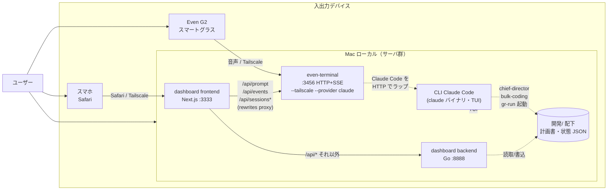
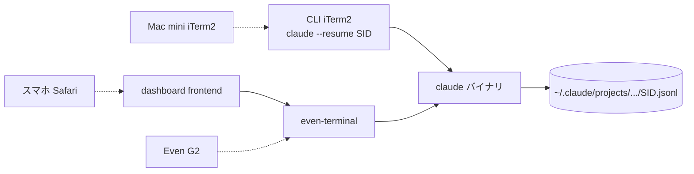

# 検討中: even-terminal の将来位置づけ

## 検討経緯

| 日付 | 内容 |
|------|------|
| 2026-05-26 | 初回相談: 「even-terminal と他のターミナル（CLI Claude Code）の違いがわからない」「整理したい」。新 dashboard も加わり3窓口になったので位置づけを決めたい。 |
| 2026-05-26 | **重要な前提修正**: ユーザーより「even-terminal は **Even G2（スマートグラス）** のためのインターフェース。ターミナル（HTTP サーバ）を立てるのが Even G2 を使う上での必須要件なので、`使いやすい / 使いにくい` の評価対象ではない」との指摘。当初の「3 つの並列ウィンドウのうち 1 つ」というフレーミングは誤り。本書は Even G2 前提で再整理する。 |
| 2026-05-26 | **未決事項への第一回回答**: (1) Even G2 と dashboard の使い分け = **「場面ごとに両方使う」** → 並列共存（案 A 系）が確定、案 C（dashboard チャット縮退）は脱落。 (2) even-terminal の起動・常駐 = **「確立している（自動起動済 or 都度手動で問題なし）」** → MVP の「Makefile に組み込む」は不要。残る論点は「場面の中身」と「Even G2 経由での統括スキル発火」「session 連続性」。次節で深堀りする。 |
| 2026-05-26 | **Q4 追加**: ユーザーより「Even G2 で表示してるターミナル内容を、スマホでも Mac mini でも自動で引き継ぎたい。3 デバイス全てで内容を共有・反映したい」との要望。Q3 / Q3-a で確定した「Even G2 ⇄ dashboard 間 session 連続性（案 γ）」を **CLI Claude Code（Mac mini ターミナル）まで拡張する**論点。本章で 3 デバイス共有を検討する。 |
| 2026-05-26 | **Q4-3 への回答**: ユーザーより「書きも必要（Mac mini から続き入力したい）」との回答。読み専用案（案 β / 案 δ）単体では要件を満たさないことが確定。**新規案 ε（gr-chat + gr-tail = even-terminal API を叩く CLI ラッパー対）** を追加し、暫定推奨を γ → ε → α の 3 段に組み替え。残論点は Q4-0a / Q4-0b / Q4-2。 |
| 2026-05-26 | **Q4-2 への回答**: ユーザーより「直近の対話 1 件＋複数 session 切替」（粒度 1+2）との回答。粒度 3（HUD レイアウト共通レンダラ）／粒度 4（CLI TUI そのもの）は不要が確定。**案 α（claude バイナリ直接アタッチ）は粒度 4 を前提とした選択肢のため将来検討からも降格**、暫定推奨は **γ → ε の 2 段構え**に簡素化。残論点は Q4-0a / Q4-0b。 |
| 2026-05-26 | **Q4-0b への部分回答**: ユーザーより「**VSCode の Claude Code プラグインのチャット欄から打ちたい**」との回答。Q4-0b の想定（Safari / iTerm2 の 2 択）になかった **第 3 パターン**。VSCode 拡張は内部で `claude` バイナリを呼ぶ系統＝ even-terminal とは別 session 体系の可能性が高く、**iTerm2 向けに用意した案 ε（gr-chat + gr-tail）は要件不一致のため降格**（ユーザーは VSCode 既存 UI を使う前提）。**新規論点 Q4-0c**（VSCode 入力を G2/dashboard と同 session で共有するか）を立て、共有要件次第で新規案（案 ζ: VSCode ⇄ even-terminal の session ID 共有 / 案 η: 独自 VSCode 拡張 / 案 θ: VSCode を独立経路として共有しない）が必要になる可能性。 |
| 2026-05-26 | **Q4-0a への回答**: ユーザーより「**ホスト機と同一**」との回答。Mac mini = even-terminal / dashboard が動いている Mac そのもの（`usermac-mini.tail85f9ea.ts.net`）。**含意**: VSCode も同一マシン上で動くため `~/.claude/projects/` を直接共有可能 → 案 ζ（session ID 共有）の前提（同じ jsonl にアクセス）が技術的に成立しやすい。Tailscale 越し（別マシン）の設計検討は **すべて不要**。残論点は Q4-0c のみ。 |
| 2026-05-26 | **Q4-0c への回答**: ユーザーより「**最初から共有実装（案 ζ）**」との回答。VSCode を独立経路として割り切る案 θ は脱落、Q4-0a 確定（ホスト機と同一）の含意（jsonl 共有可能）を踏まえて **共有方向に倒すコスト軽減を活かす判断**。Q4 全解決、本書の Q4 章は **方針確定**。`/plan` 直前の **実機検証タスク**（even-terminal の session 保存先 / claude `--resume` 同時 attach 仕様 / VSCode 拡張の SID 指定再開手段）を次節に整理。残るは Q2-a（確認事項回答の音声化 / TTS 排他制御）のみ。 |

## 背景（修正版）

Ghostrunner エコシステムには Claude Code へのアクセス経路が **3 つのモダリティ** ある。**競合関係ではなく、入出力デバイスが違うもの**として位置づけ直す必要がある。

| 経路 | 入力 | 出力 | 利用シーン |
|------|------|------|-----------|
| **CLI Claude Code** | キーボード | TUI（Mac の画面） | Mac で腰を据えた作業 |
| **Even G2 ＋ even-terminal** | 音声（グラス） | 音声＋HUD（グラス） | ハンズフリー、外出先、運転中等 |
| **dashboard（新統括 GUI）** | タッチ・音声 | スマホ画面（Safari） | スマホでの状況把握＋軽い指示 |

つまり **even-terminal は Even G2 を使うためのインフラ**であって、UI として選ぶ／捨てるの対象ではない。一方 dashboard のチャットは現状 `/api/prompt` 等を **even-terminal の :3456 に proxy** で流している = Even G2 用に立てたゲートウェイをスマホ Safari も間借りしている、という構造になる。

## 3 経路の関係（修正版）



要点:

- **even-terminal は Even G2 専用ではなく「Claude Code の HTTP+SSE ゲートウェイ」**として動いており、Even G2 と dashboard の双方が同じゲートウェイを共有している。
- Even G2 を使う以上 even-terminal は必ず立てる。**dashboard はその副産物として「タダ乗り」できる**。
- CLI Claude Code は Mac 上の本拠地で、統括スキル（`chief-director`・`bulk-coding`・`gr-run`）の起動元として独立した役割を持つ。

## 論点（修正版）

旧版にあった「even-terminal を残すか／廃止するか」は **論点ではない**（Even G2 を使う以上必須インフラ）。代わりに焦点を 4 つに整理する。

1. **dashboard を「Even G2 ゲートウェイ間借り」と公式に位置づけるか？**
   - 現状は事実として乗っているだけ。設計意図として正式に明文化するかは別問題。
2. **Even G2 と dashboard、スマホ用途での主役はどちら？**
   - 外出先で「状況は？」をやるとき、グラスで聞くのか、Safari で見るのか。両方ありなら使い分け基準が要る。
3. **dashboard 固有機能（カード型ダッシュボード・確認事項回答 UI・TTS）が Even G2 から触れないのは妥当か？**
   - グラスは音声 IO 主体なのでカード UI は当然不可。だが「確認事項に音声で答える」「進捗をグラスで読み上げ」は需要があるかも。
4. **3 モダリティの推奨使い分けをドキュメント化するか？**
   - 「Mac で腰を据えるなら CLI、外出先ハンズフリーなら G2、スマホで覗くなら dashboard」をどこに書くか。

## 選択肢（修正版）

### 案 A: 現状追認（3 モダリティを並列に明文化）

3 経路を「入出力デバイスごとの専用インターフェース」として明文化し、いまの構造をそのまま運用する。

| 経路 | 推奨用途 |
|------|---------|
| CLI Claude Code | Mac の本拠地。統括スキル起動。深い対話。 |
| Even G2 + even-terminal | ハンズフリー、外出先、運転中、寝る前など |
| dashboard | スマホで状況を一目把握、確認事項回答、TTS で読み上げ |

- メリット: 実装変更ゼロ。Even G2 のメリット（ハンズフリー）と dashboard のメリット（一覧性）を両方活かせる。
- デメリット: ドキュメントを書かないと「どれ使えばいいんだっけ」が再発する（ユーザー自身が最初に陥った混乱）。
- 工数感: 小（使い分けガイドを 1 枚書くだけ）

### 案 B: dashboard を「Even G2 ゲートウェイ+α」と公式定義し、機能拡張は両モダリティ共通の文脈で設計

dashboard を「even-terminal（Even G2 ゲートウェイ）に統括 GUI レイヤを乗せたもの」と公式に位置づける。今後 dashboard に session 管理／履歴閲覧／確認事項回答などを足すときは、**「グラスからも同じことを音声で出来るようにすべきか」を毎回問う**ことを設計原則化する。

- メリット: 「タダ乗り」が「意図ある設計」に格上げされる。Even G2 と dashboard で機能差が広がらないよう、構造的に縛れる。
- デメリット: Even G2 側で実現が難しい機能（例: 大量データの一覧）まで両方対応を考えると停滞する。原則は柔軟運用が前提。
- 工数感: 小〜中（原則ドキュメント化＋設計レビュー時のチェック項目化）

### 案 C: dashboard を「スマホ専用」と割り切り、Even G2 用途とは分離 ＜却下＞

dashboard は **スマホ Safari からの「目で見る把握」専用**と割り切り、音声系（チャット入力 / TTS）は Even G2 に集約する方向にする。dashboard のチャット欄を削除 or 縮退し、確認事項回答・状況把握ボタン・カード表示などビジュアル機能に絞る。チャットしたい場合は Even G2 を使う、と運用で線を引く。

- メリット: スマホで「カード見たい」と Even G2 で「対話したい」の役割が完全分離して、混乱が消える。dashboard の保守も軽くなる。
- デメリット: スマホしか持ってない（グラス未着用）外出時に対話ができなくなる。MVP で TTS まで作り込んだ流れに逆行。
- 工数感: 中（チャット UI を縮退、TTS の扱いを再決定）
- **却下理由（2026-05-26）**: ユーザー回答「場面ごとに両方使う」より、dashboard チャットを縮退すると「dashboard を選びたい場面でチャットが出来ない」事態が発生する。並列共存方針と矛盾。

### 案 D: dashboard 側に「Even G2 では出来ない operations 専用」機能を強化する方向で差別化

dashboard を「グラスでは表現不可能なリッチ操作（複数項目一覧・確認事項詳細閲覧・履歴フィルタ等）」の場として育てる方向に明確化する。チャット入力欄は残すが、「音声系の本命はグラス、dashboard は一覧と回答 UI が主役」と明文化する。

- メリット: 互いの強みを伸ばす設計になる。dashboard 開発の方向性が明確化。
- デメリット: 案 B との境界が曖昧。「何を入れて何を入れない」の判断を毎回することになる。
- 工数感: 中（既存 MVP の延長で段階拡張）

### 比較表

| 観点 | A 並列明文化 | B 共通設計原則 | C スマホ専用化 | D dashboard リッチ化 |
|------|:---:|:---:|:---:|:---:|
| 実装変更 | なし | なし | 中 | 中〜大 |
| ドキュメント整備 | 必要 | 必要 | 必要 | 必要 |
| Even G2 と dashboard の機能整合 | 自然任せ | 強制 | 分離 | 強み別分化 |
| MVP TTS 等の活用度 | 活用 | 活用 | 縮小 | 活用 |
| 「どれ使う？」混乱の解消度 | 中 | 中 | 高 | 中 |

## 推奨（仮）

**現時点では案 A（並列明文化）＋ 案 D（dashboard リッチ化）の組み合わせを推奨する。**

理由:

- Even G2 が必須インフラである以上、3 モダリティ並列は所与。捨てる議論は不要。
- 案 A のドキュメント整備だけでも「ユーザー自身の混乱」は解消する（最初の質問の根本原因）。
- 案 D の方向（dashboard を「目で見る」リッチ機能で差別化）は、MVP で実装した確認事項回答 UI・カード表示と整合性が高い。
- 案 C のチャット縮退は MVP の TTS まで作り込んだ流れに逆行するため見送り。
- 案 B（共通設計原則化）は良いが、現段階で原則ドキュメントを作ると過剰設計。dashboard を拡張する局面で都度判断で十分。

## MVP（次の一手）

1. **`devtools/frontend/docs/` または `開発/` 配下に「3 モダリティ使い分けガイド」を書く**
   - 入力／出力デバイス・想定シーン・できること／できないことを 1 枚で対比。
   - dashboard の README / screen-flow.md 末尾に追記、もしくは `開発/INTERFACES.md` として独立。
   - **場面マトリクスの中身は「深掘り論点」の Q1 回答で確定する**。
2. ~~even-terminal の起動を Makefile / 起動手順に組み込む~~ → **不要（2026-05-26）**: ユーザー確認により「自動起動済 or 都度手動で問題なし」。
3. **dashboard 側に「Even G2 でも同じことが出来るか」を README に注記**
   - 確認事項回答・進捗ボタン・TTS が「dashboard だけの機能か」「Even G2 でも音声で同等のことができるか」を一覧化。
   - **「深掘り論点」の Q2（統括スキル音声発火）の回答に依存**。
4. （将来）dashboard の機能拡張時に「グラス側でも同じことができるか」を都度検討（案 B の原則を非公式運用）。

## 深掘り論点（第二回・未解決）

ユーザー回答（「場面ごとに両方使う」「起動は確立」）を踏まえ、並列共存方針は固まった。残るのは **「並列共存をどう運用するか」の中身**。以下 3 つを深堀りする。

### Q1: 場面マトリクスの中身

「場面ごとに両方使う」の **「場面」を具体化したい**。これが分かると 3 モダリティ使い分けガイド（MVP 1 番）の中身が決まる。

#### Q1 への回答（2026-05-26）

選択基準は **「一覧性が欲しいかどうか」「ハンズフリーかどうか」の 2 軸**。

| モダリティ | 一覧性 | ハンズフリー |
|-----------|:---:|:---:|
| CLI Claude Code | ○（ターミナル画面で確認可） | × |
| Even G2 | ×（音声 IO・HUD は一覧に向かない） | ◎ |
| dashboard | ◎（カード一覧・確認事項詳細） | × |

→ **dashboard ＝ 一覧性、Even G2 ＝ ハンズフリー**、と軸が直交する。CLI は両軸 △ だが Mac 上でしか使えないので「Mac の本拠地」専用枠。

#### 確定マトリクス

| 場面 | 一覧性必要? | ハンズフリー必要? | 推奨モダリティ |
|------|:---:|:---:|------|
| 在宅・Mac 作業中 | △ | × | **CLI**（本拠地） |
| 在宅・休憩中（椅子に座って・スマホ取り出せる） | ○ | × | **dashboard** |
| 在宅・寝る前（横になって） | × | ◎ | **Even G2** |
| 移動中・歩行 | × | ◎ | **Even G2** |
| 移動中・電車（座席に座って） | ○ | △ | **dashboard**（一覧優先） |
| 運転中 | × | ◎（強制） | **Even G2** |
| 外食・席で待ち時間 | ○ | × | **dashboard** |
| 両手塞がる作業中（料理・洗濯・等） | × | ◎ | **Even G2** |
| 全プロジェクト状況の俯瞰確認 | ◎ | × | **dashboard** |
| 「今これ何中？」軽い確認 | × | ○ | **Even G2** |

この 2 軸ルールがあれば、上記マトリクスは **「使い分けガイド」の中身としてほぼそのまま使える**。MVP 1 番（使い分けガイド作成）は、この表＋2 軸ルールを 1 枚にまとめれば完成する。

派生する含意:

- **dashboard の存在意義 = 「一覧性」**。これは Even G2 では構造的に不可能（音声 IO ＋ HUD 表示は一覧に不向き）なので、案 D（dashboard リッチ化）= カード／確認事項詳細／進捗グラフを拡充する方向と整合的。
- **Even G2 の存在意義 = 「ハンズフリー」**。dashboard では構造的に達成不可能（スマホ操作は必ず両手 or 片手で画面注視が必要）。
- **両者は機能を奪い合う関係にない**。むしろ「dashboard を見るには手とスマホが要る／Even G2 を使うにはグラスが要る」という制約から、自然に役割分担される。

派生する残論点:

- **「dashboard ならではの一覧」を強化する方向の具体策**は別検討（カードの情報密度・確認事項詳細閲覧 UI・進捗グラフ等）。本書のスコープ外。
- **Q2（Even G2 経由での統括スキル発火）はこの 2 軸とは独立**。Even G2 で「状況は？」と聞くのは「ハンズフリー × 一覧不要（要約聞きたい）」の最頻シーンなので、対応する価値は高そう（と推測される）。

### Q2: Even G2 経由での統括スキル発火

dashboard で実装した以下の機能を、Even G2 から音声で発火するシーンを想定するか:

| dashboard 機能 | Even G2 等価操作（想定） | 想定するか？ |
|----------------|--------------------------|:---:|
| 進捗把握ボタン（「状況は？」自動送信） | 「状況は？」と話す | ? |
| 確認事項回答 UI（A 案 / B 案ボタン） | 「A 案で」「B 案で」と話す | ? |
| 一括 coding 発火（チャットで「一括codingして」） | 同じ言葉を話す | ? |
| TTS 読み上げ | グラスの音声出力に統合？ それとも別系統？ | ? |

論点:

- **誤発火リスク**: 「一括codingして」は明示動詞ゲートだが、グラスで雑談中に偶然口にしたら発火する可能性。dashboard より誤発火耐性が低い。
- **確認事項回答の音声化**: dashboard はボタンで A/B 選択、Even G2 では「A 案で」と話す → これは chief-director / chat 側で `**ステータス**: 回答済` への書き戻し処理が必要。dashboard MVP で書き戻し API は実装済（POST /api/answer 相当） → Even G2 側でも同 API を叩く流れになるが、グラス UI 側にその発火経路があるか要確認。
- **TTS の二重実装問題**: dashboard MVP で Web Speech API ベースの TTS を実装。Even G2 はグラス側で音声出力する。同じ応答を 2 系統で読まれると煩い → dashboard 利用中はグラス TTS を抑制、グラス利用中は dashboard TTS を抑制、の排他制御が必要か？

#### Q2 への回答（2026-05-26・部分回答）

| dashboard 機能 | Even G2 等価 | ユーザー回答 |
|----------------|-------------|---|
| 進捗把握（「状況は？」） | 「状況は？」と話す | **◎ 使う** |
| 一括 coding（「一括codingして」） | 同じ言葉を話す | **× しない** |
| 確認事項回答（A 案 / B 案） | 「A 案で」と話す | （未回答） |
| TTS 読み上げ | グラス音声出力に統合？ 排他制御は？ | （未回答） |

確定した含意:

- **把握系（chief-director / 「状況は？」）は Even G2 から発火する想定が正式**。最頻シーン（ハンズフリー × 軽い確認）に直接ヒットする。
- **一括操作系（bulk-coding）は Even G2 から発火させない運用方針**。
   - 「一括codingして」は明示動詞ゲートだが、誤発火するとプロジェクト横断で claude セッションが多数立ち上がるため影響が大きい。
   - グラスは独り言・雑談・口癖などで偶発入力しやすく、明示動詞だけでは耐性が不十分との判断。
   - **コードレベルでロックする必要は無さそう**（ユーザー自身が意識的に Even G2 では発火させないという運用ルールで足りる）。今後リスクが顕在化したら「Even G2 経由のセッションでは bulk-coding 系スキルを発火させない」フィルタを even-terminal 側 or skill 側で導入する余地は残る。
- **使い分けが「2 軸ルール」と整合**: 「ハンズフリーで軽い確認 = Even G2 で状況は？」「dashboard で詳細を見ながら一括 coding 発火 = 一覧性が要るから dashboard」。Q1 のマトリクスから自然に導かれる。

残る論点 → Q2-a:

- **確認事項回答（A 案 / B 案）を Even G2 から音声でやるか？**
   - dashboard では UI ボタン。Even G2 では「A 案で」と話す。
   - 把握系（読み取り）と異なり「状態変更」だが、影響は単一の回答書き戻し（プロジェクト 1 つ・1 行）に限定。一括 coding のような大規模影響は無い。
   - ハンズフリー時に「移動中に確認事項に答えたい」需要がありえる。
- **TTS の二重実装問題**: dashboard TTS（Web Speech API）と Even G2 のグラス音声出力をどう調停？
   - 同時利用は稀（場面マトリクス的に併用しない）なので運用で十分？
   - もしくは dashboard 側 TTS は ON/OFF トグル既に実装済（MVP 済）→ Even G2 利用中はトグル OFF で済む？

### Q3: Session 連続性

「場面ごとに両方使う」なら、デバイス切替時の **対話の連続性** が論点になる。

| シナリオ | 技術的可否 | 検討要否 |
|----------|:---:|:---:|
| Even G2 で始めた対話を dashboard で続ける | even-terminal session を共有すれば可能（同じ session ID を開けば） | 要 |
| dashboard で始めた対話を Even G2 で続ける | 同上 | 要 |
| CLI で始めた対話を Even G2 / dashboard で続ける | CLI は claude バイナリ独立 session、even-terminal とは別系統 | 不可能 |
| ファイル（計画書・状態 JSON）経由の情報共有 | 全モダリティで読める | OK |

論点:

- 「Even G2 で『今日のタスクは？』と聞いた直後、dashboard を開いて続き対話したい」シーンはある？それとも「場面ごとに新規 session で OK」？
- CLI と他 2 つは session が別系統。これは **ファイル経由（計画書・確認事項）で十分**と割り切れる？

#### Q3 への回答（2026-05-26）

**「重要（同 session を引き継ぎたい）」** = Even G2 ⇄ dashboard 間の session 連続性は **hard requirement**。

技術的含意:

- even-terminal の session 管理機能（`/api/sessions` 一覧、`/api/sessions/:id/history` 履歴）を Even G2 と dashboard で **同じ session ID** を指して使えるようにする必要がある。
- 現在の dashboard MVP は **チャットを送るとき session ID をどう決めているか要確認**（新規作成？最新 session を自動継承？固定 ID？）。
   - 計画書 `2026-05-26_統括GUI_MVP_plan.md` の rewrites（`/api/sessions/:path*` を proxy）と useChat フックの session ID 取り扱いを次の調査で読む。
- Even G2 側（Even 側アプリ）の session ID 設定方法も把握する必要がある（こちらは Ghostrunner 側ではコントロールできない可能性大）。
- CLI Claude Code は claude バイナリ独立 session なので、G2/dashboard との連続性は **諦めてファイル経由（計画書・確認事項）で代替**するのが妥当。

UX の分岐（次に決めたいこと）:

- **案 α: 「直近 session を自動継承」（暗黙継承）**
   - dashboard を開くと「最後に使ってた session」を自動で開く。Even G2 で話した直後にスマホを取り出せば、続きから対話できる。
   - メリット: ユーザー操作ゼロ。「場面ごとに両方使う」の自然な体験。
   - デメリット: 「新しい話題で開きたい」ときに別操作が要る。複数 session を並行運用しているとどれが直近か曖昧。
- **案 β: 「session 選択 UI で明示選択」**
   - dashboard 側に session 一覧／切替 UI を実装。ユーザーが意図的に「この session の続き」を選ぶ。
   - メリット: 意図が明確、複数 session 並行運用と相性良し。
   - デメリット: 操作が一段増える。スマホ片手の場面で面倒。
- **案 γ: 「両方（デフォルト自動継承＋必要なら選択 UI）」**
   - 開いた瞬間は直近 session、ヘッダ等から「他の session に切替」できる。
   - メリット: 最頻シーンは無操作、稀シーンは明示選択。
   - デメリット: UI が複雑化、実装コスト最大。

#### Q3-a への回答（2026-05-26）

**案 γ（両方）採用**。デフォルト = 直近 session 自動継承、必要に応じて session 選択 UI で切替可能。

技術タスク（次の実装計画で扱う想定）:

1. **dashboard 起動時に「直近 session」を自動取得**
   - `GET /api/sessions?provider=claude` で一覧取得 → 最終更新時刻 or 最終発話時刻が最新のものを current として開く。
   - 「最新」の定義は even-terminal API のレスポンス仕様に従う（updated_at / last_message_at 等）。実装時に要確認。
2. **dashboard ヘッダに session 切替 UI を追加**
   - 既存 session 一覧（タイトル＋更新日時）をドロップダウン or モーダルで表示。
   - 選択で current 切替＋履歴の re-fetch。
   - 「新規 session を開始」ボタンも併設すると新しい話題の入口が明確になる。
3. **Even G2 で作った session が dashboard 一覧に出る前提が成立しているか確認**
   - even-terminal の `/api/sessions` が「provider=claude 全 session」を返すなら成立。Even G2 / dashboard / 他クライアントを区別せず返すのが標準だと想定。
4. **「直近 session」の決定ロジックに「自分が最後に触った session」のヒューリスティックを足すか？**
   - 例: 別クライアント（Even G2）の発話で更新されたばかりの session を「直近」とみなす → 「Even G2 で話した直後 dashboard を開くと続きから」が自然に成立。
   - これが Q3 ユーザー回答の本旨「同 session を引き継ぎたい」と最も整合する。
5. **session 切替時の TTS 既読位置の扱い**
   - 切替直後に未読履歴を一気に読み上げないよう、開いた時点では TTS を発火させない / 新規応答のみ読み上げる、等の制御。dashboard MVP の TTS 実装方針と再確認が要る。

工数感: 中（hooks/useChat と新規 SessionSelector コンポーネント＋API クライアント拡張）。MVP の延長線で十分実装可能。

#### Q3-a 採用の含意

- dashboard は「単に Even G2 ゲートウェイにタダ乗りしてチャットを表示する」だけでなく、**「複数 session を俯瞰し切替可能なフロントエンド」**として位置づけ直される。
- これは Q1 確定の「dashboard = 一覧性」と整合的（session 一覧も「一覧性」の一種）。
- 案 D（dashboard リッチ化）の方向と相互に補強。

### Q4: 3 デバイス共有（Even G2 ⇄ スマホ ⇄ Mac mini）

ユーザー要望（2026-05-26）:

> イーブンg2で表示してるターミナルの内容、スマホで引き継がないかな？Mac miniでもターミナルの内容は自動で引き継げでない できればイーブンg2ターミナル、スマホ、Mac mini全てで内容を共有、反映したい

Q3 / Q3-a で確定した「Even G2 ⇄ dashboard 間の session 連続性（案 γ）」を **3 デバイス目（Mac mini ターミナル）まで広げたい**という拡張要求。Q3 時点では CLI Claude Code は「諦めてファイル経由」で整理していたが、ユーザーはその判断を覆そうとしている可能性が高い。

#### Q4-0: そもそも「Mac mini」と「ターミナル」が何を指すか（必須確認）

**ここを確定しないと設計が分岐する**。少なくとも 4 通りの解釈がある。

| 解釈 | Mac mini の位置 | 「ターミナル」の中身 | 既存検討書との関係 |
|------|-----------------|----------------------|-------------------|
| **A: Mac mini = ホスト機、Safari で見る** | 今 even-terminal / dashboard を動かしているホスト機（Tailscale 名 `usermac-mini.tail85f9ea.ts.net`）。これと同一。 | Mac mini 上の Safari / Chrome で `http://localhost:3333/dashboard` を開く | **Q3-a で解決済**。Safari で開く相手が iPhone か Mac mini かの違いだけ。実装ゼロ。 |
| **B: Mac mini = ホスト機、CLI Claude Code を iTerm2 で叩く** | 同上。同一マシン。 | iTerm2 / Terminal.app で `claude` バイナリ TUI を起動して対話している画面 | **Q3 で「諦めてファイル経由」と整理した領域**。覆す方向の議論が必要。 |
| **C: Mac mini = 別マシン、even-terminal client を新規に置く** | 今のホスト機とは別の Mac mini。Tailscale 経由でゲートウェイに繋ぐ。 | Mac mini 上のブラウザ or ネイティブクライアントで even-terminal に繋ぐ | スマホ Safari と同じ仕組みで横展開。実装ゼロ（URL 開くだけ）。 |
| **D: Mac mini = 別マシン、別の even-terminal サーバを立てる** | 別マシン上で独自に even-terminal を動かしている。 | Mac mini 側のローカル even-terminal | session が別系統。**マシン間 session 同期は別問題**として大幅検討必要。 |

技術的に判断するヒント:

- `next.config.ts` の `allowedDevOrigins` に `usermac-mini.tail85f9ea.ts.net` が含まれている → **ホスト機が Mac mini と呼ばれている可能性が高い**。
- もしそうなら解釈 A または B が濃厚。「自動で引き継げでない（＝引き継げていない）」というユーザー発言からすると、**Safari で開けば見える A は既に達成済の可能性**があり、ユーザーが不満を持っているのは **B（iTerm2 上の CLI Claude Code TUI が引き継がない）**である可能性が高い。
- ただし「Mac mini」と「Mac」を区別しているニュアンスから、**別マシンの可能性**もゼロではない（C / D）。

→ **ユーザーへの最重要確認**: ホスト機 ＝ Mac mini か、別マシンか。「ターミナル」は CLI Claude Code（iTerm2/Terminal.app の claude バイナリ TUI）か、ブラウザの dashboard か、**または VSCode の Claude Code プラグインのチャット欄か（2026-05-26 ユーザー回答により第 3 候補が追加）**。

#### Q4-0a への回答（2026-05-26）

**「Mac mini = ホスト機と同一」** が確定（解釈 A / B のいずれか、C / D は脱落）。

確定した含意:

- Mac mini は even-terminal（`:3456`）／ dashboard backend（`:8888`）／ dashboard frontend（`:3333`）が動いている **同一マシン**。
- VSCode の Claude Code プラグインも当然この Mac mini 上で動く → spawn される `claude` バイナリは even-terminal が呼ぶ claude バイナリと **同じユーザー権限・同じ `~/.claude/projects/` パス** を参照する。
- これは **案 ζ（VSCode ⇄ even-terminal session ID 共有）の前提（同じ jsonl ファイルにアクセスできる）が技術的に成立する側**に倒れる強い材料。Tailscale 越しの設計（接続先 URL 動的化・認証経路・SSHFS 等）は **すべて不要**になる。
- 全クライアント（G2 / iPhone Safari / Mac mini Safari / Mac mini VSCode）が localhost で完結。
- 案 θ（独立運用）を選んだ場合も、「同一マシンなのに session が分かれる」のは技術的・UX 的に違和感が出やすくなる（同じ jsonl が手元にあるのに別 session ということになる）。

→ **Q4-0c の選択判断にこの含意を反映すべき**: 「同一マシンで `~/.claude/projects/` を共有できる」前提なら、案 ζ の実機検証ハードルは下がっており、共有方向に倒すコストが軽くなる。

#### Q4-0b への部分回答（2026-05-26）

**「VSCode の Claude Code プラグインのチャット欄から打ちたい」** が確定。

確定した含意:

- Q4-0b の当初想定（Safari / iTerm2 の 2 択）は **第 3 パターン（VSCode）に置き換わる**。Safari / iTerm2 への需要は当面なし。
- **iTerm2 用案 ε（gr-chat + gr-tail = 独自 CLI ラッパー対）は降格**。ユーザーは既存ツール（VSCode 公式拡張）を使いたく、独自 CLI ラッパーを使う運用ではない。
- VSCode の Claude Code プラグインは **内部で `claude` バイナリを spawn する系統**（公式 Anthropic 拡張）。session 保存先は通常の CLI と同じ `~/.claude/projects/<エンコード cwd>/<UUID>.jsonl` の可能性が高い（要実機確認）。
- これは **even-terminal が生成する session とは別系統の可能性が高い**（even-terminal も内部で claude バイナリを呼んでいるが、`--cwd` 指定や session 管理方式が独自）。
- **新規論点 Q4-0c が浮上**: VSCode で打った内容を G2 / dashboard に「反映」させる必要があるか、それとも VSCode は独立した第 4 経路として運用するか。

#### Q4-0c: VSCode 入力を G2 / dashboard と同 session で共有するか（新規・最重要）

VSCode の Claude Code プラグインを共有の輪に入れるかどうかで、設計が大きく分岐する。

| 分岐 | 必要なこと | 工数感 | 技術的不確実性 |
|------|------------|:---:|:---:|
| **共有する**（VSCode で打った内容が G2 / dashboard でも見える / 続けられる） | VSCode 拡張と even-terminal で同 session ID を共有するブリッジが必要 | 中〜大 | 大（claude バイナリの `--resume` 同時 attach 仕様・session 保存先の一致確認が前提） |
| **共有しない**（VSCode は独立した入力経路として使い、G2 / dashboard とは別系統） | 何もしなくて良い。VSCode は VSCode、G2 / dashboard は G2 / dashboard で session が別れる運用 | ゼロ | なし |

##### 案 ζ: VSCode ⇄ even-terminal を session ID 共有でブリッジ（共有する場合・現実解）

dashboard 側に「現在 active な session ID をコピー」ボタンを置き、VSCode の Claude Code プラグインで `claude --resume <SID>` 相当の機能を使って同じ session を再開する。

- 仕組み:
   1. even-terminal の session 保存先が `~/.claude/projects/<cwd>/<SID>.jsonl` であることを実装読みで確認（前提）。
   2. dashboard ヘッダに「session ID をクリップボードにコピー」ボタン追加。
   3. VSCode 側で `claude --resume <SID>` を呼ぶ手段を確認（プラグインの UI 経由 or コマンドパレット）。
   4. 開いた VSCode のチャット欄で対話を続ける → 同じ jsonl に追記される → G2 / dashboard 側にも反映（SSE 経由で text_delta が流れる）。
- メリット:
   - VSCode の既存 UI（コード補完・refactoring 提案連携）をそのまま使える。
   - ファイル経由なので「同時 attach」可能性が高い（書き込みは追記なので race condition は低い）。
- デメリット:
   - **claude バイナリと VSCode 拡張の仕様依存が大きい**。`--resume` の同時 attach 可否、jsonl の locking 仕様、even-terminal が生成する SID と VSCode 拡張で開ける SID の整合性、すべて未確認。
   - VSCode 拡張が独自の session DB を持っていて `~/.claude/projects/` を読まない仕様だと成立しない。
- 工数感: 中（dashboard 側のコピーボタンは軽、本丸は実機検証・claude バイナリ仕様の確認）。

##### 案 η: 独自 VSCode 拡張で even-terminal API を直接叩く（共有する場合・夢の領域）

公式 Claude Code 拡張は使わず、自作の VSCode 拡張で `/api/prompt` / `/api/events` を叩く UI を VSCode 内に統合する。

- メリット: claude バイナリ仕様に依存しない。dashboard と同じ API で完結。
- デメリット: VSCode 拡張開発・配布・メンテのコストが大きい。公式拡張のコード補完機能を失う。
- 工数感: 大（VSCode 拡張をゼロから開発）。
- 評価: コスト対効果が悪い。**現時点では推奨外**。

##### 案 θ: VSCode を独立経路として割り切り、共有の輪に入れない（共有しない場合・実装ゼロ）

VSCode の Claude Code プラグインは **独自 session で動く第 4 経路**として運用する。G2 / dashboard / iPhone Safari / Mac mini Safari の 4 つは同 session（Q3-a の自動継承＋切替 UI 経由）で繋がるが、VSCode は別系統。

- 仕組み: 何もしない。VSCode 拡張は公式仕様のまま、G2 / dashboard 側も触らない。
- メリット:
   - **実装ゼロ**。
   - claude バイナリ仕様に依存しない。
   - VSCode の本来用途（IDE 統合・コード補完）を素直に使える。
- デメリット:
   - VSCode で打った内容は G2 / dashboard に出てこない。「3 デバイス共有」の輪から VSCode は外れる。
   - 「移動中に G2 で考え始めて、帰宅して VSCode で続き」のような連続体験は不可能（VSCode は独自 session で再起動）。
- 工数感: ゼロ。

##### 比較表（Q4-0c 分岐）

| 観点 | 案 ζ session 共有 | 案 η 独自 VSCode 拡張 | 案 θ 独立運用 |
|------|:---:|:---:|:---:|
| 実装工数 | 中 | 大 | ゼロ |
| claude バイナリ仕様依存 | 大（実機検証必須） | なし | なし |
| VSCode 既存機能（補完等）の保持 | ◎ | × | ◎ |
| 共有要件達成 | ○（実機検証次第） | ◎ | × |
| MVP 適性 | △（不確実性大） | × | ◎ |

##### Q4-0c が決まると確定すること

- **「共有する」=> 案 ζ を実装読み・実機検証から開始**。失敗時のフォールバックとして案 θ（独立運用）を用意。
- **「共有しない」=> 案 θ で完結、実装ゼロ**。Mac mini 共有は γ + θ の 2 本立て（dashboard 系は γ で共有、VSCode は独立）。3 デバイス共有の「Mac mini 側」は VSCode 単独となり、G2 / iPhone とは session が別れることを許容する運用。

#### Q4-0c への回答（2026-05-26）

**「最初から共有実装（案 ζ）」** が確定。案 θ（独立運用）は脱落。

確定した含意:

- **VSCode 入力を G2 / iPhone Safari / Mac mini Safari と同じ session で共有する**方向に倒す。VSCode で打った内容は他デバイスに即反映（SSE 経由）、他デバイスで進んだ対話を VSCode で続けられる。
- Q4-0a 確定（ホスト機と同一）の含意（`~/.claude/projects/` を全プロセスで共有可能）を **積極的に活用**する判断。Tailscale 越し設計が不要 ＆ jsonl 共有が前提成立 ＝ 共有実装のハードルが下がっている今が最適タイミング。
- **案 θ（独立運用）は不採用**: 同一マシンで jsonl が手元にあるのに session を分けるのは技術的・UX 的に不自然、というユーザー判断と整合。
- **「最初から」** の含意: フォールバック前提（まず θ で動かして後で ζ に拡張）ではなく、**最初から ζ を本命として実機検証＋実装する**意思。失敗時の代替案は確保するが、優先順位は ζ。
- 案 η（独自 VSCode 拡張）は引き続き不採用（コスト対効果が悪い）。

#### Q4 全解決サマリー（2026-05-26）

| # | 確認事項 | 確定回答 |
|---|---------|---------|
| Q4-0a | Mac mini の位置づけ | **ホスト機と同一**（解釈 A/B 確定、Tailscale 越し設計不要） |
| Q4-0b | 「ターミナル」の中身 | **VSCode の Claude Code プラグインのチャット欄**（Safari / iTerm2 は需要なし） |
| Q4-0c | VSCode 入力を共有するか | **共有する・最初から案 ζ 実装**（案 θ 不採用、案 η 不採用） |
| Q4-2 | 「内容」の粒度 | **直近 1 件＋複数 session 切替（粒度 1+2）**（粒度 3/4 不要 ＝ 案 α 降格） |
| Q4-3 | 読み or 書きも | **書きも必要**（案 β / δ 単体不可） |

**確定方針**: **案 γ（dashboard 自動継承＋切替 UI）＋ 案 ζ（VSCode ⇄ even-terminal session ID 共有）** の組み合わせで 4 経路（G2 / iPhone Safari / Mac mini Safari / Mac mini VSCode）を同一 session で結ぶ。実装ゼロの案 γ 部分は Q3-a に内包、案 ζ 部分は新規実装（dashboard 側に SID コピー UI ＋ VSCode 側で SID 指定 resume の手順整備）。

#### Q4 確定方針 → /plan 直前の実機検証タスク

案 ζ の実装計画化（/plan）に進む前に、以下を実機 / 実装読みで確定する必要がある:

1. **even-terminal の session 保存先**（実装読み）
   - even-terminal が内部で `claude` バイナリを spawn する際の `--cwd` 指定方法
   - session jsonl が `~/.claude/projects/<エンコード cwd>/<UUID>.jsonl` に書かれるか（他クライアントの claude バイナリと同じパス）
   - even-terminal が独自 session DB（SQLite 等）を持っていないか
   - `/api/sessions` の SID と jsonl ファイル名の UUID が一致するか

2. **claude バイナリの `--resume <SID>` 同時 attach 仕様**（実機検証）
   - 同じ SID を 2 つのプロセス（even-terminal + VSCode 拡張）が同時に開けるか
   - jsonl の lock 仕様（fcntl flock？ advisory のみ？）
   - 2 プロセスからの追記の atomic 性（書き込み中の他プロセスの読み出しが壊れないか）
   - `claude --resume <SID>` 起動中に even-terminal が同じ SID に追記した時、VSCode 側で text_delta が流れるか

3. **VSCode Claude Code プラグインの仕様**（実機確認）
   - 公式 Anthropic 拡張か、サードパーティか（公式の場合は名前と version、サードパーティならどれを使うか確定）
   - session 保存先が CLI と同じ `~/.claude/projects/` か
   - 「外部から取得した SID」を指定して resume する UI / コマンドパレットコマンドがあるか
   - 無い場合の代替手段（拡張内蔵ターミナル経由で `claude --resume <SID>` を打つ等）

4. **dashboard 側の SID コピー UI 仕様**（小さい実装決定）
   - 配置（ヘッダ / session 切替 UI 近辺 / フローティングボタン）
   - 1 クリックで `navigator.clipboard.writeText(currentSessionId)` 相当
   - コピー後のフィードバック表示（toast / 短時間のラベル変化）

5. **フォールバック設計**（万一案 ζ が claude 仕様で成立しない場合）
   - 案 θ（独立運用）を最終フォールバックとして用意
   - 「最初から ζ」のユーザー意思を尊重しつつ、実機検証で破綻した場合に倒れる先を確保

これら 1〜3 が **クリティカルパス**。実機検証の結果次第で実装範囲・難易度が大きく変わる。/plan で詳細計画を作る前にこれらを潰す。

#### Q4-1: CLI Claude Code（解釈 B）を共有の輪に入れるか？

ユーザー要望の本丸はおそらくこちら。以下、解釈 B 前提で設計案を出す。

**前提となる技術的事実（推定・要実装読み確認）**:

- CLI の claude バイナリは Mac ローカルの `~/.claude/projects/<エンコード済み cwd>/<UUID>/...jsonl` に session を保存している（本書執筆時点で実ファイル配置を確認済）。
- even-terminal は内部で claude バイナリを provider として呼んでいる可能性が高い。だとすると **even-terminal 経由の session も同じ `~/.claude/projects/` 配下に書かれている可能性がある**（ただし `--cwd` 指定や起動環境で配置先が分岐するため、実装読みが必要）。
- もし配置が共通なら、**「同一 cwd / 同一 session UUID」で claude バイナリを起動すれば原理的に同じ session を再開できる**可能性がある。これは Claude Code の `--resume <session-id>` 系フラグの仕様に依存する。**未確認の前提**。
- **claude バイナリの session 仕様は Anthropic 側 / 内部実装に依存し、ユーザー側でフルコントロールできない**ことを念頭に置く必要がある。

##### 案 α: 「CLI も諦めない」フル統合（高難度・夢のある方向）

CLI / Even G2 / dashboard の全部を **same session ID で claude バイナリにアタッチ**できるようにする。



- 仕組み: claude バイナリ自体が「同一 jsonl を別プロセスから順次 read+append」できれば成立。`--resume <SID>` で前回の続きが再生できる仕様なら、CLI 起動時に SID を指定すれば G2/dashboard と同じ jsonl を読み書きする。
- メリット: 真の 3 デバイス共有が実現。「移動中に G2 で考え始め → 帰宅して Mac mini で続き → 寝るとき G2 で完結」のような連続体験。CLI TUI そのものの見た目で続けられる（色・キー操作・スラッシュコマンド等を保持）。
- デメリット:
   - **claude バイナリ仕様への依存が大きい**。`--resume` の同時 attach が許可されているか、二重書込で壊れないか、要実機検証。
   - even-terminal が内部で生成する SID と CLI 側 `claude --resume` で再開する SID の対応付けが必要。
   - CLI 側で「いま attach すべき session id を知る」手段が要る（dashboard を見て手で打つ／ラッパースクリプト経由）。
- 工数感: **大（claude バイナリ実装読み・実機検証・ラッパースクリプト・session id 配信機構）**。

##### 案 β: 「読み専用ミラー」だけやる（中難度・現実解）

CLI 側は session を共有しない（書き込みは別系統のまま）が、**他デバイスで進行中の対話を CLI ターミナル上に「読み専用で流す」**だけ実現する。

- 仕組み:
   1. `gr-tail` のようなラッパーコマンドを作る。
   2. これを iTerm2 で起動すると、even-terminal の `/api/events` (SSE) に接続し、現在 active な session の発話を tail -f 風に表示。
   3. CLI で対話する場合は従来通り `claude` を別タブで起動（書き込みは別 session）。
- メリット:
   - 「Mac mini でも内容が見えている」というユーザー要望の半分は満たせる。
   - claude バイナリの仕様に依存しない（even-terminal の SSE を見るだけ）。
   - 実装が軽い（Go or シェルスクリプトで 1 日仕事）。
- デメリット:
   - 「見える」だけで「続きが書ける」わけではない。書き込みは依然 G2/dashboard でやる必要がある。
   - **Q4-3 確定（書きも必要）により単体では要件未達**。
- 工数感: 中（小〜中スクリプト + even-terminal 側に既存 SSE があれば即可能）。

##### 案 γ: 「Safari で開けば見える」だけ追認（最小・解釈 A 同等）

「Mac mini でも引き継ぎたい」を **「Mac mini の Safari/Chrome で dashboard を開けば G2 と同じ session が見える」** で読み替える。Q3-a が完成すれば自動的に達成される（dashboard 自体が「複数 session を俯瞰し切替可能」なフロントエンドになるため、Mac mini の画面で見ても同じ）。

- 仕組み: dashboard を別ブラウザ（Mac mini の Safari）で開くだけ。Q3-a 採用済 → 自動継承＋切替 UI 経由で同一 session が見える。dashboard MVP のチャット入力欄から書き込みもできる（読み・書き両方達成）。
- メリット:
   - **実装ゼロ**。Q3-a 完了で副産物として達成。
   - 全モダリティ（G2 / iPhone Safari / Mac mini Safari）が同じ「dashboard」を使う。
   - **書きも自動で達成**（dashboard のチャット欄から送れる）。
- デメリット:
   - **CLI Claude Code（iTerm2 上の TUI）は引き継ぎの輪に入らない**。iTerm2 で対話したいユーザー要望には届かない。
   - 「Mac mini = ブラウザを開く端末」と割り切る必要がある。今 CLI を本拠地にしている運用と衝突する可能性。
- 工数感: ゼロ（Q3-a に内包）。

##### 案 δ: 「ファイル経由のブリッジ」を強化（既存検討書の方針継続）

Q3 で結論済の「CLI は諦めてファイル経由で代替」を強化する方向。session 内容を file に dump して CLI 側で `cat` / `tail -f` できるようにする。

- 仕組み: even-terminal が session の発話を `運用/log/sessions/<SID>.txt` 等に書き出す。CLI 側は `tail -f` で読む。書き込みは別。
- メリット:
   - claude バイナリ仕様に依存しない。
   - 既存方針の延長で実装容易。
- デメリット:
   - 結局「読み専用」止まり。案 β とほぼ同等で、ファイル経由か SSE 経由かの違い。
   - **Q4-3 確定（書きも必要）により単体では要件未達**。
   - ファイルが肥大化する管理コスト。
- 工数感: 小〜中。

##### 案 ε: 「CLI ラッパー対」= gr-chat + gr-tail（新規・Q4-3 対応の現実解）

**Q4-3 で「書きも必要」が確定**したことを受けて新規追加。案 β（読み専用ミラー）に **書き戻し用の双子コマンド**を追加することで、claude バイナリの session attach 仕様に依存せず、**iTerm2 から書きも読みも両方** even-terminal API 経由で実現する。

```mermaid
flowchart LR
    subgraph iTerm2["Mac mini iTerm2（既存ターミナルアプリ）"]
      Tail["gr-tail<br/>(SSE 購読プロセス・読み)"]
      Chat["gr-chat 'メッセージ'<br/>(POST 1 ショット・書き)"]
    end
    subgraph ET["even-terminal :3456"]
      EV["/api/events<br/>(SSE)"]
      PR["/api/prompt<br/>(POST)"]
      SS["/api/sessions<br/>(GET)"]
    end
    subgraph Cluster["Even G2 / dashboard / Mac mini iTerm2 が同じ session を共有"]
      direction LR
      G2[Even G2]
      DBF[dashboard]
      Tail2[gr-tail]
    end

    Tail -- "GET /api/events?sessionId=SID" --> EV
    Chat -- "POST /api/prompt {sessionId:SID,text}" --> PR
    Chat -. "session 解決 GET /api/sessions" .-> SS

    EV -. "text_delta / result を全クライアントに fan-out" .-> G2
    EV -. "" .-> DBF
    EV -. "" .-> Tail2
```

- 仕組み:
   1. **`gr-tail [--session <ID>]`**: iTerm2 で起動すると `/api/events?sessionId=<SID>` (SSE) を購読し、`text_delta` を標準出力に流す（tail -f 風）。session ID 未指定なら `GET /api/sessions?provider=claude` を叩いて **最終更新時刻が最新の session を自動継承**（dashboard 案 γ と同じヒューリスティック）。
   2. **`gr-chat "メッセージ" [--session <ID>]`**: 1 ショットコマンド。`POST /api/prompt` に `{ sessionId, text }` を投げる。session ID は同じく `/api/sessions` から直近を解決、または明示指定。
   3. 運用パターン: iTerm2 のペイン左に `gr-tail` 常駐、ペイン右で `gr-chat "次の指示"` を打つ。読みと書きが分離するが **同じ session を共有**するので、G2 / dashboard / iTerm2 のどこから送っても全クライアントに反映される。
- メリット:
   - **書き／読み両方達成**（Q4-3 確定要件を満たす）。
   - **claude バイナリ仕様（`--resume` の同時 attach 可否）に依存しない**。even-terminal の HTTP+SSE API だけで完結。実機検証ハードルが消える。
   - dashboard MVP で既に叩いている `/api/prompt` / `/api/events` / `/api/sessions` をそのまま流用するので、サーバ側に新規実装が要らない。
   - **Tailscale 越し**（解釈 C: Mac mini が別マシン）でも動く。`gr-chat` / `gr-tail` の接続先 URL を Tailscale 名（`usermac-mini.tail85f9ea.ts.net:3456`）に差し替えるだけ。
   - 実装単位が小さい（Go ワンファイル CLI x2、または bash + curl + `sse-cat` 系で済む可能性）。
- デメリット:
   - **claude バイナリ TUI そのものの見た目は引き継げない**。ASCII 色付きヘッダ、`/clear` 等スラッシュコマンド、キーバインド、Esc-Esc コミットなどの CLI UX 要素は再現しない。**テキスト stream のみ**。
   - 補完機能・カーソル編集など TUI の対話性は失われる（`gr-chat` は 1 ショットで投げる単発コマンド）。
   - dashboard を介さず直接 API を叩く別経路が増えるので、認証・レート制限を後で入れるときに 2 系統メンテになる。
   - SSE 接続の安定性は even-terminal 実装依存。再接続ロジックは `gr-tail` 側に必要。
- 工数感: **中（CLI 2 本＝合計 200〜400 行、SSE 購読＋HTTP POST＋session 解決ヒューリスティック＋指数バックオフ再接続）**。1〜2 日仕事の見込み。
- 達成度（Q4-3 要件「書きも必要」基準）:
   - 「読み」◎（SSE で他デバイスの発話が即流れる）
   - 「書き」○（1 ショットコマンドだが iTerm2 から打てる、続き入力可能）
   - 「TUI そのものの見た目」×（テキスト stream のみ）

##### 比較表（Q4-1・Q4-3 反映版）

| 観点 | α フル統合 | β 読み専用ミラー | γ Safari 追認 | δ ファイル経由 | ε CLI ラッパー対 |
|------|:---:|:---:|:---:|:---:|:---:|
| **書き対応可否（Q4-3）** | ◎ TUI で書ける | × 読み専用 | ◎ Safari チャット欄から | × 読み専用 | ○ gr-chat で 1 ショット |
| 真の 3 デバイス共有 | ◎ | △（読み専用） | ○（Safari 限定） | △（読み専用） | ○（iTerm2 で書き読み両方） |
| CLI iTerm2 で書ける | ◎ | × | ×（Safari に逃げる） | × | ○（gr-chat） |
| CLI TUI そのものの見た目 | ◎ | × | × | × | × |
| 実装工数 | 大 | 中 | ゼロ | 小〜中 | 中 |
| claude 仕様依存 | 大 | 小 | 小 | なし | なし |
| Tailscale 越し（別マシン Mac mini） | △（要設計） | ○ | ◎（URL 開くだけ） | × | ○（接続先差し替え） |
| 既存検討書との整合 | 覆す | 拡張 | 内包 | 既存延長 | 拡張 |
| MVP 適性 | × | △ | ◎ | △ | ○ |
| **Q4-3 単体充足** | ◎ | × | ◎ | × | ○ |

##### 推奨（Q4-1・Q4-3 反映版 → γ → ε → α の 3 段）

**Q4-3 確定（書きも必要）を踏まえて、暫定推奨を組み替える**:

1. **MVP 第 1 段: 案 γ（Safari 追認）を Q3-a 実装で達成**
   - Mac mini の Safari/Chrome で dashboard を開けば、G2 と同じ session が見えるし dashboard のチャット欄から書ける。
   - **実装ゼロ**（Q3-a に内包）、書き要件も自動充足。最短距離。
   - これで満足するなら以降は不要。

2. **MVP 第 2 段: 案 ε（gr-chat + gr-tail）を追加**
   - 「Safari ではなく iTerm2 のターミナル画面から打ちたい」需要（Q4-0b で確認する点）がある場合に進む。
   - claude バイナリ仕様への依存を回避しつつ、**iTerm2 から読みも書きも両方できる**現実解。
   - dashboard MVP の API を流用するだけなのでサーバ側変更ゼロ。1〜2 日仕事。

3. **将来検討: 案 α（claude バイナリ直接アタッチ）を実機検証**
   - 「TUI そのものの見た目で続けたい」「色付きヘッダ・スラッシュコマンドが要る」需要が確認されたら、`claude --resume <SID>` の同時 attach 可否を実機検証してから本格設計開始。
   - 失敗しても案 ε で要件は満たされているので、夢の領域として段階的に挑戦できる。

**Mac mini が「別マシン」（解釈 C）なら**:
- 第 1 段（γ）は Safari 経由で即達成。第 2 段（ε）も接続先 URL を Tailscale 名に差し替えるだけで動く。案 α だけは別マシン上で `~/.claude/projects/` を共有できないため大幅に難しくなる（SSHFS / 共有ファイルシステムが必要）。

#### Q4-2: 「ターミナルの内容」の粒度

ユーザー発言「ターミナルの内容」が **何を指すか**で要件が変わる。

| 粒度 | 中身 | 必要な機能 |
|------|------|-----------|
| 1. 直近の対話 1 件のみ | 「いま G2 で話してる内容」を別デバイスで見たい | session 自動継承（Q3-a で達成） |
| 2. 複数 session 一覧＋切替 | 「過去にやった対話を選び直して続き」 | session 切替 UI（Q3-a で達成） |
| 3. 画面表示そのもの（HUD と同じ見た目） | G2 の HUD レイアウトをそのまま別デバイスに | HUD レイアウト共通レンダラ（大工事） |
| 4. CLI TUI の表示（claude バイナリの出力） | claude バイナリの ASCII 表示そのもの | tty スクレイピング / pty 共有（特殊） |

→ **ユーザー確認事項**: 「内容」とは粒度 1〜4 のどれか？ おそらく 1 or 2 だが、3 を期待していると設計が大きく変わる。粒度 4 を期待しているなら案 ε では届かない（案 α が必要）。

#### Q4-2 への回答（2026-05-26）

**「直近の対話 1 件＋複数 session 切替」**（粒度 1 + 2）が確定。

確定した含意:

- **粒度 1 + 2 は Q3-a 案 γ（自動継承＋切替 UI）で技術的にカバー済**。dashboard 側の表示形式（カード／チャット欄）で十分、HUD レイアウト共通レンダラ等の追加実装は不要。
- **粒度 3（HUD レイアウトそのもの）は不要** → 「他デバイスで G2 の HUD 見た目を再現」は要件外。各デバイスは各自のフォーマットで「中身（text）」を表示すれば良い。
- **粒度 4（CLI TUI そのもの）は不要** → claude バイナリの ASCII 表示・色付きヘッダ・スラッシュコマンド UX を別デバイスで保持する要求は無い。
- → **案 α（claude バイナリ `--resume` 直接アタッチ）は前提だった粒度 4 が要件外となったため、推奨から降格**。実機検証コスト・claude 仕様依存・複数 attach の不確実性をかけてまで実現する根拠が消える。
- → **暫定推奨は γ → ε の 2 段構えに簡素化**（3 段目の α は将来検討からも外す or 「需要が再浮上したら検討」相当に格下げ）。
- iTerm2 利用時に「色付きヘッダや TUI 装飾が無くて寂しい」と感じる場合は、`gr-tail` 側で簡易整形（発話者ラベル・タイムスタンプ・色付け）を入れれば十分カバーできる（案 ε の範囲内）。

#### Q4-3: Mac mini で「書き込み」もしたいか、「見えるだけ」で良いか

ユーザー発言「共有、反映」の **「反映」** が何を指すかも論点。

| 反映の意味 | 必要機能 |
|------------|---------|
| 他デバイスで送ったメッセージが Mac mini の画面に「反映」される（受信） | 案 β / γ / δ / ε で達成 |
| Mac mini からも送って、それが G2 / スマホに「反映」される（送信） | 案 α / γ / ε のいずれかが必要 |

#### Q4-3 への回答（2026-05-26）

**「読みだけでなく書きも必要。Mac mini から続きを入力したい」** が確定。

確定した含意:

- **案 β（gr-tail 単体）・案 δ（ファイル経由読み出し）単体では要件未達**。両者とも読み専用で「Mac mini から書く」経路を持たない。
- **案 γ（Safari で dashboard を開く）は書ける**（dashboard のチャット欄から）。ただし「ターミナル（iTerm2）から書きたい」という前提を満たしているかは Q4-0b で要確認。
- **案 α（claude バイナリ直接アタッチ）は理想だが claude 仕様依存が大きく実機検証が必要**。
- **新規案 ε（gr-chat + gr-tail = even-terminal API を叩く CLI ラッパー対）**を追加検討対象に加えるのが妥当。iTerm2 から `gr-chat "次の指示"` で書ける、`gr-tail` で読める、両方を claude バイナリ仕様非依存で実現。

残る分岐:

- Q4-0b で「Safari で dashboard が開ければ満足」なら案 γ で完結（実装ゼロ）。
- Q4-0b で「iTerm2 のターミナルから打ちたい」なら案 ε（gr-chat + gr-tail）を追加実装。
- 「CLI TUI そのものの見た目も保持したい」なら案 α の実機検証へ。

#### Q4 まとめ（未確定の確認事項）

| # | 確認事項 | 設計分岐 | ステータス |
|---|---------|---------|---|
| Q4-0a | Mac mini ＝ ホスト機 と同一マシンか、別マシンか | 解釈 A/B vs C/D | **回答済: ホスト機と同一（解釈 A/B 確定、Tailscale 越し設計不要）** |
| Q4-0b | 「ターミナル」= CLI Claude Code (iTerm2) / Safari の dashboard / **VSCode の Claude Code プラグイン** のどれか | 案 γ で十分 vs 案 ε vs 新規案 ζ/η/θ | **回答済: VSCode（→ Q4-0c へ展開）** |
| Q4-0c | **新規**: VSCode 入力を G2 / dashboard と同 session で共有するか | 案 ζ/η（共有実装）vs 案 θ（独立運用、実装ゼロ） | **回答済: 最初から共有実装（案 ζ）／案 θ・η 不採用** |
| Q4-2 | 「内容」の粒度（直近 1 件 / 複数 session / HUD そのもの / CLI 画面そのもの） | session 連続性で足りる vs UI 共通化必要 vs 案 α 必須 | **回答済: 直近 1 件＋複数 session 切替（粒度 1+2）** |
| Q4-3 | Mac mini で「読みたい」だけか、「書きたい」のか | 案 β/γ/δ vs 案 α/γ/ε | **回答済: 書きも必要** |

**Q4 全解決（2026-05-26）。確定方針 = 案 γ ＋ 案 ζ の組み合わせ**:

- ~~Safari で良い → 案 γ で完結、実装ゼロ~~ → **Q4-0b で VSCode 確定により Safari 単独需要は降格**（ただし案 γ は dashboard 系全体（iPhone Safari / Mac mini Safari）の同 session 共有として継続採用）
- ~~iTerm2 で打ちたい → 案 ε（gr-chat + gr-tail）が追加で必要~~ → **Q4-0b で VSCode 確定により案 ε 降格**（独自 CLI 不要）
- **VSCode で打ちたい + G2/dashboard と同 session で共有したい** → **Q4-0c で確定。案 ζ（VSCode ⇄ even-terminal session ID 共有）を最初から本命として実機検証＋実装**
- ~~VSCode で打ちたい + 共有しなくて良い（独立経路で OK） → 案 θ（独立運用）で完結、実装ゼロ~~ → **Q4-0c で「最初から共有実装」回答により案 θ 不採用**
- ~~TUI 見た目も保持したい → 案 α（claude バイナリ直接アタッチ）~~ → **Q4-2 回答により粒度 4 不要が確定、案 α は降格**

**結論**: 4 経路（G2 / iPhone Safari / Mac mini Safari / Mac mini VSCode）を同一 session で結ぶ。**γ（dashboard 自動継承＋切替 UI、Q3-a に内包）＋ ζ（VSCode ⇄ even-terminal SID 共有、新規実装）**。Tailscale 越し設計は不要（Q4-0a により全部 localhost で完結）。

#### Q4 確定方針（2026-05-26・Q4 全回答反映）

Q4-0a / Q4-0b / Q4-0c / Q4-2 / Q4-3 すべての回答を踏まえ、**案 γ ＋ 案 ζ の組み合わせ** を確定方針とする:

1. **第 1 部分: 案 γ（dashboard 系の自動継承＋切替 UI）= Q3-a に内包**
   - 4 経路のうち「G2 / iPhone Safari / Mac mini Safari」の 3 経路は dashboard 経由で同 session を共有。
   - Q3-a 完了（直近 session 自動継承＋切替 UI 実装）で副産物として自動達成。書き要件・粒度 1+2 要件いずれも自動充足。
   - 実装ゼロ（既に [[2026-05-26_統括GUI_MVP_plan.md]] と並んで進む別計画として Q3-a を切り出す想定）。

2. **第 2 部分: 案 ζ（VSCode ⇄ even-terminal の SID 共有）= 新規実装**
   - 4 経路のうち「Mac mini VSCode（Claude Code プラグイン）」を残り 3 経路と同 session に結ぶ。
   - Q4-0a 確定（ホスト機と同一）により jsonl 共有が成立、Q4-0c 確定（最初から共有実装）により本命として進める。
   - 仕組みの骨格: dashboard ヘッダ等に「現在 active な SID をクリップボードコピー」ボタン追加 → VSCode の Claude Code プラグインで `claude --resume <SID>` 相当を呼ぶ → 同じ jsonl に追記 → 全クライアントに反映。
   - **実装前提として実機検証が必要**（次節に整理）。仕様依存項目をクリアしてから /plan に進む。
   - 工数感: 検証 0.5〜1 日 + 実装 0.5〜1 日（dashboard 側はコピーボタンのみ、本丸は VSCode 側の手順整備）。

3. ~~第 3 部分: 案 ε（gr-chat + gr-tail）~~ → **Q4-0b で iTerm2 需要なしが確定したため降格**。
4. ~~将来検討: 案 α（claude バイナリ TUI 直接アタッチ）~~ → **Q4-2 確定（粒度 4 不要）により降格**。
5. ~~案 η（独自 VSCode 拡張）・案 θ（独立運用）~~ → **Q4-0c 確定により不採用**。

最終結論: **γ ＋ ζ の組み合わせで 4 経路同一 session 共有を実現**。「3 デバイス共有」のユーザー要望は **「Mac mini ＝ ホスト機 上の VSCode を含む 4 経路同 session」** という形で確定。

##### 実装読み確認待ち項目（案 ε を確定するなら）

案 ε は dashboard MVP の API 利用前提で書いているが、本格設計時に以下を実装読みで確認する必要がある:

- `POST /api/prompt` のリクエスト body スキーマ（`sessionId` 必須 or オプション、`text` フィールド名、`cwd` 等の付加フィールドの要否）。dashboard MVP 計画書 4.1 の `chatApi.ts` 仕様によれば `sendPrompt({sessionId, text, cwd?})` で渡している。
- `GET /api/events?sessionId=<id>` の SSE フォーマット（dashboard MVP 計画書 4.3 によれば `text_delta` / `result` / `status` / `error` / `user_prompt` などのイベントが流れる）。`gr-tail` で受信して標準出力に流す際の整形ルールを決める。
- `GET /api/sessions?provider=claude` のレスポンス形（`updated_at` / `last_message_at` 等で「直近」を決定するフィールド名）。dashboard 側の session 切替 UI（Q3-a）と同じヒューリスティックを CLI でも採用する。
- 別マシン Mac mini の場合の認証経路（even-terminal `--tailscale` フラグの認証仕様）。

これらは **案 ε を `/plan` フェーズに進める前に実機 / 実装読みで確定する**必要がある。

## 未決事項（旧）

- [x] ~~Even G2 のユースケース実態~~ → 場面ごとに両方使う（深掘りは Q1 へ）
- [-] Even G2 経由での統括スキル音声発火 → 把握系 ◎ / 一括操作系 ×（Q2 部分解決）。残: 確認事項回答 / TTS 排他は **Q2-a**
- [x] ~~even-terminal の起動・常駐方法~~ → 確立済
- [x] ~~dashboard チャット欄を残すか~~ → 残す（並列共存方針確定）
- [x] ~~**新規**: 場面マトリクスの具体化~~ → 「一覧性 / ハンズフリー」の 2 軸で確定（Q1 解決）
- [x] ~~**新規**: Session 連続性ニーズの有無~~ → **重要・hard requirement**（Q3 解決、UX 詳細は Q3-a で深掘り）
- [x] ~~**新規**: Session 切替 UX~~ → **案 γ（両方＝デフォルト自動継承＋切替 UI）採用**（Q3-a 解決）
- [x] ~~**新規 Q4**: 3 デバイス共有（Even G2 ⇄ スマホ ⇄ Mac mini）~~ → **全解決（2026-05-26）。確定方針 = 案 γ ＋ 案 ζ の組み合わせ。4 経路（G2 / iPhone Safari / Mac mini Safari / Mac mini VSCode）を同一 session で結ぶ。/plan 直前の実機検証タスク（even-terminal の session 保存先 / claude --resume 同時 attach 仕様 / VSCode 拡張の SID 指定再開手段）を Q4 章末尾に整理済**

## 次のステップ

1. ~~**Q4-0a / Q4-0b / Q4-0c の確認事項回収**~~ → **全解決（2026-05-26）**:
   - Q4-0a = ホスト機と同一 / Q4-0b = VSCode の Claude Code プラグイン / Q4-0c = 最初から共有実装（案 ζ）
2. **残論点 Q2-a の回答取得**（確認事項回答の音声化 / TTS 排他制御の方針）→ **Q4 とは独立、別途回収**
3. **/plan 直前の実機検証タスク**（Q4 確定方針 ＝ 案 ζ の前提を潰す）:
   - (i) even-terminal の session 保存先（実装読み）= `~/.claude/projects/<エンコード cwd>/<UUID>.jsonl` に書かれるか、`/api/sessions` の SID と jsonl ファイル名 UUID が一致するか
   - (ii) claude バイナリの `--resume <SID>` 同時 attach 仕様（実機検証）= 2 プロセスから同じ SID を開けるか、jsonl の lock / atomic 性、追記中の他プロセスの読み出し挙動
   - (iii) VSCode Claude Code プラグインの仕様（実機確認）= 公式 / サードパーティ、session 保存先、外部 SID 指定 resume の UI / コマンドパレットコマンド有無
   - これら (i)〜(iii) が **クリティカルパス**。検証結果次第で実装範囲・難易度が変わる。
4. **本書 Q4 章の方針確定**（既に整理済み）:
   - 案 A（並列共存）＋ 案 D（dashboard リッチ化）の組み合わせ
   - 使い分け = 「一覧性 / ハンズフリー」の 2 軸ルール
   - 把握系は Even G2 から発火 OK、一括操作系は Even G2 から発火させない運用
   - Session 連続性は hard requirement、UX は案 γ（自動継承＋切替 UI）
   - **Mac mini / VSCode 共有 = 案 γ ＋ 案 ζ の組み合わせ**（Q4 全回答確定）
   - Tailscale 越し設計は不要（Q4-0a 確定により全部 localhost）
5. Q2-a 解決 ＋ 実機検証 (i)〜(iii) 完了後、`/plan` で **複数系統の実装計画**を作る:
   - (a) **軽量タスク**: 3 モダリティ使い分けガイド（2 軸ルール＋場面マトリクス）をドキュメント追加
   - (b) **新規実装タスク（案 γ 部分）**: dashboard に session 切替 UI と直近 session 自動継承を追加（hooks/useChat 拡張・SessionSelector 新規・API クライアント拡張・TTS 既読制御）
   - (c) **新規実装タスク（案 ζ 部分）**: dashboard ヘッダに「現在 active SID をクリップボードコピー」ボタン追加 ＋ VSCode 側の SID 指定 resume 手順整備（実機検証 (iii) の結果に依存して具体化）。サーバ側変更は実機検証 (i) の結果次第（even-terminal が独自 SID 体系を持っているなら ID マッピング層が必要）。
   - ~~(d) iTerm2 用 CLI ラッパー対（案 ε）~~ → **Q4-0b で VSCode 確定により降格、当面実施不要**
   - ~~(e) claude バイナリ TUI 直接アタッチ（案 α）~~ → **Q4-2 で粒度 4 不要が確定したため降格**
6. （将来）dashboard リッチ化（カード情報密度・確認事項詳細閲覧）は別の検討書として独立させる（本書のスコープ外）
