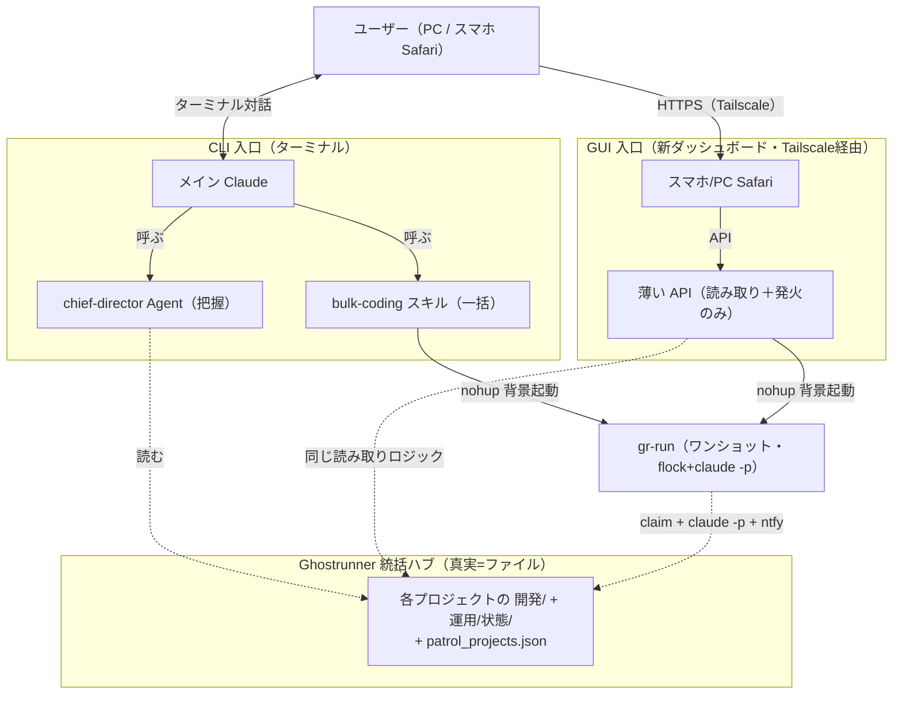
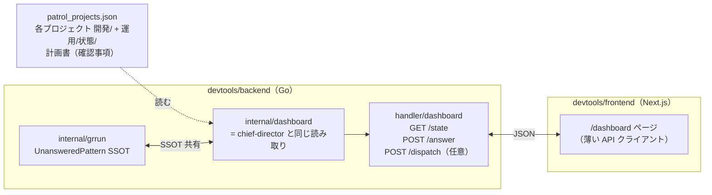

# 検討結果: 統括 GUI 化と巡回ダッシュボード廃止

作成日: 2026-05-26
ステータス: 設計検討（各論点の案・推奨まで整理。最終決定はメインスレッドで取る）

## 検討経緯

| 日付 | 内容 |
|------|------|
| 2026-05-26 | 統括（chief-director の把握＋bulk-coding の一括＋運用把握）の GUI 化、および既存の巡回ダッシュボード（devtools の /patrol + PatrolService）の廃止／置き換えを検討開始 |
| 2026-05-26 | 最終目的を「スマホ Safari でも快適に統括を扱える」「ターミナル CLI と GUI の2系統に統合」「真実は1つ（ファイル）」と明確化。各論点について案＋推奨を整理 |

## 背景・目的

### 現状（2系統が並走している）

Ghostrunner は今、目的が重なる2つの仕組みを抱えている。

| | 統括（新・2026-05-24〜25 で確立） | 巡回ダッシュボード（旧・既存） |
|---|---|---|
| 入口 | Ghostrunner ターミナルの Claude（CLAUDE.md） | devtools フロントエンド（/patrol） |
| 把握 | `chief-director` Agent が `開発/` と `運用/状態/` をファイルから読む | `PatrolService` が in-memory state + SSE + 5分ポーリング |
| 実行 | `bulk-coding` スキル → `gr-run` を `nohup` 背景起動（flock + claim + 終了コード分類 + ntfy） | `PatrolService.StartPatrol` が goroutine セマフォで `claude -p` を直接駆動、状態をメモリ保持 |
| 確認事項 | 計画書の `**ステータス**: 未回答` をファイルでスキャン、回答も計画書に書き戻す | SSE で `question` イベントを拾い、`AnswerForm` から `--resume` で答える |
| 真実源 | フォルダ／計画書／`運用/状態/*.json`（ファイル＝真実） | サービスのメモリ＋プロジェクトのファイル（二重） |

新（統括）が確立された原則は次の通り（2026-05-24 / 2026-05-25 の検討書）。

- フォルダ＝カンバン／状態はファイルから導出（中央DBを持たない）
- 把握＝読み取り（自動）／操作＝状態変更は明示指示のみ
- 委譲型（統括は撃つだけ、ワーカー＝gr-run / claude -p が自律）
- `実行中/`・`運用/` フォルダの有無で opt-in（前方互換）
- 確認事項 SSOT は chief-director.md の `\*\*ステータス\*\*:\s*未回答` パターン
- gr-run = ロック＋起動＋通知のワンショット（常駐なし、終了コードで分類）

旧（巡回）は登場時の必要から `PatrolService` が in-memory 状態と独自の SSE/ポーリングを持っており、
これらの原則と部分的にズレている（in-memory state は再起動で消える＝真実が二重、SSE/--resume は
ファイルベースの確認事項ライフサイクルと別系統）。

### 目的（このドキュメント）

1. 統括の体験を**スマホ Safari からも快適に扱える GUI**に拡張する。ターミナル CLI と GUI の2系統で同じ統括を操作できるようにする。
2. 旧巡回ダッシュボードは**目的が重複**するため廃止／置き換える。原則どおり「真実は1つ（ファイル）」「入口は CLI と GUI の2系統」に統合する。
3. CLI（chief-director / bulk-coding）と GUI が同じ読み取りロジック（patrol_projects.json → 各プロジェクトの 開発/・運用/状態/ → staleness 算出）を見て、同じ世界観で動くようにする。

### 全体像（提案）



ポイント:

- 「真実 = ファイル」は変えない。CLI も GUI も**同じ読み取りロジック**で同じ世界を見る。
- `gr-run` は CLI からも GUI からも `nohup` で発火される（既に bulk-coding がやっている流儀）。
- in-memory state（PatrolService 由来）は持たない。stale 判定は updatedAt / ファイル mtime からその場で計算する。

---

## 論点 1: GUI の MVP スコープ（最小で価値が出る範囲）

「最小で価値が出る」を「スマホで状況把握＋確認事項に答えられる」と置く。書き込み系は段階的に追加する。

### 案 1-A: 把握だけ（読み取り専用ダッシュボード）

含む: プロジェクト一覧、開発カンバン件数（検討中/実装待ち/実行中/完了）、運用状態（kind×account 単位の status / progress / today / stale 強調）、確認事項の未回答件数表示。

- 長所: chief-director の出力を素直に GUI 化するだけ。サーバー側は「ファイルを読んで JSON を返す」だけで済む。スマホで一望でき、原則「把握＝読み取り自動」と完全整合。
- 短所: スマホからは何も操作できない（毎回 Mac のターミナルに戻る必要がある）。

### 案 1-B: 把握＋確認事項回答 UI（推奨）

案 1-A に加えて、各プロジェクトの未回答確認事項を一覧 → 回答 → 計画書に書き戻す（`**ステータス**: 回答済`）まで。

- 長所: 「スマホから統括をハンドルできる」価値が最も大きい。確認事項回答は**書き込み先がファイル1か所**（計画書）で、原則「真実 = ファイル」と整合。CLI とも互換（CLI から回答しても GUI から回答しても結果は同じファイル変更）。
- 短所: 計画書ファイル編集（ステータス行の書き換え）の実装が要る（小〜中）。

### 案 1-C: 案 1-B ＋ 一括 coding ボタン

案 1-B に加えて「実行中/ が空 ＆ 実装待ち/ あり」のプロジェクトに対し、ボタンで gr-run を発火。

- 長所: スマホで「動かす」までできる。bulk-coding スキルの GUI 版。
- 短所: 発火経路（API → exec.Command で nohup gr-run）の実装と、誤発火を防ぐ UX 設計が必要。

### 案 1-D: 案 1-C ＋ 一括運用（`make follow` 起動）

bulk-ops は YAGNI で棚上げされているが、GUI 化のタイミングで足すか検討。

- 短所: 運用統括 Phase2 が棚上げのままなので、GUI だけ先行すると整合性が崩れる。

### 案 1-E: 案 1-C ＋ 通知履歴ビュー

ntfy 履歴を画面内で見られる。

- 短所: ntfy には既にスマホ通知が来るので二重。価値が薄い（不採用寄り）。

### 推奨

**MVP は案 1-B（把握＋確認事項回答）。** 一括 coding ボタン（案 1-C）は MVP 直後の小さな増分として 1.5 ステップ目に置く。

理由:
- 「スマホで状況を見て、確認事項に答えられる」が**外出先で最も嬉しい体験**。一括 coding はターミナルから「一括codingして」と打てば足りており、スマホからの発火は補助的価値。
- 案 1-B までは「真実 = ファイル」を全く動かさない。スマホで安全に試せる。
- 一括運用（案 1-D）は運用統括 Phase2 が棚上げの間は GUI でも棚上げ（YAGNI）。
- 通知履歴（案 1-E）は ntfy で代替できるため不要。

スマホ UX の MVP 配慮（縦長・タッチ）:
- カードはタテ積み（PC の 2 列を MVP では諦めて常時 1 列）
- 確認事項は「展開すると質問本文＋A 案/B 案/自由入力」を出す。フォームは縦長で大きめタップ領域。
- 「stale」「未回答」など要対応はカード左端の太いアクセントバーで視認性を上げる。

---

## 論点 2: バックエンドのアーキテクチャ

chief-director の読み取りロジック（patrol_projects.json → 各プロジェクトの 開発/・運用/状態/ → staleness 算出）を**どこに置くか**が核。

### 案 2-A: devtools backend を残し、PatrolService を引退して薄い API 化（推奨）

- `devtools/backend/internal/service/patrol.go`（in-memory state / SSE / Polling）を廃止し、**新パッケージ `internal/dashboard`（仮）**を作る。
- 提供する API:
  - `GET /api/dashboard/state` — patrol_projects.json を読み、各プロジェクトの開発カンバン件数・確認事項件数・運用ステータス（運用 manifest あれば）・staleness を計算した JSON を返す。
  - `POST /api/dashboard/answer` — 計画書のステータス行（`**ステータス**: 未回答` → `回答済`）と回答本文を書き戻す。
  - `POST /api/dashboard/dispatch` — bulk-coding と同じ条件で対象を絞り、gr-run を `nohup` で背景起動（MVP は無くてもよい）。
- 既存の `cmd/gr-run`、`internal/grrun` パッケージ、ntfy、patrol_projects.json はそのまま再利用。
- 長所:
  - Go 側に既に `internal/grrun`（claim/lock/runner）と patrol_projects.json 読み込みコードがあるため、**読み取りロジックを Go 側に1か所**置き、テストもしやすい。
  - Next.js フロントエンドは API を叩くだけのシンプルな構造（Server Components / API Routes に複雑なロジックを置かない）。
  - スマホからは Next.js の `/api/:path* → http://localhost:8888` プロキシ経由で API を叩ける（既存設定で動く）。
- 短所:
  - devtools backend の常駐は残る（ただし `make backend` で起動する開発用サーバーなのでもともと常駐前提）。

### 案 2-B: devtools backend を撤去、Next.js が直接ファイル IO

- Next.js の API Routes / Server Components が `fs.readFile`、`child_process.spawn` で直接ファイル読み書き＋ gr-run 起動。
- 長所: Go バックエンド廃止できる。新規ランタイムが1つ減る（Next.js だけ）。
- 短所:
  - **Next.js の dev サーバーが死ぬと全部止まる**。今の Go バックエンドは独立してメイン Claude などにも使われており、フロントだけで全部抱えるのはリスク高。
  - gr-run は Go 製で `devtools/backend/gr-run` に置かれている。Next.js から spawn することはできるが、go ビルド成果物への依存を Next.js が持つのは責務が逆。
  - 既存資産（chief-director の手順、gr-run、ntfyService）と二重実装になる（Go と TypeScript で同じ読み取りを書く羽目）。
  - **不採用寄り**。

### 案 2-C: ハイブリッド（読み取りは Next.js、書き込み/gr-run 起動だけ Go API）

- 読み取り（patrol_projects.json → ファイルスキャン → staleness）を Next.js の Server Components で直接実装。書き込みと gr-run 発火だけ Go の薄い API。
- 長所: 読み取りはサーバーサイドレンダリングで速い。
- 短所:
  - 読み取りロジックが Go（chief-director / gr-run）と TS（Next.js）に**重複**する。SSOT が崩れる（`UnansweredPattern` の片方更新漏れ等で chief-director と GUI の結果が食い違うリスク）。
  - chief-director と GUI の挙動を**1か所で揃える保証**が失われる。**不採用寄り**。

### 推奨

**案 2-A（devtools backend を残し、PatrolService 引退＋薄い API 化）。**

理由:
- 「chief-director と同じ世界を GUI から見る」が核要件。SSOT を Go 側に1か所置く案 2-A が最も整合する。
- `internal/grrun` の `UnansweredPattern` 定数は既に chief-director.md と一致する SSOT として存在し、これを GUI 側の API も参照すれば、CLI と GUI の食い違いが原理的に起きない。
- Next.js フロントは「薄い API を叩いて描画する」シンプルな構造で済み、TypeScript 側に読み取りロジックを増やさない。



---

## 論点 3: ライブ更新の仕組み

GUI が「今の状況」を反映する方法。スマホ電池への配慮も必要。

### 案 3-A: シンプルなポーリング（推奨・MVP）

- フロントが N 秒（既定 15 秒）ごとに `GET /api/dashboard/state` を叩く。Visibility API でタブが非アクティブなら停止。
- 長所: 実装が最も簡単・確実。スマホでもブラウザを閉じれば電池消費ゼロ。サーバーは状態を持たない（リクエスト時にファイルを読むだけ）。
- 短所: 即時性に劣る（15 秒ラグ）。だが統括の用途では「分単位の鮮度」で十分。

### 案 3-B: fsnotify → SSE で即時通知

- backend が `~/プロジェクト群/開発/実装/実行中/` などを fsnotify で監視、変更があれば SSE で push。
- 長所: 即時。
- 短所: 監視対象が多い（プロジェクト数 × カンバン3フォルダ＋運用/状態/）。スマホで SSE 接続を張りっぱなしにすると電池消費。fsnotify の制限（macOS の inode 上限）も気になる。MVP の即時性要件には過剰。

### 案 3-C: WebSocket

- 双方向通信。
- 短所: SSE 以上の双方向性は不要（クライアントからの操作は HTTP POST で十分）。複雑度に対する利点が薄い。

### 推奨

**MVP は案 3-A（ポーリング 15 秒）。** 旧巡回の `PollingInterval = 5 * time.Minute` は新 GUI には遅すぎるので 15 秒に短縮。
将来即時性が必要になれば案 3-B を追加（破壊変更にならない＝API 互換）。

スマホ電池への配慮:
- `document.visibilityState === 'hidden'` ならポーリング停止
- スリープから戻ったら即 1 回叩いて画面を最新化、その後 15 秒間隔再開

---

## 論点 4: 巡回ダッシュボードの廃止戦略

### 案 4-A: 即削除

- 現在の `/patrol` ルート、`PatrolHandler`、`PatrolService`、`patrol/*.tsx` を一気に消し、新 GUI と入れ替える。
- 長所: コードベースが綺麗。二重メンテ無し。
- 短所: 新 GUI が想定外の不具合を出した時、戻る場所がない。

### 案 4-B: フィーチャーフラグで共存（短期）

- 既存 `/patrol` を残し、新ルート `/dashboard` を追加。1〜2 週間ほど併存させ、問題なければ削除。
- 長所: 移行リスクが低い。
- 短所: 二重メンテ期間がある。

### 案 4-C: `/patrol` を新 GUI にリダイレクト

- 旧 URL に来たら新 `/dashboard` に 302 リダイレクト。バックエンドの PatrolService は消す。
- 長所: ブックマーク等の互換性が残る。
- 短所: 案 4-A とほぼ同じ（中身は新に置き換え）。

### 案 4-D: 段階的（read-only 化 → 廃止）

- 旧 PatrolService を一旦 read-only（StartPatrol を no-op に）にして、表示だけ残す → 数日後に削除。
- 長所: 「巡回が動かない」と「ページごと消えた」を分けられる。
- 短所: 中途半端な期間が長い。

### 推奨

**案 4-B（短期フィーチャーフラグ共存）→ 検証後に案 4-C（リダイレクト＋PatrolService 削除）。**

理由:
- 案 4-A は心理的に怖い。案 4-D は手間に見合わない。案 4-B → 4-C のステップが手戻りリスク最小。
- 共存期間中は旧巡回は「動くが新規実行はしない」運用（READMEで案内）。新 GUI で確認事項回答が安定動作することを目視確認してから旧を畳む。

### 再利用可否

旧コード資産の扱い:

| 既存資産 | 扱い | 理由 |
|---|---|---|
| `patrol.go`（PatrolService） | **廃止** | in-memory state / SSE / Polling は新原則と二重 |
| `handler/patrol.go`（HTTP ルート） | **廃止**（互換のためルート1つだけ 410/リダイレクト残してもよい） | API 形状が新と違う |
| `patrol_types.go` | **新 dashboard 用に作り直し**（PatrolStatus enum は GUI 用に再設計） | 旧の `StatusRunning` 等は in-memory 前提 |
| `patrol_projects.json` | **そのまま再利用**（読み込み関数だけ dashboard に移す） | プロジェクト一覧の SSOT |
| `usePatrolSSE.ts` / `patrolApi.ts` | **廃止** | SSE 自体を使わない |
| `ProjectCard.tsx` / `PatrolHeader.tsx` / `ProjectRegister.tsx` | **新 `/dashboard` 配下に再設計**（部分流用は可） | カード表示の構造は使えるが、表示項目（開発カンバン件数＋運用ステータス）が違う |
| `AnswerForm.tsx` | **流用**（質問テキスト＋自由入力フォーム部分） | 形が近い。回答送信先 API だけ差し替え |

---

## 論点 5: even-terminal の位置づけ

even-terminal は Ghostrunner ターミナルから補助的に別ウィンドウ／同一セッションを開く仕組み（過去の検討記録に登場）。

### 案 5-A: そのまま残す（補助・パワーユーザー用）（推奨）

- GUI 化後も、ターミナル派・複雑な対話を必要とするユーザーは even-terminal で並列ウィンドウを開ける。
- 長所: 既存ユーザーの体験を壊さない。GUI は「日常の覗き見」、even-terminal は「腰を据えた対話」と棲み分けできる。
- 短所: 学習コストは残る（ただし強制ではない）。

### 案 5-B: 廃止案内

- 短所: GUI だけでは「対話の文脈を別窓で開く」用途が再現できない（GUI に Claude 対話を埋め込むのは複雑度が跳ね上がる）。スマホ運用には GUI で十分だが、Mac 上の腰を据えた作業には even-terminal が便利。**廃止する利点が薄い**。

### 案 5-C: GUI に統合（Claude 対話を埋め込み）

- 短所: マネージャー構想の「難しい」課題（claude.ai/code セッション接続）に正面衝突。MVP では無理。

### 推奨

**案 5-A（そのまま残す）。** GUI とは目的が直交する（GUI = スマホでの状況把握＋軽い操作、even-terminal = Mac での深い対話）。

---

## 論点 6: GUI の配布範囲

### 案 6-A: devtools 配下に置き、Ghostrunner だけが持つ（推奨）

- GUI は `devtools/frontend/src/app/dashboard/` 配下に置く。
- 各プロジェクトには配布しない（chief-director / bulk-coding は `/init` で配られるが、それらは「単体層」。GUI は「統括層」に属する）。
- 長所: Ghostrunner = 統括ハブ という二層構造（既存決定）と整合。各プロジェクトの devtools をビルドする必要がない。
- 短所: 特になし。

### 案 6-B: templates にも入れ、生成プロジェクトでも使える

- 短所:
  - 「Ghostrunner だけが2つの層（統括＋単体）を持つ」既存決定と矛盾。各プロジェクトは単体層のみ。
  - 各プロジェクトに統括 GUI を配ると「どこから見るのが正しいか」がブレる。

### 推奨

**案 6-A。** chief-director / bulk-coding が単体層に配られていないのと同じ理由。GUI は Ghostrunner の devtools 限定。

---

## 論点 7: GUI から gr-run を呼ぶ機構

「スマホでボタン押下 → Mac で gr-run 起動」をどう実現するか。MVP では一括 coding ボタンは 1.5 ステップ目（論点1 の推奨）に置いたので、ここは設計のみ整理。

### 案 7-A: backend が `exec.Command` で nohup 起動（推奨）

- `POST /api/dashboard/dispatch` を受けたら、backend が bulk-coding と同じコマンドラインで gr-run を背景起動する:
  ```text
  nohup <gr-run> --project <path> --task <file> </dev/null >/dev/null 2>&1 &
  ```
- 長所: bulk-coding スキルの流儀（nohup background）とまったく同じ。Mac 側に新しい仕組みを増やさない。
- 短所: backend が動いている前提（既に開発時には動いている）。

### 案 7-B: launchd プラグイン / メッセージキュー

- 短所: 過剰。

### 推奨

**案 7-A。** 既存の bulk-coding スキルの起動コマンドを Go から呼ぶだけで、新概念ゼロ。

UX 設計の注意:
- 「一括 coding を発火」は破壊的に見えるので、押下時にプロジェクト名一覧と「N 件を起動します」確認モーダル必須。
- 起動結果（どのプロジェクトに gr-run を撃ったか）はトーストでフィードバック。

---

## 論点 8: 運用軸の GUI

chief-director の運用出力（kind×account 単位、stale/blocked/連続エラー強調、updatedAt 経過時間）を GUI で表現する。

### 案 8-A: プロジェクトカード内に運用セクションを横並び（推奨）

- 1 プロジェクト = 1 カード。カード内に「開発カンバン」「運用ステータス」のセクション。
- 運用セクションは kind×account 単位の小さなカードを縦に並べる:
  ```
  [auto-follow/akiba]  running  300フォロー  本日12/40   stale 4h
  [auto-follow/sub]    blocked  150フォロー  本日0/40    制限検知で停止
  ```
- 要対応（stale / blocked / consecutiveErrors >= 3）は赤系の太いボーダーで強調。
- 運用なしのプロジェクトは運用セクションを描画しない（前方互換）。
- 長所: chief-director の「単一ダッシュボード」哲学と整合。スマホ縦長画面では 1 プロジェクトずつ縦スクロール。
- 短所: 運用が多いプロジェクトでカードが縦に長くなる（許容）。

### 案 8-B: 開発と運用を別タブ

- 短所: chief-director の単一ダッシュボード哲学に反する。タブ切り替えで情報が分断される。

### 推奨

**案 8-A（カード内横並び）。** chief-director の出力フォーマットを素直に GUI に写す。

表示の整合性:
- chief-director の出力テキストを参考に、API レスポンスも「開発サマリ + 運用サマリ（kind×account ごと）」の構造で返す。
- stale 判定は chief-director と同じく `(now - mtime) / 3600 >= 3` を Go 側（dashboard サービス）で行い、レスポンスに `stale: true`、`staleHours: N` を含める。フロントは表示するだけ。

---

## 論点 9: 確認事項の回答 UI

既存の `AnswerForm.tsx` は「セッションに `--resume` で答えを送る」想定で作られている。新統括では「**計画書ファイルにステータスを書き戻す**」流儀なので、API と送信先が違う。

### 案 9-A: AnswerForm を流用、API だけ差し替え（推奨）

- フォームの見た目（質問文 + 自由入力テキストエリア + 送信ボタン）はそのまま再利用。
- 送信先を `POST /api/patrol/resume`（旧）から `POST /api/dashboard/answer` に変更。
- リクエストボディは `{ projectPath, planFilePath, questionId or position, answer }`。
- backend は計画書を読み、該当ステータス行（`**ステータス**: 未回答`）を `回答済` に書き換え、回答本文を追記する。
- 長所: UI 資産を再利用、書き込み先が「ファイル1か所」に閉じる。CLI（メイン Claude）が同じ書き換えをしても結果は同じ。
- 短所: 「どのステータス行を書き換えるか」の特定が必要（後述）。

### 案 9-B: 新規フォームを書く

- 短所: 既存資産がほぼそのまま使えるので不要。

### 推奨

**案 9-A。**

書き換え位置の特定方法（細目・/plan で詰める）:
- API レスポンスの確認事項に `{ planPath, lineStart, lineEnd, questionText }` のメタ情報を含めて返す。
- POST /api/dashboard/answer は `planPath` と `lineStart` を受け取り、その位置の `**ステータス**: 未回答` を `回答済` に書き換え、直後に「回答: <本文>」を追記する。
- SSOT は引き続き `UnansweredPattern = \*\*ステータス\*\*:\s*未回答`（gr-run の types.go と chief-director.md と一致）。書き換え後は `**ステータス**: 回答済` の正規形にする（後で chief-director / gr-run が「回答済」とみなせるように）。

確認事項回答後の再ディスパッチは MVP では手動（ユーザーが GUI で「一括 coding 発火」を押すか、ターミナルで「一括codingして」と打つ）。半自動化は次フェーズ。

---

## 論点 10: 認証・アクセス制御

旧巡回は Tailscale 前提で認証薄かった（`/api/patrol/*` は誰でも叩ける）。新 GUI も同じでよいか。

### 案 10-A: Tailscale 前提・認証なし（推奨・MVP）

- 旧巡回と同じ。Mac の Tailscale IP（100.68.245.31:3333）に Tailscale 認証済み端末からだけアクセス可。
- 長所: 個人開発フレームワーク前提。Tailscale 自体が認証層。
- 短所: Tailscale 経由でない人（家族端末など）からは事故的にアクセス可能性。だが個人運用環境では実害ゼロ。

### 案 10-B: シンプルなトークン認証

- `Authorization: Bearer <token>` で API 保護。
- 長所: 念のための二重認証。
- 短所: スマホからトークンを設定する手間。MVP 不要。

### 案 10-C: OAuth / SSO

- 短所: 個人ツールに過剰。

### 推奨

**案 10-A（Tailscale 前提）。** 既存の `next.config.ts` のプロキシ設定 + Tailscale で実用十分。書き込み API（`/answer`, `/dispatch`）が増えるが、Tailscale 認証済み端末のみで運用するなら追加認証は不要。
将来必要になれば案 10-B を CSRF 対策とともに追加（破壊変更にならない）。

---

## MVP 提案（推奨案を集約）

### MVP 範囲（最小）

1. **GUI ページ `/dashboard`**: プロジェクト一覧、開発カンバン件数、運用ステータス（kind×account 単位、stale 強調）、未回答確認事項一覧。スマホ縦 1 列レイアウト。
2. **確認事項回答 UI**: 各プロジェクトの未回答確認事項に答える → 計画書のステータス行を `回答済` に書き換え。
3. **薄い Go API**:
   - `GET /api/dashboard/state`（chief-director と同じ読み取りロジックを Go 側に実装、SSOT 共有）
   - `POST /api/dashboard/answer`（計画書のステータス書き換え）
4. **ポーリング**: 15 秒間隔、可視性に応じて停止。
5. **旧 /patrol との共存**: 旧ページは残したまま新 `/dashboard` を追加。1〜2 週間検証後に旧を削除。
6. **PatrolService の引退準備**: 新 API 完成後、旧 PatrolService 関連コード（`patrol.go` / `handler/patrol.go` / `patrol_types.go` の不要部分 / `usePatrolSSE.ts` / `patrolApi.ts` / `patrol/*.tsx`）を削除。

### MVP に含めない（次フェーズ）

- **一括 coding 発火ボタン**（GUI から `POST /api/dashboard/dispatch` → gr-run nohup）。MVP+1 で追加。
- **一括運用ボタン**（bulk-ops 連動）。運用統括 Phase2 と同期して棚上げ（YAGNI）。
- **即時更新（SSE / fsnotify）**。ポーリングで足りる。
- **通知履歴ビュー**。ntfy で代替。
- **認証強化**。Tailscale で十分。
- **異常終了の解消 UI**（差し戻し／完了扱い）。CLI 側でも未実装（人間トリガー）。

### MVP の実装単位の見積（粗）

| 項目 | 工数感 |
|---|---|
| Go: `internal/dashboard` 新規（状態算出ロジック、chief-director と同じ読み取り） | 中 |
| Go: `handler/dashboard.go` 新規（GET /state, POST /answer） | 小 |
| Next.js: `/dashboard` ページ＋カードコンポーネント（スマホ縦 1 列） | 中 |
| Next.js: 確認事項回答フォーム（AnswerForm 流用＋API 差し替え） | 小 |
| 旧 PatrolService 撤去（共存期間後） | 小 |
| 計画書ステータス書き換えロジック＋テスト | 小 |

---

## 原則との矛盾チェック

| 原則 | チェック | 整合性 |
|---|---|---|
| フォルダ＝真実／状態はファイルから導出 | 新 dashboard サービスはファイルだけを真実源にする（in-memory state 廃止）。`UnansweredPattern` も gr-run の SSOT を共有 | 整合 |
| 把握＝読み取り自動／操作＝明示指示 | GET /state は読み取りのみ。POST /answer, /dispatch は明示的なボタン操作（ユーザーアクション）が必要。把握と操作の境界が API レベルで分かれる | 整合 |
| 委譲型（統括は撃つだけ、ワーカー自律） | /dispatch は gr-run を nohup で発火するだけ。CLI の bulk-coding と完全に同じ流儀 | 整合 |
| `実行中/`・`運用/` フォルダの有無で opt-in（前方互換） | dashboard サービスはフォルダがなければ 0 件扱い（chief-director と同じ実装方針） | 整合 |
| 確認事項 SSOT は chief-director.md のパターン | dashboard サービスは `internal/grrun` の `UnansweredPattern` 定数を import 共有。書き戻しも `回答済` の正規形にする | 整合 |
| 単一指揮官・並列ワーカー | GUI からの発火も nohup gr-run（複数並列ワーカー）、状態は1か所（ファイル） | 整合 |

矛盾は見つからなかった。新 GUI は CLI と「同じファイルを読み、同じファイルに書き、同じ gr-run を撃つ」構造になる。

---

## スマホ UX への配慮（MVP 範囲）

- **レイアウト**: PC で 2 列、スマホ（< 768px）で 1 列。常に縦スクロール前提。`max-w-[900px]` を MVP では維持。
- **タップターゲット**: 確認事項回答フォームの送信ボタンは min-height 48px、横幅は親いっぱい。
- **要対応の視認性**: カード左端に 4px のアクセントバー（赤=要対応 / 黄=確認事項待ち / 青=実行中 / 灰=静観）。chief-director の `[要対応]/[進行]/[静観]` テキストプレフィクスと対応。
- **stale の見せ方**: `4時間無更新（実行停止疑い）` のような自然文を運用カードに 1 行で添える（chief-director 出力と同じ語彙）。
- **ポーリング停止**: タブが背景に入ったら 15s ポーリング停止 → 復帰時に即 1 回叩いて再開。電池配慮。
- **書き戻し失敗時のフィードバック**: 計画書書き換えに失敗したらトースト＋元の UI 状態に戻す（楽観的更新でなくサーバー結果を待つ pessimistic UI）。

---

## 残る論点（/plan で詰める／MVP を止めない細目）

- 計画書ステータス行の特定方法: 行番号で持つか、ID/UUID を計画書側に埋めるか。MVP は行番号で行く（chief-director も Grep ベースで行番号を扱える）。
- 計画書書き換えのロック: 同じ計画書を CLI と GUI が同時に書く可能性は低いが、`os.Rename` パターンで原子的に置き換える。
- staleness 閾値（3 時間既定）は GUI でも同じ。設定変更の UI は MVP 外。
- 旧 PatrolService の `--resume` ベース運用を新 GUI が再現する必要があるか → 新原則は `--resume` を使わない（ファイル書き戻し＋新規 claude -p で再起動）。旧の resume 動線は廃止。
- 一括 coding ボタン（MVP+1）の UX 詳細（誤発火防止モーダル文言、起動結果表示）。
- 認証の将来拡張（案 10-B）の具体は MVP+ で再検討。

---

## 主要決定の確定（メインスレッドで確認・2026-05-26）

検討書の論点ごとの分析を踏まえ、メインスレッドで以下を確定した。検討書の各推奨と差分がある場合はここを優先する。

### 確定した MVP スコープ

**MVP ＝ ダッシュボード（把握）＋ チャット入力（テキスト＋音声）＋ 確認事項回答 UI ＋ 進捗把握ショートカットボタン ＋ 応答の音声読み上げ（TTS）**

- **チャット入力は even-terminal の既存 API（`/api/prompt`・`/api/sessions` 等）に乗せる**（論点 2-A の補完）。新規でチャット層を作らない。これにより:
  - スマホ OS キーボードの音声入力がそのまま使える（even-terminal が既にスマホ運用で実証済み）
  - セッション管理・履歴・ストリーミング応答を一から作る重さが消える
- **一括codingボタン／一括運用ボタンは MVP 不要**。チャットで「一括codingして」「フォロー一括で」と打つ／喋れば、既存の `bulk-coding` スキル（および将来の bulk-ops）がそのまま発火する。**チャット入力が万能の入口**になるためボタン UI を別に作る必要がない。これは検討書の論点 1-B 推奨を超える、よりミニマルな MVP。
- **進捗把握ショートカットボタンは MVP 必須**（最頻アクションへの例外）。ワンタップで `状況は？` をチャット送信し chief-director の横断報告を返す＋ダッシュボードカードを即時リフレッシュ。タイピング／発話なしのハンズフリー状況把握を実現。ボタン UI を「最も頻度の高い 1 アクションだけ」に限定することで「チャット入力が万能の入口」原則と両立する。
- **応答の音声読み上げ（TTS）は MVP 必須**。実装は **Web Speech API（`window.speechSynthesis`、ja-JP）**：ブラウザ標準・追加 API 不要・モバイル Safari 対応・コスト 0。要件:
  - 応答受信時に自動読み上げ。ON/OFF トグル必須（運転中など読み上げを切りたい場面）
  - モバイル autoplay 制限を踏まえ、**最初の TTS 発火はユーザー操作起点**（送信ボタン／進捗把握ボタン押下の続きとして）。初回が鳴らない可能性は仕様として許容
  - 新規応答到着時は **`speechSynthesis.cancel()`** で前の読み上げを中断してから新応答を開始
  - ストリーミング応答は MVP では **全文受信完了→一括読み上げ** で十分。チャンク逐次読みは MVP+ で扱う
  - 読み上げ速度・声の選択は MVP では既定値（ブラウザの ja-JP デフォルト）固定。設定 UI は MVP 外
- フロントのみで完結する追加（進捗把握ボタン・TTS とも）。バックエンド API 追加は不要。

### 他論点の確定（検討書の推奨どおり採用）

- 論点 2: バックエンド構成 → 案 2-A（devtools backend 残し、PatrolService 引退、薄い読み取り API ＋ 計画書書き戻し API）。**加えて Next.js の `rewrites` で `/api/prompt`・`/api/sessions` 系を even-terminal の `:3456` に proxy する経路を確立**（チャット入力の足回り）。
- 論点 3: ライブ更新 → 案 3-A（15 秒ポーリング、タブ非可視で停止）。
- 論点 5: even-terminal → 案 5-A（残す）。さらに**チャット入力の実体としても活用**（補助以上の役割になる）。
- 論点 6: 配布 → 案 6-A（devtools 配下、Ghostrunner 限定）。
- 論点 7: gr-run 呼び出し → 案 7-A（backend が `exec.Command` で nohup 起動）。ただし**MVP では使わない**（チャット経由で `bulk-coding` から発火されるため）。専用 /dispatch API は MVP+ で需要が出てから判断。
- 論点 8: 運用軸 UI → 案 8-A（カード内に開発＋運用を横並び）。
- 論点 9: 確認事項回答 UI → 案 9-A（AnswerForm 流用＋API 差し替え、計画書ファイルへ書き戻し）。
- 論点 10: 認証 → 案 10-A（Tailscale 前提・認証なし）。

### 確定保留（parked）

- **論点 4: 巡回ダッシュボードの廃止スケジュール** → 実装フェーズの後半で再評価する。MVP 完了後、新 GUI が実運用に耐えるか見た上で 4-B（短期共存→撤去）／4-A（即撤去）／4-D（段階廃止）を最終判断。`/patrol` ルートと PatrolService の撤去は MVP 完了後の別タスク。

---

## 次のステップ

1. `/plan` で実装計画化する。主要成果物の例:
   - `devtools/backend/internal/dashboard/`（読み取りサービス、chief-director と同じ SSOT を共有）
   - `devtools/backend/internal/handler/dashboard.go`（GET /state, POST /answer）
   - `devtools/frontend/next.config.*` の `rewrites` に `/api/prompt`・`/api/sessions` 系を even-terminal `:3456` へ proxy する経路追加（チャット入力の足回り）
   - `devtools/frontend/src/app/dashboard/page.tsx` ＋ `components/dashboard/*.tsx`（**ダッシュボード＋チャット入力欄＋応答表示＋進捗把握ショートカットボタン＋TTSトグル**の一体画面、スマホ縦 1 列レイアウト）
   - `devtools/frontend/src/hooks/useDashboard.ts`（15 秒ポーリング + 可視性連動）
   - `devtools/frontend/src/hooks/useTTS.ts`（Web Speech API ラッパ: `speak(text)` / `cancel()` / 言語設定 ja-JP / トグル状態管理）
   - 既存 even-terminal セッション一覧／履歴／プロンプト送信を呼び出すクライアント関数群
   - 旧 PatrolService 関連の削除（**廃止スケジュール parked**・MVP 完了後の別計画）
2. 計画確定後、`開発/実装/実装待ち/` に計画書を移動。
3. （MVP 完了後）巡回廃止の最終判断、専用 /dispatch（一括 coding ボタン）の要否判断、半自動再ディスパッチを次フェーズで検討。
