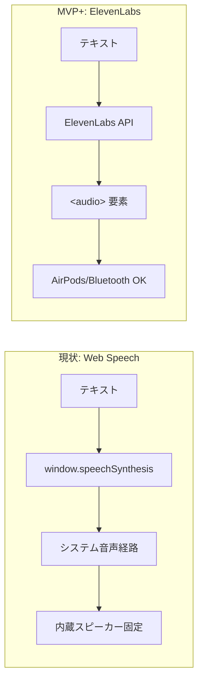
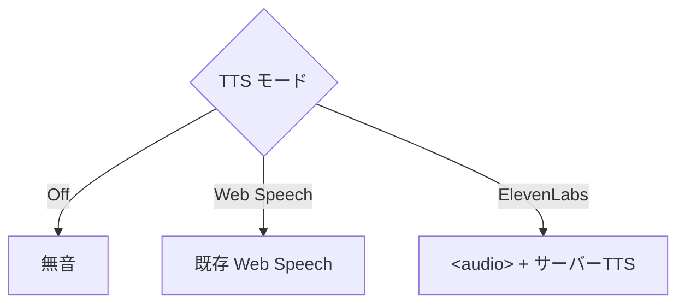
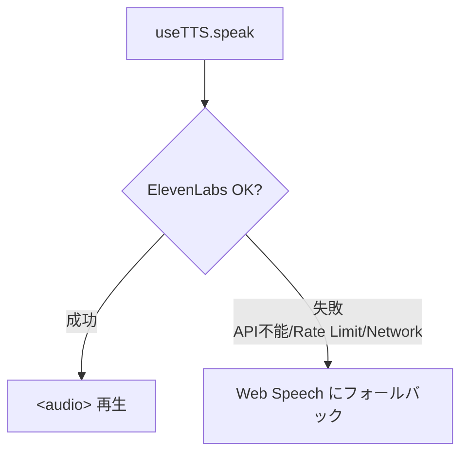
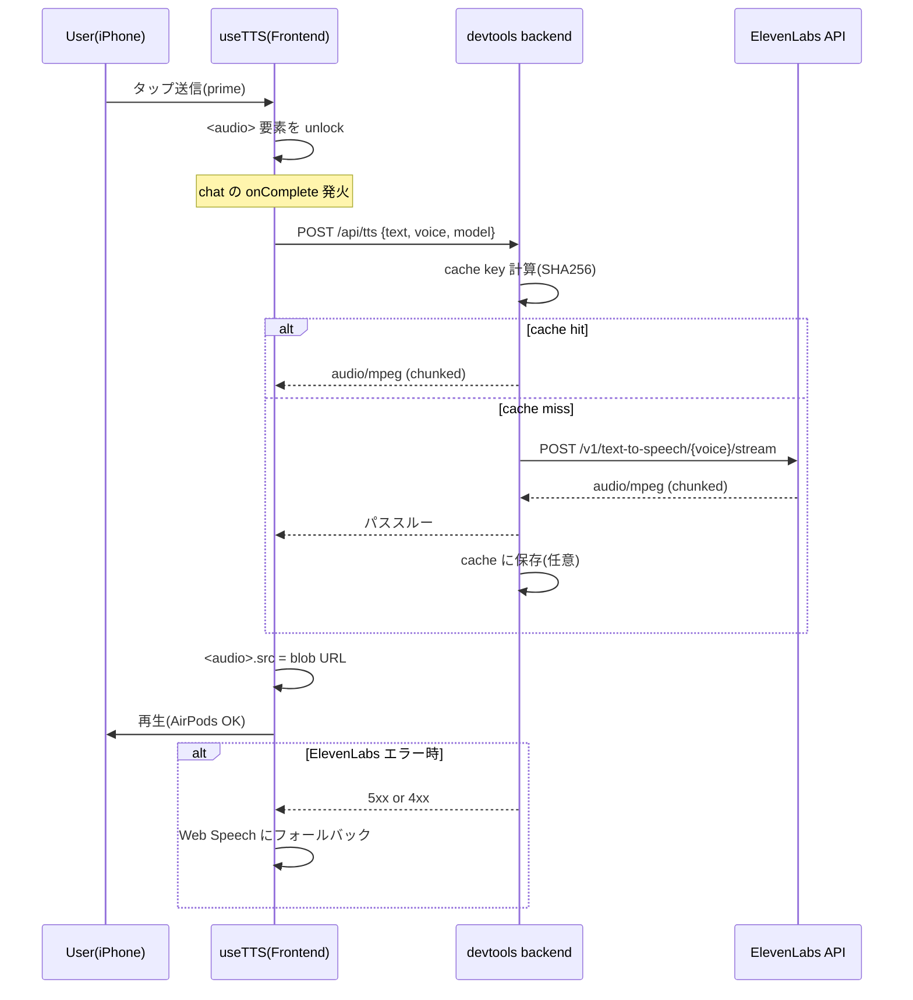

# ElevenLabs サーバーTTS化 (MVP+)

## 検討経緯

| 日付 | 内容 |
|------|------|
| 2026-05-26 | 統括GUI化の検討書で MVP+ 候補に「サーバー側TTS+MediaSession(背景再生)」をパーク |
| 2026-05-27 | 統括GUI MVP(feat/dashboard-gui)実機検証で iOS Safari Web Speech の 2 制約が顕在化(音質ロボット調・出力経路が内蔵スピーカー固定)。ユーザーが ElevenLabs での MVP+ 化を選択。本検討書を起票 |

---

## 背景

統括GUI MVP は feat/dashboard-gui ブランチでほぼ完了し、iPhone 実機 + Tailscale 経由で動作確認済み。しかし TTS 周りで以下 2 つの制約が発覚した。

### 制約 1: 音質がロボット調

現在の TTS は Web Speech API (`window.speechSynthesis`)。iOS Safari では裏で `AVSpeechSynthesizer` が動き、OS 標準音声(Kyoko 等)が使われる。日本語の自然さに欠け、長文を読み上げると単調で聞き疲れする。

### 制約 2: AirPods/Bluetooth に出力されない

Web Speech は HTML5 `<audio>` ではなく**システム音声経路**で再生されるため、iOS では Bluetooth ルーティング設定の影響を強く受け、AirPods 接続中でも**iPhone 内蔵スピーカーから鳴る**事象が発生する。家庭や移動中の利用シナリオでは致命的。



---

## 目的

- **自然な日本語音声**で統括の応答を読み上げる
- **AirPods/Bluetooth 出力経路**に乗る再生方式に切り替える
- **既存の useTTS インターフェース**を温存し、ページ層(`dashboard/page.tsx`)の改修を最小化
- **コスト管理可能**: 月額予算内に収まる構成(目安: $5〜$22/月)
- **ON/OFF 切替**で既存 Web Speech にいつでも戻せる安全網を残す

---

## 技術調査(WebSearch 結果 / 2026-05-27 時点)

### ElevenLabs モデルラインナップ

| モデルID | 特徴 | 言語数 | 日本語 | レイテンシ | 文字制限 | 主用途 |
|---------|------|-------|--------|----------|---------|--------|
| `eleven_v3` | 最新フラグシップ、感情豊か、文脈理解優秀 | 70+ | あり | 高め | 5,000字/req | 長文ナレーション、表現重視 |
| `eleven_multilingual_v2` | 安定の定番、自然・感情豊か | 29 | あり | 中 | 通常 | 汎用、ナレーション |
| `eleven_turbo_v2_5` | 高速、Flash と同等品質 | 32 | あり | 低 | 通常 | リアルタイム寄り |
| `eleven_flash_v2_5` | 超低レイテンシ(~75ms) | 32 | あり | 最低 | 通常 | 会話AI、即応性重視 |

**統括GUIの読み上げ用途では `eleven_multilingual_v2` か `eleven_flash_v2_5` が候補**。前者は自然さ重視、後者は応答性重視。`eleven_v3` は新しいが課金単価が高い可能性 + 5000字制限があり、長文を分割する手間が増える。

### 日本語対応 Voice

ElevenLabs の Voice Library に複数の日本語デフォルト音声が存在する。

- **Kyoko** — 落ち着いた女性
- **Ishibashi** — 落ち着いた男性、東京アクセント
- **Konoha** — プレミアム女性、自然なリズム、クリア
- **Soh** — 若い男性、穏やか
- **Taro** — 柔らかい男性、抑揚豊か、ナレーション向き
- **Akira** — スムーズな男性、東京アクセント
- **Hideki** — 落ち着き、ニュース読み向き
- **Sekishusai** — アニメ調、関西弁

**注意**: Voice の voice_id は API でリスト取得可能。試聴は ElevenLabs サイト(`/voice-library`)で行うのが手早い。

### 料金プラン(2026-05-27 時点)

| プラン | 月額 | 月間クレジット | 商用利用 | 音質上限 | 想定TTS時間 |
|-------|------|--------------|---------|---------|------------|
| Free | $0 | 10,000 | **不可**(クレジット表記必須) | 標準 | ~10分 |
| Starter | $5 | 30,000 | 可 | 標準(mp3 128kbps相当) | ~30分 |
| Creator | $22 | 121,000 | 可 | 192kbps | ~100分 |
| Pro | $99 | 600,000 | 可 | 44.1kHz PCM | ~500分 |

**クレジット消費**:
- Multilingual v2: 1 文字 = 1 クレジット
- Flash/Turbo: 0.5〜1 クレジット/文字(プラン依存)

**月間消費量見積**:
- 想定: 1日10回 × 平均500字 × 30日 = **15万字/月**
- Multilingual v2 なら 15万クレジット → **Creator($22) が最低ライン**
- Flash v2.5 なら 7.5万〜15万クレジット → **Creator で余裕、ぎりぎり Starter も可能性あり**

**超過時挙動**: 各プランは usage-based overage が設定可能(設定ONなら追加課金、OFFなら停止)。MVP+ では OFF を推奨し、停止時は Web Speech にフォールバックする運用が安全。

### Streaming API 仕様

- **エンドポイント**: `POST https://api.elevenlabs.io/v1/text-to-speech/{voice_id}/stream`
- **方式**: HTTP chunked transfer encoding で MP3(またはPCM/μ-law)のバイト列を逐次返す
- **デフォルト output_format**: `mp3_44100_128`(MP3 / 44.1kHz / 128kbps)
- **リクエストヘッダ**: `xi-api-key: <KEY>`
- **body**: `{ "text": "...", "model_id": "eleven_multilingual_v2", "voice_settings": { "stability": 0.5, "similarity_boost": 0.75 } }`
- **音質上限**: 192kbps は Creator+、PCM 44.1kHz は Pro+(MVP+ では `mp3_44100_128` か `mp3_44100_64` で十分)
- **WebSocket 版** (`/stream-input`) もあるが、MVP では HTTP chunked で十分

---

## 既存実装の確認

### useTTS インターフェース(`devtools/frontend/src/hooks/useTTS.ts`)

```ts
interface UseTTSReturn {
  speak: (text: string) => void;
  cancel: () => void;
  enabled: boolean;
  setEnabled: (v: boolean) => void;
  isSpeaking: boolean;
  error: string | null;
  prime: () => void; // iOS Safari autoplay unlock
}
```

### 呼び出し側(`dashboard/page.tsx`)

- `tts.speak(fullText)` を `chat.onComplete` から呼ぶ
- `tts.prime()` を `handleGrasp`/`handleChatSend` の同期スコープで呼ぶ(タップ unlock)
- `tts.cancel` を `chat.onSessionSwitch` に渡す

### バックエンド構成

- devtools backend(Go + Gin, :8888)が `/api/dashboard/*` を提供
- even-terminal(:3456)が `/api/prompt`, `/api/events`, `/api/sessions/*` 等を提供
- frontend `next.config.ts` の rewrites で振り分け済み
- **`/api/tts` を追加するなら devtools backend(:8888) 側が自然**(API キー管理・キャッシュとも Go 側で完結)

---

## 設計案

### 案A: 完全置換(Web Speech 廃止)

```mermaid
flowchart LR
    UI[useTTS.speak] --> FE_AUD["&lt;audio&gt; element"]
    FE_AUD --> BE[/api/tts プロキシ]
    BE --> EL[ElevenLabs API]
    EL --> BE
    BE --> FE_AUD
```

- **概要**: useTTS の内部実装を完全に `<audio>` + サーバーTTS に差し替え。Web Speech 関連コード(voiceschanged, cancel→speak の 50ms 待機 等)を削除。
- **メリット**:
  - コード見通しが良い、保守対象が1つに減る
  - 全ユーザーで音質一定
- **デメリット**:
  - API キー未設定/レート制限/オフライン時に**読み上げ機能ごと死ぬ**
  - 試聴・チューニング期間に無音事故が起きやすい
  - 課金が必ず発生(Web Speech に逃げられない)
- **工数感**: 中

### 案B: 二段構え(Web Speech と ElevenLabs を ON/OFF で選択)



- **概要**: TTS トグルを「OFF / Web Speech / ElevenLabs」の三択(またはサブメニュー)に拡張。ユーザーが明示選択。
- **メリット**:
  - 課金を抑えたい時に手動で Web Speech に切替可能(節約モード)
  - 段階的に ElevenLabs に移行できる、A/B 試聴に便利
- **デメリット**:
  - UI 複雑化(TTSToggle を選択 UI に拡張)
  - useTTS が二経路を抱える=実装複雑度がやや上がる
- **工数感**: 中〜やや大

### 案C: フォールバック型(ElevenLabs を基本、失敗時のみ Web Speech)



- **概要**: 既定で ElevenLabs を使い、API キー欠如/HTTP エラー/ネットワーク不能を検知したら自動で Web Speech に降格。ユーザーから見れば「常に何かしらは喋る」。
- **メリット**:
  - 障害耐性が最も高い(無音事故ゼロを狙える)
  - ユーザーは設定不要、UI 変更最小
  - API キー未設定状態でも一応動く(開発・他ユーザー環境)
- **デメリット**:
  - 内部実装やや複雑(成否判定とフォールバックパス)
  - フォールバック発生がユーザーに気づかれにくい(音質が突然落ちる)→ UI 通知が要る
- **工数感**: 中

### 案D(参考): MVP++ の WebSocket ストリーミング

- **概要**: HTTP chunked ではなく `/stream-input` WebSocket で文ごとに小刻みに再生開始
- **メリット**: 体感レイテンシが大幅に下がる(最初の音が出るまで 1 秒未満も可能)
- **デメリット**: 実装複雑、MVP+ には過剰。**スコープ外**として後送り。

---

## MVP+ 推奨案

### 推奨: **案C(フォールバック型)**

理由:

1. **無音事故を最小化**: ElevenLabs の課金停止・APIキー無効・モバイル回線断などの想定可能なリスクで「読み上げが完全に死ぬ」事態を避けられる。
2. **UI 変更が最小**: 既存の TTSToggle(ON/OFF)を維持できるので、page.tsx / TTSToggle / useTTS のインターフェースは無改修。
3. **段階導入と相性が良い**: API キー未設定の開発環境では自動的に Web Speech にフォールバックするので、本番だけ ElevenLabs を有効化できる。
4. **将来 案B(明示切替)への発展は容易**: フォールバック実装ができていれば、後でトグル UI を増やすのは小改修。

二次推奨: **案B**(節約モードが欲しくなった場合に検討)

---

## 実装スコープ概要(MVP+)



### バックエンド変更(devtools backend / Go)

- 新規ハンドラ `POST /api/tts`
  - リクエスト: `{ text: string, voice_id?: string, model_id?: string }`
  - ElevenLabs `/v1/text-to-speech/{voice_id}/stream` をリバースプロキシ
  - レスポンス: `Content-Type: audio/mpeg` のまま chunked で返却
  - 認証ヘッダ `xi-api-key` を環境変数 `ELEVENLABS_API_KEY` から付与
  - エラー時は 5xx を返し、フロント側でフォールバック発火
- 環境変数経由の設定(`ELEVENLABS_API_KEY`, `ELEVENLABS_DEFAULT_VOICE_ID`, `ELEVENLABS_DEFAULT_MODEL`)
- (任意) 短期キャッシュ: `text` の SHA256 をキーに `/tmp` or インメモリ LRU、24h 程度

### フロントエンド変更(useTTS)

- 既存インターフェース(`speak/cancel/enabled/setEnabled/isSpeaking/error/prime`)を**完全維持**
- 内部実装を以下に差し替え:
  - `<audio>` 要素を ref で1つ持ち、`speak(text)` で `/api/tts` に fetch → blob → `audio.src = URL.createObjectURL(blob)` → `audio.play()`
  - `prime()` は `<audio>` autoplay unlock として継続(無音 0.1s の Blob を一度 play しておく等)
  - `cancel()` は `audio.pause(); audio.currentTime = 0` + 進行中の fetch を AbortController で中断
  - `isSpeaking` は `play`/`ended`/`error` イベントで更新
  - **フォールバック**: fetch が `response.ok === false` または catch に入った場合、内部で Web Speech 版 speak を呼ぶ。`error` ステートには「ElevenLabs 失敗、Web Speech に降格」とユーザー見える形でセット
- Web Speech 用の既存ロジックは `useTTSFallback` として小さく分離(または同ファイル内 helper)

### TTSToggle / page.tsx 変更

- **変更なし**(案C の利点)。
- ただし、フォールバック発生をユーザーに気づかせる小バッジを将来追加可能(MVP++ 任意)。

### 環境変数・設定

- `devtools/backend/.env` に追記(例):
  ```
  ELEVENLABS_API_KEY=sk_xxxxxxxxxx
  ELEVENLABS_DEFAULT_VOICE_ID=xxxxxxx
  ELEVENLABS_DEFAULT_MODEL=eleven_multilingual_v2
  ```
- 未設定時は backend 起動時にログで警告し、`/api/tts` は 503 を返す → フロントが Web Speech にフォールバック

### 実機検証手順(AirPods)

1. iPhone と AirPods をペアリング、再生先を AirPods にする(コントロールセンター)
2. 統括GUI を Tailscale 経由で開く
3. TTS を ON、送信タップ → 応答完了で読み上げ開始
4. **AirPods から鳴れば成功**。内蔵スピーカーから鳴る場合は `<audio>` の `playsInline` 属性や iOS の Bluetooth ルーティング設定を確認

---

## 決定事項(2026-05-27 確定)

### Q1: 声選び(デフォルト voice) — **Romaco** に確定

- **voice**: `Romaco`
- **voice_id**: **`KgETZ36CCLD1Cob4xpkv`**(2026-05-27 取得済)
- **Voice Library URL**: https://elevenlabs.io/app/voice-library?voiceId=KgETZ36CCLD1Cob4xpkv
- **タイプ**: コミュニティ Voice(ElevenLabs Voice Library)
- **キャラクタ**: "Lovely and cheerful Anime-style cute female voice"(アニメ調・明るい女性声)
- **取得済み手順**(参考):
  1. ElevenLabs Voice Library で "Romaco" を検索
  2. "Add to Voices" で自分の Voices に追加
  3. voice_id `KgETZ36CCLD1Cob4xpkv` を取得
- **backend env 設定値**:
  ```
  ELEVENLABS_DEFAULT_VOICE_ID=KgETZ36CCLD1Cob4xpkv
  ```

検討時の他候補(参考、現時点では不採用):
| 案 | 内容 |
|---|------|
| Taro | 柔らかい男性、ナレーション向き |
| Konoha | プレミアム女性、自然なリズム |
| Ishibashi | 東京男性、業務報告調 |

### Q2: モデル選択(`model_id`) — **eleven_flash_v2_5** に確定

- **model_id**: `eleven_flash_v2_5`
- **採用理由**: 超低レイテンシ(~75ms)、クレジット消費が約半額、Romaco(コミュニティ Voice)との組み合わせで自然さは確保できる前提
- **backend env**: `ELEVENLABS_DEFAULT_MODEL=eleven_flash_v2_5`
- **将来切替**: 自然さが不足と感じたら env を `eleven_multilingual_v2` に変更するだけで品質優先モードに移行可能

検討時の他候補(参考、現時点では不採用):
| 案 | 内容 |
|---|------|
| eleven_multilingual_v2 | 自然さ最良、安定の定番だがレイテンシ中・コスト2倍 |
| eleven_v3 | 最新、感情豊かだが単価高め・5000字制限 |

### Q3: 料金プラン — **Romaco が使えるプランで段階導入** に確定

- **方針**: ユーザー判断は「Romaco が使えればプランは問わない」。コスト効率優先で段階的にアップグレード。
- **段階1(試聴・初期運用)**: **Free($0)**。10k クレジット/月で、`eleven_flash_v2_5` × 500字 ≒ 1回平均250クレジット消費(Flash は文字あたり0.5クレジット) → 月40回まで読み上げ可能。個人用統括 GUI の初期運用には十分。
- **段階2(本格運用)**: **Starter($5)** または **Creator($22)** に必要に応じてアップグレード。商用利用が発生するなら最低 Starter 必須。
- **超過時挙動**: overage(超過課金)は OFF にし、上限到達時は backend が ElevenLabs に投げず Web Speech フォールバックで継続。
- **`Romaco` Voice の利用可否**: コミュニティ Voice は Free でも Voice Library から Add 可能なはず(実装フェーズでアカウント作成して確認)。
- **commercial use 注意**: Free プランは商用不可・"Powered by ElevenLabs" 表記必須。個人運用の統括 GUI には影響しないが、配信や他者共有を始める場合は Starter+ にアップ必須。

検討時の他候補(参考):
| 案 | プラン | 月額 |
|---|-------|------|
| Creator | $22 | 121k クレジット = Flash で月500回相当、本格運用なら理想 |
| Starter | $5 | 30k クレジット = Flash で月120回、商用 OK |

### Q4: バックエンド配置 — **devtools backend(:8888)に /api/tts** に確定

- 採用: **案A**。Go 側で API キー保護とキャッシュを一元管理。Go のストリームプロキシは `io.Copy` で実装可。
- 配置: `devtools/backend/internal/tts/` 新規パッケージ。
- next.config.ts の rewrites: `/api/tts` → `http://localhost:8888/api/tts`(または既存の最下段 `/api/:path*` ルートに乗せる)。

### Q5: ストリーミング実装 — **一括方式(案A)** に確定

- 採用: **案A**。backend で全 mp3 を受けてから一括返却、フロント側は Blob URL で `<audio>.src` にセット。
- 理由: MVP+ は「自然な音声 + AirPods 出力」が主目的、レイテンシは二次目標。`flash_v2_5` の生成自体が高速なので体感差は小さい。
- 将来: HTTP chunked パススルー + MediaSource API、WebSocket `/stream-input` は MVP++ で再評価。

### Q6: AirPods/Bluetooth 出力 — **`<audio>` 標準実装** に確定

- 採用: **案A**。HTMLAudioElement + `play()` は通常のメディア再生扱いで AirPods にルーティングされる。
- 実機検証手順: 実装後に iPhone+AirPods 接続状態で読み上げ確認。NG なら Web Audio API への切替を検討(MVP++ で再評価)。

### Q7: Web Speech との切替方式 — **フォールバック型(案C)** に確定

- 採用: **案A(設計案C)**。基本 ElevenLabs、失敗時のみ Web Speech に自動降格。
- UI 変更: ゼロ(既存 TTS ON/OFF トグルそのまま)。
- 障害可視化: `error` ステートに "ElevenLabs 失敗、Web Speech に降格" をセット → 既存 `topError` バナーで表示(Q10 と統合)。

### Q8: キャッシュ — **インメモリ LRU(案B)** に確定

- 採用: **案B**。SHA256(text + voice_id + model_id) をキーに、TTL 24h・上限 50MB のインメモリ LRU。
- 実装: Go の `golang.org/x/sync/singleflight` で重複リクエスト統合 + 自前 LRU(またはサードパーティ `hashicorp/golang-lru`)。
- 効果: 「状況は？」ショートカット等で同じ応答が連続する場合に課金回避。プロセス再起動で消える割り切り。
- 将来: ファイル永続キャッシュは MVP++ で再評価。

### Q9: useTTS 互換性 — **既存インターフェース完全維持(案A)** に確定

- 採用: **案A**。`{speak, cancel, enabled, setEnabled, isSpeaking, error, prime}` のインターフェースをそのまま維持し内部実装のみ差し替え。
- 結果: `dashboard/page.tsx` / `TTSToggle.tsx` は無改修。
- `prime()` の役割転換: Web Speech の `speechSynthesis.speak(無音utterance)` → `<audio>` の autoplay unlock(`play().then(pause)` 古典パターン、または 0.1秒の無音 Blob を play)。同期ジェスチャから呼ぶ要件は同じ。

### Q10: エラーハンドリング — **エラーバナー + Web Speech フォールバック(案C)** に確定

- 採用: **案C**。Q7 のフォールバック動作と連動。
- 動作:
  - `/api/tts` が 5xx / 4xx / network error / abort 以外で失敗 → catch
  - `useTTS` 内で Web Speech 版 speak を即時呼び(無音事故ゼロ)
  - 並行して `error` ステートに `"ElevenLabs 接続失敗。Web Speech に降格しました"` をセット
  - `page.tsx` の既存 `topError` バナーが表示(改修不要)
- 失敗の判定境界:
  - 503(API キー未設定)/401(無効キー)/429(レート/クレジット超過)/5xx(プロバイダ障害)はすべて即フォールバック
  - 200 で空ボディ・非 audio Content-Type も失敗扱い

---

## スコープ外(MVP++ で再評価)

- **WebSocket ストリーミング(`/stream-input`)による低レイテンシ化**(Q5 案C)
- **MediaSource API による HTTP chunked 逐次再生**(Q5 案B)
- **MediaSession API(背景再生・ロック画面コントロール)** — iOS Safari は対応に制約あり、別途検証回
- **Voice 選択 UI**(複数声から選べる UI、現状は env で固定)
- **キャッシュの永続化**(ファイル or KVS)
- **使用量メーター**(月間どれだけクレジット消費したか dashboard で可視化)
- **TTS ON/OFF 三択トグル**(案B への発展)
- **多言語対応**(現状は ja-JP 固定で十分)

---

## 参考リンク

- [Models | ElevenLabs Documentation](https://elevenlabs.io/docs/overview/models)
- [What models do you offer and what is the difference between them? – ElevenLabs](https://help.elevenlabs.io/hc/en-us/articles/17883183930129-What-models-do-you-offer-and-what-is-the-difference-between-them)
- [ElevenLabs eleven_v3 Flagship Model Released: 70+ Languages, Audio Tags Emotion Control - UnifiedTTS](https://unifiedtts.com/en/news/2026-02-12-elevenlabs-v3-model)
- [ElevenLabs Cheat Sheet (2026): Models, Voices, API, Streaming & Agents](https://www.webfuse.com/elevenlabs-cheat-sheet)
- [Stream speech | ElevenLabs Documentation](https://elevenlabs.io/docs/api-reference/text-to-speech/stream)
- [Streaming | ElevenLabs Documentation](https://elevenlabs.io/docs/api-reference/streaming)
- [Create speech | ElevenLabs Documentation](https://elevenlabs.io/docs/api-reference/text-to-speech/convert)
- [Streaming text to speech | ElevenLabs Documentation](https://elevenlabs.io/docs/developers/guides/cookbooks/text-to-speech/streaming)
- [ElevenLabs Pricing (2026): Plans, Credits, Commercial Rights, and API Costs | BIGVU](https://bigvu.tv/blog/elevenlabs-pricing-2026-plans-credits-commercial-rights-api-costs/)
- [ElevenAPI Pricing for creators and businesses of all sizes](https://elevenlabs.io/pricing/api)
- [Free Japanese Text to Speech & Japanese AI Voices](https://elevenlabs.io/text-to-speech/japanese)
- [ElevenLabs Voices in Japanese](https://json2video.com/ai-voices/elevenlabs/languages/japanese/)
- [Voices | ElevenLabs Documentation](https://elevenlabs.io/docs/capabilities/voices)
- [What languages do you support? – ElevenLabs](https://help.elevenlabs.io/hc/en-us/articles/13313366263441-What-languages-do-you-support)

---

## 次のステップ

- [x] 検討書レビュー + Q1〜Q10 確定(2026-05-27)
- [ ] `/plan` で実装計画を作成
  - フルスタック: go-planner(`/api/tts` ハンドラ・LRU キャッシュ) + nextjs-planner(useTTS 内部差し替え・`<audio>` 化)
  - テスト計画(test-planner): フォールバック分岐の網羅、キャッシュキー衝突、エラー伝播
- [x] ElevenLabs アカウント開設 → Voice Library で **Romaco** を Add → voice_id `KgETZ36CCLD1Cob4xpkv` 確定(2026-05-27)
- [ ] ElevenLabs API キー発行 → backend `.env` に `ELEVENLABS_API_KEY` を設定
- [ ] backend `.env` に `ELEVENLABS_DEFAULT_VOICE_ID=KgETZ36CCLD1Cob4xpkv` / `ELEVENLABS_DEFAULT_MODEL=eleven_flash_v2_5` 設定
- [ ] 実装着手(`開発/実装/実装待ち/` に移動 → `/coding`)
- [ ] 実機検証(iPhone Safari + AirPods で読み上げが Bluetooth 経由に乗ること)

## 決定サマリ

| 論点 | 確定 |
|---|---|
| Q1 Voice | **Romaco**(コミュニティ Voice / Anime 調女性) |
| Q2 Model | **eleven_flash_v2_5**(低レイテンシ・コスト半額) |
| Q3 Plan | **Free → 必要に応じて Starter/Creator** に段階アップ |
| Q4 Backend | **devtools backend(:8888) の `/api/tts`** |
| Q5 Streaming | **一括方式**(MVP+ はレイテンシより自然さ・実装簡素を優先) |
| Q6 出力経路 | **HTML `<audio>` 標準実装** |
| Q7 切替方式 | **フォールバック型**(UI 変更ゼロ) |
| Q8 キャッシュ | **インメモリ LRU(SHA256 / TTL 24h / 50MB)** |
| Q9 useTTS 互換 | **インターフェース完全維持・内部差し替え** |
| Q10 エラー処理 | **エラーバナー + Web Speech フォールバック** |
