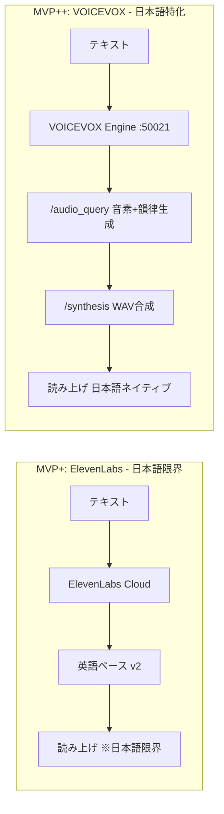
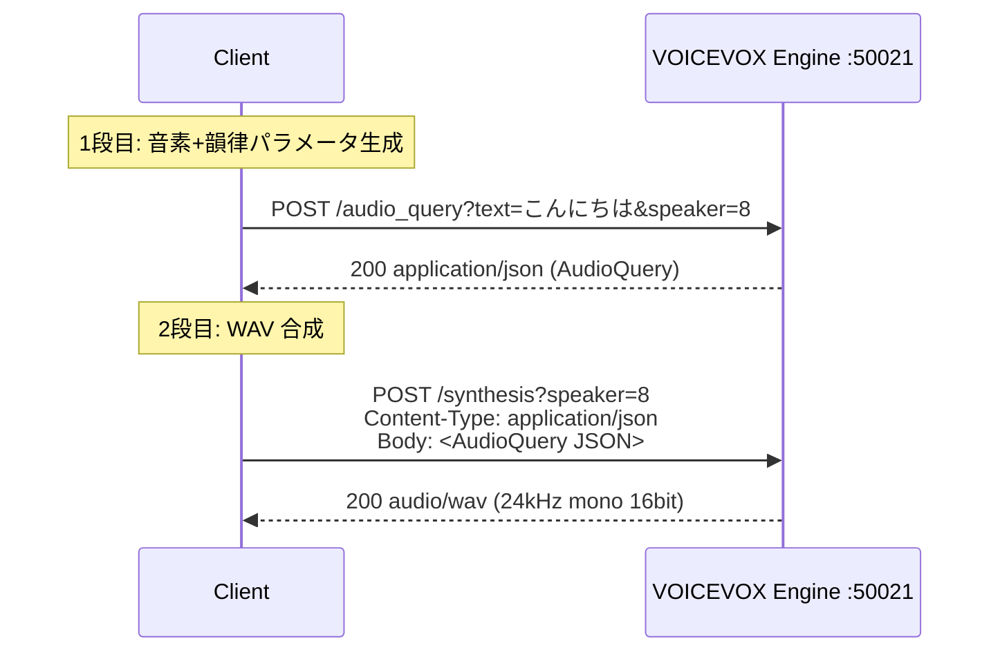
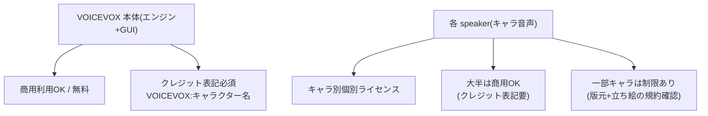
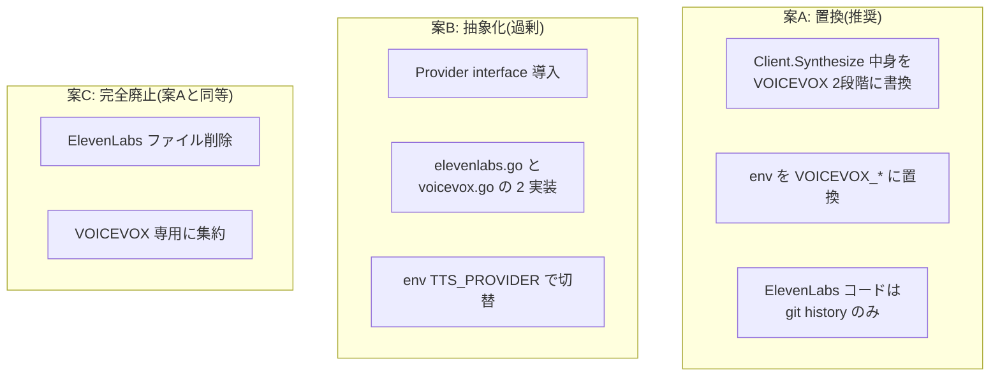
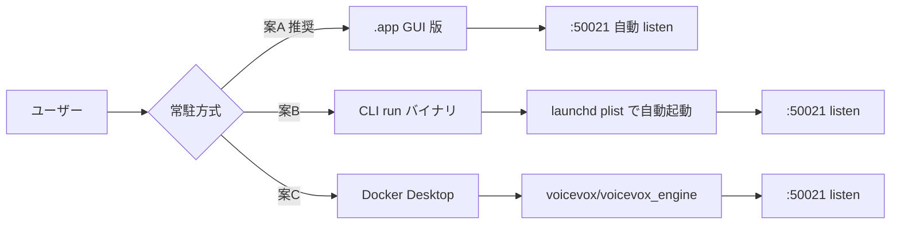
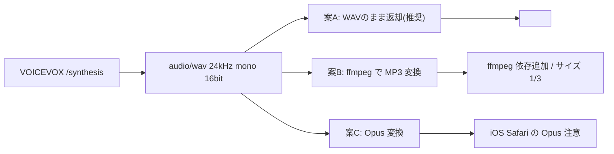
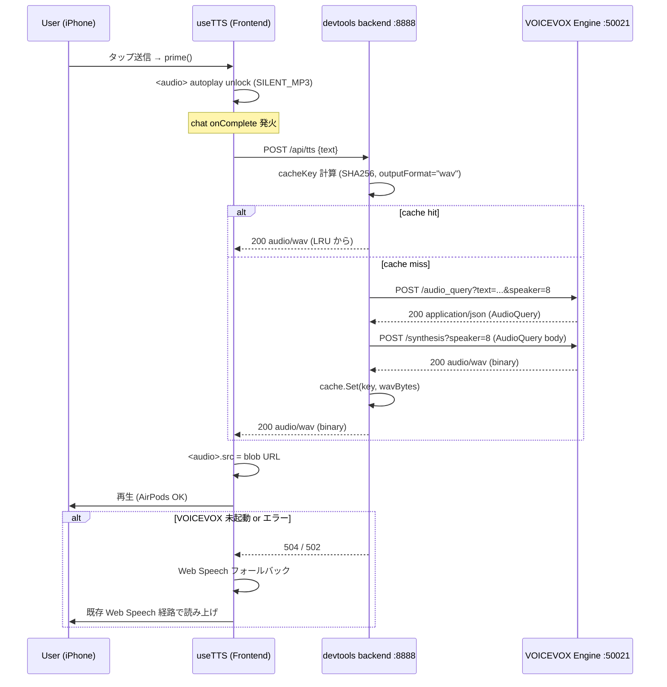

# VOICEVOX 切替 (MVP++)

## 検討経緯

| 日付 | 内容 |
|------|------|
| 2026-05-26 | 統括GUI MVP+ で ElevenLabs サーバー TTS 化を起票(`アーカイブ/2026-05-27_ElevenLabsサーバーTTS化.md`) |
| 2026-05-27 | ElevenLabs 実装完了(feat/elevenlabs-tts、コミット 1aa37bb、main 未マージ)。iPhone Safari + AirPods で再生経路は OK、AC1 達成 |
| 2026-05-27 | 実機検証で日本語の正確性に根本限界が判明。`eleven_flash_v2_5` → `eleven_multilingual_v2` → 別 voice と段階試行も改善せず。v2 系は英語ベース構造で日本語のイントネーション・アクセント・句点処理に根本限界(voice/stability チューニングではモデル限界を超えられない)。`eleven_v3` はコスト 1.5〜2 倍 + 5000 字制限 + 安定性未検証で MVP++ 採用は見送り |
| 2026-05-27 | ユーザー判断で **VOICEVOX(国産OSS・ローカル・無料・日本語特化)** への切替を選択、本検討書を起票 |

---

## 背景

### ElevenLabs MVP+ の到達点と限界

MVP+ で達成できたこと:
- iPhone Safari + AirPods で `<audio>` 経由の Bluetooth 出力が成立(AC1 達成)
- backend での API キー隔離、SHA256 キー / LRU+TTL+バイト数 / singleflight キャッシュ
- Web Speech 自動フォールバック + 503/502 セキュリティ丸め

限界として残った課題:
- **日本語の正確性**: ElevenLabs v2 系は英語ベース多言語拡張のため、イントネーション・アクセント・句点処理に根本限界。`flash_v2_5 → multilingual_v2 → 別 voice` の三段試行で改善せず、voice settings(`stability` / `similarity_boost`)のチューニングはモデル限界を超えられない。
- **コスト**: Free(10k クレジット/月) はクレジット表記必須・商用不可、Starter $5・Creator $22 への段階アップが見込まれる。

### VOICEVOX の優位性(切替の根拠)

| 観点 | ElevenLabs(MVP+) | VOICEVOX(MVP++) |
|------|------------------|------------------|
| 日本語自然性 | 多言語モデルの副次対応 | **日本語特化、音素+韻律パラメータ生成** |
| コスト | $5〜$22/月(段階) | **無料**(エンジン本体) |
| ネット依存 | 必須 | **不要**(ローカル :50021) |
| キー管理 | API キー漏洩リスク | **不要**(ローカル前提) |
| 起動コスト | なし | **エンジン常駐**(.app or Docker) |
| Speaker 数 | コミュニティ含めて数百 | **公式 70+**(キャラごとの個別ライセンス) |



---

## 目的

- **日本語ネイティブの自然な音声**(イントネーション・アクセント・句点処理)
- **ローカル動作・無料・商用利用可**(個人運用範囲は OK、配布時は speaker 規約確認)
- **AirPods/Bluetooth 出力経路**を維持(`<audio>` 再生は維持)
- **既存 useTTS 公開インターフェース完全維持**(`speak/cancel/enabled/setEnabled/isSpeaking/error/prime`)
- **MVP+ の運用品質を継承**: キャッシュ・singleflight・フォールバック・autoplay unlock はそのまま

---

## VOICEVOX 技術調査(WebSearch 結果 / 2026-05-27 時点)

### バージョン・最新動向

- VOICEVOX は Hiroshiba 氏(株式会社アクシオ)中心の OSS プロジェクト
- GUI アプリ版(`VOICEVOX.app`)と Engine 単体(`voicevox_engine`)の 2 系統提供
- Engine は **FastAPI 製の REST サーバー**、HTTP で `audio_query`/`synthesis`/`speakers` 等を提供
- Mac 版はビルド済アーカイブと Docker イメージが配布されている

### API 仕様(2 段階呼出)



主要エンドポイント:

| エンドポイント | メソッド | 用途 | レスポンス |
|----------------|---------|------|-----------|
| `/audio_query` | POST | text → AudioQuery(音素・韻律 JSON) | `application/json` |
| `/synthesis` | POST | AudioQuery → WAV 合成 | `audio/wav` |
| `/speakers` | GET | スピーカー一覧 | `application/json` |
| `/version` | GET | エンジンバージョン取得(疎通確認用) | `text/plain` |
| `/docs` | GET | Swagger UI(動作確認用) | `text/html` |

注意点:
- `speaker` は数値 ID(整数)。speaker_uuid と style_id の組み合わせで指定するキャラ+スタイルを表す
- `/audio_query` の戻り JSON は `speedScale` / `pitchScale` / `intonationScale` / `volumeScale` / `prePhonemeLength` / `postPhonemeLength` 等のチューニング項目を含む(必要に応じて編集して `/synthesis` に渡せる)
- 中間 AudioQuery JSON はキャッシュ不要(最終 WAV のみキャッシュすればよい)

### Speaker 一覧(代表例 + ライセンス概要)

公式の代表 speaker(数字は `speaker_id` ≒ `style_id`、ノーマル スタイル):

| speaker_id | キャラクター | 声質 | 商用利用 |
|------------|------------|------|---------|
| 2 | 四国めたん(ノーマル) | 落ち着き女性 | クレジット表記で可 |
| 3 | ずんだもん(ノーマル) | 子供っぽい・人気 | クレジット表記で可 |
| 8 | 春日部つむぎ(ノーマル) | しっかり目女性 | クレジット表記で可 |
| 9 | 雨晴はう(ノーマル) | 元気な女性 | クレジット表記で可 |
| 10 | 波音リツ(ノーマル) | クール女性 | クレジット表記で可 |
| 11 | 玄野武宏(ノーマル) | 力強い男性 | クレジット表記で可(キャラ規約確認) |
| 16 | 九州そら(ノーマル) | 低めの女性 | クレジット表記で可(キャラ規約確認) |
| 20 | もち子さん(ノーマル) | 優しい女性 | クレジット表記で可(キャラ規約確認) |
| 28 | 栗田まろん(ノーマル) | 中性的 | クレジット表記で可(キャラ規約確認) |

(その他 60+ speaker / `/speakers` エンドポイントで取得可能)

### ライセンス・商用利用条件

**重要な 2 層構造**:



要点:
- **VOICEVOX ソフトウェア本体**: 商用・非商用問わず無料利用可。`VOICEVOX:キャラクター名` のクレジット表記が必須
- **キャラクター音声**: speaker ごとに個別の利用規約。ずんだもん・春日部つむぎ・四国めたん等の代表キャラはクレジット表記で商用利用可
- **立ち絵(画像)**: 音声とは別の規約。画像は使わず音声のみ利用なら関係なし
- **再頒布禁止**: 合成した音声を「素材として再頒布」する用途は別途各キャラ規約で確認必要

統括 GUI の位置付け:
- 個人運用(自分の Mac で自分の作業用に読み上げ)→ クレジット表記なしでも実質問題なし(規約はクレジット表記推奨)
- 同人誌(技術書典)で素材化する場合 → `VOICEVOX:<speaker 名>` 表記必須、speaker 個別規約も再確認
- OSS フレームワーク Ghostrunner 配布物に音声ファイルを同梱しない → 再頒布規約は触れない

### Mac での起動方法(3 案)

| 案 | 方法 | 長所 | 短所 |
|----|------|------|------|
| 案A | **公式 .app GUI 版** | DMG ダウンロード→ドラッグ→起動で完了。起動と同時に :50021 で API サーバー立つ。GUI で speaker 試聴も可 | GUI が常駐(メニューバー or Dock 占有)、CPU は idle 時ほぼ 0 |
| 案B | **CLI 版 `voicevox_engine`** | ビルド済アーカイブ展開→`run` 実行。GUI 不要・軽量・CI/SSH 親和 | モデル別途・配布形態がやや散らかる(Mac は `macos-x64/` 配下) |
| 案C | **Docker 版**(`voicevox/voicevox_engine:cpu-latest`) | クロスプラットフォーム・環境隔離・コマンド一発 | Docker Desktop 常駐コスト(数 GB メモリ・起動時間)、Apple Silicon は CPU エミュレーション |

自動起動の慣習:
- 案A: 手動起動が基本。`launchd` plist(`~/Library/LaunchAgents/jp.hiroshiba.voicevox-engine.plist`)で自動起動可能だが、案A の .app は内部で engine をホストするので plist は基本的に CLI 版用
- 案B: `launchd` plist で `voicevox_engine/macos-x64/run` を `RunAtLoad=true` で起動 → Mac ログイン時に自動起動

参考 plist(案B 用):

```xml
<?xml version="1.0" encoding="UTF-8"?>
<!DOCTYPE plist PUBLIC "-//Apple//DTD PLIST 1.0//EN" "http://www.apple.com/DTDs/PropertyList-1.0.dtd">
<plist version="1.0">
<dict>
  <key>Label</key>
  <string>jp.hiroshiba.voicevox-engine</string>
  <key>ProgramArguments</key>
  <array>
    <string>/path/to/voicevox_engine/macos-x64/run</string>
    <string>--host</string>
    <string>127.0.0.1</string>
  </array>
  <key>RunAtLoad</key>
  <true/>
</dict>
</plist>
```

### 互換エンジン(同一 API プロトコル)

VOICEVOX ENGINE API 規約を実装する他エンジン:

| エンジン | 特徴 | API 互換性 |
|---------|------|-----------|
| **COEIROINK** | つくよみちゃん中心、商用緩い speaker あり | 同 API(`/v2/` 系も追加) |
| **SHAREVOX** | 商用フレンドリー speaker | 同 API |
| **A.I.VOICE** | 商用音声合成、有料 | 同 API |
| **AivisSpeech** | AivisSpeech プロジェクト | 同 API |
| **LMROID / ITAVOICE** | コミュニティ系 | 同 API |

**実装上の含意**: VOICEVOX で実装した HTTP クライアントは、エンドポイント URL(`VOICEVOX_HOST`)を切り替えるだけで互換エンジンに乗せ替えられる(エンジン依存固有処理を入れなければ自動的に互換)。env で `VOICEVOX_HOST` を変えるだけで COEIROINK や SHAREVOX を試せる。

---

## 既存実装の確認(MVP+ feat/elevenlabs-tts コミット 1aa37bb)

### バックエンド(`devtools/backend/internal/tts/`)

| ファイル | 役割 |
|---------|------|
| `doc.go` | パッケージドキュメント(ElevenLabs プロキシ前提で記述) |
| `types.go` | `TTSRequest`/`Config`/`SynthesizeParams`/`UpstreamStatusError`、定数(`MaxTextLength=2000`, `CacheMaxBytes=50MB`, `CacheTTL=24h`, `DefaultBaseURL`, `DefaultVoiceID="KgETZ36CCLD1Cob4xpkv"`, `DefaultModelID="eleven_flash_v2_5"`) |
| `client.go` | `Client.Synthesize` が `POST /v1/text-to-speech/{voice_id}?output_format=mp3_44100_128` を 1 回叩く |
| `cache.go` | `lruCache`(hashicorp/golang-lru/v2 + bytes 管理 + TTL)、`cacheKey(text,voiceID,modelID,outputFormat)` |
| `service.go` | `serviceImpl`(cache + singleflight + client)、`NewService()` は `ELEVENLABS_API_KEY` 未設定で nil 返却 |
| `handler.go` | `POST /api/tts` Gin ハンドラ、`mapErrorToStatus` で 503/400/504/429/502 にマッピング |

### フロントエンド

| ファイル | 役割 |
|---------|------|
| `src/hooks/useTTS.ts` | 公開インターフェース `{speak, cancel, enabled, setEnabled, isSpeaking, error, prime}`、`<audio>` 経路 + Web Speech フォールバック |
| `src/lib/tts/elevenlabsClient.ts` | `requestTTS({text, signal})` → `fetch("/api/tts", POST {text})` → `Blob` |
| `src/lib/tts/webSpeech.ts` | フォールバック用 Web Speech ラッパ |
| `src/lib/tts/silentMp3.ts` | iOS Safari unlock 用 0.1 秒無音 MP3 |
| `src/lib/tts/errors.ts` | `TTSError` クラス(reason 列挙) |
| `src/types/tts.ts` | `TTSRequest` 型(`{text: string}`) |

### env テンプレ(`devtools/backend/.env.example`)

`ELEVENLABS_API_KEY` / `ELEVENLABS_DEFAULT_VOICE_ID` / `ELEVENLABS_DEFAULT_MODEL` の 3 つを ElevenLabs 用に保持中。

### 共通インターフェース継承点

VOICEVOX 化で**変えない**もの:
- `useTTS` の 7 つの公開メソッド/プロパティ
- フロント `fetch("/api/tts", POST {text})` の単純さ
- backend のキャッシュ + singleflight + フォールバック設計
- `<audio>` 要素 + autoplay unlock(`SILENT_MP3_DATA_URL`)

VOICEVOX 化で**変える**もの:
- `Client.Synthesize` の中身を 2 段階呼出に置換(`/audio_query` → `/synthesis`)
- WAV(24kHz mono 16bit)を返すように `Content-Type: audio/wav` + `cacheKey` の `outputFormat` を `"wav"` に
- env 名・defaults・`DefaultBaseURL` を VOICEVOX 用に置換
- パッケージドキュメント・ログ接頭辞のラベル(`[TTSService]` は維持、コメント中の "ElevenLabs" 表記を "VOICEVOX" に書き換え)

---

## 設計案の整理(主要論点)

### プロバイダ抽象化方針



### エンジン常駐方式の比較



### Output Format の選択



---

## MVP++ 推奨案(全体像)



### 推奨採択サマリ

| 論点 | 推奨 | 理由 |
|------|------|------|
| Q1 エンジン | VOICEVOX 公式 | speaker 数・API 安定性・コミュニティ規模、互換エンジンは env 切替で対応 |
| Q2 Speaker | 春日部つむぎ(speaker_id=8)を仮置 | 落ち着き目で業務報告に親和、env で差替可能 |
| Q3 常駐 | 案A `.app` GUI 版 | 初期セットアップ最小 |
| Q4 抽象化 | 案A 置換 | MVP++ は VOICEVOX 単独、将来追加プロバイダ発生時に抽象化検討 |
| Q5 2段呼出 | Client 内部に隠蔽 | 呼び出し側は単一メソッドのまま |
| Q6 Output | WAV のまま | シンプル優先、サイズ問題が出たら MVP+++ で MP3 化 |
| Q7 キャッシュ | 50MB 維持 | 個人運用想定 |
| Q8 エラー | 既存フォールバックそのまま | dial refused → 504 → Web Speech 降格 |
| Q9 env | `VOICEVOX_HOST` + `VOICEVOX_SPEAKER_ID` の 2 つ | API キー不要 |
| Q10 ライセンス | 個人運用は問題なし | RUNBOOK に `VOICEVOX:春日部つむぎ` クレジット記載方針を明記 |
| Q11 既存ブランチ | 案B(feat/elevenlabs-tts 破棄+新ブランチで VOICEVOX 単独) | 案Aは ElevenLabs 痕跡が main に残り続ける |
| Q12 スコープ | VOICEVOX 単独切替のみ | Voice 選択 UI は MVP+++ |
| Q13 fe ファイル名 | 案B rename(`elevenlabsClient.ts` → `ttsClient.ts`) | git rename で履歴追跡可、意図明示 |

---

## 実装スコープ概要

### バックエンド変更

| ファイル | 変更内容 |
|---------|---------|
| `internal/tts/doc.go` | ElevenLabs 記述を VOICEVOX に書換、2 段階呼出の説明追加 |
| `internal/tts/types.go` | 定数を `DefaultBaseURL="http://localhost:50021"` / `DefaultSpeakerID=8` / `DefaultOutputFormat="wav"` に、`Config` を `{Host, DefaultSpeakerID}` に、`SynthesizeParams` を `{Text, SpeakerID, OutputFormat}` に変更。`ErrAPIKeyMissing` は撤去(キー不要)、エラー sentinel は `ErrUpstreamTimeout` / `ErrInvalidContentType` / `ErrEngineUnreachable` を維持/追加 |
| `internal/tts/client.go` | `Synthesize` 内部で `audioQuery(ctx, text, speakerID)` → `synthesis(ctx, speakerID, audioQuery)` の 2 段階。エラーマッピングは既存パターン継承 |
| `internal/tts/cache.go` | `cacheKey(text, speakerID, outputFormat)` に変更(3 フィールド)。50MB 上限・TTL 24h は維持 |
| `internal/tts/service.go` | env 読み替え(`VOICEVOX_HOST`, `VOICEVOX_SPEAKER_ID`)。API キー判定撤去、エンジン未起動でも `NewService()` は非 nil を返す(リクエスト時に dial 失敗で 504) |
| `internal/tts/handler.go` | `mapErrorToStatus` から `ErrAPIKeyMissing → 503` を撤去、それ以外は維持 |
| `cmd/server/main.go` | コメントを ElevenLabs → VOICEVOX に書換、配線は同じ |

### フロントエンド変更

| ファイル | 変更内容 |
|---------|---------|
| `src/lib/tts/elevenlabsClient.ts` | **`ttsClient.ts` に rename**(git mv)、`requestTTS` シグネチャは維持 |
| `src/hooks/useTTS.ts` | import パスを `@/lib/tts/ttsClient` に更新、エラーメッセージ "ElevenLabs 接続失敗" → "VOICEVOX 接続失敗" に書換 |
| `src/types/tts.ts` | コメント書換(MVP++ で speaker 選択拡張余地) |
| `src/lib/tts/webSpeech.ts` | 変更なし |
| `src/lib/tts/silentMp3.ts` | 変更なし(WAV 再生でも unlock は MP3 で OK) |

### 環境変数・設定

`devtools/backend/.env.example` を以下に置換:

```
# VOICEVOX Engine ホスト(任意、デフォルト http://localhost:50021)
# 互換エンジン(COEIROINK / SHAREVOX 等)を使う場合もここで切替可能
VOICEVOX_HOST=http://localhost:50021

# VOICEVOX speaker_id(任意、デフォルト 8 = 春日部つむぎ ノーマル)
# /speakers エンドポイントで一覧確認可能(http://localhost:50021/docs)
VOICEVOX_SPEAKER_ID=8
```

`ELEVENLABS_*` は削除。

### 依存追加(VOICEVOX エンジンの常駐セットアップ)

ユーザー手作業:
1. https://voicevox.hiroshiba.jp/ から Mac 版 .dmg ダウンロード
2. `/Applications/VOICEVOX.app` にドラッグ
3. 初回起動時に Gatekeeper 承認(システム設定 → プライバシーとセキュリティ)
4. アプリ起動 → 自動的に `127.0.0.1:50021` で API サーバー起動
5. ブラウザで `http://localhost:50021/docs` にアクセスして Swagger UI で疎通確認
6. (任意)`/speakers` を叩いて speaker_id 一覧を確認、好みの speaker を `.env` に設定

backend 起動順序:
1. VOICEVOX.app 起動
2. `make backend`(devtools backend を `make` で起動)
3. `make frontend`

エンジン未起動の挙動:
- backend `/api/tts` が `dial tcp 127.0.0.1:50021: connect: connection refused` で 504
- フロント useTTS が `triggerFallback(text)` を呼び Web Speech 経路に降格
- ユーザーには既存の `topError` バナーで `"VOICEVOX 接続失敗。Web Speech に降格しました"` 通知

---

## 既存 MVP+(feat/elevenlabs-tts コミット 1aa37bb)の処遇

### 推奨: 案B(feat/elevenlabs-tts 破棄 + 新ブランチで VOICEVOX 単独実装)

理由:
- MVP+ の ElevenLabs 実装は実機検証で「日本語の正確性に根本限界」と判定済 → main にマージしても運用採用しないなら不要コードが main に残る
- MVP++ で VOICEVOX 単独運用が決まったので、ElevenLabs コードを共存させる必要なし(Q4 案A 推奨と整合)
- 抽象化(Q4 案B)を採らないなら、ElevenLabs コードは git history のみで参照可能
- 新ブランチ `feat/voicevox-tts` を main から切り、MVP+ で作った構造(キャッシュ・singleflight・useTTS フォールバック)はファイル単位でコピー流用

代替案: 案A(MVP+ を main にマージしてから MVP++ で別ブランチ)も検討時の選択肢:
- メリット: 「VOICEVOX 接続失敗 → ElevenLabs フォールバック → Web Speech フォールバック」の 2 段階フォールバック設計余地が残せる
- デメリット: 日本語が ElevenLabs に降格しても日本語限界は変わらないので、フォールバック先として価値が薄い

### ブランチ運用

```
main
 |
 |-- feat/elevenlabs-tts (1aa37bb) [破棄予定]
 |   └─ git push -d origin feat/elevenlabs-tts はユーザー判断
 |
 └-- feat/voicevox-tts (新規) [MVP++ 実装]
     ├─ ElevenLabs コードを VOICEVOX 用に書換
     ├─ git mv elevenlabsClient.ts ttsClient.ts
     └─ .env.example を VOICEVOX 用に置換
```

---

## 決定事項(2026-05-27 全件確定、Q1〜Q13 すべて推奨案で採択)

**判断サマリ**:
- Q1 エンジン選定: **VOICEVOX 公式に絞る**(同 API 規約の互換エンジンは自動的に動く)
- Q2 Speaker 選定: **仮 speaker_id を計画書に置き、実装完了後に試聴で決定**(`.env.example` に複数候補をコメント)
- Q3 エンジン常駐: **公式 .app GUI 版**(`.dmg` ダウンロード → Applications → 起動で `:50021` 自動 listen)
- Q4 プロバイダ抽象化: **案A 置換**(ElevenLabs を VOICEVOX で書き換え、抽象化なし、env も `VOICEVOX_*` に置換)
- Q5 2 段階呼出設計: 推奨案(Client 内部で隠蔽、cache は WAV のみ保持)
- Q6 Output Format: **案A WAV のまま返却**(MP3 変換は MVP+++ で評価)
- Q7 キャッシュ容量: **50MB 維持**(個人運用想定、必要なら env で上書き可能化)
- Q8 エラーハンドリング: **既存フォールバック機構を流用**(エンジン未起動は connection refused → Web Speech 降格)
- Q9 env 設計: **`VOICEVOX_HOST` + `VOICEVOX_SPEAKER_ID` の 2 つ**、`ELEVENLABS_*` は撤去(API キー不要、ローカル前提)
- Q10 ライセンス: **個人運用範囲は問題なし**、BACKEND_RUNBOOK に「`VOICEVOX:<speaker 名>` クレジット表記」+ 配布時の speaker 個別規約確認を明記
- Q11 既存 MVP+ の処遇: **feat/elevenlabs-tts を破棄 → main から feat/voicevox-tts を新規**(MVP+ は main 未反映なので破棄コストなし、コードスニペットは git 履歴に残る)
- Q12 MVP++ スコープ: **VOICEVOX 単独切替のみ**(Voice 選択 UI は MVP+++ で評価)
- Q13 ファイル名: **`elevenlabsClient.ts` → `voicevoxClient.ts` に rename**、シグネチャ維持で useTTS 側無改修

---

## 各論点の詳細

### Q1: エンジン選定

**ステータス**: 回答済(推奨案で確定、2026-05-27)
**選択肢**:
- A) VOICEVOX 公式に絞る(speaker 数・コミュニティ規模)
- B) VOICEVOX + COEIROINK / SHAREVOX の同時サポート(env 切替)
- C) 別エンジン(COEIROINK 単独)を採用

**推奨**: A
**理由**: 同 API 規約なので `VOICEVOX_HOST` を変えれば自動的に互換エンジンも動く(B は自動的に達成)。MVP++ は公式 1 本で集中、互換性は副次的に得る。

---

### Q2: Speaker(声)選定

**ステータス**: 回答済(推奨案で確定、2026-05-27)
**選択肢**:
- A) 春日部つむぎ(speaker_id=8、しっかり目女性、業務報告調)
- B) 四国めたん(speaker_id=2、落ち着き女性)
- C) 九州そら(speaker_id=16、低めの女性)
- D) もち子さん(speaker_id=20、優しい女性)
- E) ずんだもん(speaker_id=3、子供っぽい・人気だがアニメ寄り)
- F) その他(VOICEVOX 起動後 `/speakers` で確認 + 試聴して決定)

**推奨**: A(春日部つむぎ)
**理由**: 統括 GUI の応答(進捗報告・確認事項取り次ぎ)に親和、落ち着いた声質で長時間聞いても疲れにくい。env で差替可能なので試聴後変更も容易。

---

### Q3: エンジン常駐方式

**ステータス**: 回答済(推奨案で確定、2026-05-27)
**選択肢**:
- A) 公式 .app GUI 版(`/Applications/VOICEVOX.app` 手動起動)
- B) CLI 版(`voicevox_engine/macos-x64/run`)+ launchd plist 自動起動
- C) Docker 版(`docker run -p 50021:50021 voicevox/voicevox_engine:cpu-latest`)

**推奨**: A
**理由**: 初期セットアップ最小(DMG→ドラッグ→起動)、GUI で speaker 試聴も可能、メモリ消費少。launchd 自動起動は MVP+++ で必要なら追加。

---

### Q4: プロバイダ抽象化方針

**ステータス**: 回答済(推奨案で確定、2026-05-27)
**選択肢**:
- A) 置換(`client.go` を VOICEVOX 用に書換、ElevenLabs は git history のみ)
- B) 抽象化(`Provider` interface + 2 implementations + `TTS_PROVIDER` env)
- C) 完全廃止(ElevenLabs ファイル削除、VOICEVOX 専用)

**推奨**: A(C と実質同等、C が明示的)
**理由**: MVP++ は VOICEVOX 単独運用想定。B は OpenAI TTS / Google Cloud TTS 追加が見えてから MVP+++ で再評価。テスト・型コストを今は払わない。

---

### Q5: 2 段階呼出設計

**ステータス**: 回答済(推奨案で確定、2026-05-27)
**選択肢**:
- A) `Client.Synthesize` 内部で 2 段階を実行(audioQuery + synthesis を 1 メソッドにラップ)
- B) `Client.AudioQuery` と `Client.Synthesis` を別公開メソッドにして Service 層で組み立てる
- C) 1 メソッドに加えて、AudioQuery を編集できる拡張点(`AdjustAudioQuery func(*AudioQuery)`)を入れる(speedScale 等のチューニング余地)

**推奨**: A
**理由**: 呼び出し側(Service / Handler)からは ElevenLabs と同じ単一メソッドで済む。AudioQuery のチューニングは MVP+++ で必要になったら C に拡張。

---

### Q6: Content-Type と Output Format

**ステータス**: 回答済(推奨案で確定、2026-05-27)
**選択肢**:
- A) WAV のまま返す(変換なし、シンプル)
- B) backend で WAV → MP3 変換(`ffmpeg` 依存追加、サイズ 1/3)
- C) backend で WAV → Opus 変換(Web 親和性高いが iOS Safari Opus 注意)

**推奨**: A
**理由**: WAV は約 500KB/5 秒(MP3 の 3 倍)だが、個人運用 + ローカル backend なら帯域問題なし。iOS Safari は WAV 再生対応。サイズ問題が出たら MVP+++ で B に変更。

---

### Q7: キャッシュ容量

**ステータス**: 回答済(推奨案で確定、2026-05-27)
**選択肢**:
- A) 50MB 維持(WAV 平均 500KB で約 100 エントリ)
- B) 100MB に増加(約 200 エントリ)
- C) env で上書き可能化(`TTS_CACHE_MAX_BYTES`)

**推奨**: A
**理由**: 個人運用、同一テキストヒット率は低い想定。MVP+++ で必要なら C(env 化)に拡張。

---

### Q8: エラーハンドリング(エンジン未起動含む)

**ステータス**: 回答済(推奨案で確定、2026-05-27)
**選択肢**:
- A) 既存フォールバック機構をそのまま流用(dial refused → ErrUpstreamTimeout 系 → 504 → Web Speech 降格)
- B) ヘルスチェック追加(起動時 `GET /version` で疎通確認、未起動なら NewService が nil 返却)
- C) 起動チェック + 定期リトライ(`/version` を 30s 毎に確認、復旧したら自動有効化)

**推奨**: A
**理由**: 既存機構で十分。NewService 時点でエンジン未起動でも、後でユーザーがエンジン起動すれば次のリクエストから自動成功。ヘルスチェックは MVP+++ で必要になれば B 追加。

---

### Q9: env 設計

**ステータス**: 回答済(推奨案で確定、2026-05-27)
**選択肢**:
- A) `VOICEVOX_HOST` + `VOICEVOX_SPEAKER_ID` の 2 つ(MVP+ より env 1 つ少ない)
- B) `VOICEVOX_HOST` + `VOICEVOX_SPEAKER_ID` + `VOICEVOX_SPEED_SCALE` 等のチューニング項目
- C) `TTS_PROVIDER=voicevox` も足して将来切替準備

**推奨**: A
**理由**: API キー不要、speaker_id のみで十分。チューニング項目は MVP+++ で必要になったら B 追加。TTS_PROVIDER は Q4 抽象化を採らない方針と整合。

---

### Q10: ライセンス・商用利用方針

**ステータス**: 回答済(推奨案で確定、2026-05-27)
**選択肢**:
- A) 個人運用範囲のみ想定、RUNBOOK に `VOICEVOX:春日部つむぎ` クレジット表記方針を明記
- B) 同人誌素材化を想定、speaker 個別ライセンスをドキュメントに転記
- C) 商用配布想定、各 speaker の規約を全て確認した上で speaker を厳選

**推奨**: A
**理由**: 統括 GUI 自体は個人用ツール。同人化が決まったら B に拡張、配布が決まったら C に拡張。

---

### Q11: 既存 MVP+(feat/elevenlabs-tts)の処遇

**ステータス**: 回答済(推奨案で確定、2026-05-27)
**選択肢**:
- A) MVP+ を main にマージしてから MVP++ を新ブランチで進める(クリーンな履歴、ElevenLabs コードは main に残る)
- B) feat/elevenlabs-tts は破棄、新ブランチ `feat/voicevox-tts` で VOICEVOX 単独実装(コードはファイル単位でコピー流用)
- C) feat/elevenlabs-tts 上で VOICEVOX 化(同ブランチ続行、git history が長くなる、ブランチ名と中身がズレる)

**推奨**: B
**理由**: ElevenLabs は日本語限界が確定し、運用採用しない判定済み。main に残す価値が薄い。Q4 案A(抽象化なし)と整合。

---

### Q12: MVP++ のスコープ

**ステータス**: 回答済(推奨案で確定、2026-05-27)
**選択肢**:
- A) VOICEVOX 単独切替のみ(speaker は env 固定、UI は変えず)
- B) Voice 選択 UI 追加(複数 speaker から dashboard で切り替え、localStorage 永続)
- C) Voice 選択 UI + チューニング UI(speedScale / pitchScale 等)

**推奨**: A
**理由**: MVP++ は機能追加最小。VOICEVOX 化の動作確認と日本語自然性の評価を優先。B/C は MVP+++ で再評価。

---

### Q13: 既存 useTTS / lib/tts 配下のファイル名

**ステータス**: 回答済(推奨案で確定、2026-05-27)
**選択肢**:
- A) ファイル名はそのまま、内部だけ書換(`elevenlabsClient.ts` は名前気になるが互換性維持)
- B) `elevenlabsClient.ts` → `ttsClient.ts` に rename(git mv)、`requestTTS` シグネチャ維持
- C) VOICEVOX 用の新ファイル `voicevoxClient.ts` を追加、`elevenlabsClient.ts` は削除

**推奨**: B
**理由**: rename で意図明示、git mv で履歴追跡可。useTTS 側は import 文 1 行の変更のみ。

---

## スコープ外(MVP+++ で再評価)

- **Voice 選択 UI**(複数 speaker から dashboard で切り替え、localStorage 永続)
- **AudioQuery チューニング**(speedScale / pitchScale / intonationScale / volumeScale)
- **launchd plist 配布**(自動起動、Mac ログイン時にエンジン立ち上げ)
- **WAV → MP3 変換**(ffmpeg 依存追加、帯域削減)
- **ヘルスチェック導入**(`/version` 起動時疎通確認、定期リトライ)
- **互換エンジン公式サポート**(COEIROINK / SHAREVOX / A.I.VOICE / AivisSpeech の動作確認 + docs)
- **Voice ON/OFF 三択トグル**(節約モード: OFF / Web Speech / VOICEVOX)
- **使用量メーター**(`/api/tts` 月間呼出回数の dashboard 可視化)
- **キャッシュ永続化**(ファイル / KVS)
- **多言語対応**(VOICEVOX は日本語特化なので英語混在テキスト時の挙動)

---

## 参考リンク

- [VOICEVOX 公式サイト](https://voicevox.hiroshiba.jp/)
- [VOICEVOX ソフトウェア利用規約](https://voicevox.hiroshiba.jp/term/)
- [VOICEVOX Q&A](https://voicevox.hiroshiba.jp/qa/)
- [voicevox_engine API Document(公式 Swagger)](https://voicevox.github.io/voicevox_engine/api/)
- [GitHub: VOICEVOX/voicevox_engine](https://github.com/VOICEVOX/voicevox_engine)
- [API Reference | DeepWiki](https://deepwiki.com/VOICEVOX/voicevox_engine/4-api-reference)
- [Observing the VOICEVOX API | Hikari's Notebook](https://www.hikari-dev.com/en/blog/2024/11/12/voicevox-api/)
- [Mac上にVOICEVOX Engineを立てて自宅ネットワークに音声合成サーバを用意する(Qiita)](https://qiita.com/mikito/items/21aa74c3850a70c647f7)
- [VOICEVOX EngineをmacOSで実行する - MonoBook](https://monobook.org/wiki/VOICEVOX_Engine%E3%82%92macOS%E3%81%A7%E5%AE%9F%E8%A1%8C%E3%81%99%E3%82%8B)
- [VOICEVOXをDockerで起動する方法(Qiita)](https://qiita.com/tsrs0211/items/501d9294340b277e4008)
- [音声合成エンジンのVOICEVOXをMac上のDocker Desktopで試す](https://shinshin86.hateblo.jp/entry/2022/01/22/134049)
- [【2025年12月】VOICEVOXは商用利用できるのか？利用規約をもとに徹底解説](https://blue-r.co.jp/blog-voicevox-commercial-use/)
- [【非公式】よくわかるVOICEVOX関連規約【個人向け】](https://note.com/dokuro_roudoku/n/n7109cdce7f5a)
- [VOICEVOXキャラクターの商用利用を整理する](https://be-cando.com/voicevox_character-syuueki/)
- [話者一覧 [VOICEVOX] – Site-Builder.wiki](https://site-builder.wiki/posts/64100)
- [launchctl でサービスを自動起動する - koba::blog](https://blog.kobalab.net/entry/2024/01/26/221737)

---

## 次のステップ

- [x] 本検討書をユーザーレビュー + Q1〜Q13 確定(2026-05-27、全 13 件推奨案で採択)
- [ ] **ユーザー手作業 1**: VOICEVOX.app の Mac インストール
  - https://voicevox.hiroshiba.jp/ → Mac 用 .dmg ダウンロード → Applications にドラッグ → 起動
  - 初回起動でモデルダウンロード(数百MB、数分)
  - 起動完了で自動的に `http://localhost:50021/` で API サーバー listen
  - 動作確認: ブラウザで http://localhost:50021/docs を開いて Swagger UI が表示されれば OK
- [ ] `/plan` で実装計画作成
  - フルスタック: go-planner(`internal/tts/client.go` を VOICEVOX 用に書き換え、2段階呼出、`/audio_query` → `/synthesis`)+ nextjs-planner(`elevenlabsClient.ts` → `voicevoxClient.ts` rename、useTTS の Content-Type 判定は WAV 対応で既存ロジックそのまま流用)
  - reviewer 2 名 + test-planner でテスト計画追記
- [ ] **ブランチ運用**(Q11 採択): `feat/elevenlabs-tts` 破棄 → main から `feat/voicevox-tts` を新規作成
  - 既存 main は MVP の Web Speech のみ(MVP+ ElevenLabs はマージされていない)
  - VOICEVOX 実装後にこのブランチを main にマージ → 本来の TTS 機能リリース
- [ ] `開発/実装/実装待ち/` に計画書移動 → `/coding` で実装着手
- [ ] 実機検証(iPhone Safari + AirPods で VOICEVOX 経由の日本語自然性確認、初回起動時の重さ確認、ネットワーク回り)
- [ ] **ユーザー手作業 2**: 試聴で speaker_id 決定 + `.env` 書き換え
- [ ] main マージ → MVP+++ 候補論点(Voice 選択 UI、launchd 自動起動、MP3 変換、ヘルスチェック等)を別検討書に切り出し
