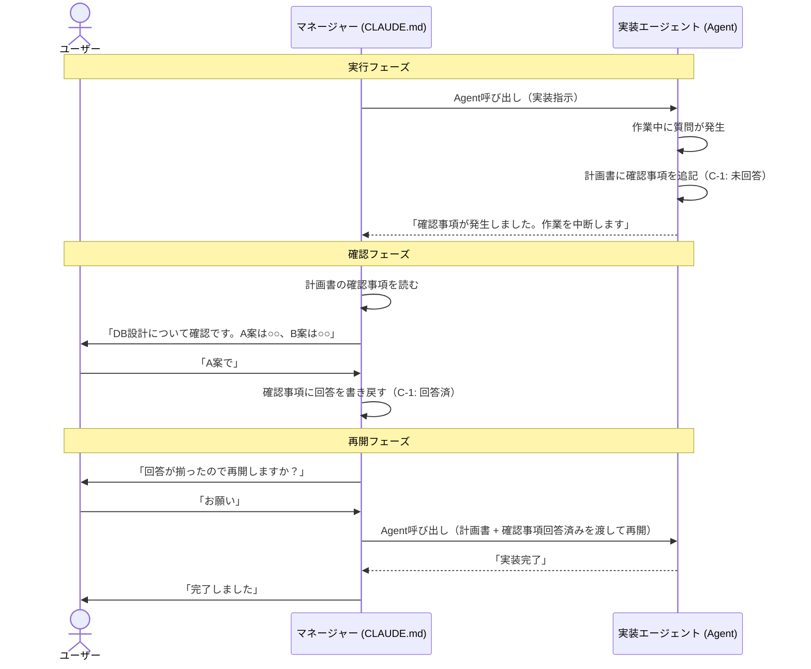
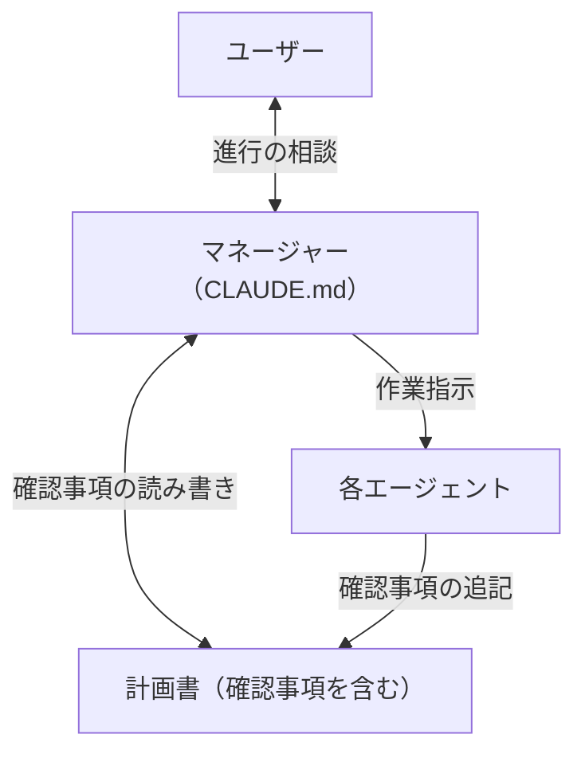

# マネージャーと確認事項

## 背景・目的

Claude Codeでの開発体験を統一するために、以下を導入する。

- **マネージャー**: 進行管理の窓口。確認事項の翻訳・承認フローを担う（技術や何を作るかの相談はdiscussが担当）
- **確認事項**: エージェントからの質問をファイルベースで管理する非同期メカニズム

## 対象ユーザー

- Ghostrunnerフレームワークの利用者（個人開発者）
- `/init` で生成したプロジェクトの開発者

## マネージャーの詳細

### 実現方法

**CLAUDE.md に組み込む。** サブエージェントはユーザーと直接対話できないため、メインプロセスであるCLAUDE.mdに組み込むのが唯一の手段。

### 役割

**進行管理の窓口。技術や何を作るかの相談はdiscussが担当。**

- **確認事項を読んで、ユーザーに噛み砕いて伝える**
- **ユーザーの回答を確認事項に書き戻す**
- 承認フローの仲介
- ユーザーが直接スキルを呼んだ場合は介入しない

### 適用範囲

Ghostrunnerだけでなく、`/init` で生成したプロジェクトにも入れる。どこで開いても同じ体験を提供する。

## 確認事項（非同期質問メカニズム）

### なぜ必要か

Claude Codeの構造的制約:
- サブエージェントは呼び出し終了時にコンテキストを失う
- Agent入れ子が深くなると質問の取り次ぎが複雑になる
- AIの記憶に頼ると、会話が長くなった時に情報が失われる

**解決策**: エージェントはユーザーに直接質問せず、計画書に確認事項を追記して中断する。マネージャーが確認事項を読んでユーザーに伝え、回答を書き戻す。エージェントが忘れても、ファイルが覚えている。

### フェーズ別の運用

| フェーズ | 確認事項の扱い | 理由 |
|----------|---------------|------|
| /discuss | 使わない。対話ベースで検討ファイルに直接記録 | 対話そのものが成果物 |
| /plan | 計画書に「確認事項」セクションとして追記 | 仕様書がベースとして残っている |
| /coding | 計画書に「確認事項」セクションとして追記 | 計画書がベースとして残っている |

### フォーマット

計画書（`_plan.md`）の中に追記する:

```markdown
## 確認事項

### C-1: DBスキーマの方式（go-impl, 2026-04-05）
**質問**: A案（正規化）とB案（非正規化）のどちらにするか
**ステータス**: 回答済
**回答**: A案で進める。パフォーマンスが問題になったら後で検討する

### C-2: エラー時のリトライ（go-reviewer, 2026-04-05）
**質問**: 外部API呼び出し失敗時にリトライするか
**ステータス**: 未回答
**回答**: -
```

### 動作フロー



## 指揮系統

### プロジェクト内



### ルール

- 進行の相談はマネージャー、技術や何を作るかの相談はdiscuss
- エージェントはユーザーに直接質問せず、計画書に確認事項を追記して中断する
- マネージャーが確認事項を読んでユーザーに伝え、回答を書き戻す
- ユーザーが直接スキルを呼んだ場合はマネージャーは介入しない

## 設計判断

| 判断 | 選択 | 理由 |
|------|------|------|
| マネージャーの実現方法 | CLAUDE.md に組み込み | サブエージェントはユーザーと直接対話不可 |
| エージェントの質問方法 | 確認事項（ファイルベース非同期） | コンテキスト消失問題を解決 |
| 確認事項の置き場所 | 計画書に追記 | 1ファイルで全部わかる |
| /discuss の確認事項 | 使わない | 対話そのものが成果物 |
| 適用範囲 | 全プロジェクトに入れる | どこで開いても同じ体験 |

## Claude Codeの構造的制約

- ユーザーと直接対話できるのはメインプロセス（CLAUDE.md）だけ
- サブエージェントは呼び出し終了時にコンテキストを失う
- サブエージェント同士の直接通信は不可能

## MVP

**マネージャー + 確認事項をセットで実装する。**

1. **CLAUDE.md マネージャーセクション**: 確認事項の読み書き、承認フロー
2. **確認事項フォーマット**: 計画書に追記する形式の定義
3. **/init 更新**: 生成プロジェクトにもマネージャーセクションを含める
