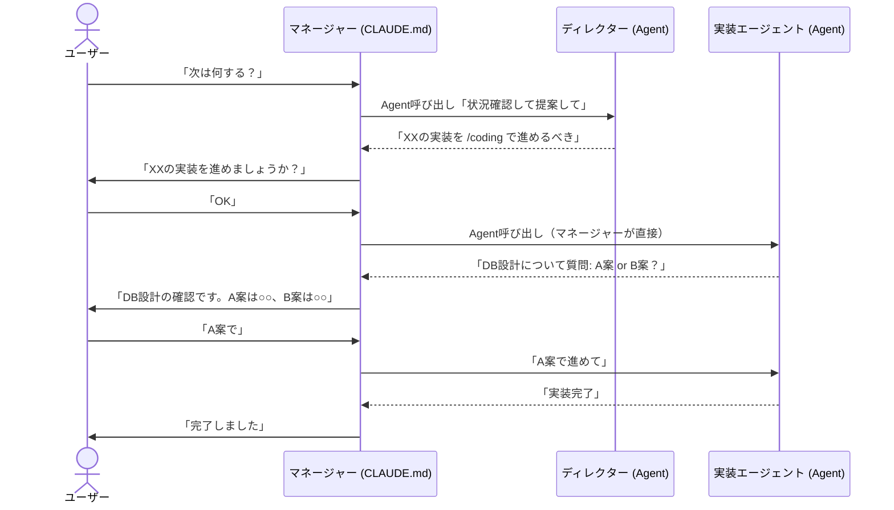
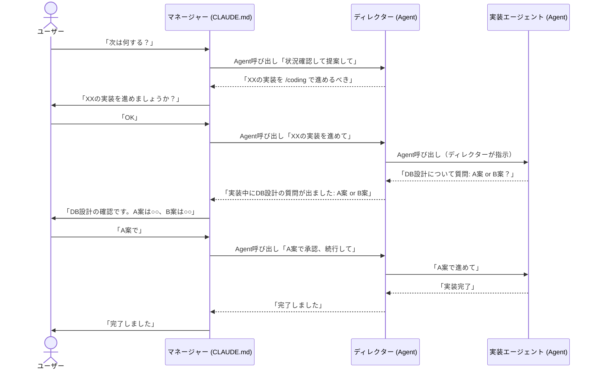

# マネージャー + ディレクター フロー比較

## 案A: マネージャーが直接実行（現在の計画）

ディレクターは提案だけ。承認後はマネージャーが直接エージェントを呼ぶ。

### 特徴

- ディレクターは提案を返すだけの存在
- 質問の経路: エージェント → マネージャー → ユーザー（2段）
- Agent入れ子は浅い（最大2段: マネージャー → エージェント）
- ディレクターは実行フェーズに関与しない

---

## 案B: ディレクター経由で実行（検討結果の指揮系統）

ディレクターが現場を仕切る。承認後もディレクターがエージェントに指示。

### 特徴

- ディレクターが現場責任者として機能する
- 質問の経路: エージェント → ディレクター → マネージャー → ユーザー（3段）
- Agent入れ子が深い（最大3段: マネージャー → ディレクター → エージェント）
- 質問1つにつきマネージャー → ディレクター → エージェントの往復が毎回発生

---

## 比較表

| 観点 | 案A: マネージャー直接 | 案B: ディレクター経由 |
|------|----------------------|---------------------|
| ディレクターの役割 | 提案のみ | 提案 + 実行管理 |
| Agent入れ子の深さ | 最大2段 | 最大3段 |
| 質問の取り次ぎ | 2段（速い） | 3段（遅い） |
| 指揮系統の忠実度 | 検討結果と異なる | 検討結果どおり |
| ディレクターのツール | Read, Grep, Glob, Bash | Read, Grep, Glob, Bash, Agent |
| シンプルさ | シンプル | 複雑 |
| ディレクターの文脈保持 | なし（毎回新規） | あり（実行中の文脈を保持） |
