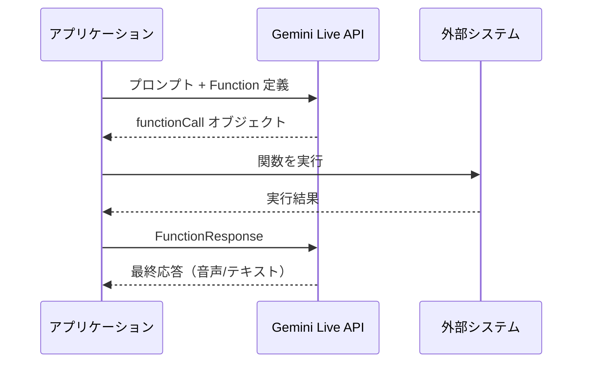
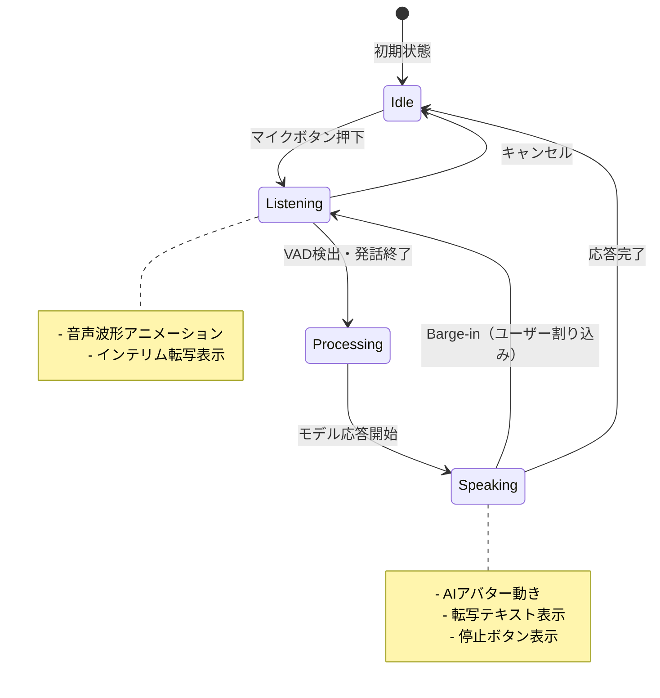
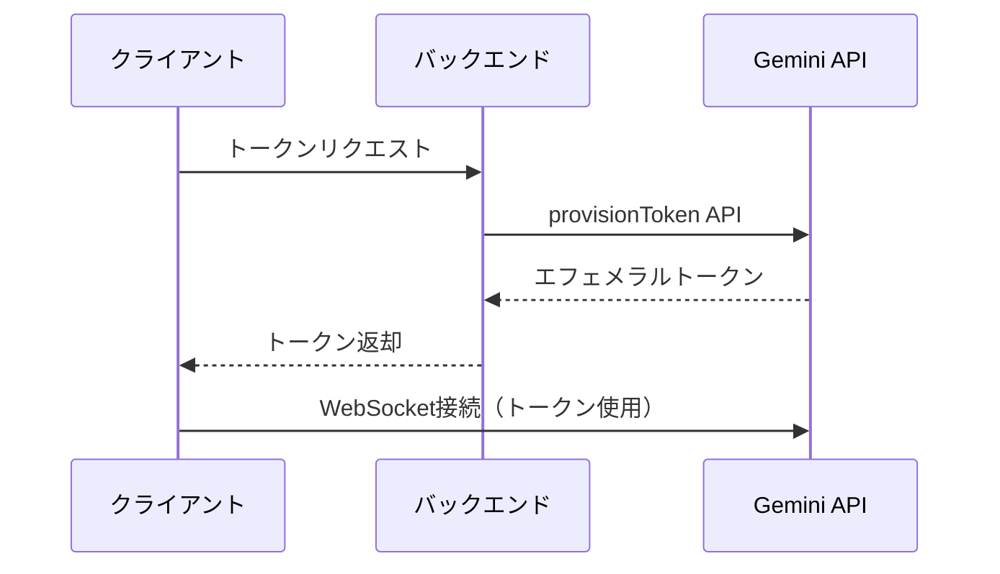
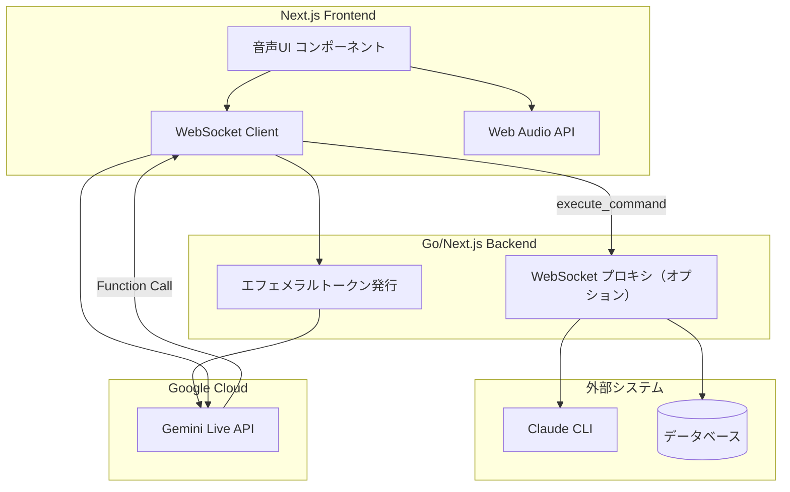

# 調査レポート: Gemini Live API を UI のメインにして Function Calling で操作する方法

## 概要

Gemini Live API は、低遅延のリアルタイム音声・動画インタラクションを実現する API であり、Function Calling（ツール使用）と組み合わせることで、音声 AI インターフェースから外部システムを操作する強力なソリューションを構築できる。日本語を含む24言語をサポートし、割り込み（barge-in）や感情認識対話などの高度な機能も備えている。

## 背景

データ復旧サービスの業務管理システム（Ghostrunner プロジェクト）において、Gemini Live API を使った音声 AI インターフェースをメイン UI とし、Function Calling を通じてシステムを操作したい。既存の実装計画（`開発/アーカイブ/2026-01-25_function-calling-ui_plan.md`）では OpenAI API + Whisper を想定していたが、Gemini Live API への移行・採用を検討する。

---

## 調査結果

### 1. Gemini Live API の最新仕様

#### 概要と機能

Gemini Live API は、連続的な音声・動画・テキストのストリームを処理し、即座に人間らしい音声応答を生成するリアルタイム会話 API。

**主要機能:**
- **マルチモダリティ**: モデルは見る・聞く・話すことが可能
- **低遅延リアルタイムインタラクション**: 高速レスポンス
- **セッションメモリ**: 単一セッション内のすべてのやり取りを保持
- **音声アクティビティ検出（VAD）**: 話者認識と割り込み処理
- **Barge-in（割り込み）**: ユーザーがいつでもモデルを中断可能
- **感情対話（Affective Dialog）**: ユーザーの感情表現に応じた応答
- **ツール使用**: Function Calling、Code Execution、Google Search との統合

#### WebSocket 接続

```
wss://generativelanguage.googleapis.com/ws/google.ai.generativelanguage.v1beta.GenerativeService.BidiGenerateContent
```

**接続フロー:**
1. WebSocket 接続を確立
2. 最初のメッセージでセッション設定（`setup`）を送信
3. サーバーから `BidiGenerateContentSetupComplete` を受信
4. 双方向でメッセージを交換

**クライアント送信メッセージ形式（いずれか1つを含む）:**
- `setup`: セッション設定
- `clientContent`: 会話の段階的更新
- `realtimeInput`: リアルタイム音声/動画/テキスト入力
- `toolResponse`: ツール呼び出しへのレスポンス

#### 音声フォーマット

| 方向 | フォーマット |
|------|-------------|
| 入力（マイク） | 16-bit PCM、16kHz、モノラル |
| 出力（再生） | 16-bit PCM、24kHz、モノラル |

**重要**: ブラウザの `getUserMedia` は通常 44.1kHz または 48kHz でキャプチャするため、16kHz へのダウンサンプリング処理が必要。

#### 対応言語（日本語サポート状況）

**24言語をサポート（日本語を含む）:**
- 英語、スペイン語、フランス語、ドイツ語、ヒンディー語、**日本語**、韓国語、中国語など
- 30種類の HD ボイス
- 多言語入力: 単一セッション内で複数言語を同時に理解可能
- 言語設定なしで自動的に適切な言語で応答

#### 使用可能なモデル

| モデル ID | 説明 |
|----------|------|
| `gemini-2.5-flash-native-audio-preview-12-2025` | 最新のネイティブ音声モデル（推奨） |
| `gemini-2.5-flash-live-preview` | Gemini 2.5 Flash Live |

**注意**: Gemini 2.0 Flash および Flash-Lite モデルは **2026年3月3日に廃止予定**。`gemini-2.5-flash-lite` などの新しいモデルへの移行が必要。

---

### 2. Function Calling の実装方法

#### 基本的な仕組み

Gemini の Function Calling は、モデルが外部関数を直接実行するのではなく、**構造化された `functionCall` オブジェクトを返す**仕組み。アプリケーション側で関数を実行し、結果をモデルに返す。



#### Live API での Function 定義

セッション設定時に `tools` 配列に Function Declaration を含める:

```python
# Python 実装例
turn_on_lights = {
    "name": "turn_on_the_lights",
    "description": "室内の照明をオンにする",
    "parameters": {
        "type": "object",
        "properties": {
            "room": {
                "type": "string",
                "description": "対象の部屋名"
            },
            "brightness": {
                "type": "integer",
                "description": "明るさ（0-100）"
            }
        },
        "required": ["room"]
    }
}

tools = [{"function_declarations": [turn_on_lights]}]
config = {
    "response_modalities": ["AUDIO"],
    "tools": tools
}

async with client.aio.live.connect(model=model, config=config) as session:
    # セッション開始
    pass
```

#### ツールレスポンスの送信

**重要**: generateContent API と異なり、Live API は自動的なツール応答処理をサポートしていない。手動でレスポンスを送信する必要がある。

```python
# ツール呼び出しを受信後
function_response = types.FunctionResponse(
    id=fc.id,           # 元の呼び出し ID と一致させる
    name=fc.name,
    response={"result": "ok", "status": "lights_on"}
)
await session.send_tool_response(function_responses=[function_response])
```

#### Function Calling モード

| モード | 説明 |
|--------|------|
| `AUTO`（デフォルト） | モデルが状況に応じて関数呼び出しか自然言語応答かを判断 |
| `ANY` | 常に関数呼び出しを生成。`allowed_function_names` で制限可能 |
| `NONE` | 関数呼び出しを禁止 |

#### 非ブロッキング実行

デフォルトでは関数呼び出しは順次実行（ブロッキング）。非同期実行するには:

```python
# 非ブロッキング関数定義
turn_on_lights = {
    "name": "turn_on_the_lights",
    "behavior": "NON_BLOCKING"  # 非同期実行を有効化
}
```

**スケジューリングオプション:**
- `INTERRUPT`: 現在の応答を中断して即座に結果を配信
- `WHEN_IDLE`: 現在の応答完了後に結果を処理
- `SILENT`: ユーザーへの通知なしに結果を処理

#### マルチツール使用

Live API では複数のツールを同時に使用可能（Live API 限定機能）:

```python
tools = [
    {"google_search": {}},
    {"code_execution": {}},
    {"function_declarations": [function1, function2]}
]
```

---

### 3. フロントエンド実装パターン

#### アーキテクチャ選択

| パターン | 説明 | 適用場面 |
|----------|------|----------|
| **クライアント直接接続** | ブラウザから直接 WebSocket 接続 | 最低遅延が必要な場合 |
| **サーバープロキシ経由** | バックエンドが中継 | セキュリティ重視、APIキー保護 |

**推奨**: セキュリティの観点から **サーバープロキシ経由** を推奨。クライアント直接接続の場合は **エフェメラルトークン** を使用する。

#### Next.js / React 実装の基本構造

```typescript
// hooks/useGeminiLive.ts
import { useCallback, useEffect, useRef, useState } from 'react';

interface GeminiLiveConfig {
  model: string;
  systemInstruction?: string;
  tools?: FunctionDeclaration[];
}

export function useGeminiLive(config: GeminiLiveConfig) {
  const wsRef = useRef<WebSocket | null>(null);
  const audioContextRef = useRef<AudioContext | null>(null);
  const [isConnected, setIsConnected] = useState(false);
  const [isListening, setIsListening] = useState(false);

  const connect = useCallback(async (token: string) => {
    const ws = new WebSocket(
      `wss://generativelanguage.googleapis.com/ws/google.ai.generativelanguage.v1beta.GenerativeService.BidiGenerateContent?key=${token}`
    );

    ws.onopen = () => {
      // セッション設定を送信
      ws.send(JSON.stringify({
        setup: {
          model: config.model,
          generationConfig: {
            responseModalities: ["AUDIO"]
          },
          systemInstruction: config.systemInstruction,
          tools: config.tools
        }
      }));
    };

    ws.onmessage = (event) => {
      const data = JSON.parse(event.data);
      handleServerMessage(data);
    };

    wsRef.current = ws;
  }, [config]);

  // ... 残りの実装
}
```

#### 音声入出力の処理（Web Audio API）

```typescript
// lib/audioProcessor.ts

// マイク入力のダウンサンプリング（44.1kHz/48kHz -> 16kHz）
export function createDownsamplingProcessor(
  audioContext: AudioContext,
  targetSampleRate: number = 16000
): ScriptProcessorNode {
  const bufferSize = 4096;
  const processor = audioContext.createScriptProcessor(bufferSize, 1, 1);

  processor.onaudioprocess = (event) => {
    const inputData = event.inputBuffer.getChannelData(0);
    const downsampledData = downsample(inputData, audioContext.sampleRate, targetSampleRate);
    const pcmData = float32ToInt16(downsampledData);
    // WebSocket 経由で送信
    sendAudioData(pcmData);
  };

  return processor;
}

// Float32 -> Int16 PCM 変換
function float32ToInt16(buffer: Float32Array): Int16Array {
  const result = new Int16Array(buffer.length);
  for (let i = 0; i < buffer.length; i++) {
    const s = Math.max(-1, Math.min(1, buffer[i]));
    result[i] = s < 0 ? s * 0x8000 : s * 0x7FFF;
  }
  return result;
}

// 出力音声の再生（24kHz PCM）
export function playAudioResponse(pcmData: ArrayBuffer, sampleRate: number = 24000) {
  const audioContext = new AudioContext({ sampleRate });
  const audioBuffer = audioContext.createBuffer(1, pcmData.byteLength / 2, sampleRate);
  const channelData = audioBuffer.getChannelData(0);
  const int16Data = new Int16Array(pcmData);

  for (let i = 0; i < int16Data.length; i++) {
    channelData[i] = int16Data[i] / 0x8000;
  }

  const source = audioContext.createBufferSource();
  source.buffer = audioBuffer;
  source.connect(audioContext.destination);
  source.start();
}
```

#### 状態管理のベストプラクティス

```typescript
// types/geminiLive.ts
interface GeminiLiveState {
  connectionStatus: 'disconnected' | 'connecting' | 'connected' | 'error';
  isModelSpeaking: boolean;
  isUserSpeaking: boolean;
  pendingToolCalls: ToolCall[];
  conversationHistory: ConversationTurn[];
  error: Error | null;
}

// Context を使った状態管理
const GeminiLiveContext = createContext<GeminiLiveState | null>(null);
```

#### UI/UX パターン（音声優先インターフェース）



**推奨 UI 要素:**
- 音量レベルに連動したアニメーション（scale/opacity）
- リアルタイム転写テキスト表示
- 割り込み（Barge-in）ボタン
- ツール実行中のインジケーター

---

### 4. 既存実装の調査

#### 公式サンプルコード

**1. google-gemini/live-api-web-console**
- React + TypeScript 実装
- WebSocket 接続、音声処理、Function Calling のリファレンス実装
- GitHub: https://github.com/google-gemini/live-api-web-console

**2. google-gemini/cookbook - Live API Tools Guide**
- Jupyter Notebook 形式のチュートリアル
- Function Calling の詳細な実装例
- GitHub: https://github.com/google-gemini/cookbook/blob/main/quickstarts/Get_started_LiveAPI_tools.ipynb

**3. GoogleCloudPlatform/generative-ai - Multimodal Live API Intro**
- Colab 形式のガイド
- WebSocket 接続からツール使用までの完全なフロー
- GitHub: https://github.com/GoogleCloudPlatform/generative-ai/blob/main/gemini/multimodal-live-api/intro_multimodal_live_api.ipynb

#### 本プロジェクトの現在の実装状況

現在の Ghostrunner プロジェクトには Gemini Live API の実装は含まれていない。

**既存の関連計画:**
- `開発/アーカイブ/2026-01-25_function-calling-ui_plan.md`: OpenAI API + Whisper を使った Function Calling UI の計画（アーカイブ済み）

**既存アーキテクチャ:**
```
Ghostrunner/
|-- cmd/server/main.go           # Go API サーバー
|-- internal/
|   |-- handler/command.go       # SSE ストリーミング対応
|   |-- service/claude.go        # Claude CLI 実行
|-- web/index.html               # バニラ JS UI
```

**移行ポイント:**
- Go バックエンドに Gemini Live API プロキシエンドポイントを追加
- または Next.js フロントエンドから直接エフェメラルトークンで接続

---

### 5. セキュリティと認証

#### APIキー管理の選択肢

| 方式 | セキュリティ | 遅延 | 実装難易度 |
|------|-------------|------|-----------|
| サーバーサイドプロキシ | 高 | 中 | 中 |
| エフェメラルトークン | 中〜高 | 低 | 低 |
| クライアント直接（非推奨） | 低 | 最低 | 低 |

#### エフェメラルトークン（推奨）

短命の認証トークンで、クライアントから直接 Live API に接続する際に使用。

**特徴:**
- 有効期限: 新規セッション開始に1分、メッセージ送信に30分
- Live API 専用（他の Gemini API では使用不可）
- 設定をロックして追加のセキュリティを確保可能

**生成フロー:**


**実装例:**

```typescript
// バックエンド (Next.js API Route)
// app/api/gemini-token/route.ts
export async function POST() {
  const response = await fetch(
    'https://generativelanguage.googleapis.com/v1beta/models/gemini-2.5-flash-native-audio-preview-12-2025:provisionEphemeralToken',
    {
      method: 'POST',
      headers: {
        'Content-Type': 'application/json',
        'x-goog-api-key': process.env.GEMINI_API_KEY!
      },
      body: JSON.stringify({
        expire_time: { seconds: 3600 } // 1時間
      })
    }
  );

  const token = await response.json();
  return Response.json({ token: token.name });
}

// フロントエンド
const { token } = await fetch('/api/gemini-token', { method: 'POST' }).then(r => r.json());
const ws = new WebSocket(`wss://...?key=${token}`);
```

#### セキュリティベストプラクティス

1. **APIキーをクライアントコードに含めない**
2. **環境変数で管理**（`.env`）
3. **IP制限/ドメイン制限を設定**
4. **定期的なキーローテーション**
5. **HTTPS 必須**
6. **本番環境では Vertex AI + サービスアカウント認証を検討**

---

### 6. 制限事項と注意点

#### セッション制限

| 項目 | 制限値 |
|------|--------|
| 音声のみセッション | 15分 |
| 音声+動画セッション | 2分 |
| WebSocket 接続寿命 | 約10分 |
| コンテキストウィンドウ（ネイティブ音声） | 128Kトークン |
| コンテキストウィンドウ（その他） | 32Kトークン |

**長時間セッションへの対応:**
- コンテキストウィンドウ圧縮を有効化
- セッション再開（Session Resumption）機能を使用

#### セッション再開（Session Resumption）

```python
# セッション設定で有効化
config = {
    "sessionResumption": {
        "enabled": True
    }
}

# 再接続時
config = {
    "sessionResumption": {
        "handle": previous_resumption_token  # 2時間有効
    }
}
```

#### レート制限

| ティア | RPM | TPM | 同時接続数 |
|--------|-----|-----|-----------|
| Free | 5-15 | - | - |
| Tier 1（有料） | 300 | 1,000,000 | 50 |
| Tier 2 | 300+ | 1,000,000+ | 1,000 |

**注意**: Tier 2 でも50接続制限に当たる報告あり（バグの可能性）。

#### 既知の問題点（GitHub Issues）

| 問題 | 説明 | ステータス |
|------|------|-----------|
| WebSocket 1008/1011 エラー | ツールレスポンス送信後にランダムに切断 | 調査中 |
| 応答の途中切断 | `turnComplete` にもかかわらず不完全な応答 | p2（修正未定） |
| 音声出力の途中停止 | 文の途中で音声が切れる（不定期） | 調査中 |
| Function Calling でセッションハング | 関数呼び出しトリガー時に無応答 | 報告あり |
| 特定モデルでの認証エラー | 2.5-flash-native-audio で 1008 エラー | 調査中 |

#### ベストプラクティス（公式推奨）

1. **システム指示の設計**
   - ペルソナ、会話ルール、ガードレールの順で記述
   - エージェントごとに個別の指示を作成

2. **プロンプト設計**
   - 1つのプロンプトに1つの役割/ペルソナ
   - 長いプロンプトよりプロンプトチェーンを使用
   - 単一関数呼び出しタスクで最高性能

3. **ツール定義**
   - 呼び出し条件を明確に記述
   - 「一度だけ呼び出す」などの制約を明記

4. **音声送信**
   - 20-40ms チャンクで送信（遅延最小化）
   - 16kHz にリサンプリング

5. **割り込み処理**
   - クライアント側バッファをクリア
   - 再生中の音声を停止

---

## 比較表

### OpenAI Realtime API vs Gemini Live API

| 項目 | OpenAI Realtime API | Gemini Live API |
|------|---------------------|-----------------|
| プロトコル | WebSocket | WebSocket |
| 音声入力 | 16-bit PCM, 24kHz | 16-bit PCM, 16kHz |
| 音声出力 | 16-bit PCM, 24kHz | 16-bit PCM, 24kHz |
| Function Calling | サポート | サポート |
| マルチツール | 非対応 | 対応（Live API限定） |
| 動画入力 | 非対応 | 対応 |
| 日本語 | サポート | サポート（24言語） |
| セッション時間 | 無制限（課金） | 15分（圧縮で延長可） |
| 価格（音声入力） | $0.06/分 | 従量課金 |
| 価格（音声出力） | $0.24/分 | 従量課金 |
| エフェメラルトークン | なし | あり |
| セッション再開 | なし | あり |

---

## 結論・推奨

### 推奨アーキテクチャ



### 実装ステップ（推奨）

1. **Phase 1: 基本接続**
   - エフェメラルトークン発行エンドポイント作成
   - WebSocket 接続の確立
   - 音声入出力の基本実装

2. **Phase 2: Function Calling**
   - Function 定義の設計（UI操作 + Claude CLI）
   - ツール呼び出しハンドラーの実装
   - レスポンス処理

3. **Phase 3: 本番対応**
   - セッション再開の実装
   - エラーハンドリング強化
   - パフォーマンス最適化

### 技術的な推奨事項

1. **認証**: エフェメラルトークンを使用（クライアント直接接続）
2. **音声処理**: AudioWorklet を使用（ScriptProcessorNode は非推奨）
3. **状態管理**: React Context + useReducer または Zustand
4. **エラー処理**: 自動再接続ロジックの実装
5. **テスト**: Jest + React Testing Library でユニットテスト

### 注意点

- Gemini 2.0 モデルは 2026年3月3日に廃止予定。2.5 モデルを使用すること
- セッション時間制限（15分）に注意し、長時間操作にはセッション再開を実装
- 既知のバグ（途中切断、ハングなど）に備えたフォールバック処理を実装

---

## ソース一覧

### 公式ドキュメント
- [Get started with Live API](https://ai.google.dev/gemini-api/docs/live) - Gemini API
- [Live API - WebSockets API reference](https://ai.google.dev/api/live) - Gemini API
- [Tool use with Live API](https://ai.google.dev/gemini-api/docs/live-tools) - Gemini API
- [Live API capabilities guide](https://ai.google.dev/gemini-api/docs/live-guide) - Gemini API
- [Session management with Live API](https://ai.google.dev/gemini-api/docs/live-session) - Gemini API
- [Function calling with the Gemini API](https://ai.google.dev/gemini-api/docs/function-calling) - Gemini API
- [Ephemeral tokens](https://ai.google.dev/gemini-api/docs/ephemeral-tokens) - Gemini API
- [Best practices with Gemini Live API](https://docs.cloud.google.com/vertex-ai/generative-ai/docs/live-api/best-practices) - Vertex AI
- [Gemini Live API overview](https://docs.cloud.google.com/vertex-ai/generative-ai/docs/live-api) - Vertex AI
- [Rate limits](https://ai.google.dev/gemini-api/docs/rate-limits) - Gemini API

### 公式サンプルコード
- [google-gemini/live-api-web-console](https://github.com/google-gemini/live-api-web-console) - React スターターアプリ
- [google-gemini/cookbook - Live API Tools](https://github.com/google-gemini/cookbook/blob/main/quickstarts/Get_started_LiveAPI_tools.ipynb) - ツール使用ガイド
- [GoogleCloudPlatform/generative-ai - Multimodal Live API](https://github.com/GoogleCloudPlatform/generative-ai/blob/main/gemini/multimodal-live-api/intro_multimodal_live_api.ipynb) - イントロダクション

### GitHub Issues（既知の問題）
- [Issues - google-gemini/live-api-web-console](https://github.com/google-gemini/live-api-web-console/issues)
- [Gemini Live API responses cut off prematurely - js-genai #707](https://github.com/googleapis/js-genai/issues/707)
- [Function Calling Hangs - python-genai #803](https://github.com/googleapis/python-genai/issues/803)

### コミュニティ記事
- [Building a Multimodal Realtime App With Gemini 2.0 API and Next.js](https://yeyu.substack.com/p/building-a-multimodal-realtime-app) - Substack
- [Gemini API Rate Limits: Complete Guide](https://www.aifreeapi.com/en/posts/gemini-api-rate-limit-explained) - AI Free API

---

## 関連資料

- このレポートを参照: `/discuss`, `/plan` で活用
- 既存計画との比較: `開発/アーカイブ/2026-01-25_function-calling-ui_plan.md`
