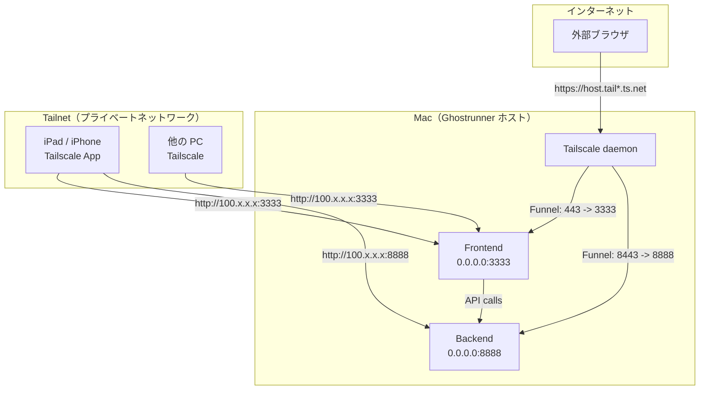

# 調査レポート: Ghostrunner を Tailscale で外部アクセスする手順

## 概要

Ghostrunner の devtools（バックエンド port 8888 / フロントエンド port 3333）を Tailscale 経由で iPhone/iPad や他の PC からアクセスする方法をまとめた。Ghostrunner には既に Tailscale 対応が組み込まれており、`make dev-external` コマンド一発で外部公開モードに切り替えられる。

## 背景

Ghostrunner の devtools は開発者のローカル PC で動作するが、iPad や iPhone から操作したいケースがある。Tailscale を使えば VPN トンネル経由で安全にアクセスでき、Tailscale Funnel を使えばインターネット経由の公開も可能になる。

---

## 1. 前提条件

- macOS 12 以降
- Homebrew がインストール済み
- Git がインストール済み
- Node.js / Go がインストール済み（Ghostrunner devtools のビルドに必要）

## 2. Tailscale のインストール（macOS）

### 方法 A: Homebrew Cask（GUI アプリ、推奨）

```bash
brew install --cask tailscale-app
```

インストール後、メニューバーに Tailscale アイコンが表示される。

### 方法 B: Homebrew Formula（CLI のみ）

```bash
brew install tailscale
sudo brew services start tailscale
```

### 方法 C: 公式サイトからダウンロード（最も確実）

[tailscale.com/download](https://tailscale.com/download) からインストーラーをダウンロード。

### 初回セットアップ

```bash
# ネットワークに参加（ブラウザでログイン画面が開く）
tailscale up

# 接続状態を確認
tailscale status

# 自分の Tailscale IP を確認
tailscale ip -4
# => 100.x.x.x のような IP が表示される
```

## 3. Ghostrunner のインストール

```bash
git clone https://github.com/<your-repo>/Ghostrunner.git
cd Ghostrunner
```

devtools のフロントエンドの依存関係をインストール:

```bash
cd devtools/frontend
npm install
cd ../..
```

## 4. devtools の起動

### ローカルアクセスのみ（通常の開発）

```bash
make dev
```

- フロントエンド: http://localhost:3333
- バックエンド API: http://localhost:8888

### 外部アクセスモード（Tailscale 経由）

```bash
make dev-external
```

このコマンドは以下を行う:

1. `tailscale ip -4` で Tailscale IP を自動取得
2. バックエンドを `0.0.0.0:8888` で起動（既にデフォルトで全インターフェースをリッスン）
3. フロントエンドを `0.0.0.0:3333` で起動（`-H 0.0.0.0` オプション付き）
4. `NEXT_PUBLIC_API_BASE` 環境変数に `http://<Tailscale IP>:8888` を設定

フロントエンドだけ外部公開する場合:

```bash
make frontend-external
```

## 5. 同一ネットワーク（Tailnet）からのアクセス

### Ghostrunner 側で既に対応済みの設定

**バックエンド CORS 設定**（`devtools/backend/cmd/server/main.go`）:
- `http://100.*` のオリジンを許可（Tailscale IP）
- `*.ts.net` のオリジンを許可（Tailscale Funnel ドメイン）
- `http://localhost:3000`, `http://localhost:3333` を許可

**フロントエンド Next.js 設定**（`devtools/frontend/next.config.ts`）:
- `allowedDevOrigins` に Tailscale ドメインと IP を登録済み
- `NEXT_PUBLIC_API_BASE` 環境変数でバックエンド URL を切り替え可能
- `rewrites` でローカル時は `/api/*` を `localhost:8888` にプロキシ

**API呼び出しの仕組み**（`devtools/frontend/src/lib/api.ts`）:
- `NEXT_PUBLIC_API_BASE` が設定されていれば、その URL をベースに API を呼び出す
- 未設定なら相対パス（`/api/*`）を使い、Next.js の rewrites 経由で localhost:8888 にプロキシ

### アクセス手順

1. Mac で `make dev-external` を実行
2. 表示された Tailscale IP を確認（例: `100.68.245.31`）
3. 同じ Tailnet に参加しているデバイスから `http://100.68.245.31:3333` にアクセス

## 6. iPhone / iPad からのアクセス

### Tailscale アプリのインストール

1. App Store で [Tailscale](https://apps.apple.com/us/app/tailscale/id1470499037) をダウンロード
2. アプリを開き「Get Started」をタップ
3. VPN 構成のインストールを許可
4. Mac と同じアカウント（Google, Microsoft, Apple 等）でログイン

### アクセス

1. iPhone/iPad で Tailscale を有効化（VPN 接続をオンにする）
2. Safari で `http://<Mac の Tailscale IP>:3333` にアクセス
3. Ghostrunner の devtools UI が表示される

### VPN On Demand（オプション）

Tailscale アプリの設定 > VPN On Demand で、Wi-Fi 接続時に自動で Tailscale を有効化できる。

### 注意事項

- サーバー再起動機能は外部からは使用できない（Mac のローカルプロセス管理のため）
- `NEXT_PUBLIC_API_BASE` が正しく設定されていないと、フロントエンドから API に接続できない

### allowedDevOrigins の更新

`devtools/frontend/next.config.ts` の `allowedDevOrigins` に自分の Tailscale ホスト名と IP を追加する必要がある。現在の設定:

```typescript
allowedDevOrigins: ["usermac-mini.tail85f9ea.ts.net", "100.68.245.31", "100.104.204.15"],
```

新しい環境で使う場合は、自分の Tailscale IP（`tailscale ip -4`）と MagicDNS 名を追加する。

## 7. Tailscale Funnel（インターネット公開）- オプション

Tailscale Funnel を使うと、Tailnet 外のインターネットから HTTPS でアクセスできるようになる。

### 前提条件

- Tailscale v1.38.3 以降
- MagicDNS が有効
- HTTPS 証明書が有効（Funnel 有効化時に自動設定される）
- Tailnet ポリシーで `funnel` ノード属性が許可されていること

### 使用可能なポート

Funnel で公開できるポートは **443, 8443, 10000** のみ。

### 基本コマンド

```bash
# フロントエンド（port 3333）をインターネットに公開
# Funnel はポート 443 で HTTPS を受け付け、localhost:3333 に転送
tailscale funnel --bg 3333

# バックエンド API（port 8888）をポート 8443 で公開
tailscale funnel --bg --https=8443 8888
```

- `--bg` フラグで永続的にバックグラウンド実行
- デバイス再起動後も自動で Funnel が再開される

### 公開 URL

Funnel を有効にすると、以下のような URL でアクセス可能になる:

```
https://<hostname>.tail<tailnet>.ts.net/      # port 443 -> localhost:3333
https://<hostname>.tail<tailnet>.ts.net:8443/  # port 8443 -> localhost:8888
```

### Funnel を停止する

```bash
# フロントエンドの Funnel を停止
tailscale funnel 3333 off

# バックエンドの Funnel を停止
tailscale funnel --https=8443 8888 off
```

### Funnel 使用時の注意

- HTTPS 証明書は Let's Encrypt で自動取得される
- 頻繁にリクエストするとレート制限に達する可能性がある（最大34時間の待機）
- Funnel はインターネット全体に公開されるため、機密情報を含むサービスには注意
- CORS 設定で `*.ts.net` は既に許可済み

## 構成図



## 結論・推奨

Ghostrunner は既に Tailscale 対応が十分に組み込まれている。以下の手順で外部アクセスが可能:

1. Mac と iPhone/iPad の両方に Tailscale をインストールし、同じアカウントでログイン
2. `make dev-external` で devtools を起動
3. iPhone/iPad の Safari から `http://<Tailscale IP>:3333` にアクセス

Tailscale Funnel はインターネット全体に公開する場合のみ使用し、通常は Tailnet 内のアクセスで十分。

## ソース一覧

- [Install Tailscale on macOS](https://tailscale.com/docs/install/mac) - 公式ドキュメント
- [tailscale-app - Homebrew Formulae](https://formulae.brew.sh/cask/tailscale-app) - Homebrew
- [Three ways to run Tailscale on macOS](https://tailscale.com/docs/concepts/macos-variants) - 公式ドキュメント
- [Tailscale Funnel](https://tailscale.com/docs/features/tailscale-funnel) - 公式ドキュメント
- [tailscale funnel command](https://tailscale.com/docs/reference/tailscale-cli/funnel) - CLI リファレンス
- [Tailscale Funnel examples](https://tailscale.com/docs/reference/examples/funnel) - 公式サンプル
- [Tailscale Serve](https://tailscale.com/docs/features/tailscale-serve) - 公式ドキュメント
- [Install Tailscale on iOS](https://tailscale.com/docs/install/ios) - 公式ドキュメント
- [Tailscale - App Store](https://apps.apple.com/us/app/tailscale/id1470499037) - App Store
- [Tailscale quickstart](https://tailscale.com/docs/how-to/quickstart) - 公式クイックスタート

## 関連資料

- このレポートを参照: /discuss, /plan で活用
