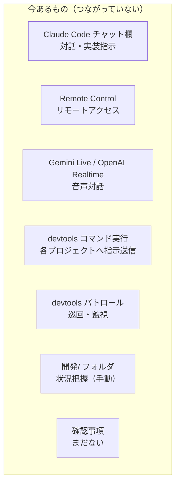
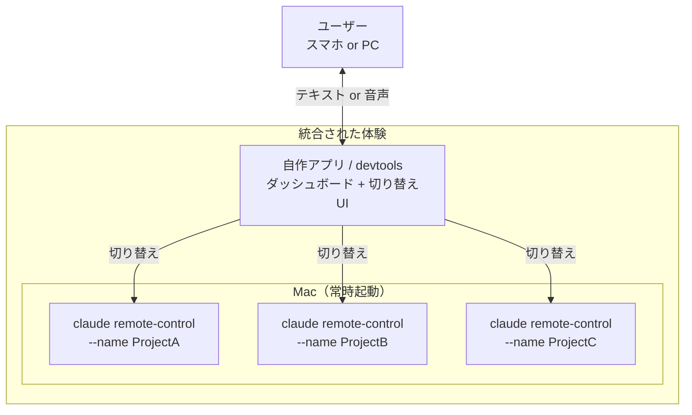
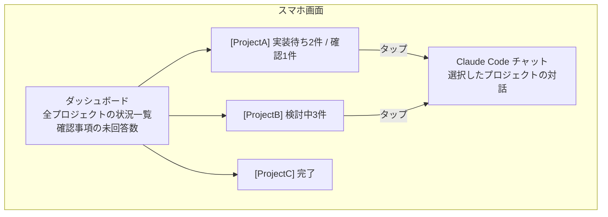
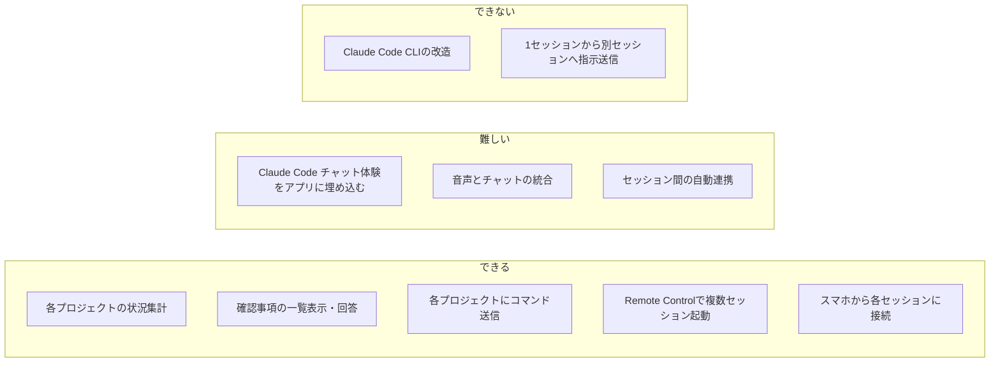
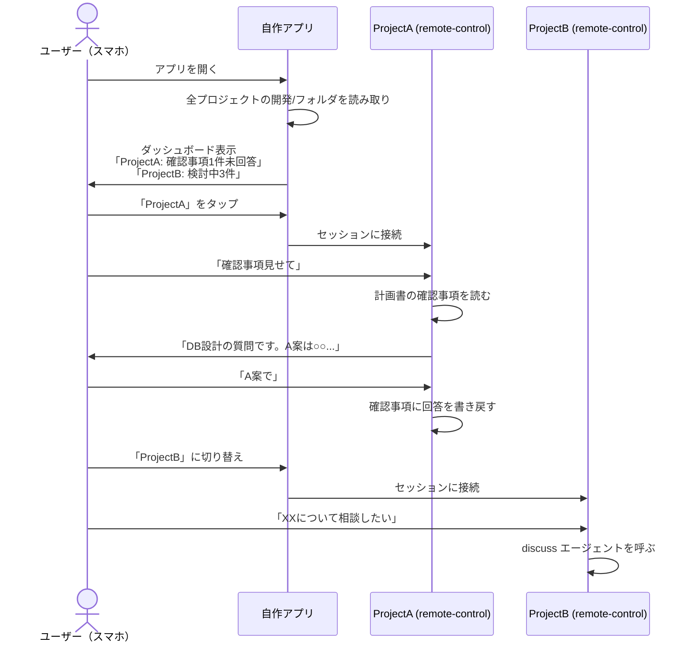
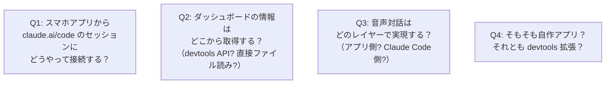

# マネージャー構想 全体図

## 現状の仕組み（バラバラ）

```mermaid
flowchart TB
    subgraph "今あるもの（つながっていない）"
        CHAT[Claude Code チャット欄<br/>対話・実装指示]
        RC[Remote Control<br/>リモートアクセス]
        VOICE[Gemini Live / OpenAI Realtime<br/>音声対話]
        DT_CMD[devtools コマンド実行<br/>各プロジェクトへ指示送信]
        DT_PATROL[devtools パトロール<br/>巡回・監視]
        DEV[開発/ フォルダ<br/>状況把握（手動）]
        CONFIRM[確認事項<br/>まだない]
    end
```

## 理想の姿

```mermaid
flowchart TB
    USER[ユーザー<br/>スマホ or PC]

    subgraph "統合された体験"
        APP[自作アプリ / devtools<br/>ダッシュボード + 切り替えUI]

        subgraph "Mac（常時起動）"
            RC_A["claude remote-control<br/>--name ProjectA"]
            RC_B["claude remote-control<br/>--name ProjectB"]
            RC_C["claude remote-control<br/>--name ProjectC"]
        end
    end

    USER <-->|テキスト or 音声| APP
    APP -->|切り替え| RC_A
    APP -->|切り替え| RC_B
    APP -->|切り替え| RC_C
```

## スマホアプリのイメージ

```mermaid
flowchart TB
    subgraph "スマホ画面"
        DASH[ダッシュボード<br/>全プロジェクトの状況一覧<br/>確認事項の未回答数]
        
        BTN_A["[ProjectA] 実装待ち2件 / 確認1件"]
        BTN_B["[ProjectB] 検討中3件"]
        BTN_C["[ProjectC] 完了"]
        
        CHAT_VIEW[Claude Code チャット<br/>選択したプロジェクトの対話]
    end

    DASH --> BTN_A
    DASH --> BTN_B
    DASH --> BTN_C
    BTN_A -->|タップ| CHAT_VIEW
    BTN_B -->|タップ| CHAT_VIEW
```

## 技術的にできること / できないこと

```mermaid
flowchart LR
    subgraph "できる"
        A1[各プロジェクトの状況集計]
        A2[確認事項の一覧表示・回答]
        A3[各プロジェクトにコマンド送信]
        A4[Remote Controlで複数セッション起動]
        A5[スマホから各セッションに接続]
    end

    subgraph "難しい"
        B1[Claude Code チャット体験をアプリに埋め込む]
        B2[音声とチャットの統合]
        B3[セッション間の自動連携]
    end

    subgraph "できない"
        C1[Claude Code CLIの改造]
        C2[1セッションから別セッションへ指示送信]
    end
```

## 対話の流れ（理想）

```mermaid
sequenceDiagram
    actor User as ユーザー（スマホ）
    participant App as 自作アプリ
    participant RCA as ProjectA (remote-control)
    participant RCB as ProjectB (remote-control)

    User->>App: アプリを開く
    App->>App: 全プロジェクトの開発/フォルダを読み取り
    App->>User: ダッシュボード表示<br/>「ProjectA: 確認事項1件未回答」<br/>「ProjectB: 検討中3件」

    User->>App: 「ProjectA」をタップ
    App->>RCA: セッションに接続
    User->>RCA: 「確認事項見せて」
    RCA->>RCA: 計画書の確認事項を読む
    RCA->>User: 「DB設計の質問です。A案は○○...」
    User->>RCA: 「A案で」
    RCA->>RCA: 確認事項に回答を書き戻す

    User->>App: 「ProjectB」に切り替え
    App->>RCB: セッションに接続
    User->>RCB: 「XXについて相談したい」
    RCB->>RCB: discuss エージェントを呼ぶ
```

## 未解決の問い

```mermaid
flowchart TB
    Q1["Q1: スマホアプリから<br/>claude.ai/code のセッションに<br/>どうやって接続する？"]
    Q2["Q2: ダッシュボードの情報は<br/>どこから取得する？<br/>（devtools API? 直接ファイル読み?）"]
    Q3["Q3: 音声対話は<br/>どのレイヤーで実現する？<br/>（アプリ側? Claude Code側?）"]
    Q4["Q4: そもそも自作アプリ？<br/>それとも devtools 拡張？"]
```
