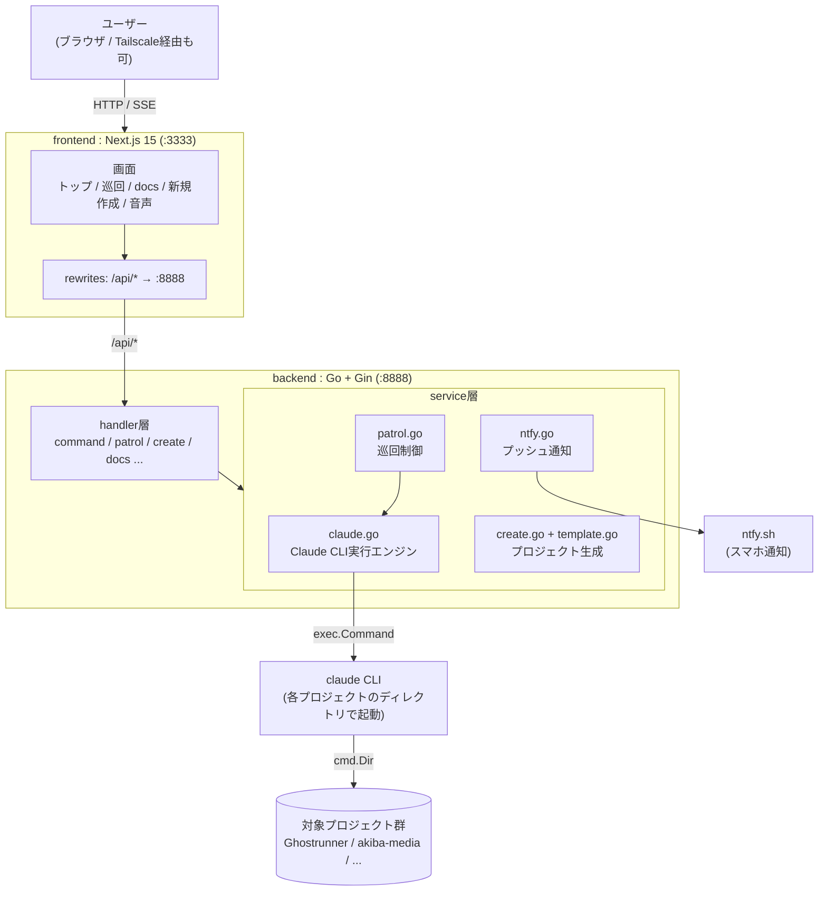
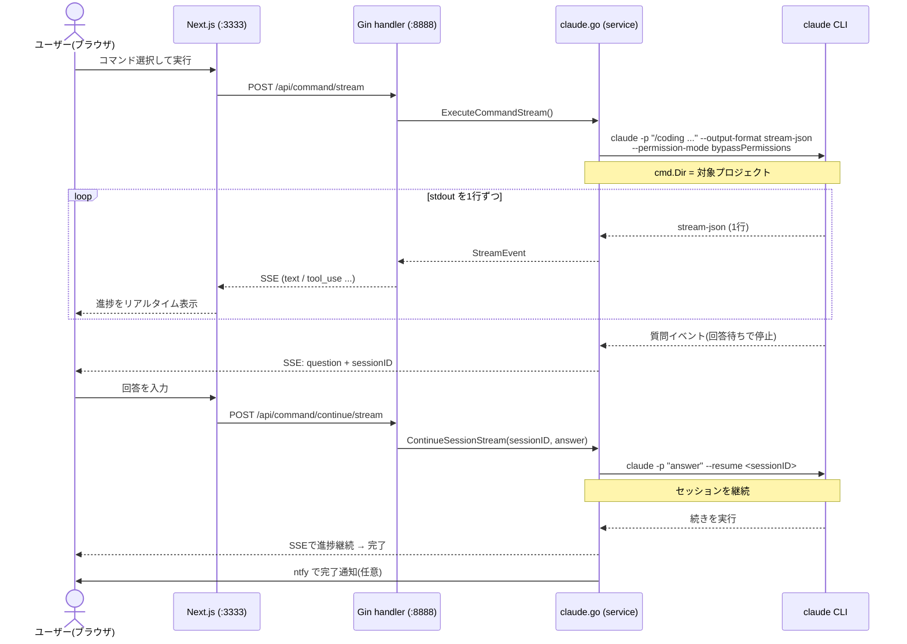
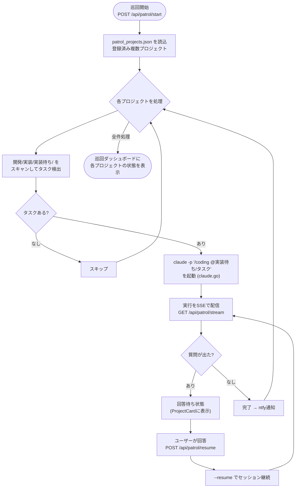
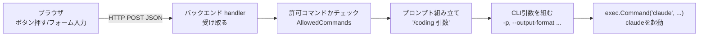
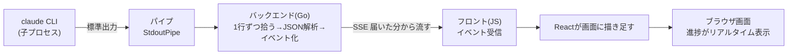

# devtools（進捗ビューア / 巡回ダッシュボード）の仕組み

作成日: 2026-05-23

Ghostrunner の `devtools/` は、**Claude Code CLI をブラウザから操作するための GUI ラッパー**である。
`claude -p ...` を Web UI・複数プロジェクト対応・進捗可視化付きで叩けるようにしたアプリ。

---

## 1. 全体構成（2 層）

- **frontend**: Next.js 15（App Router）/ ポート `:3333` … 画面・状態管理
- **backend**: Go + Gin / ポート `:8888` … Clean Architecture（handler 層 → service 層）
- フロントは `next.config.ts` の `rewrites` で `/api/*` をバックエンドへプロキシ。
  これにより外部（Tailscale）からアクセスしても `localhost` 問題が起きない。



---

## 2. 中核エンジン: Claude CLI ラッパー

このアプリの心臓部は `devtools/backend/internal/service/claude.go`。やっていることはシンプル。

```bash
claude -p "<プロンプト>" --output-format stream-json --verbose \
       --permission-mode bypassPermissions [--resume <sessionID>]
# cmd.Dir = 対象プロジェクトのディレクトリ
```

1. `claude` を `stream-json` モードで起動し、stdout を **1 行ずつパース**
2. それを **SSE（Server-Sent Events）** に変換してブラウザへリアルタイム送信
3. Claude が質問してきたら停止し、`--resume <sessionID>` で **回答を送ってセッション継続**

`bypassPermissions` で許可確認を飛ばすため、ブラウザから完全自動で実行できる。

---

## 3. コマンド実行の流れ（質問・回答を含む）



---

## 4. 巡回ダッシュボードの流れ

複数プロジェクトを登録し、各プロジェクトの `開発/実装/実装待ち/` にあるタスクを
自動検出して `/coding` を順次実行する機能。登録は `patrol_projects.json` に永続化される。



---

## 5. 主要機能（画面ごと）

| 画面 | パス | 役割 |
|---|---|---|
| トップ | `src/app/page.tsx` | プロジェクト・コマンド(/plan, /coding 等)・ファイル・画像を選んで実行、進捗をストリーム表示 |
| 巡回 | `src/app/patrol/page.tsx` | 複数プロジェクトを登録し、`実装待ち/` のタスクを自動検出して `/coding` を順次実行 |
| ドキュメント | `src/app/docs/` | `開発/` 配下のドキュメントをブラウザで閲覧 |
| 新規作成 | `src/app/new/page.tsx` | テンプレート(base/with-db/with-storage 等)から新規プロジェクト生成 |
| 音声 | `src/app/gemini-live/`, `src/app/openai-realtime/` | Gemini Live・OpenAI Realtime との音声連携（バックエンドがトークン発行） |

---

## 6. バックエンド service 層の責務分担

| ファイル | 役割 |
|---|---|
| `service/claude.go` | Claude CLI 実行エンジン（全機能の土台） |
| `service/patrol.go` | 巡回オーケストレーション（タスク検出・並列実行・状態管理） |
| `service/create.go` + `service/template.go` | テンプレートからのプロジェクト生成 |
| `service/ntfy.go` | ntfy.sh へのプッシュ通知（完了・質問待ちを通知） |
| `service/gemini.go` / `service/openai.go` | 音声 AI のトークン発行 |

---

## 7. 通信の流れ（要点）

1. **実行**: ブラウザ → `POST /api/command/stream` → バックが claude 起動 → SSE で進捗が流れ続ける
2. **質問対応**: Claude が質問 → SSE の `question` イベント → ユーザー回答 → `POST /api/command/continue/stream`（`--resume` でセッション継続）
3. **通知**: 長時間タスクの完了・質問待ちは ntfy でスマホ等へプッシュ
4. **外部アクセス**: Tailscale（`100.x` / `*.ts.net`）を CORS・`allowedDevOrigins` で許可 → 外出先のブラウザからも操作可能

---

## 8. データの流れ：claude から画面まで（双方向の翻訳）

devtools の本質は、バックエンドが **「ブラウザの言葉」と「claude の言葉」を双方向に翻訳する**こと。
行き（操作）と帰り（進捗）で、それぞれ別の技術を使う。

| 方向 | 流れ | 技術 |
|---|---|---|
| 行き（操作） | ボタン → POST → バックが**コマンド組み立て** → claude 起動 | HTTP POST |
| 帰り（進捗） | claude 出力 → パイプで拾う → **イベント整形** → 画面表示 | SSE / ストリーミング |

```
ブラウザ ──[POST: 材料]──→ バックエンド ──[組み立て]──→ claude
ブラウザ ←──[SSE: 整形済み]── バックエンド ←──[パイプで拾う]── claude
```

### 行き：ボタン → コマンド組み立て

ブラウザは「どのコマンドを・どのプロジェクトで・どの引数で」という**材料だけ**を JSON で送る。
実際の `claude -p "/coding ..."` というコマンド文字列に仕立てるのはバックエンドの仕事。



ポイント: バックエンドは「ただの通し役」ではなく、**門番（許可コマンドのチェック）** と
**組み立て役**を兼ねる。ブラウザから任意のコマンドを実行されないよう `AllowedCommands` で弾く。

### 帰り：claude 出力 → パイプで拾って画面へ

claude は人間向けの画面ではなく**標準出力にデータ（stream-json）を吐く**。
バックエンドはその出口をパイプで横取りし、1 行ずつ拾ってイベントに整形、SSE でブラウザへ流す。



ポイント: 生の JSON をそのまま貼るのではなく、イベントの種類ごとに描き分ける。

- `text`（claude のコメント）→ 吹き出し
- `tool_use`（ファイル編集・コマンド実行）→ 「○○を編集中」カード
- `question`（質問）→ 回答ボタン付き

### 入力（送信）は SSE ではできない点に注意

SSE（`EventSource`）は **GET・受信専用**なので、入力の送信には使えない。
そのため送信は必ず HTTP POST で行い、devtools は 2 方式を使い分けている。

| 機能 | 受信 | 送信 |
|---|---|---|
| 巡回 | `EventSource`（GET `/api/patrol/stream`） | POST（start/stop/resume） |
| トップ | ストリーミング POST（`fetch` の `response.body.getReader()`） | 同じ POST の body |

巡回は「複数プロジェクトを流しっぱなし」なので常時接続の `EventSource` が向く。
トップは「1 コマンド完結」なので、POST で送りつつ同じ返事をストリーム受信する方式が素直。

---

## まとめ

全体は「**Claude CLI を `exec` で叩く薄いエンジン（claude.go）** の上に、
トップ画面・巡回・新規作成・ドキュメント閲覧という機能を載せた構造」である。

そして要点は、**バックエンドがブラウザと claude の双方向の翻訳役**を担うこと。
行きは「材料 → CLI コマンドの組み立て」、帰りは「標準出力をパイプで拾って整形 → SSE で画面へ」。
人間向けの対話モードを使わずヘッドレス（`claude -p`）を選んだのは、UI を自前で描くために
**画面ではなくデータが欲しかった**から——という設計判断がここで一貫する。
